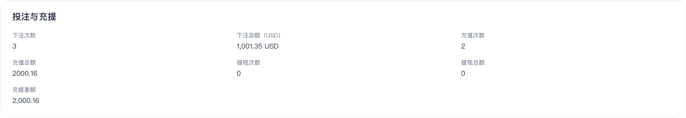
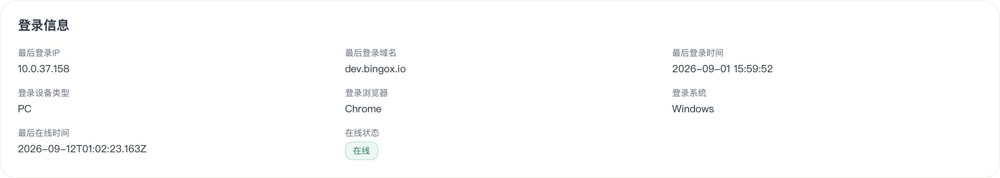

# KAN-185 会员详情弹窗验收记录

> 后续结论更新：用户已认可“每笔先保留两位小数再累计”的 USD 口径，以下原金额差异不再按缺陷处理。随后实际注册了专用测试用户，确认注册/登录 IP 错存为 ALB 内网地址；最新证据见[新用户注册 IP 反查](../kan-185-ip-trace-2026-09-12/README.md)。以下保留首次验收过程，不代表更新后的金额缺陷判断。

验收日期：2026-09-12。任务：[补全登录信息并将下注总额统一为 USD](https://bingobox.atlassian.net/browse/KAN-185)。网站：[会员列表](https://dev-app.bingox.io/admin/users/list)。任务当前为「产品验收」，负责人 nonamerobert2012。

**结论：本次验收不通过。USD 下注汇总与已有账务折算明细不一致，已在单币种和多币种样本中复现。登录信息展示已有实现，但真实客户端 IP、新登录和失败登录等场景没有全部通过验证。**

本次查看 11 位现有会员，逐页查询 6 位会员的投注扣款账变，共 1,758 条，检查详情字段、空值、时区和金额。只执行查询及页面切换，没有充值、下注、调整资金、修改会员资料或修改 Jira。文中样本编号沿用本次列表的零起始采样编号，不保存真实会员身份信息。

## 1. 已确认的问题：USD 汇总不一致

对账使用网站实际返回的 `userWalletLedgers`，按会员和 `reasonType=betDebit` 查询全部分页，每条只取最新一份 USD 折算记录的绝对金额，使用十进制计算。下面两例全部明细都有 completed 折算结果，账变 ID 无重复，明细条数也与详情下注次数一致。

| 样本 | 投注情况 | USD 明细合计 | 合计保留两位 | 详情实际显示 | 差额 |
|---|---|---|---|---|---|
| 4 | 3 笔 USDT | 1,001.34366 | 1,001.34 | 1,001.35 | 多 0.01 |
| 3 | 920 笔，包含 USD、USDC、USDT | 115,075.73046812 | 115,075.73 | 115,076.37 | 多 0.64 |

样本 4 的完整计算：999.345 + 0.999364 + 0.999296 = 1,001.34366 USD。原币投注为 1,000、1、1 USDT，合计 1,002 USDT，因此已有实际换算，但最终汇总不准确。

**修复要求：累计时保留足够精度，最后展示时再保留两位；已有汇总数据也要按相同口径校正。**

源码佐证：后端 `prisma/models/user.prisma` 的 `UserFundsSummary.totalBetAmount` 为 `Decimal(20, 2)`；`WalletLedgerEffectService.record` 将标准金额逐次 increment 到该字段。样本 4 的结果与每笔累计提前舍入一致。这是对原因的源码推断；网站金额差异本身已由实际接口和页面共同证实。

另有 4 个样本存在缺少折算记录、pending 折算或汇总次数与扣款条数不同的情况，不能把其“已有折算合计”当作完整应得总额，也不能据此直接断言重复扣款。本次未用这些不完整样本计算资金差额。

脱敏对账证据：[usd-comparison.json](usd-comparison.json)。

### 追加复核：差额是否来自不同汇率快照

针对用户提出的汇率快照问题，再次检查本次采集的两组完整样本：样本 4 的 3 笔和样本 3 的 920 笔，每笔都只有一份已完成的折算记录，没有修订或补算版本。本次直接累计这些已保存的 USD 金额，没有调用当前汇率，没有将不同时间的投注按同一个汇率重算。

将同一组 USD 明细分别按两种方式累计，结果如下：

| 样本 | 保留原精度累计 | 每笔先四舍五入到两位再累计 | 后端返回汇总 |
|---|---|---|---|
| 4 | 1,001.34366 | 1,001.35 | 1,001.35 |
| 3 | 115,075.73046812 | 115,076.37 | 115,076.37 |

两组样本的“每笔先四舍五入到两位”结果均与后端完全一致。样本 4 三笔原币金额乘各自保存的快照汇率，也分别精确等于保存的 USD 折算结果。因此，这两组已发现的汇总差额可以由提前舍入完整复现，无需用新旧快照不同解释。没有直接检查线上数据库字段或跟踪原始写入过程，具体部署代码的根因仍以开发定位为准。

这里模拟四舍五入是为了复现当前汇总行为，并非将其规定为产品的正确舍入方式。标准计价 PRD 要求保存 8 位标准金额，并引用向下取整规则。两组样本的完整合计无论最终截取两位或四舍五入到两位，结果分别都是 1,001.34 和 115,075.73，不影响本次差额结论。

该复核没有验证第三方历史行情是否准确，也没有证明其他缺快照或多版本场景没有问题。差额属于累计统计结果，本次没有发现或验证玩家钱包因此被多扣款。

复核证据：[snapshot-rounding-check.json](snapshot-rounding-check.json)。

## 2. 登录信息：展示已有，真实来源仍未完成验收

11 位会员中，6 位的 `lastLoginRecord` 为 null，页面相关字段统一显示 `-`，没有报错。其余 5 位能显示登录时间、域名、浏览器、系统和 PC，其中历史 `web` 类型也能展示为 PC。

但这 5 位中，3 位 IP 为 `10.0.*` 私网地址，2 位 IP 为空。本次没有发现可用于证明真实公网客户端 IP 已正确记录的样本。

这些是现存记录，不能据此判定今天新登录一定仍写错。要完成这部分验收，需要在玩家端进行新登录，然后核对本次 IP、访问域名、设备类型和时间。玩家端测试登录已向用户请求，尚未执行。

Jira 旧评论提到的会员，详情仍没有登录记录，登录设备列表也无数据。不过会员列表名为“最后登录时间”的列，实际读取 `lastOnlineAt`，并非成功登录事件时间。因此，列表有时间而详情为空，只能证明两个位置口径不同，不能单独证明本次登录记录丢失。

## 3. 时区：基本转换正确，澳洲选项文字有误

同一条登录时间 `2026-09-11T07:40:29.242Z`，切换页面右上角时区后重新打开同一会员：

| 页面选项 | 实际显示 |
|---|---|
| GMT-3（巴西） | 2026-09-11 04:40:29 |
| GMT-6（墨西哥） | 2026-09-11 01:40:29 |
| GMT+11（澳洲） | 2026-09-11 17:40:29 |

三个显示值符合相应地区在该日期的时区规则，底层 UTC 时间没有改变。最后恢复原先的澳洲时区选择。

**澳洲选项固定写 GMT+11，但 2026-09-11 的悉尼实际为 UTC+10。** 应显示地区名称，或根据日期显示准确偏移。该问题是选项文字错误，不是将当前登录时间转错了一个小时。

当前下拉只有这三个地区；UTC、半小时、四十五分钟和其他地区无法直接从下拉选择。本次另读取前端 main 的实际时间格式化函数，在本地验证 UTC、半小时、四十五分钟、负时区跨日、悉尼冬夏时间以及无效/缺失时区回退，共 8 个案例全部通过。该结果是源码函数验证，不代替线上界面验收；也未验证弹窗保持打开时切换时区的即时更新。

函数验证明细：[frontend-timezone-check.json](frontend-timezone-check.json)。

## 4. 按任务原验收标准核对

| 原验收项目 | 本次结果 |
|---|---|
| 成功登录后的真实客户端 IP | 未通过完整验证；现有样本仅见私网 IP 或空值，需要新登录复测 |
| 本次访问域名 | 已能展示现有记录，尚未进行新登录核对 |
| PC 和 Mobile | PC 展示及旧 web 值兼容已验证；没有 Mobile 新登录实测 |
| 登录失败不覆盖成功记录 | 尚未进行线上失败登录测试 |
| 同次事件字段一致、并发按成功时间取最新 | 接口按整条登录记录返回；源码按 createdAt、id 降序取最新；未进行并发登录实测 |
| 历史数据缺失的空态 | 通过本次现有样本检查，显示 `-`，不报错 |
| 所选时区转换 | 三个可选地区切换后重新打开显示正确；弹窗内即时更新没有实测 |
| UTC、正负、非整点、跨日、夏令时 | 本地实际源码函数 8 案例通过；线上下拉仅有三个地区，不能声称已全部 E2E 通过 |
| 单币种、多币种下注汇总 | **不通过**，两种样本均存在可复现的精度差异 |
| 明确显示 USD 并与标准统计一致 | USD 标识通过；与账务折算合计一致性不通过 |
| 零、冲正、大额、高精度、缺汇率 | 零值展示通过；累计精度发现问题；缺折算的历史样本无法完整对账；没有创建冲正或大额测试交易 |
| 前后端自动化测试 | 后端选定 5 套测试中 4 套通过，共 13 个用例；登录 hook 套件因依赖缺失未运行成功。前端未找到已提交的对应 test/spec，本次补做只读函数验证 |

## 5. 源码及测试边界

源码只读核对使用本次 fetch 后的 `origin/main`：前端 `1b5ab3c`，后端 `d11de4b`。没有切换或覆盖用户工作区。源码不能单独作为线上部署版本证明。

后端测试在 `/tmp` 的独立源码副本运行，复用已有 node_modules，使用不可连接的本机测试数据库地址满足初始化检查，未连接业务数据库。执行文件：

- `libs/core/src/utils/login-context.spec.ts`
- `libs/core/src/utils/user-agent.spec.ts`
- `apps/web-api/src/services/user/user.service.spec.ts`
- `apps/worker/src/services/exchange/standard-conversion-backfill.service.spec.ts`
- `apps/web-api/src/hooks/auth.hook.spec.ts`

前四套通过，共 13 用例。最后一套经 services 聚合导入遇到 `Cannot find module 'ethers'`，未得到测试通过结果。没有将本地依赖缺失认定为线上运行故障。

后续通过条件：先修复并复核 USD 累计精度和澳洲时区文字，再用玩家测试账号补测新注册自动登录、PC/Mobile 登录、失败登录及并发登录；提供缺汇率、冲正、大额等场景的正确结果和可运行的自动化测试。
