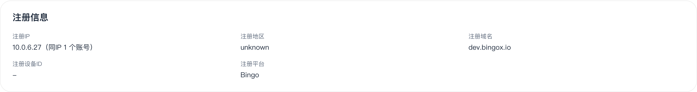
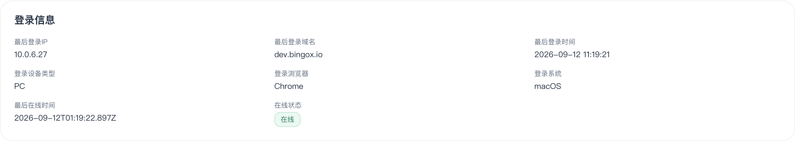

# 新用户注册 IP 内网反查

> 后续更新：用户已授权修复，入口配置已更新并完成新注册和登录复测。最新结果见[修复与复测](../kan-185-ip-fix-2026-09-12/README.md)。以下保留修复前证据。

2026-09-12 按用户要求，通过玩家端实际注册专用测试账号，查询后台记录，并只读检查 AWS 和 Kubernetes。没有修改基础设施、后台配置、Jira 或业务代码。

**结论：新用户记录的 10.0.6.27 属于公网 ALB 的内网网卡。当前 ingress-nginx 将来源 IP 头覆盖成上一跳 ALB 地址，导致注册和登录均保存该内网 IP。**

## 注册结果

- 账号：`qa_ip_1789175959293`，显示名称 QA IP trace，使用测试邮箱域 example.invalid。
- 玩家入口：`https://dev.bingox.io/en`。
- 注册接口：`https://dev-casino.bingox.io/api/auth/sign-up/email`。
- 成功响应：HTTP 200，2026-09-12 01:19:22 UTC。
- 后台注册 IP：`10.0.6.27`，注册地区 unknown，注册域名 dev.bingox.io。
- 注册后自动登录记录：IP 同为 `10.0.6.27`，域名 dev.bingox.io，设备 PC，Chrome / macOS，事件时间 `2026-09-12T01:19:21.982Z`。
- 密码未写入本记录或仓库。没有充值、下注或调整资金。





## IP 归属的实际证据

AWS 账号 123515105281，区域 us-east-2，按 `addresses.private-ip-address=10.0.6.27` 查询 EC2 网卡：

| 字段 | 值 |
|---|---|
| NetworkInterfaceId | eni-0ffb3d0ca76dfcc08 |
| PrivateIpAddress | 10.0.6.27 |
| Description | ELB app/bingo-prod-alb/5b5ea2adbe0ee2cd |
| VPC | vpc-054797b769e26ca81 |
| Subnet | subnet-069d605a0cbe318e6 |
| RequesterManaged | true |

ELB API 返回同名负载均衡器 `bingo-prod-alb` 的 Type 为 application、Scheme 为 internet-facing。集群按该 IP 查 Pod 无结果。名称含 prod，但此次开发环境注册确实经过此共享入口；不能仅凭名称判定为生产用户流量。

本次同时看到内部 NLB `bingo-prod-nlb-int` 和开发直连 NLB，但 10.0.6.27 网卡描述明确关联上述 ALB，不属于这两个 NLB。

## 同一次请求的链路证据

ingress-nginx Pod `ingress-nginx-controller-7b68c8c76d-hm2f8` 的访问日志：

```text
10.0.6.27 ... [12/Sep/2026:01:19:22 +0000]
POST /api/auth/sign-up/email HTTP/1.1
200 ... https://dev.bingox.io/
[bingo-dev-bingo-backend-web-3001]
10.0.33.17:3001 ... 200
request_id=335195a28baab95cf85036983a07a431
```

运行中的 `/etc/nginx/nginx.conf`，`dev-casino.bingox.io` server 转发到 `bingo-dev/bingo-backend-web:3001`，包含：

```nginx
proxy_set_header X-Real-IP                 $remote_addr;
proxy_set_header X-Forwarded-For           $remote_addr;
proxy_set_header X-Original-Forwarded-For  $http_x_forwarded_for;
```

该请求的 `$remote_addr` 就是日志中的 ALB 地址 10.0.6.27。检查到的运行配置没有 real_ip_header、set_real_ip_from 等真实 IP 还原配置；controller ConfigMap 的 data 为空。原始 X-Forwarded-For 被另存到 X-Original-Forwarded-For，标准 X-Forwarded-For 则被覆盖。

后端注册路径优先从 X-Forwarded-For / X-Real-IP 提取地址，最终接口实际返回的注册和登录地址与被覆盖后的值一致。运行中的开发后端镜像为 `main-20260911T083130Z-d11de4b`，容器未设置 TRUSTED_PROXY_IPS。没有读取或输出其他敏感环境变量。

因此可定位到 ingress-nginx 的来源 IP 处理，而不只是怀疑前端没有传 IP。没有抓取本次原始 Cloudflare 请求头，故未证明原始客户端 IP 在每一跳的具体值，也没有验证可信代理配置修复后的效果。

## 建议的后续处理

在入口代理恢复可信链路中的真实客户端 IP，再以一致的头转发给应用；应用注册与登录使用同一套可信代理规则。只信任已确认的入口和代理来源，不能无条件相信外部用户自行提交的 IP 头。修复后重新注册，并验证公网 IP、注册/登录一致性及伪造请求头不会改变真实地址。

时区显示建议使用“悉尼（Australia/Sydney）”，避免固定 GMT+11。底层保留 UTC 时间，展示按每条记录发生时的悉尼夏令时规则转换。若显示偏移，当前时区选择器的偏移按当前日期计算，历史记录的偏移按各自事件日期计算。

本次仅完成诊断，未实施上述修复。原 KAN-185 的 USD 差额已由用户接受为“每笔先保留两位再累计”的业务口径，不再作为阻塞缺陷；本次新注册验证明确复现了错误客户端 IP。
