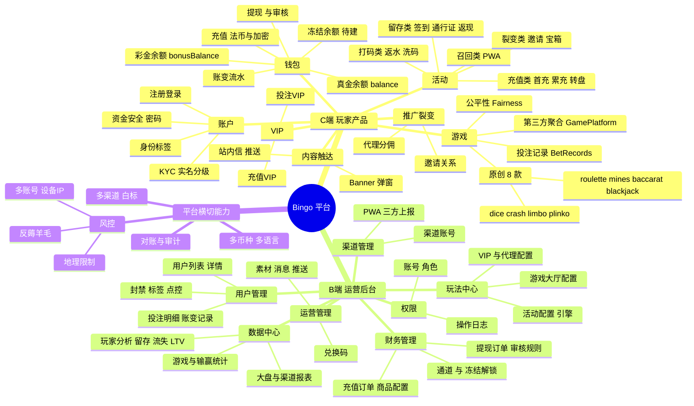
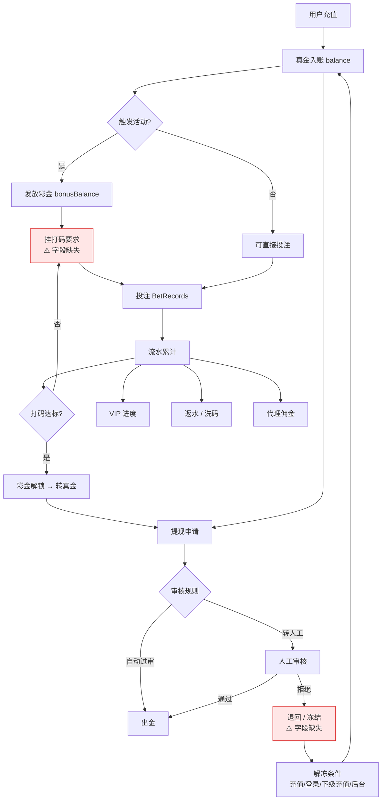
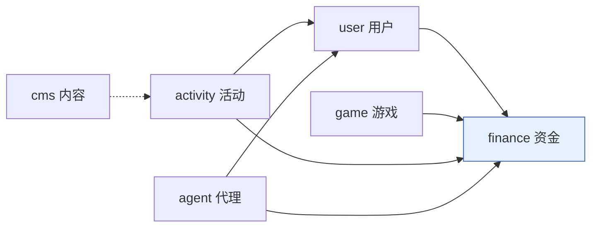

# Bingo 产品全景图

> 一页看懂整个产品。新人、CEO、外部合作方的第一入口。
> 结构基于**自身代码**(`bingo-backend/prisma/models`、resolvers)+ 竞品参考(`参考资料/竞品-aigobet`)。
> ⚠️ 思维导图表达**结构**;跨模块的**依赖关系**看下方第二张流程图——两张配套才完整。

---

## 一、功能全景(结构)

---

## 二、钱的一生(依赖关系)

这是全平台**最重要的一条链**,也是资损最集中的地方。思维导图画不出它,因为它横跨钱包/活动/游戏/代理/财务五个域。

### 图上两个红块 = 当前真实缺口
| 缺口 | 现状 | 后果 |
|---|---|---|
| **打码进度** | `Wallet` 有 `balance` / `bonusBalance`,但**无 wagering/turnover 字段** | 彩金无法挂流水要求 → 送出去的彩金可直接提走,薅羊毛入口 |
| **冻结余额** | 只有账号级 `fundLocked`,**无金额级冻结字段** | 提现拒绝后无法冻结部分金额;解冻的多条触发路径无处落地 |

> 参考:竞品 action_type 里 `97 提现审核拒绝并冻结` / `98 充值解冻` / `99 登录解冻` / `100 直属下级充值解冻` / `101 后台解冻`——五条解冻路径,说明这是成熟平台的标配。

---

## 三、模块依赖方向(架构约束)

**铁律:`finance` 不得反向依赖 `activity`。** 资金域只认"一笔账变",不认"这是哪个活动发的"——活动信息作为元数据传入,不是编译期依赖。违反这条,活动一改财务就得跟着改。

---

## 四、待拍板决策(挂在图上,别丢)
1. **自营 vs 白标哪条主线**——`bingo-backend`(NestJS)与 `bingo-saas`(Go 微服务)是替代还是并行?
2. **双 VIP 是否合并**——充值VIP / 投注VIP 两条独立线,用户会有两个 VIP 维度。
3. **身份体系 SSOT**——`UserKyc` / `UserTag` / `UserIdentity` 三套并存,谁是主?

> 这三条属于 `01-product-definition/`,是全图的前提。定不下来,下游一切返工。
