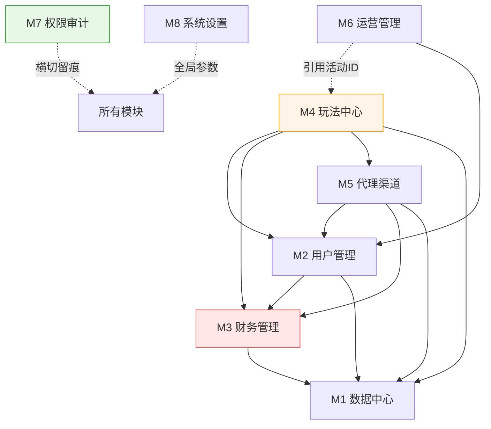

# 模块总览

> **本文只做索引和依赖总图。** 每个模块的职责、依赖、表、子模块、待探讨事项,一律见各模块目录下的 `README.md` —— **细节只维护一处**,避免两处分叉。
> **范围**:运营后台(B端)。C 端产品模型已完成。
> **前提**:在现有 `bingo-backend/apps/admin-api`(NestJS + GraphQL + Prisma)上**扩建**。
> **基线**:36 个 resolver / 8 个域 / 59 个 prisma model(2026-07 盘点)。

## 模块索引

| 模块 | 目录 | 职责一句话 | 现状 | P0 子模块 |
|---|---|---|---|---|
| M1 数据中心 | `M1-数据中心/` | 经营数据读侧,只读汇总表 | 🔴 `dashboard.resolver.ts` 仅 59 行 | 1 |
| M2 用户管理 | `M2-用户管理/` | 玩家账号查询/干预/分层 | 🟢 12 个 resolver,较全 | 5 |
| M3 财务管理 | `M3-财务管理/` | 钱的进出与审核 | 🔴 **最大缺口** | 7 |
| M4 玩法中心 | `M4-玩法中心/` | 游戏编排 + 活动配置 | 🟡 **结构要改造** | 4 |
| M5 代理渠道 | `M5-代理渠道/` | 流量归因 + 分销分佣 | 🟢 基础已有,口径待定 | 3 |
| M6 运营管理 | `M6-运营管理/` | 内容位与消息触达 | 🔴 只有站内信/多语言 | 2 |
| M7 权限审计 | `M7-权限审计/` | 账号、角色、留痕(横切) | ✅ **最完整,可直接用** | 3 |
| M8 系统设置 | `M8-系统设置/` | 全局参数、域名、币种 | 🟢 基础已有 | 1 |
| — | `00-公共约定/` | 跨模块引用规则 + 共享枚举 | ✅ | — |

**合计 P0 = 26 个子模块**,集中在 M3(7)和 M2(5)。
**图例**:✅ 已有 · 🟢 基本可用 · 🟡 需改造 · 🔴 大缺口

## 依赖总图

## 三条架构铁律

1. **`M3 财务` 不得反向依赖 `M4 活动`** —— 资金域只认一笔账变,活动信息以**元数据 ID** 传入。
   实现见 `M3-财务管理/表设计.prisma` 的 `WagerRequirement.sourceId`(不建外键)。
2. **`M1 报表` 只读汇总表**,禁止直连业务表 —— 否则拖垮生产库。
3. **`M7 权限/日志` 横切所有模块**,M3/M4 的写操作**必须**留痕。

## 表归属速查

| 表 | owner |
|---|---|
| `User` `UserTag` `Level` `VipLevel` `UserKyc` | M2 |
| `Wallet` `Transaction` `RechargeOrder` `WithdrawOrder` `WagerRequirement` `FreezeRecord` | M3 |
| `Activity` `ActivityClaim` `BetRecords` `GamePlatform` `SubGame` | M4 |
| `Agent` `Channel` `Promoter` `AgentSettlement` | M5 |
| `Banner` `Popup` `Notification` `RedeemCode` | M6 |
| `Account` `Role` `Permission` `OperationLog` | M7 |
| `Kv` `Domain` `CryptoCoins` `CodingMultiple` | M8 |
| 各类 `*Summary` 汇总表 | M1 |

> 归属规则:**谁写它,谁拥有它**。完整规则见 `00-公共约定/README.md`。

## ⬜ 全局待探讨(跨模块,需优先解决)

| # | 议题 | 卡住 |
|---|---|---|
| 1 | 自营 vs 白标哪条主线 | M8 域名、整体架构 |
| 2 | 双 VIP 是否合并 | M2.6 / M4.8 |
| 3 | 身份体系 SSOT(KYC/Tag/Identity) | M2.1 / M2.7 |
| 4 | 指标口径统一(GGR/NGR/LTV + 时区) | M1 全部 |
| 5 | 分佣模式与负余额结转 | M5.2 |
| 6 | 打码多笔并存规则 / 有效投注定义 | M3.7 |
| 7 | 活动奖励多态用 JSON 还是子表 | M4.1 |
