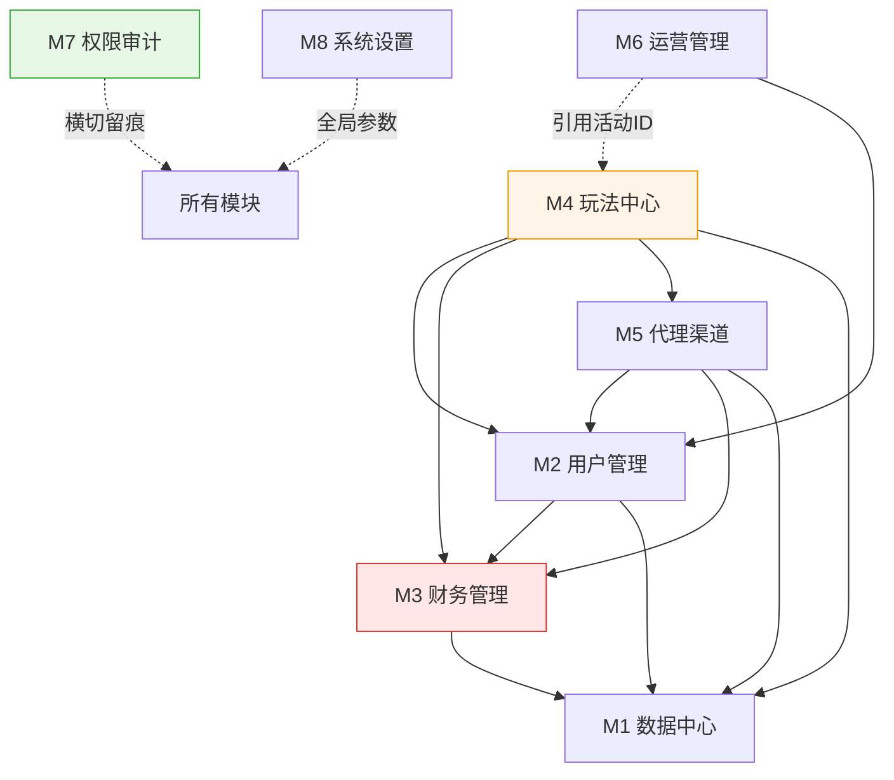
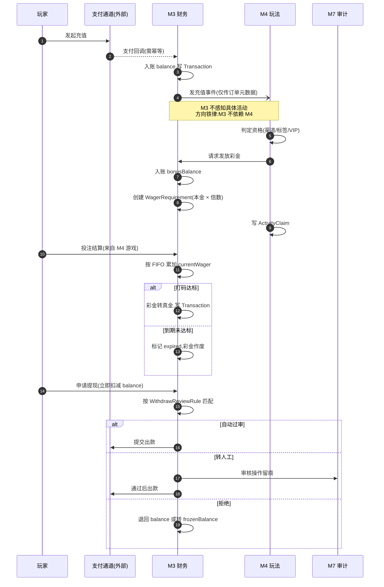
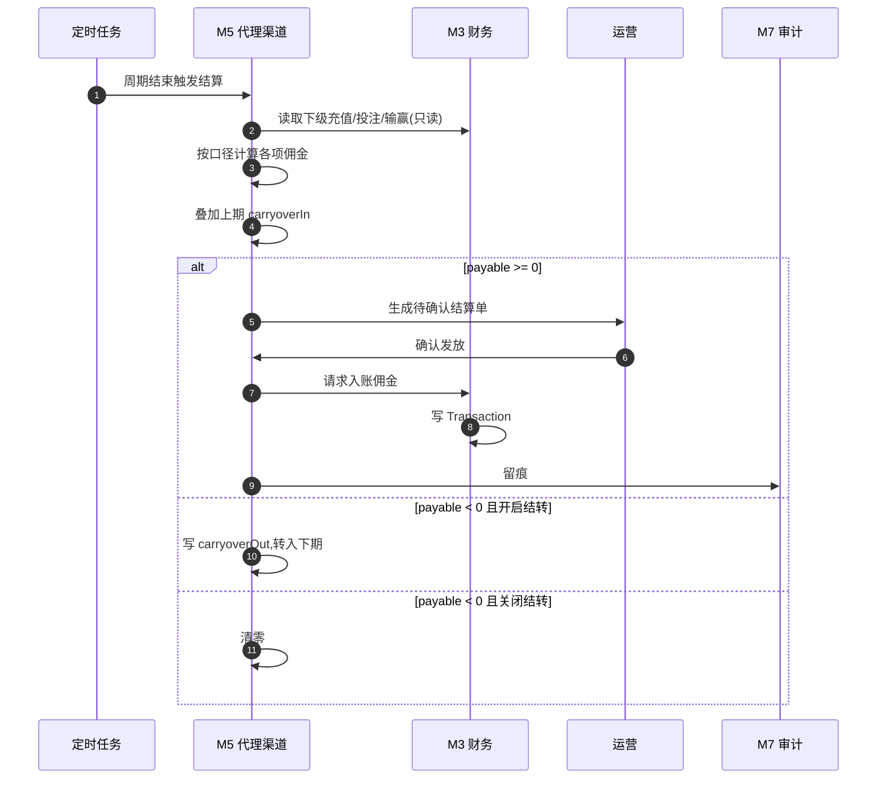

# 模块总览

> **本文只做索引和依赖总图。** 每个模块的职责、依赖、表、子模块、待探讨事项,一律见各模块目录下的 `README.md` —— **细节只维护一处**,避免两处分叉。
> **范围**:运营后台(B端)。C 端产品模型已完成。
> **前提**:在现有 `bingo-backend/apps/admin-api`(NestJS + GraphQL + Prisma)上**扩建**。
> **基线**:36 个后台接口 / 8 个域 / 59 张数据表(2026-07 盘点)。

## 模块索引

| 模块 | 目录 | 职责一句话 | 现状 | P0 子模块 |
|---|---|---|---|---|
| M1 数据中心 | `M1-数据中心/` | 经营数据读侧,只读汇总表 | 大缺口 · `dashboard.resolver.ts` 仅 59 行 | 1 |
| M2 用户管理 | `M2-用户管理/` | 玩家账号查询/干预/分层 | 基本可用 · 12 个 resolver,较全 | 5 |
| M3 财务管理 | `M3-财务管理/` | 钱的进出与审核 | 大缺口 · **最大缺口** | 7 |
| M4 玩法中心 | `M4-玩法中心/` | 游戏编排 + 活动配置 | 需改造 · **结构要改造** | 4 |
| M5 代理渠道 | `M5-代理渠道/` | 流量归因 + 分销分佣 | 基本可用 · 基础已有,口径待定 | 3 |
| M6 运营管理 | `M6-运营管理/` | 内容位与消息触达 | 大缺口 · 只有站内信/多语言 | 2 |
| M7 权限审计 | `M7-权限审计/` | 账号、角色、留痕(横切) | 已有 · **最完整,可直接用** | 3 |
| M8 系统设置 | `M8-系统设置/` | 全局参数、域名、币种 | 基本可用 · 基础已有 | 1 |
| — | `00-公共约定/` | 跨模块引用规则 + 共享枚举 | 已有 | — |

**合计 P0 = 26 个子模块**,集中在 M3(7)和 M2(5)。
**图例**:现状取值 `已有` / `基本可用` / `需改造` / `大缺口` / `缺失`

## 依赖总图

## 跨模块流程(泳道)

单页 README 只画本页的状态机;**跨模块的交接必须在这里画**,否则没人看得到全貌。

### 流程一:充值 → 活动 → 打码 → 提现(钱的一生)

**关键交接点**(最易出错,每处都要有测试)
| # | 交接 | 风险 |
|---|---|---|
| 1 | 支付回调 → 入账 | **幂等**:重复回调不得重复入账 |
| 2 | M3 发事件 → M4 判定 | 事件丢失则活动不发放;**M4 不可反查 M3 表** |
| 3 | M4 请求发彩金 → M3 挂打码 | 发了彩金没挂打码 = **直接漏钱** |
| 4 | 投注 → 流水累加 | 有效投注定义(见决策清单 #6) |
| 5 | 提现 → 打码校验 | 未达标必须拦住彩金部分 |

### 流程二:代理佣金结算

> **负余额结转**是本流程最大的钱袋子分歧,见决策清单 #5。

## 三条架构铁律

1. **`M3 财务` 不得反向依赖 `M4 活动`** —— 资金域只认一笔账变,活动信息以**来源标识**传入。
   打码进度只记来源标识,不与活动建立关联。
2. **`M1 报表` 只读汇总表**,禁止直连业务表 —— 否则拖垮生产库。
3. **`M7 权限/日志` 横切所有模块**,M3/M4 的写操作**必须**留痕。

## 表归属速查

| 表 | owner |
|---|---|
| 用户 用户标签 等级 VIP等级 实名认证 | M2 |
| 钱包 账变记录 充值订单 提现订单 打码进度 冻结记录 | M3 |
| 活动 活动领取记录 投注记录 游戏厂商 游戏 | M4 |
| 代理 渠道 推广员 佣金结算单 | M5 |
| 展示位 弹窗 站内信 兑换码 | M6 |
| 后台账号 角色 权限 操作日志 | M7 |
| 键值配置 域名 加密币种 打码倍数配置 | M8 |
| 各类汇总表 | M1 |

> 归属规则:**谁写它,谁拥有它**。完整规则见 `00-公共约定/README.md`。

## 全局待探讨(跨模块,需优先解决)

| # | 议题 | 卡住 |
|---|---|---|
| 1 | 自营 vs 白标哪条主线 | M8 域名、整体架构 |
| 2 | 双 VIP 是否合并 | M4.9 VIP配置 |
| 3 | 身份体系 SSOT(KYC/Tag/Identity) | M2.1 用户列表 |
| 4 | 指标口径统一(GGR/NGR/LTV + 时区) | M1 全部 |
| 5 | 分佣模式与负余额结转 | M5.2 |
| 6 | 打码多笔并存规则 / 有效投注定义 | M3.7 |
| 7 | 活动奖励多态用 JSON 还是子表 | M4.1 |
