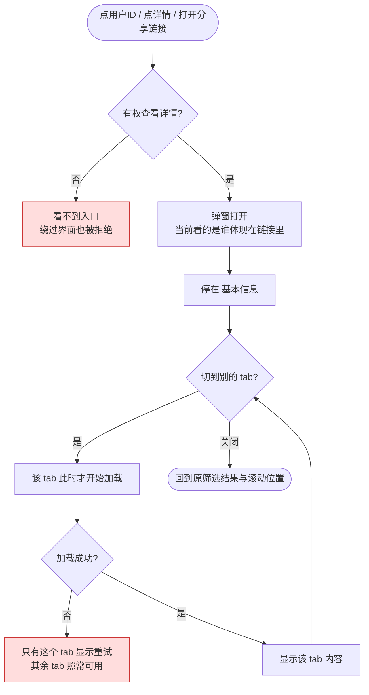
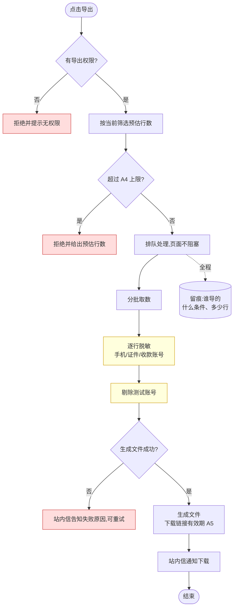
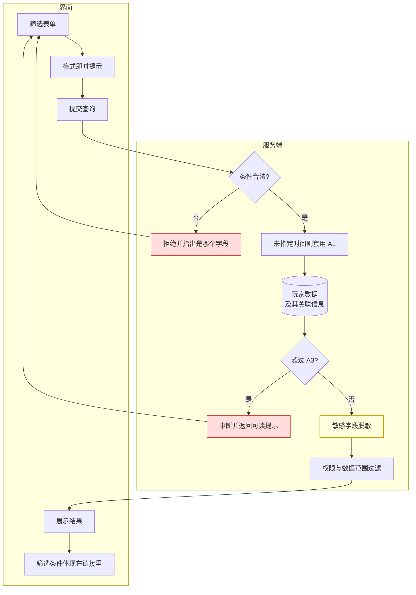

# 2.1 · 用户列表与详情

## 1. 背景与目标

**一句话**:后台找人的地方——运营能在 10 秒内按任意条件定位到一个玩家,并在一个页面看完他的全部情况。

**谁在用,用来做什么**

| 角色 | 场景 | 没有这一页会怎样 |
|---|---|---|
| 客服 | 玩家投诉"我的钱没到账",先把这个人查出来 | 要在多个页面之间来回跳,响应慢、容易查错人 |
| 风控 | 排查同一 IP 或设备下的多个账号 | 薅羊毛团伙识别不出来 |
| 运营 | 按标签、VIP 等级、充值额圈出目标人群 | 活动没法精准投放 |
| 财务 | 核对某个玩家的充提与余额 | 对账要跨系统查 |

**业务价值**
- 后台使用频率最高的入口页,几乎所有排查动作都从这里开始
- 是其余 8 个用户相关页面的跳转枢纽(2.2–2.9 均可从本页进入)
- 玩家信息的口径以本页为准,其他页面展示的用户数据与本页保持一致

**不做什么**
- 不做资金操作(充值/扣款走 M3.5,本页只提供跳转)
- 不做风控判定(只展示档案,规则判定在 M2.7)
- 不做后台账号管理(那是 M7 管理运营人员的账号,不是玩家)

**适用范围**
| 项 | 定义 |
|---|---|
| 终端 | Web 后台,**桌面优先**(设计基准 1440px) |
| 响应式 | 最小支持 1280px;**不做移动端适配** |
| 界面语言 | 后台界面简体中文;**玩家昵称等内容按原文展示,不翻译** |
| 时区 | 所有时间按**运营时区**(巴西)展示,页面顶部标注时区 |
| 货币 | 多币种共存,金额必须带币种标识,**不做汇率换算** |

## 2. 入口
菜单:用户管理 → 用户列表
跳入:全站任意「用户ID」链接 · 封禁管理 · 各报表下钻

## 3. 术语

> 仅列本页特有词;通用术语见 `../README.md` 第 2 段。

| 术语 | 定义 |
|---|---|
| 在线状态 | 玩家最近有活动即视为在线,判定窗口见 A6 |
| 邀请人 | 玩家注册时绑定的上级,**与「所属代理」不是一回事** |
| 累计充值 | 玩家所有**成功到账**的充值之和,**不含后台人工上分** |
| 真金 / 彩金 | 真金可直接提现;彩金是活动赠送,需打够流水才能提 |

## 4. 关键参数与假设

> **本表是这些数值的唯一出处。** 其余段落一律引用编号(如 A1),不重复写数值——
> 改一处忘三处是需求文档最常见的错误来源。
>
> 标「假设」的均为**未经实盘验证的取值**,评审时应逐条挑战。

| # | 参数 | 取值 | 性质 | 依据 / 待验证点 |
|---|---|---|---|---|
| A1 | 未指定时间时的默认查询窗 | 近 90 天 | 假设 | 需实盘看运营常用跨度;过窄会漏查,过宽拖库 |
| A2 | 时间筛选跨度上限 | 180 天 | 假设 | 同上;超限直接拒绝并提示 |
| A3 | 查询超时阈值 | 3 秒 | 假设 | 需压测确认;超时返回可读提示 |
| A4 | 导出行数上限 | 5 万行 | 假设 | 取决于导出服务的承载能力,需实测 |
| A5 | 导出链接有效期 | 24 小时 | 假设 | 合规要求可能更短 |
| A6 | 在线状态判定窗口 | 近 5 分钟内有活动 | 假设 | 取决于玩家端多久上报一次,需确认 |
| A7 | 筛选下拉项的更新延迟 | 5 分钟内 | 假设 | 新建渠道/标签后,多久能在筛选里选到 |
| A8 | 模糊匹配最小关键词长度 | 2 字符 | 假设 | 防单字符全表扫 |
| A9 | 详情弹窗各 tab 的预览条数 | 最近 20 条 | 假设 | 超出走「查看更多」跳完整页面;条数过多会拖慢弹窗打开 |

## 5. 字段清单

**筛选(19 项)**

| 字段 | 类型 | 可输入数据 / 校验 |
|---|---|---|
| 用户ID / 昵称 / 账号 | text(三选一) | ID 为数字;昵称/账号最长 32 字符;模糊匹配最小长度见 A8 |
| 渠道 | select | 只列启用中的渠道,更新延迟见 A7 |
| 在线状态 | select | 全部 / 在线 / 离线(判定见 A6) |
| 提现绑定手机 | text | 数字,最长 20 |
| VIP等级 | select | 0-N |
| 注册IP | text | IPv4/IPv6 格式校验 |
| 注册设备 | text | 最长 128 |
| 注册平台 / 登录平台 | select | 玩家从哪种客户端注册/登录 |
| 充值金额 min/max | number | 不小于 0;最小值不得大于最大值 |
| 是否充值 | select | 是 / 否 |
| 注册/登录/首充/最后投注/最后存款/最后登录时间 | daterange | 跨度上限见 A2;未指定见 A1 |
| 用户标签 | multi-select | 只列启用中的标签,更新延迟见 A7 |

**表格列**(支持列设置)
`序号 | 用户ID | 昵称 | 邀请人 | 渠道 | VIP | 余额(真金) | 彩金 | 累计充值 | 累计提现 | 标签 | 状态 | 注册时间 | 操作`

- **用户ID 列**为链接样式,点击即打开详情弹窗
- **操作列**含「详情」「封禁/解封」「打标签」三个入口

---

### 用户详情弹窗

**展开方式**:**弹窗**(不是抽屉,不是新页面)。列表停留在弹窗背后,关闭后回到原筛选结果与滚动位置。

**点击哪里展开**
| 入口 | 位置 | 说明 |
|---|---|---|
| 用户ID | 表格「用户ID」单元格 | 主入口,链接样式 |
| 「详情」按钮 | 表格「操作」列 | 与点 ID 等效 |
| 分享链接 | 全站任意用户ID | 点开即直接停在该玩家的详情上 |

> 勾选框、行内「封禁」「打标签」按钮**不触发**弹窗,避免误点。
> **详情必须可以把链接发给同事**——客服和风控排查时经常需要互相甩人。

**弹窗内 7 个 tab 的内容**

| # | Tab | 展示内容 | 数据来自 |
|---|---|---|---|
| 1 | 基本信息 | 用户ID · 昵称 · 账号 · 头像 · 在线状态 · VIP等级 · 标签 · 邀请人 · 所属渠道 · 实名状态 · 账号状态(正常/封禁)· 注册时间/IP/设备/平台 · 最后登录时间/IP | M2 |
| 2 | 钱包与账变 | **四分账余额**(真金 / 彩金 / 冻结 / 待打码)· 累计充值 · 累计提现 · 累计投注 · 最近账变流水(条数见 A9) | M3(只读) |
| 3 | 投注记录 | 最近投注(条数见 A9):局号 · 游戏 · 投注额 · 派彩 · 输赢 · 时间 | M4(只读) |
| 4 | 活动领取 | 参与过的活动 · 发放金额 · 打码进度与状态 | M4(只读) |
| 5 | 代理关系 | 上级代理 · 所属渠道与推广员 · 若本人是代理:下级人数与佣金贡献 | M5(只读) |
| 6 | 风控档案 | 注册/登录 IP 与设备 · **同 IP 账号数** · **同设备账号数** · 登录历史 · 风险标签 · 封禁历史 | M2 |
| 7 | 操作记录 | 后台对该玩家的全部操作:封禁/解封 · 打标签 · 人工上下分 · 查看敏感字段,含操作人与时间 | M7(只读) |

**弹窗内可执行的操作**
| 操作 | 权限码 | 说明 |
|---|---|---|
| 封禁 / 解封 | `user:ban` | 二次确认 + 原因必填,详见 2.4 |
| 打标签 / 移除标签 | `user:tag:edit` | 即时生效 |
| 人工上下分 | `finance:manual:adjust` | **跳转** M3.5,本弹窗不直接改余额 |
| 查看完整敏感字段 | 独立权限 | 默认脱敏,查看完整值单独留痕(见 E6) |

> 每个 tab 的「查看更多」跳到对应完整页面:tab2 → 2.2 · tab3 → 2.3 · tab4 → M4.3 · tab7 → M7.3

## 6. 需求清单

> 本段是**索引**:扫一眼知道这一页要做哪些事、各自需要什么权限。
> 详细规格在第 7 段,两段不重复表述。

| ID | 需求 | 触发条件 | 验收标准 | 权限码 |
|---|---|---|---|---|
| 2.1-R1 | 用户列表与分页 | 进入页面 / 翻页 | 默认按注册时间倒序;分页与总数准确 | `user:list:view` |
| 2.1-R2 | 19 项组合筛选 | 查询 / 回车 / 打开分享链接 | 任一及组合条件生效;重置清空;**当前筛选可分享给同事** | `user:list:view` |
| 2.1-R3 | 列设置 | 勾选列 | 勾选即时生效并按账号持久化 | `user:list:view` |
| 2.1-R4 | 用户详情弹窗 | 点用户ID / 点「详情」/ 打开分享链接 | 弹窗展示 7 个 tab,切到哪个才加载哪个;关闭后回到原筛选与滚动位置 | `user:detail:view` |
| 2.1-R5 | 导出 | 点导出 | **不阻塞页面**,完成后站内信通知;下载链接有效期见 A5 | `user:export` |

## 7. 需求详述

### 2.1-R2 · 19 项组合筛选

| 项 | 内容 |
|---|---|
| **触发条件** | 点击「查询」按钮 · 筛选框内回车 · 打开别人发来的带筛选条件的链接 |
| **可输入数据** | 见第 5 段字段表 |
| **功能范围** | 界面负责:收集条件、即时提示格式错误、把当前筛选体现在链接里 **服务端负责:条件合法性、结果正确性、超时保护。** 界面上的校验只为改善体验,**不能作为唯一防线** |
| **处理逻辑** | 见下方流程图 |
| **错误处理** | 参数非法 → 定位到具体字段的提示 无结果 → 空态"未找到匹配用户",并提示可放宽的条件 超时 → "查询范围过大,请收窄时间或增加条件",**不返回半截数据** |
| **测试案例** | **正向**:单条件 / 三条件组合 / 打开带筛选的分享链接 → 结果与条件一致,总数准确 **逆向**:最小值大于最大值 → 被拒绝并指出是哪个字段;跨度超 A2 → 被拒绝;关键词短于 A8 → 被拒绝;不填时间 → 自动套用 A1,且出结果快于 A3 |

处理过程见第 8 段的数据流向(同一条链路,不重复画)。

### 2.1-R4 · 用户详情弹窗

| 项 | 内容 |
|---|---|
| **触发条件** | 点表格「用户ID」· 点「操作」列的「详情」· 打开别人发来的该玩家详情链接 |
| **可输入数据** | 一个玩家。玩家不存在或已注销时按 E4 处理 |
| **功能范围** | 界面负责:弹窗开合、tab 切换、把当前看的是谁体现在链接里(以便分享) **服务端负责:每次取数都要判权限、每次返回都要脱敏。** **界面上"看不见"不算数据安全**——不允许把完整数据发给界面再靠隐藏遮住(见 E3、E6) |
| **处理逻辑** | 见下方流程 |
| **错误处理** | 玩家不存在/已注销 → 弹窗内提示,不出现系统错误页(E4) 无权限 → 不显示入口;绕过界面直接取数同样被拒绝并提示无权限(E3) **某个 tab 取数失败 → 只有该 tab 显示重试,其余 tab 照常可用** 弹窗打开期间该玩家被他人封禁 → 提交操作时提示状态已变更(E5) |
| **测试案例** | **正向**:点用户ID 打开 → 停在「基本信息」→ 切到「钱包与账变」时该 tab 才开始加载 → 关闭后列表的筛选条件与滚动位置都没变 **逆向**:分享链接里的玩家已注销 → 弹窗内提示,不是错误页;无权限账号绕过界面取数 → 被拒绝;某个 tab 加载失败 → 只有它显示重试,其余 tab 仍能正常查看 |

**用户看到的过程**

> 红色为拒绝与失败分支。

### 2.1-R5 · 导出

| 项 | 内容 |
|---|---|
| **触发条件** | 点击「导出」按钮(需导出权限) |
| **可输入数据** | 沿用当前筛选条件;可选导出列(默认同当前列设置) |
| **功能范围** | 界面负责:发起导出、展示进度 **服务端负责:排队、取数、脱敏、生成文件、完成通知、到期失效。** 导出**不得阻塞页面**,运营发起后可以继续做别的事 |
| **处理逻辑** | 见下方流程图 |
| **错误处理** | 超上限 → 拒绝并给出当前预估行数 任务失败 → 站内信告知失败原因,可重试 链接过期 → 提示重新导出,不展示原文件 |
| **测试案例** | **正向**:1 万行导出 → 收到通知,文件行数与列表总数一致,敏感字段已脱敏 **逆向**:超 A4 行 → 被拒绝并告知当前行数;无权限的人绕过界面发起导出 → 被拒绝;超 A5 后再点下载链接 → 已失效;结果里含测试账号 → 文件中不出现 |

> 红色为拒绝/失败分支,黄色为安全关键步骤(脱敏见 E6,测试账号剔除见 E7)。

## 8. 数据流向与系统串接

**数据流向**(运营输入 → 服务端处理 → 界面呈现)

> 红色为错误分支,黄色为安全关键步骤(脱敏见 E6)。

- **本页几乎只读**:唯一会被改动的是「列设置」,按每个后台账号各自保存
- **玩家数据要实时**,不接受看到过期数据;筛选下拉项的更新延迟见 A7

**系统串接**

| 外部系统 | 用途 | 方向 | 责任边界 |
|---|---|---|---|
| 文件存储服务 | 存放导出的文件 | 本页 → 文件存储 | 生成、提供下载、到期自动失效(有效期见 A5) |
| 站内信(M6.1) | 导出完成后通知发起人 | 本页 → M6 | 本页只负责发出通知,消息怎么展示、已读状态归 M6 |

本页无第三方系统对接。

## 9. 异常与边界

> 正、反流程都要想一遍。每条都应有对应测试用例。数值一律引用第 4 段编号。

| # | 场景 | 触发条件 | 预期处理 |
|---|---|---|---|
| E1 | 查询范围过大导致超时 | 不填时间,又只用了区分度低的条件 | 自动套用 A1 默认时间窗、A2 跨度上限;超过 A3 给出可读提示,**不能白屏** |
| E2 | 导出数据量过大 | 筛选结果超过 A4 | 拒绝并提示收窄条件;未超则转异步任务 |
| E3 | 越权查看玩家详情 | 改链接里的玩家标识,或绕过界面直接取数 | **每次取数都要在服务端判权限**并拒绝;**把入口藏起来不算防线** |
| E4 | 玩家不存在或已注销 | 打开一条旧的分享链接 | 提示"该玩家不存在或已注销",**不出现系统错误页** |
| E5 | 并发状态变更 | 详情弹窗打开期间该玩家被他人封禁 | 操作提交时二次校验状态,冲突提示刷新 |
| E6 | 敏感字段泄露 | 手机号/证件号/收款账号的展示与导出 | **数据发出前就要脱敏**;查看完整值需独立权限且单独留痕 |
| E7 | 测试账号混进统计 | 该玩家被标记为测试账号 | 列表里可见但有标记;**导出和报表默认剔除** |
| E8 | 标签并发删除 | 筛选用的标签被他人删除 | 提示筛选条件已失效,不返回空结果误导 |
| E9 | 昵称含特殊字符 | 玩家昵称含表情、从右向左文字或超长内容 | 按原文保存与展示,列表里截断;**导出的文件被表格软件打开时不能被当成公式执行** |

## 10. 状态清单
空 / 加载 / 错误 / 无权限 / 用户已封禁(标记)/ 测试账号(标记)/ 导出任务进行中

> 仅声明**必须存在哪些状态**;各状态长什么样由 Figma 定义。

## 11. 涉及表与职责

**拥有**(owner=M2):`User` `UserTag` `VipLevel` `UserKyc`
**只读**:`Wallet` `Transaction`(owner=M3)· `BetRecords`(owner=M4)· `Channel`(owner=M5)
→ `../表设计.prisma`

| 事项 | 归属 |
|---|---|
| 筛选条件校验、结果正确性、超时保护 | **服务端** |
| 权限判定与可见范围过滤 | **服务端**(E3) |
| 敏感字段脱敏 | **服务端**(E6) |
| 列设置的保存 | 服务端(按每个后台账号各自保存) |
| 导出的排队、取数、脱敏、通知 | 服务端 |
| 表单交互、把筛选体现在链接里、格式即时提示 | 界面 |

## 12. 关联页面
跳出:钱包账变(2.2)· 投注明细(2.3)· 封禁管理(2.4)· 用户标签(2.5)· 人工充值(M3.5)· 打码核销(M3.7)
跳入:全站用户ID 链接 · 封禁管理 · 报表下钻
