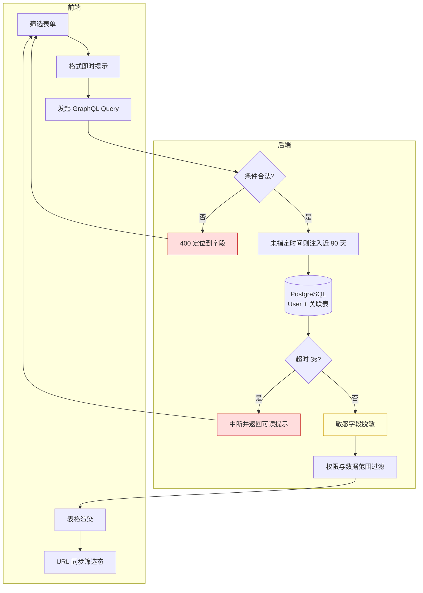

# 2.1 · 用户列表与详情

## 1. 背景与目标

**目标**:运营能在 10 秒内按任意维度定位到一个玩家,并在一个页面看完他的完整档案。

**背景**:客服处理争议、风控排查多账号、运营圈人做活动,起点都是"先找到这个人"。现有 `user.resolver` 已有基础列表,但筛选维度不足、详情分散在多个页面,一次排查要跳 5 个地方。

**价值**:后台使用频率最高的入口页,也是其余 8 个用户相关页面的跳转枢纽。

**不做什么**
- 不做资金操作(充值/扣款走 M3.5,本页只提供跳转)
- 不做风控判定(只展示档案,规则引擎在 M2.7)
- 不做后台账号管理(那是 M7 的 `Account`)

**适用范围**
| 项 | 定义 |
|---|---|
| 终端 | Web 后台,**桌面优先**(设计基准 1440px) |
| 响应式 | 最小支持 1280px;**不做移动端适配** |
| 界面语言 | 后台界面 `zh-CN`;**玩家数据中的文本按原始语言展示,不翻译** |
| 时区 | 所有时间按**运营时区**(巴西)展示,页面顶部标注时区 |
| 货币 | 多币种共存,金额必须带币种标识,**不做汇率换算** |

## 2. 入口
菜单:用户管理 → 用户列表
跳入:全站任意「用户ID」链接 · 封禁管理 · 各报表下钻

## 3. 术语

> 仅列本页特有词;通用术语见 `../README.md` 第 2 段。

| 术语 | 定义 |
|---|---|
| 在线状态 | 近 5 分钟内有心跳请求即为在线 |
| 邀请人 | 注册时绑定的上级(`parent_id`),与「所属代理」不同 |
| 累计充值 | 所有 `paid` 状态充值订单之和,**不含人工上分** |

## 4. 字段清单

**筛选(19 项)**

| 字段 | 类型 | 可输入数据 / 校验 |
|---|---|---|
| 用户ID / 昵称 / 账号 | text(三选一) | ID 为数字;昵称/账号最长 32 字符;**后端做模糊匹配上限**,禁止空串全表扫 |
| 渠道 | select | 来自 `Channel` 启用项 |
| 在线状态 | select | 全部 / 在线 / 离线 |
| 提现绑定手机 | text | 数字,最长 20 |
| VIP等级 | select | 0-N |
| 注册IP | text | IPv4/IPv6 格式校验 |
| 注册设备 | text | 最长 128 |
| 注册平台 / 登录平台 | select | `PlatformType` 枚举 |
| 充值金额 min/max | number | ≥0;min ≤ max,否则前后端均报错 |
| 是否充值 | select | 是 / 否 |
| 注册/登录/首充/最后投注/最后存款/最后登录时间 | daterange | **跨度上限 180 天**(见 E1) |
| 用户标签 | multi-select | 来自 `Tag` |

**表格列**(支持列设置)
`序号 | 用户ID | 昵称 | 邀请人 | 渠道 | VIP | 余额(真金) | 彩金 | 累计充值 | 累计提现 | 标签 | 状态 | 注册时间 | 操作`

**详情抽屉 tab**(页面内 tab,非独立路由)
基本信息 · 钱包与账变 · 投注记录 · 活动领取 · 代理关系 · 风控档案 · 操作记录

## 5. 需求清单

| ID | 需求 | 触发条件 | 验收标准 | 现状 | 权限码 | 人日 |
|---|---|---|---|---|---|---|
| 2.1-R1 | 用户列表与分页 | 进入页面 / 翻页 | 默认按注册时间倒序;分页与总数准确 | 已有 | `user:list:view` | 0.5 |
| 2.1-R2 | 19 项组合筛选 | 点「查询」/ 回车 / URL 带参进入 | 任一及组合条件生效;重置清空;筛选态同步到 URL | 改造 | `user:list:view` | 1 |
| 2.1-R3 | 列设置 | 点「列设置」勾选 | 勾选即时生效并按账号持久化 | 新增 | `user:list:view` | 0.5 |
| 2.1-R4 | 用户详情抽屉 | 点击表格行 | 展示 7 个 tab;各 tab 懒加载 | 改造 | `user:detail:view` | 0.5 |
| 2.1-R5 | 异步导出 | 点「导出」 | 生成任务→完成后站内信通知→下载链接 24h 有效 | 新增 | `user:export` | 0.5 |

> `现状`:`已有`(仅适配)· `改造`(有基础需改)· `新增`(从零)。人日按现状差异估。
> 人日 ≥ 1 或涉及资金/权限/外部系统的需求,必须在第 6 段展开。

## 6. 需求详述

> 仅展开复杂需求。简单需求(R1/R3/R4)第 5 段一行已足够。

### 2.1-R2 · 19 项组合筛选

| 项 | 内容 |
|---|---|
| **触发条件** | 点击「查询」按钮 · 筛选框内回车 · 带查询参数的 URL 直接进入 |
| **可输入数据** | 见第 4 段字段表。时间跨度上限 180 天;金额 min ≤ max;模糊匹配关键词 ≥ 2 字符 |
| **功能范围** | 前端:表单收集、即时格式提示、URL 同步 **后端:全部条件校验、SQL 构造、分页、排序、超时保护**(前端校验仅作体验优化,不可作为唯一防线) |
| **处理逻辑** | 1. 收集非空条件 2. 后端校验合法性,非法直接 400 3. 未指定时间范围时**强制注入默认时间窗(近 90 天)** 4. 按索引字段优先构造查询 5. 超时(3s)中断并返回可读提示 6. 结果分页返回,同时返回总数 7. 前端将条件序列化到 URL query |
| **错误处理** | 参数非法 → 定位到具体字段的提示 无结果 → 空态"未找到匹配用户",并提示可放宽的条件 超时 → "查询范围过大,请收窄时间或增加条件",不返回半截数据 |
| **测试案例** | **正向**:单条件 / 三条件组合 / URL 带参直进 → 结果与条件一致,总数准确 **逆向**:min > max → 400;时间跨度 200 天 → 400;关键词单字符 → 400;不传时间 → 自动近 90 天且响应 < 3s |

### 2.1-R5 · 异步导出

| 项 | 内容 |
|---|---|
| **触发条件** | 点击「导出」按钮(需 `user:export` 权限) |
| **可输入数据** | 沿用当前筛选条件;可选导出列(默认同当前列设置) |
| **功能范围** | 前端:发起任务、展示任务状态 **后端:任务队列、数据查询、脱敏、文件生成、通知、链接过期** |
| **处理逻辑** | 1. 校验权限与筛选条件 2. 预估行数,> 5 万拒绝并提示收窄 3. 创建导出任务并立即返回任务ID(不阻塞) 4. Worker 分批查询,**逐行脱敏**(手机号/证件号/收款账号) 5. 剔除 `isTestAccount=true` 的行 6. 生成文件存对象存储,链接有效期 24h 7. 完成后发站内信通知 8. 全程写 `OperationLog`(操作人、条件、行数) |
| **错误处理** | 超上限 → 拒绝并给出当前预估行数 任务失败 → 站内信告知失败原因,可重试 链接过期 → 提示重新导出,不展示原文件 |
| **测试案例** | **正向**:1 万行导出 → 收到通知,文件行数与列表总数一致,敏感字段已脱敏 **逆向**:6 万行 → 拒绝;无权限调接口 → 403;25h 后访问链接 → 失效;含测试账号 → 文件中不出现 |

## 7. 数据流向与系统串接

**数据流向**(用户端输入 → 后端处理 → 最终显示)

> 红色为错误分支,黄色为安全关键步骤(脱敏,见 E6)。

- **写入**:本页仅列设置写入(按账号存储),其余均为读
- **缓存**:不缓存用户数据(实时性优先);筛选下拉的枚举项(渠道/标签)可缓存 5 分钟

**系统串接**

| 外部系统 | 用途 | 方向 | 责任边界 |
|---|---|---|---|
| 对象存储(S3) | 导出文件存放 | 后端 → S3 | 后端负责上传与签名 URL;过期由 S3 生命周期策略控制 |
| 站内信(M6.1) | 导出完成通知 | 后端 → M6 | 本页只投递消息,渲染与已读归 M6 |

> 本页无第三方系统对接。涉及支付通道、游戏厂商等外部串接的页面(M3.9 / M4.4),此表必须包含**正向与逆向流程图**及对接人。

## 8. 异常与边界

> 正、反流程都要想一遍。每条都应有对应测试用例。

| # | 场景 | 触发条件 | 预期处理 |
|---|---|---|---|
| E1 | 大范围筛选超时 | 无时间限制 + 无索引字段组合 | 后端强制默认时间窗(近 90 天),跨度上限 180 天;超时返回可读提示而非白屏 |
| E2 | 导出数据量过大 | 筛选结果 > 5 万行 | 拒绝并提示收窄条件;5 万内转异步任务 |
| E3 | 越权访问详情 | 手改 URL 带无权限用户ID | **后端校验**权限返回 403;前端不得作为唯一防线 |
| E4 | 用户不存在/已注销 | 从旧链接跳入 | 显示"用户不存在或已注销",不报 500 |
| E5 | 并发状态变更 | 详情打开期间用户被他人封禁 | 操作提交时二次校验状态,冲突提示刷新 |
| E6 | 敏感字段泄露 | 手机号/证件号/收款账号的展示与导出 | **后端脱敏**;查看完整值需独立权限且单独留痕 |
| E7 | 测试账号混入 | `isTestAccount=true` | 列表可见但打标;**导出与报表默认剔除** |
| E8 | 标签并发删除 | 筛选用的标签被他人删除 | 提示筛选条件已失效,不返回空结果误导 |
| E9 | 昵称含特殊字符 | 玩家昵称含 emoji / RTL / 超长 | 按原文存储与展示,**列表截断显示**;导出时防 CSV 注入(`=`/`+`/`-`/`@` 前缀转义) |

## 9. 状态清单
空 / 加载 / 错误 / 无权限 / 用户已封禁(标记)/ 测试账号(标记)/ 导出任务进行中

> 仅声明**必须存在哪些状态**;各状态长什么样由 Figma 定义。

## 10. 涉及表与职责

**拥有**(owner=M2):`User` `UserTag` `VipLevel` `UserKyc`
**只读**:`Wallet` `Transaction`(owner=M3)· `BetRecords`(owner=M4)· `Channel`(owner=M5)
→ `../表设计.prisma`

| 事项 | 归属 |
|---|---|
| 筛选校验、分页、排序、超时保护 | **后端** |
| 权限判定与数据范围过滤 | **后端**(E3) |
| 敏感字段脱敏 | **后端**(E6) |
| 列设置持久化 | 后端(按账号存储) |
| 导出任务、脱敏、通知 | 后端 Worker |
| 表单交互、URL 同步、格式即时提示 | 前端 |

## 11. 关联页面
跳出:钱包账变(2.2)· 投注明细(2.3)· 封禁管理(2.4)· 用户标签(2.5)· 人工充值(M3.5)· 打码核销(M3.7)
跳入:全站用户ID 链接 · 封禁管理 · 报表下钻
