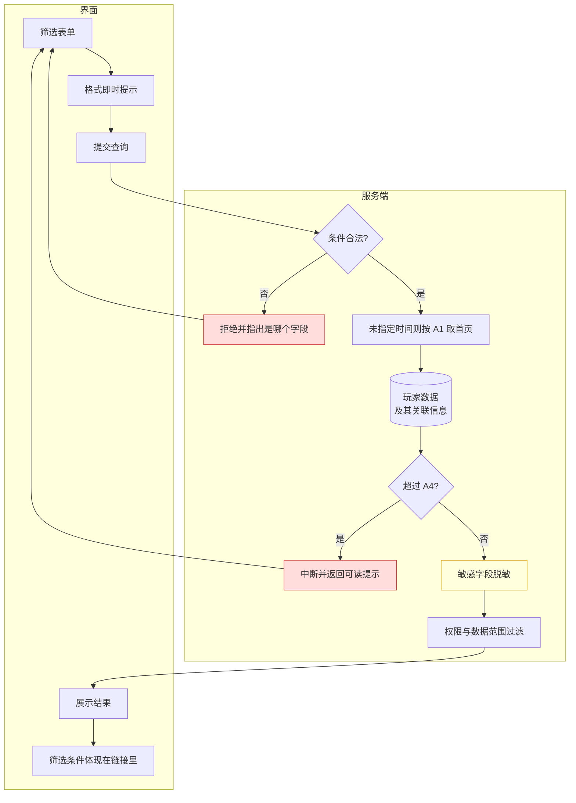

# 2.1 · 用户列表与详情

## 1. 背景与目标

**一句话**:后台找人的地方——运营能在 10 秒内按任意条件定位到一个玩家,并在一个页面看完他的全部情况。

**谁在用,用来做什么**

| 角色 | 场景 | 没有这一页会怎样 |
|---|---|---|
| 客服 | 玩家投诉"我的钱没到账",先把这个人查出来 | 要在多个页面之间来回跳,响应慢、容易查错人 |
| 风控 | 排查同一 IP 或设备下的多个账号 | 薅羊毛团伙识别不出来 |
| 运营 | 按标签、VIP 等级、充值额圈出目标人群 | 活动没法精准投放 |
| 财务 | 核对某个玩家的充提与余额 | 对账要跨系统查 |

**业务价值**
- 后台使用频率最高的入口页,几乎所有排查动作都从这里开始
- 是其余相关页面查询用户信息的跳转枢纽
- 玩家信息的口径以本页为准,其他页面展示的用户数据与本页保持一致

**不做什么**
- 不做资金操作(充值/扣款走人工充值页,本页只提供跳转)
- 不做风控规则判定(详情弹窗内展示关联账户数据,规则引擎另议)
- 不做后台账号管理(那是管理运营人员的账号,不是玩家)

**适用范围**
| 项 | 定义 |
|---|---|
| 终端 | Web 后台,**桌面优先**(设计基准 1440px) |
| 响应式 | 最小支持 1280px;**不需要做移动端适配** |
| 界面语言 | 后台界面简体中文;**玩家昵称等内容按原文展示,不翻译** |
| 时区 | 所有时间按**运营时区**展示,页面顶部标注时区及时间 |
| 货币 | 多币种共存,金额必须带币种标识 |

## 2. 入口
菜单:用户管理 → 用户列表
跳入:全站任意「用户ID」链接 · 封禁列表 · 各报表

## 3. 术语

> 仅列本页特有词;通用术语见 `../README.md` 第 2 段。

| 术语 | 定义 |
|---|---|
| 在线状态 | **以长连接为准**:玩家客户端与服务端存在活跃 WebSocket 连接即在线,断开超过宽限期视为离线;客户端不支持长连接时,退化为「窗口期内有请求/心跳」。两种判定并存时以长连接为准。参数见 A5。列表展示的是**查询时刻**的状态,不实时刷新 |
| 邀请人 | 玩家注册时绑定的上级,**与「所属代理/上级代理」不是一回事**;不作为表格列展示,在详情弹窗内查看 |
| 上级代理 | 玩家归属的代理(owner=M7 代理管理);列表「上级代理」列展示的是它,不是邀请人 |
| 累计充值 | 玩家所有**成功到账**的充值之和,**不含后台人工上分**;列表的「充值总额」即此口径按标准币 USD 汇总(见 [`标准计价.md`](./标准计价.md)) |

> 资金相关术语(钱包、余额、可兑换余额、真金、彩金、打码任务、有效投注、闪兑等)
> **统一定义在同目录 [`资金模型.md`](./资金模型.md) 第 2 段**,此处不重复。
> 要点:每个币种只有**一个余额**,真金与彩金是账本上的**来源构成**,不是两个独立余额。

## 4. 关键参数与假设

> **本表是这些数值的唯一出处。** 其余段落一律引用编号(如 A1),不重复写数值——
>
> 标「假设」的均为**未经实盘验证的取值**,评审时应逐条挑战。

| # | 参数 | 取值 | 性质 | 依据 / 待验证点 |
|---|---|---|---|---|
| A1 | 未指定时间时的默认查询窗 | **不限时间**,按注册时间降序取首页 | 假设 | 每页条数见 A2;靠排序与分页兜住数据量,不靠时间窗 |
| A2 | 每页条数 | 50 条/页 | 已验证 | 实采为 50 条/页(`截图/列表-表格与分页.png`) |
| A3 | 进入页面是否自动查询 | **否**,点「查询」才取数 | 假设 | 减轻服务端压力 |
| A4 | 查询响应上限 | 5 秒 | **未验证假设** | 超过即中断并给可读提示,不返回半截数据。这是**约束不是目标**:实测达不到就改查询实现,不是把这个数调大 |
| A5 | 在线状态判定 | 首选按 WebSocket 连接状态:断开超过 **60 秒**宽限期判离线;客户端不支持长连接时退化为**近 5 分钟内有请求/心跳** | 假设 | 宽限期与心跳周期取决于玩家端的连接与上报机制,需与玩家端确认;两种判定并存时以长连接为准 |
| A6 | 导出行数上限 | 5 万行 | 假设 | 取决于导出服务的承载能力,需实测 |
| A7 | 导出链接有效期 | 24 小时 | 假设 | 防止文件在对象存储里无限累积 |

**时间跨度不设上限。** 用户列表按注册时间排序分页,查得慢就靠 A4 兜住,不用跨度限制去挡。

> A4 是按语义补的取值,**尚未验证** —— 拿到带数据的账号后实测确认。

## 5. 字段清单

**表格列**

> **列清单以实际界面为准**(2026-08-17 对照线上表格核对),共 19 列,顺序如下;
> 本文档正文的「用户」与界面列头的「会员」同义。
> 旧清单混入的筛选与弹窗字段已移出列表:昵称、注册IP、注册平台、登录时间、首充时间、
> 总流水金额、余额、真金、彩金、最后投注/存款时间——它们仍作为**筛选项**(见下方筛选框)
> 或**详情弹窗内容**存在,只是不再是表格列;测试账号不单独成列,改为**行内标记**(E7)。

| # | 字段 | 类型 | 说明 / 口径 |
|---|---|---|---|
| 1 | 会员ID | number | 蓝色可点,点击打开详情弹窗;旁边的**复制按钮只复制 ID,不打开弹窗**。查询按**精确匹配**,需考虑查询速度 |
| 2 | 会员账号 | text | 注册时所用账号(手机号 / 邮箱等);通过 Google 注册时展示哪个值为账号**待确认** |
| 3 | 邮箱 | text | 绑定邮箱,未绑定为空;脱敏见 E6 |
| 4 | 真实姓名 | text | 实名认证姓名,未实名为空;脱敏见 E6 |
| 5 | 手机号 | text | 数字,最长 20;**口径待确认**:账号绑定手机还是提现绑定手机(两者是不同字段);脱敏见 E6 |
| 6 | 上级代理 | text | 玩家归属的代理,**与「邀请人」不是一回事**(见第 3 段术语);点击是否跳转代理详情**待确认** |
| 7 | 推广渠道 | text | 玩家注册来源的渠道 |
| 8 | 会员标签 | tag | 自定义标签;**≥ 3 个时折叠**:只显示前 2 个 + 「+N」,悬停浮层展示全部,见下方「用户标签折叠」 |
| 9 | 账号状态 | enum | 正常 / 封禁(枚举取值与封禁列表 2.4 对齐,是否含「冻结」等中间态**待确认**) |
| 10 | 在线状态 | enum | 在线 / 离线,判定见 A5 |
| 11 | VIP等级 | number | 0-N |
| 12 | 注册时间 | datetime | 运营时区,例如:2026-07-14 13:16:46 |
| 13 | 充值次数 | int | **成功到账**的充值笔数,口径与「累计充值」一致(不含后台人工上分) |
| 14 | 充值总额 | float | 用户累计成功充值,**换算为标准币 USD 展示**;列头带说明悬浮(见下方「列头说明组件」),换算规则见 [`标准计价.md`](./标准计价.md) |
| 15 | 提现次数 | int | **成功提现**的笔数 |
| 16 | 提现总额 | float | 用户累计成功提现,同上按标准币 USD 展示,列头带说明悬浮 |
| 17 | 充提差额 | float | 充值总额 − 提现总额,标准币 USD,列头带说明悬浮 |
| 18 | 最后登录时间 | datetime | 运营时区,例如:2026-07-14 13:16:46 |
| 19 | 操作 | — | 固定在右侧,当前只有「设为测试账号」一个动作 |
- **用户标签折叠**:标签数 ≤ 2 全部显示;≥ 3 只显示前 2 个,其余折叠为「+N」计数标记,悬停「+N」以浮层展示全部标签(浮层内标签样式与列内一致)。单个玩家常挂十几个标签(截图里一行挂满 15 个),折叠保证行高稳定、表格布局不被撑乱
- **列头说明组件**:充值总额 / 提现总额 / 充提差额的列头带「?」图标,悬停显示口径说明——按标准币 USD 换算、每笔账变按入账时刻汇率、只读派生视图不作任何资金判定依据(见 [`标准计价.md`](./标准计价.md))。该悬浮说明抽成**通用组件**,供其他需要口径解释的列复用(截图中会员ID等列头已有 ? 图标,即此形态)
- 表格横向滚动,分页在底部,每页条数见 A2 —— 见 `截图/列表-表格与分页.png`

**筛选框**

**共 16 项**,分两屏:收起态只露前 6 项,点「展开」出全部 16 项。
收起态见 `截图/列表-筛选面板-收起.png`,展开态见 `截图/列表-筛选面板-展开.png`。

| # | 筛选项 | 类型 | 首屏 | 说明 |
|---|---|---|---|---|
| 1 | 渠道 | select | 是 | 下拉展示所有渠道,可输入搜索实时匹配 |
| 2 | 用户ID / 用户昵称 / 用户账号 | select + text | 是 | 左侧下拉选维度,右侧输入值,**精确匹配** |
| 3 | 在线状态 | select | 是 | 全部 / 在线 / 离线(判定见 A5) |
| 4 | 用户提现绑定手机 | text | 是 | **精确匹配** |
| 5 | VIP等级 | select | 是 | 默认「不限」;下拉展示本平台已设置的全部等级 |
| 6 | 时间 | select | 是 | 默认「不限」。选中某个时间维度后,**右侧动态插入一个日期范围框**,见下方说明 |
| 7 | 注册IP | text | 否 | IPv4/IPv6 格式校验,**精确匹配** |
| 8 | 注册设备 | text | 否 | 设备标识,**精确匹配** |
| 9 | 注册平台 | select | 否 | 不限 / 网页 / PWA / APK |
| 10 | 登陆平台 | select | 否 | 取值同注册平台 |
| 11 | 充值金额最小值 | number | 否 | 筛出累计充值 **大于等于** 该值的玩家(标准币 USD 口径,同「充值总额」列) |
| 12 | 充值金额最大值 | number | 否 | 筛出累计充值 **小于等于** 该值的玩家(同上);小于最小值时拒绝并指出字段 |
| 13 | 是否充值 | select | 否 | 是 / 否 |
| 14 | 最后投注时间 | daterange | 否 | 独立日期范围框,与第 6 项的动态框并存 |
| 15 | 最后存款时间 | daterange | 否 | 同上 |
| 16 | 最后登录时间 | daterange | 否 | 同上 |

**第 6 项「时间」的行为**:它是一个维度选择器,不是日期框本身。
选中后在其右侧插入一个对应的日期范围框,框上带快捷选项(今日 / 昨日 / 近3日 / 近7日 / 上周 / 本月 / 上月),
插入后同排后续字段依次右移 —— 见 `截图/列表-筛选面板-时间与日期框.png`。**跨度不设上限。**

> **可选维度待确认**:14–16 三项已是独立日期框,「时间」下拉是否仍重复提供这三个维度需实盘核对;
> 确定覆盖的是注册时间(截图已验证),登录时间、首充时间为推断。

**全部文本类筛选一律精确匹配**,不做模糊搜索 —— 输入完点「查询」才取数。

### 用户详情弹窗

点击用户ID 打开弹窗,内含 **10 个 tab**。
**完整规格见同目录 [`用户详情弹窗.md`](./用户详情弹窗.md)**,此处只列索引:

| # | Tab | 一句话 |
|---|---|---|
| 1 | 用户详情 | 该币种**单一余额** + 来源构成派生视图 · CPF · 充提差与冻结资金 · 注册与登录的 IP、设备、域名、渠道 |
| 2 | 账户详情 | 玩家绑定的收款账户(银行名称 / 持有人 / 账户信息) |
| 3 | 风控数据 | 同设备/同 IP 的关联账户数量 |
| 4 | 订单数据 | 单注明细 |
| 5 | 提款记录 | **按币种**统计,含 CPF 与四个时间戳;资格判定见 `资金模型.md` R10 |
| 6 | 充值记录 | 支付金额 / 获得金额 / 赠送金额分开 |
| 7 | 资产变动 | 所有余额变动流水;总额是余额,真金彩金是**来源构成**(混合注在此看出出资拆分),打码量是该币种**全部任务剩余量合计** |
| 8 | 投注记录 | **按游戏聚合**的统计与 RTP |
| 9 | 资产走势 | 余额随时间变化的面积图 |
| 10 | 状态监控 | 获客与首充事实拉平成一行的宽表,用于**投放归因核对** |

弹窗顶部有**常驻信息区**(不随 tab 切换),含可就地修改的账号、手机、邮箱、备注,
以及可新增的打码量 —— 新增即按 `资金模型.md` R8 **创建一条独立任务**,需二次确认与原因。

## 6. 需求清单

> 本段是**索引**:扫一眼知道这一页要做哪些事、各自需要什么权限。
> 详细规格在第 7 段,两段不重复表述。
>
> **R1–R5 是页面行为**,规格在第 7 段;**R6–R17 是这一页所有金额的底层资金规则**,
> 规格在同目录 [`资金模型.md`](./资金模型.md)。R6 起的实现主体在财务、玩法、
> 系统设置与玩家端(**均在本仓库范围外**),但语义只在这里定义一次,前后台共用。
>
> **闪兑延后**(2026-08 决定):R11、R12 整条延后,R13 的汇率与报价、R14 的闪兑确认页、
> R15 的闪兑对账随之延后,拟拆分为**第三方闪兑服务**后再上。规格保留为验收契约,
> 详见 `资金模型.md`「范围裁剪:闪兑延后」。

| ID | 需求 | 触发条件 | 验收标准 | 权限码 |
|---|---|---|---|---|
| 2.1-R1 | 用户列表与分页 | 进入页面 / 翻页 | 默认按注册时间倒序;每页条数见 A2;**进入页面不自动查询**(A3);分页与总数准确 | `user:list:view` |
| 2.1-R2 | 16 项组合筛选 | 查询 / 回车 / 打开分享链接 | 16 项任一及组合生效;收起态只露前 6 项;重置清空;**当前筛选可分享给同事** | `user:list:view` |
| 2.1-R3 | 列设置 | 勾选列 | 勾选即时生效并按账号持久化 | `user:list:view` |
| 2.1-R4 | 用户详情弹窗 | 点用户ID / 点「详情」/ 打开分享链接 | 弹窗展示 10 个 tab,切到哪个才加载哪个;关闭后回到原筛选与滚动位置 | `user:detail:view` |
| 2.1-R5 | 导出 | 点导出 | **不阻塞页面**,完成后站内信通知;下载链接有效期见 A7 | `user:export` |
| 2.1-R6 | 多币种单钱包与统一余额 | 某币种首次产生资金往来 | 同玩家同币种只有一个钱包与一个余额;冻结与提现占用不计入可用;余额不为负 | `finance:wallet:view` |
| 2.1-R7 | 资金来源账本与账变流水 | 任何一次余额变化 | 无流水不得改余额;流水记变动前/金额/变动后与来源;冲正写反向流水不改原记录 | `finance:ledger:view` |
| 2.1-R8 | 充值及彩金创建独立打码任务 | 充值到账 / 彩金入账 / 人工调整 | 每笔独立建任务不合并;充值固定 1 倍,彩金按活动倍数;人工调整可填 0 倍但需豁免权限、原因与留痕;**倍数缺失一律拒绝入账,不退化为 0 倍** | `finance:wager:adjust` |
| 2.1-R9 | 有效投注与 FIFO 跨任务核销 | 一笔投注最终结算成功 | 严格 FIFO;单笔可连续冲抵多条任务且总量守恒;超额部分不形成打码余额;重复推送只核销一次 | `finance:wager:view` |
| 2.1-R10 | 按币种钱包执行提现拦截 | 玩家发起提现 / 后台审核 | 该币种存在任意 active 任务即整个币种禁提;币种之间互不牵连;被拦时告知还差多少 | `finance:withdraw:review` |
| 2.1-R11 | 跨币种闪兑(**延后**) | 玩家确认报价并提交闪兑 | 整笔原子成败,不出现单边账;报价过期或币种停用即拒绝;同一请求重复提交只成交一笔 | `finance:fx:view` |
| 2.1-R12 | 闪兑的打码义务迁移(**延后**) | 一次闪兑成功执行 | 逐条任务按可兑换余额比例拆分;目标任务继承来源与任务链;往返闪兑义务不增不减 | `finance:fx:view` |
| 2.1-R13 | 币种、汇率、报价与精度配置 | 运营修改币种或汇率配置 | 精度、汇率、报价有效期均可配且留痕;缺配置时该币种不可用而非套默认值 | `system:currency:config` |
| 2.1-R14 | 玩家端钱包与闪兑展示 | 玩家打开钱包 / 发起闪兑 | 玩家只见单一余额与"还差多少";闪兑确认页展示将迁移的打码量;展示舍入不写回 | — |
| 2.1-R15 | 自动对账与不平告警 | 按周期自动执行 / 手动发起 | 钱包、流水、闪兑、任务、派彩两轨每期核对;不平即告警并冻结该钱包提现与闪兑 | `finance:reconcile:view` |
| 2.1-R16 | 扣款顺序与返奖回冲 | 下注扣款 / 该注派彩 / 提现扣款 | 下注彩金优先扣光为止、提现真金优先,两个方向相反;打码按下注全额递减与出资来源无关;出资比例下注瞬间冻结,派彩按该比例回冲且两轨之和恒等于派彩额 | `finance:ledger:view` |
| 2.1-R17 | 人工打码干预(增加/清除) | 运营给某币种加打码量 / 清除某条任务 | 加码填绝对值不走倍数、允许超过余额;**清除只能逐条,不提供一键清空**;两者均需原因与留痕并进对账关注项 | `finance:wager:add` `finance:wager:clear` |

## 7. 需求详述

### 2.1-R2 · 16 项组合筛选

| 项 | 内容 |
|---|---|
| **触发条件** | 点击「查询」按钮 · 筛选框内回车 · 打开别人发来的带筛选条件的链接 |
| **可输入数据** | 见第 5 段字段表 |
| **功能范围** | 界面负责:收集条件、即时提示格式错误、把当前筛选体现在链接里 **服务端负责:条件合法性、结果正确性、超时保护。** 界面上的校验只为改善体验,**不能作为唯一防线** |
| **处理逻辑** | 见下方流程图 |
| **错误处理** | 参数非法 → 定位到具体字段的提示 无结果 → 空态"未找到匹配用户",并提示可放宽的条件 超时 → "查询范围过大,请收窄时间或增加条件",**不返回半截数据** |
| **测试案例** | **正向**:单条件 / 三条件组合 / 打开带筛选的分享链接 → 结果与条件一致,总数准确 **逆向**:最小值大于最大值 → 被拒绝并指出是哪个字段;不填时间 → 按 A1 取首页,且出结果快于 A4;查询超时 → 给出可读提示而不是白屏或半截数据 |

处理过程见第 8 段的数据流向(同一条链路,不重复画)。

### 2.1-R4 · 用户详情弹窗

| 项 | 内容 |
|---|---|
| **触发条件** | 点表格「用户ID」· 点「操作」列的「详情」· 打开别人发来的该玩家详情链接 |
| **可输入数据** | 一个玩家。玩家不存在或已注销时按 E4 处理 |
| **功能范围** | 界面负责:弹窗开合、tab 切换、把当前看的是谁体现在链接里(以便分享) **服务端负责:每次取数都要判权限、每次返回都要脱敏。** **界面上"看不见"不算数据安全**——不允许把完整数据发给界面再靠隐藏遮住(见 E3、E6) |
| **处理逻辑** | 见下方流程 |
| **错误处理** | 玩家不存在/已注销 → 弹窗内提示,不出现系统错误页(E4) 无权限 → 不显示入口;绕过界面直接取数同样被拒绝并提示无权限(E3) **某个 tab 取数失败 → 只有该 tab 显示重试,其余 tab 照常可用** 弹窗打开期间该玩家被他人封禁 → 提交操作时提示状态已变更(E5) |
| **测试案例** | **正向**:点用户ID 打开 → 停在「用户详情」→ 切到「资产变动」时该 tab 才开始加载 → 关闭后列表的筛选条件与滚动位置都没变 **逆向**:分享链接里的玩家已注销 → 弹窗内提示,不是错误页;无权限账号绕过界面取数 → 被拒绝;某个 tab 加载失败 → 只有它显示重试,其余 tab 仍能正常查看 |

**用户看到的过程**

> 红色为拒绝与失败分支。

### 2.1-R5 · 导出

| 项 | 内容 |
|---|---|
| **触发条件** | 点击「导出」按钮(需导出权限) |
| **可输入数据** | 沿用当前筛选条件;可选导出列(默认同当前列设置) |
| **功能范围** | 界面负责:发起导出、展示进度 **服务端负责:排队、取数、脱敏、生成文件、完成通知、到期失效。** 导出**不得阻塞页面**,运营发起后可以继续做别的事 |
| **处理逻辑** | 见下方流程图 |
| **错误处理** | 超上限 → 拒绝并给出当前预估行数 任务失败 → 站内信告知失败原因,可重试 链接过期 → 提示重新导出,不展示原文件 |
| **测试案例** | **正向**:1 万行导出 → 收到通知,文件行数与列表总数一致,敏感字段已脱敏 **逆向**:超 A6 行 → 被拒绝并告知当前行数;无权限的人绕过界面发起导出 → 被拒绝;超 A7 后再点下载链接 → 已失效;结果里含测试账号 → 文件中不出现 |

> 红色为拒绝/失败分支,黄色为安全关键步骤(脱敏见 E6,测试账号剔除见 E7)。

## 8. 数据流向与系统串接

**数据流向**(运营输入 → 服务端处理 → 界面呈现)

> 红色为错误分支,黄色为安全关键步骤(脱敏见 E6)。

- **本页几乎只读**:唯一会被改动的是「列设置」,按每个后台账号各自保存
- **玩家数据要实时**,不接受看到过期数据;筛选下拉项(渠道/标签/VIP)同样要反映最新配置

**系统串接**

| 外部系统 | 用途 | 方向 | 责任边界 |
|---|---|---|---|
| 文件存储服务 | 存放导出的文件 | 本页 → 文件存储 | 生成、提供下载、到期自动失效(有效期见 A7) |
| 站内信(**本仓库范围外**) | 导出完成后通知发起人 | 本页 → 站内信 | 本页只负责发出通知,消息怎么展示、已读状态归站内信模块 |

本页无第三方系统对接。

## 9. 异常与边界

> 正、反流程都要想一遍。每条都应有对应测试用例。数值一律引用第 4 段编号。

| # | 场景 | 触发条件 | 预期处理 |
|---|---|---|---|
| E1 | 查询范围过大导致超时 | 不填时间,又只用了区分度低的条件 | 按 A1 排序分页兜底(**不设跨度上限**);超过 A4 给出可读提示,**不能白屏** |
| E2 | 导出数据量过大 | 筛选结果超过 A6 | 拒绝并提示收窄条件;未超则转异步任务 |
| E3 | 越权查看玩家详情 | 改链接里的玩家标识,或绕过界面直接取数 | **每次取数都要在服务端判权限**并拒绝;**把入口藏起来不算防线** |
| E4 | 玩家不存在或已注销 | 打开一条旧的分享链接 | 提示"该玩家不存在或已注销",**不出现系统错误页** |
| E5 | 并发状态变更 | 详情弹窗打开期间该玩家被他人封禁 | 操作提交时二次校验状态,冲突提示刷新 |
| E6 | 敏感字段泄露 | 手机号/邮箱/真实姓名/证件号/收款账号的展示与导出 | **数据发出前就要脱敏**;查看完整值需独立权限且单独留痕 |
| E7 | 测试账号混进统计 | 该玩家被标记为测试账号 | 列表里可见但有标记;**导出和报表默认剔除** |
| E8 | 标签并发删除 | 筛选用的标签被他人删除 | 提示筛选条件已失效,不返回空结果误导 |
| E9 | 昵称含特殊字符 | 玩家昵称含表情、从右向左文字或超长内容 | 按原文保存与展示(昵称不再是表格列,展示位在详情弹窗与导出),超长截断;**导出的文件被表格软件打开时不能被当成公式执行** |

## 10. 状态清单
空 / 加载 / 错误 / 无权限 / 用户已封禁(标记)/ 测试账号(标记)/ 导出任务进行中

> 仅声明**必须存在哪些状态**;各状态长什么样由 Figma 定义。

## 11. 涉及表与职责

**拥有**(owner=M2):用户 用户标签 VIP等级 实名认证
**只读**:钱包 账变流水 资金来源账本 打码任务 闪兑订单(owner=财务)· 投注记录 有效投注(owner=玩法)·
渠道(owner=代理渠道)· 币种与汇率配置(owner=系统设置)—— 均在**本仓库范围外**,本页只读展示,不写入。
资金侧的完整职责划分见 `资金模型.md` 第 7 段。

| 事项 | 归属 |
|---|---|
| 筛选条件校验、结果正确性、超时保护 | **服务端** |
| 权限判定与可见范围过滤 | **服务端**(E3) |
| 敏感字段脱敏 | **服务端**(E6) |
| 列设置的保存 | 服务端(按每个后台账号各自保存) |
| 导出的排队、取数、脱敏、通知 | 服务端 |
| 表单交互、把筛选体现在链接里、格式即时提示 | 界面 |

## 12. 关联页面
跳出(本模块内):账变记录(2.2)· 投注明细(2.3)· 封禁列表(2.4)· 用户标签(2.5)
跳出(**本仓库范围外**):人工充值 · 打码核销
跳入:全站用户ID 链接 · 封禁列表 · 报表下钻
