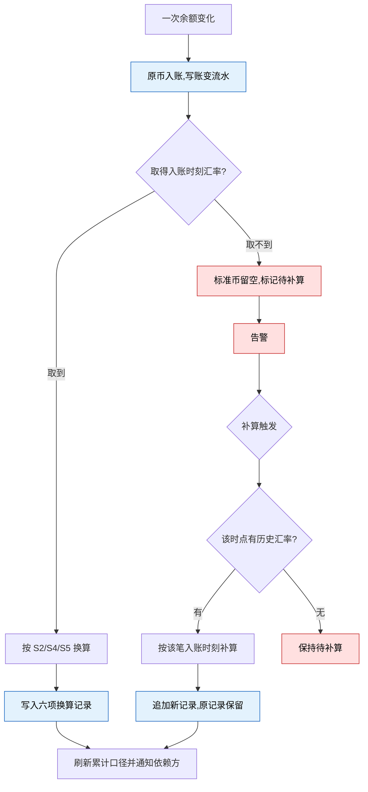

# 标准计价与换算记录

> **这是底层记账规则,不是一个界面。** 没有独立菜单、没有独立路由、没有配置页。
> 换算依据随账变流水呈现在 **2.2 账变记录**(账变流水的唯一运营查询入口)。
>
> **与 `资金模型.md` 的分工**:那份定义**单个币种内**的资金语义(单钱包、真金彩金、
> 打码义务、提现拦截);本文只定义**跨币种统计**时怎么把不同币种的数字放到一把尺子上比。
> 两者的编号互不相干:资金模型用 `F`,本文用 `S`,页面 README 用 `A`。

## 1. 为什么要有它

平台有多个币种。一个玩家充了 100 巴币又充了 20 泰达币,「他一共充了多少钱」没有唯一答案 ——
运营圈不准人、财务合不出总数、风控的阈值在不同币种下松紧完全不同。

做法是给**每一笔账变**按**入账当时**的汇率算出一个标准币金额,并把算的依据一并记下来,
使这个数字永远可复现。

**它不动钱。** 换算结果与真金/彩金同为**派生视图** —— 不可加减、不可提现、
**不作任何资金判定依据**。提现门槛、打码义务、余额判定一律在原币种内完成
(`资金模型.md` R6、R10)。

## 2. 术语

| 术语 | 定义 |
|---|---|
| 标准计价币种 | 跨币种统计的统一尺子。**只是记账单位,不是可持有资产**,平台不为它开钱包 |
| 换算记录 | 一笔账变发生时固定下来的六项依据,见第 4 段 |
| 入账时刻 | 该笔账变真正改变余额的时刻。**不是下单时刻,也不是回调到达时刻** |
| 待补算 | 当时取不到汇率,标准币金额尚未算出的状态 |
| 补算 | 事后按该笔账变的入账时刻补上换算 |

## 3. 关键参数

> 本表是标准计价侧所有数值的唯一出处,其余段落一律引用编号。

| # | 参数 | 取值 | 性质 | 说明 |
|---|---|---|---|---|
| S1 | 标准计价币种 | **USD** | 已定 | **写死在代码里**,改动经 git 与 code review 留痕 |
| S2 | 标准币金额精度 | 小数 8 位 | 已定 | |
| S3 | 换算取哪一刻的汇率 | **入账时刻**,与账变流水同一时刻 | 已定 | 见 S6 的反例 |
| S4 | 汇率精度 | **按来源提供的原样保存,不自行截断或补位** | 已定 | 中间计算仍按 `资金模型.md` F6 至少 18 位 |
| S5 | 舍入方向 | **向下取整** | 已定 | 沿用 `资金模型.md` F7 |
| S6 | 汇率来源、刷新频率与取不到时的重试 | **由开发选定并实现** | 已定归属 | 文档只约束两条:每次取值可追溯到来源与时点(第 4 段);**原币入账不得因取不到汇率而阻塞**(S7) |
| S7 | 原币入账与换算的关系 | 原币入账**先行且不可被阻塞** | 已定 | 原币金额是事实,标准币金额是派生。汇率服务不可用不得变成玩家的钱不上账 |

## 4. 每笔账变要记什么

**六项,缺一不可:**

| # | 项 | 说明 |
|---|---|---|
| ① | 原币种 | 事实 |
| ② | 原币金额 | 事实,**永不因换算失败而缺失** |
| ③ | 换算用的汇率 | 按 S4 原样存 |
| ④ | 汇率时点与来源 | 时点按 S3;来源标识用于追溯与批量定位 |
| ⑤ | **换算到的标准币是哪个** | 见下方说明,这一项最容易被认为多余 |
| ⑥ | 换算结果 | 按 S2 精度、S5 舍入 |

**为什么要存汇率本身(③),不只存结果(⑥)。** 只有结果的话:玩家争议无法还原;
汇率源出错时无法批量定位受影响的记录;标准币口径要调整时无法重算。

**为什么第 ⑤ 项不能省。** S1 虽然写死在代码里、改动能在 git 里查到,
但 git 记的是「代码何时改的」,**不是「哪些历史行是按哪个值算的」**。
每行自带标准币标识,数据才自解释,口径真的变了历史也不会失真。

**汇总口径的唯一来源。** 所有跨币种累计(累计充值、累计提现、累计投注等)
一律从这里汇总,不各自再实现一遍换算。

**挂在账变流水上,不挂在充值订单上。** 挂充值上的话,提现、投注、人工调整
各自还要再实现一遍换算;挂账变上,一处写入,所有累计口径自动都有。

## 5. 处理逻辑

1. 汇率按 S3 取**入账时刻**的值。充值下单到到账可能隔数小时,用错时刻等于换了一个金额
2. 换算记录**一经写入不可修改**。事后发现汇率有误时**追加新记录并保留原记录**,
   与 `资金模型.md` R7「冲正不改原记录」同一口径
3. 取不到汇率时按 S6、S7:**原币入账照常完成**,标准币金额留空并标记待补算,同时告警。
   **绝不猜测,绝不静默套用旧汇率或当前汇率**
4. **补算按每笔各自的入账时刻取汇率,不是按补算执行时刻** ——
   否则等于把历史金额按今天的汇率重算,老玩家的历史统计会凭空变动
5. 补算取不到该时刻的历史汇率时**保持待补算**,不用邻近时刻或当前汇率顶替
6. 补算完成后刷新受影响的累计口径并通知依赖方重新判定
   (标签侧见 `../2.5-用户标签/README.md` R6)
7. 补算**绝不改动原币种与原币金额**,那是事实;只补换算部分

> 配色:红色为降级与待处理分支,蓝色为不可回退的事实写入。
> `原币入账` 在最前且**不受汇率分支影响** —— 这是 S7 的图形表达。

## 6. 异常与边界

| # | 场景 | 触发条件 | 预期处理 |
|---|---|---|---|
| SE1 | 汇率取不到卡住入账 | 汇率来源不可用时发生充值到账 | **原币入账照常完成**(S7),标准币留空待补算并告警。玩家的钱不能因为统计口径取不到而不上账 |
| SE2 | 汇率异常值 | 来源返回零、负数或数量级明显偏离 | 视同取不到,不写换算部分,告警;不得用异常值污染累计口径 |
| SE3 | 用错时刻换算 | 补算时按执行时刻,或入账时按下单时刻取汇率 | 一律按该笔的**入账时刻**(S3)。否则历史统计随汇率漂移,同一笔账在不同时候查出不同数 |
| SE4 | 历史汇率缺失 | 补算时该时点没有汇率记录 | 保持待补算,**不用邻近或当前汇率顶替** |
| SE5 | 记录被改写 | 尝试修改已写入的换算记录 | 拒绝;修正只能追加新记录并保留原记录 |
| SE6 | 换算结果被当成钱 | 下游拿标准币金额判定提现、打码或直接加减余额 | 一律拒绝。它与真金/彩金同为派生视图,资金判定只认原币种钱包 |
| SE7 | 标准币被切换 | 有人改了 S1 的常量 | 历史记录因自带标准币标识(第 4 段 ⑤)仍可解释;真要改口径必须从**原币 + 新汇率**重算,**不得拿旧标准币结果二次换算** —— 会累积误差且语义错误 |
| SE8 | 存量数据无换算记录 | 本规则上线前的历史账变 | 按历史汇率回填;取不到历史汇率的标注为**近似回填**且可识别,**不得静默按当前汇率回填** |
| SE9 | 补算引发人群突变 | 大批量补算后累计口径跨过标签阈值 | 依赖方按各自重算规则处理;标签侧的批量摘标熔断照常生效 |
| SE10 | 标准币标识缺失 | 写入时拿不到 S1 | 拒绝写入换算部分,视同取不到 —— 不带标识的结果无法自解释 |

## 7. 涉及数据与职责

**数据归属**

- **账变流水上的换算记录**:owner=财务(M5),随账变流水一同写入
- **汇率取值与历史**:owner=财务(M5)
- **标准计价币种**:写死在代码里(S1),不是配置数据
- **只读**:第三方汇率来源(**本仓库范围外**,选型见 S6)

**职责划分**

| 事项 | 归属 |
|---|---|
| 按入账时刻取汇率、换算、与账变同事务写入 | **服务端** |
| 取不到汇率时保证原币入账不受阻 | **服务端** |
| 换算记录不可改写、修正只追加 | **服务端** |
| 补算的时刻正确性、可中断续跑与留痕 | **服务端** |
| 换算依据的呈现(随账变展示,见下) | 界面(2.2) |

**人日归属**:与 `资金模型.md` R6–R17 同理,实现主体在账变流水侧,
**人日不归任何一页**,由承接方排期。

## 8. 谁在用

| 消费方 | 用它做什么 |
|---|---|
| 2.2 账变记录 | 展示每笔账变的六项换算依据;待补算的显式标注,**不显示为 0** |
| 2.5 用户标签 | 金额类基础指标一律按标准币判定(2.5-A9);待补算的账变不计入,该指标按 2.5-R6 视为 NULL,该条件判否 |
| 报表与对账 | 跨币种汇总的唯一口径 |
| 风控 | 统一门槛判断大额与异常 |
