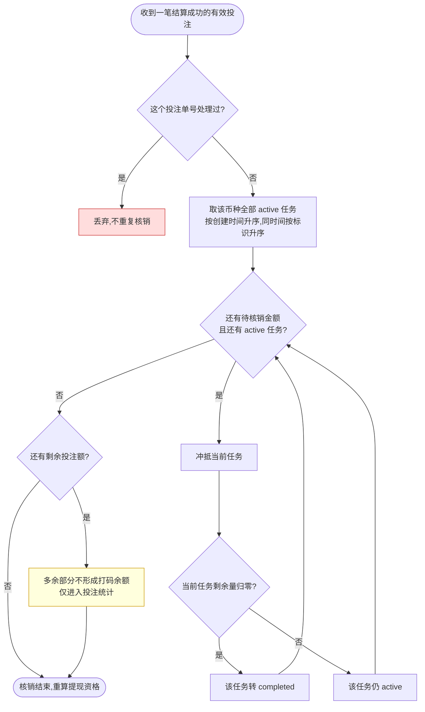

# 资金模型 · 多币种单钱包与打码义务

> 本文是 `2.1-用户列表` 的组成部分,不是独立页面(没有自己的菜单项)。
> 页面级的筛选、列表、导出见同目录 `README.md`;详情弹窗的逐 tab 字段见 `用户详情弹窗.md`。

## 1. 定位

**这一页显示的每一个金额,含义都由本文定义。** 列表里的真金余额、彩金余额、总充值、
总提现、总流水,详情弹窗里的账户详情、提款记录、充值记录、资产变动、投注记录 ——
它们显示的数字叫什么、从哪来、彼此什么关系,只在这里说一次。

**取代的旧口径**(2026-07 之前的写法,已全部作废):

| 旧 | 新 |
|---|---|
| 真金余额、彩金余额是两个独立余额 | **每个币种只有一个余额**;真金彩金降为账本上的资金来源属性 |
| 一笔有效投注只冲抵一条打码任务 | 一笔投注**连续冲抵多条**任务,总量守恒 |
| 打码进度是钱包上的一个累计值 | **每笔入账独立建任务**,各自带倍数 |
| 提现按真金/彩金分别判定 | **按币种钱包整体判定**:该币种还有未完成任务就整个禁提 |
| 打码到期未达标则彩金作废 | **彩金入账即玩家资产,不作废不回收**;相应地打码义务**不设期限** |
| 扣款来源顺序未定义 | **下注彩金优先、提现真金优先**,两个方向相反(F13/F14) |
| 单币种 | 多币种,且**跨币种闪兑必须同时迁移余额与打码义务** |

**不做什么**
- 不规定数据表结构、索引、字段类型 —— 那是开发依据本文自行设计
- 不规定用什么机制保证并发与幂等 —— 本文只写必须达成的结果
- 不定义活动如何决定彩金倍数(归玩法侧),只定义拿到倍数之后怎么建任务

**适用范围**:全平台所有币种、所有资金往来。玩家端与运营后台共用同一套语义。

## 2. 术语

| 术语 | 定义 |
|---|---|
| 钱包 | 一个玩家在一个币种下的资金容器。**同一玩家同一币种只有一个** |
| 余额 | 钱包里的钱,对玩家展示为**单一数字**。不含冻结与提现占用 |
| 可兑换余额 | 余额减去冻结、提现占用、风控锁定后,真正能动的部分 |
| 资金来源 | 这笔钱怎么来的:充值 / 彩金 / 投注输赢 / 佣金 / 人工调整。**记在账本上,不是余额** |
| 真金 | 资金来源为充值的部分。**不再是独立余额**,是账本上还原出来的构成 |
| 彩金 | 资金来源为活动发放的部分。同上 |
| 账变流水 | 一次余额变化的完整记录:变动前、变动金额、变动后、来源、原因 |
| 打码任务 | 一笔入账带来的流水要求。独立成条,不与其他入账合并 |
| 需打码量 | 入账本金 × 打码倍数 |
| 剩余打码量 | `max(需打码量 − 已核销有效投注, 0)` |
| 有效投注 | 最终结算成功、且计入流水要求的投注金额 |
| 核销 | 用有效投注抵扣剩余打码量 |
| 闪兑 | 把一个币种的余额按报价换成另一个币种 |
| 报价 | 一次闪兑锁定的汇率与有效期 |
| 任务链 | 一条任务经多次闪兑拆分后,所有子任务共享的追溯标识 |

## 3. 关键参数与假设

> 本表是资金侧所有数值的唯一出处,编号用 `F` 前缀,与页面 README 第 4 段的 `A` 编号互不相干。
> 标「未验证假设」的评审时应逐条挑战。

| # | 参数 | 取值 | 性质 | 依据 / 待验证点 |
|---|---|---|---|---|
| F1 | 充值到账的打码倍数 | **固定 1 倍** | 已定 | 全平台统一,不随活动变 |
| F2 | 彩金入账的打码倍数 | 按活动配置 | 已定 | 取值归玩法侧,本文只消费 |
| F3 | 人工**调整余额**时的打码倍数 | 后台逐笔填写,**允许填 0** | 已定 | 只适用于加钱的情形(R8)。0 表示该笔不带打码义务,需独立权限 `finance:wager:waive` + 原因必填 + 留痕,并纳入对账关注 |
| F4 | 法币金额精度 | 小数 2 位 | 已定 | |
| F5 | 加密货币金额精度 | 小数 8 位 | 已定 | |
| F6 | 汇率与中间计算精度 | 至少小数 18 位 | 已定 | 打码义务按此精度存,不按展示精度提前舍入 |
| F7 | 目标币种入账的舍入方向 | **向下取整**,差额记独立的汇兑舍入流水 | 已定 | 舍入不得凭空产生或吞掉资金 |
| F8 | 打码义务展示的舍入方向 | **向上取整**,仅用于展示 | 已定 | **不得写回**,后端始终保留高精度值 |
| F9 | 报价有效期 | 30 秒 | **未验证假设** | 拍的值,取决于汇率源刷新频率 |
| F10 | 闪兑手续费与点差 | V1 **均为零** | 已定 | 报价即成交价 |
| F11 | 闪兑快捷比例 | 25% / 50% / 75% / 100% | 已定 | 分母是可兑换余额,不是余额 |
| F12 | 对账周期 | 每日 | 假设 | 是否需要更高频取决于资金规模 |
| F13 | 下注扣款顺序 | **彩金 → 真金**,扣光为止 | **已验证** | 实采:两边余额都 >0 时,461 万次扣彩金 vs 仅 1.6 万次扣真金;情形占比 纯真金 76% / 纯彩金 23% / 混合 1% |
| F14 | 提现扣款顺序 | **真金 → 彩金**(与下注相反) | 已定 | 让彩金尽量留在钱包里被消耗,压低彩金变现机会 |
| F15 | 返奖回冲的拆分方式 | 彩金部分按比例舍入,**真金部分取差额** | 已定 | 保证两轨之和恒等于派彩额,见 R16 |
| F16 | 人工**加打码量**的填写方式 | **绝对值**,不走倍数 | 已定 | 不涉及入账,没有本金可乘(R17)。允许超过当前余额 —— 制造磨损正是目的 |

## 4. 需求详述

索引(编号、触发条件、验收标准、权限码)见 `README.md` 第 6 段,此处只写规格。

### 2.1-R6 · 多币种单钱包与统一余额

| 项 | 内容 |
|---|---|
| **触发条件** | 玩家在某币种下首次产生资金往来:充值到账 · 彩金发放 · 佣金入账 · 投注结算 · 人工调整 |
| **可输入数据** | 玩家 · 币种(必须是启用中的币种) |
| **功能范围** | **每个玩家每个币种只有一个钱包**,该币种的充值、彩金、投注输赢、佣金全部进这一个余额。 冻结资金、提现占用、风控锁定**不属于可用余额**,也不参与闪兑。 所有投注消费当前币种的钱包余额。 真金、彩金等属性**只存在于账本**,不再是可加减的独立余额 |
| **处理逻辑** | 钱包在该币种首次需要时建立;已存在则直接使用。 并发的首次入账**只能产生一个钱包**,不得出现同玩家同币种两个钱包 |
| **错误处理** | 币种未启用或已停用 → 拒绝入账并说明原因 任何操作都不得使余额变成负数,会导致负数的操作直接拒绝 |
| **测试案例** | **正向**:同一玩家分别在 BRL 与 USDT 产生充值 → 两个独立钱包,余额互不影响;BRL 投注只扣 BRL **逆向**:并发两笔首充同时到账 → 只建立一个钱包,两笔都入账;对已停用币种入账 → 被拒绝;构造使余额为负的扣款 → 被拒绝 |

### 2.1-R7 · 资金来源账本与账变流水

| 项 | 内容 |
|---|---|
| **触发条件** | 任何一次余额变化 |
| **可输入数据** | 变动金额 · 资金来源 · 变动原因 · 关联单号 |
| **功能范围** | **余额只能通过写流水来改变**,不允许出现改了余额却没有流水的情况。 每条流水记录:变动前金额、变动金额、变动后金额、资金来源、变动原因、关联单号、时间。 后台据此还原任意时点的真金/彩金构成 —— 这是**派生视图**,不是余额。 流水**不可修改**:冲正生成一条反向流水,原流水原样保留 |
| **处理逻辑** | 一次下注生成两条流水(扣款一条、返奖一条),不合并成净额一条。 资金来源在多次闪兑后仍可追溯回最初的充值单或活动单 |
| **错误处理** | 流水写入失败则整笔资金操作回滚,不允许余额已变而流水缺失 |
| **测试案例** | **正向**:充值 100 后下注 2 中奖 0.16 → 三条流水,变动前后金额首尾相接 **逆向**:对已结算投注发起冲正 → 生成反向流水而不是改原流水;流水写入失败 → 余额不变 |

### 2.1-R8 · 打码任务的创建

| 项 | 内容 |
|---|---|
| **触发条件** | 充值到账 · 彩金入账 · 后台人工**调整余额**(加钱) **不含**「只加打码量不加钱」和「清除打码量」—— 那两个动作没有本金,归 **R17** |
| **可输入数据** | 入账本金 · 打码倍数(充值见 F1,彩金见 F2,人工见 F3) |
| **功能范围** | **每一笔入账独立创建一条任务**,需打码量 = 入账本金 × 倍数。 不同充值之间、充值与彩金之间、人工调整之间**一律不合并**。 任务保留:来源类型、来源单号、原始币种、倍数、需打码量、剩余打码量、创建时间、状态、任务链。 **倍数一栏允许「不适用」** —— R17 的人工加码没有本金可乘,需打码量直接是填入的绝对值。 状态只有三种:`active` 进行中 · `completed` 已完成 · `cleared` 已清空。 **任务没有到期时间**,义务永久有效 —— 理由见下方「彩金不作废」 |
| **处理逻辑** | 剩余打码量 = `max(需打码量 − 已核销有效投注, 0)`,归零即转 `completed`。 后台清空转 `cleared`,**不再参与后续核销**。 **倍数为 0(F3)时照样建任务**:需打码量为 0,创建即 `completed`,因此不构成提现拦截。 之所以不省掉这条任务:对账要能区分「当时就填了 0」和「漏建任务」—— 前者是运营的决定,后者是缺陷。 人工调整创建任务需**二次确认 + 原因必填 + 留痕**;倍数为 0 额外需 `finance:wager:waive` |
| **错误处理** | **倍数缺失 ≠ 倍数为 0**:缺失一律拒绝建任务并拦住这笔入账,不允许资金入账而义务丢失 倍数为负 → 拒绝 倍数为 0 但没有豁免权限或没填原因 → 拒绝 入账本金为零 → 不建任务 |
| **测试案例** | **正向**:充值 100 → 一条 100 的任务;同日再充 50 → 另起一条 50 的任务,不合并;人工补偿 30 填 0 倍 → 建一条需打码量 0 的任务且创建即 `completed`,该币种若无其他 `active` 任务则可提现 **逆向**:彩金发放但活动没配倍数(缺失)→ 整笔入账被拒绝,**不得当成 0 倍放行**;倍数填 −1 → 被拒绝;无豁免权限的账号填 0 倍 → 被拒绝;后台清空任务未填原因 → 被拒绝;领取彩金后长期不投注 → 任务**永远保持 `active`**,不会自行失效 |

**彩金不作废**(已定)

彩金一旦入账即为玩家资产,**不作废、不回收**。平台不靠没收控制风险,靠**打码门槛 + RTP 消耗** ——
按 F13 彩金最先被推进赌局,大部分会被磨掉,没有没收的必要。

因此**打码义务不设期限**。这两条必须成对:如果义务会到期而彩金又不作废,
玩家只要领了彩金一注不打、等到期,整个钱包就解禁可提 —— 那是一条白拿的套利路径。
现在的规则是:钱是玩家的,想怎么玩都行,**但不打码就一直提不出来**。

义务的豁免只有两条通道,都受控:后台清空(`cleared`)与 0 倍入账(F3)。

### 2.1-R9 · 有效投注与 FIFO 跨任务核销

| 项 | 内容 |
|---|---|
| **触发条件** | 一笔投注最终结算成功 |
| **可输入数据** | 有效投注金额(由游戏侧给出,**本仓库范围外**)· 币种 · 投注单号 |
| **功能范围** | 只有**最终结算成功**的投注参与核销;取消、作废、退款、未结算一律不计。 财务侧对同一投注单号**重复收到只处理一次**。 核销顺序**严格 FIFO**:按任务创建时间升序,同一时间按任务标识升序。 **一笔投注可连续冲抵多条任务**:冲满第一条后,溢出部分继续冲下一条。 超过全部待打码量的部分**不形成"打码余额"**,只进入投注统计 |
| **处理逻辑** | 见下方流程图。核销只在**同币种**的任务之间进行 |
| **错误处理** | 已核销的投注发生冲正 → 生成反向核销记录,任务剩余量回补,并**重新计算提现资格** 收到没有对应钱包或币种的投注 → 拒绝并告警,不静默丢弃 |
| **测试案例** | **正向**:任务 A(充值 100 × 1 = 100)、任务 B(彩金 50 × 5 = 250),待打码合计 350。有效投注 120 → A 归零转 `completed`,B 剩 230 仍 `active` **逆向**:同一投注单号重复推送两次 → 只核销一次;投注 400 > 待打码 350 → 两条任务都归零,多出的 50 不形成打码余额;该笔投注随后冲正 → 反向核销,提现资格重算 |

> 红色为幂等拦截,黄色为最容易被误解成"打码余额"的分支。

### 2.1-R10 · 按币种钱包执行提现拦截

| 项 | 内容 |
|---|---|
| **触发条件** | 玩家发起提现 · 后台审核提现 |
| **可输入数据** | 币种 · 提现金额 |
| **功能范围** | 提现资格**按币种钱包独立判断**。 该币种存在**任意一条** `active` 任务 → 整个币种钱包禁止提现。 V1 **不支持只提已解锁部分**:任务全部归零后,整个可用余额才进入可提现状态。 币种之间互不牵连 —— BRL 有待打码任务,不影响提取独立来源的 USDT。 冻结资金、提现占用、风控锁定**始终不可提现、不可闪兑** |
| **处理逻辑** | 判定只看该币种是否还有 `active` 任务,不看具体差多少。 `cleared` 的任务不构成拦截。 **任务不会自行失效**(R8),所以不存在「等到期解禁」这条路径 |
| **错误处理** | 被拦截时告诉玩家**还差多少打码量**,不只给一句"不满足条件" 提现审核期间任务状态变化 → 提交时二次校验,不按打开页面时的状态放行 |
| **测试案例** | **正向**:BRL 任务全部归零 → BRL 可用余额全部可提;此时 BRL 还剩一条 active、USDT 无任务 → USDT 照常可提 **逆向**:BRL 剩 1 单位未打码 → 整个 BRL 钱包禁提;冻结中的金额 → 不计入可提金额也不可闪兑;审核过程中新充值产生新任务 → 提交时被拦下 |

### 2.1-R11 · 跨币种闪兑

| 项 | 内容 |
|---|---|
| **触发条件** | 玩家在钱包发起闪兑并确认报价 |
| **可输入数据** | 源币种 · 目标币种 · 源金额(可直接填,也可用 F11 的快捷比例)· 报价 |
| **功能范围** | V1 无手续费无点差(F10),报价即成交价,确认页明确展示汇率方向,如 `1 USDT = 5.5 BRL`。 一次闪兑生成一条闪兑订单,记录:源与目标币种、源与目标金额、汇率方向与汇率快照、报价标识与有效期、订单状态、双边账变流水、打码任务迁移关系。 **整笔闪兑要么全部成功,要么全部不发生**:扣源、入目标、迁移打码义务、写双边流水与审计,任一环节失败则全部回滚,**不允许出现单边账**。 目标钱包不存在时一并建立;并发只产生一个 |
| **处理逻辑** | 扣减源钱包 → 增加目标钱包 → 按 R12 拆分并迁移打码任务 → 写双边流水与审计。 闪兑期间汇率更新**不影响已锁定的报价** |
| **错误处理** | 源币种与目标币种相同 → 拒绝 报价过期(F9)、汇率缺失或为零、币种已停用 → 拒绝并要求重新报价 金额为零、为负、超过可兑换余额 → 拒绝 换算后目标金额低于目标币种最小精度 → 拒绝,**不生成零金额入账** 同一闪兑请求重复提交 → 只处理一次,重复请求返回首次结果 |
| **测试案例** | **正向**:BRL 550 可兑换,选 50% → 兑 275 BRL,按 5.5 入账 50 USDT,双边流水成对出现 **逆向**:报价过期后再确认 → 被拒绝;BRL→BRL → 被拒绝;兑 0.000001 BRL 换 USDT 不足最小精度 → 被拒绝;同一请求点两次 → 只成交一笔;目标入账失败 → 源钱包金额原样退回,无单边账 |

### 2.1-R12 · 闪兑的打码义务迁移

| 项 | 内容 |
|---|---|
| **触发条件** | 一次闪兑成功执行 |
| **可输入数据** | 兑换金额 · 兑换前可兑换余额 · 汇率 · 源币种全部 `active` 任务 |
| **功能范围** | **兑换比例 = 兑换金额 ÷ 兑换前可兑换余额**(分母是可兑换余额,不是余额)。 按该比例**逐条拆分每一条 active 任务**,不是只搬一个汇总值。 迁移的源打码量 = 该任务剩余量 × 兑换比例;目标币种打码量 = 迁移的源打码量 ÷ 汇率。 目标任务**继承**:来源类型、来源单号、原始任务标识、任务链标识、打码倍数、状态与审计信息 |
| **处理逻辑** | 部分闪兑后,源钱包与目标钱包各自保留对应比例的任务。 100% 闪兑后,源钱包余额与源任务剩余量**均归零**,全部义务进入目标钱包。 迁移金额按 F6 的高精度保存,**展示时按 F8 向上取整,不写回** |
| **错误处理** | 拆分后源侧与目标侧的义务之和,换算回同一币种必须与迁移前相等,不等则整笔闪兑回滚 往返闪兑不得因舍入**减少**打码义务,也不得**持续放大**打码义务 |
| **测试案例** | **正向**:BRL 余额 550、待打码 300,兑 50%(275 BRL)→ BRL 留 150 待打码,USDT 增加 150 ÷ 5.5 = 27.272727… 后端按高精度保存,前端展示 28 **逆向**:100% 闪兑 → 源侧余额与任务全部归零;BRL→USDT→BRL 往返 → 打码经济价值不减少;账上有冻结资金时 → 兑换比例的分母只用可兑换余额 |

**迁移示例**(对应 `1 USDT = 5.5 BRL`)

| 项 | 兑换前 | 兑换后留在 BRL | 迁移到 USDT |
|---|---|---|---|
| 余额 | 550 BRL | 275 BRL | +50 USDT |
| 待打码 | 300 BRL | 150 BRL | +27.272727… USDT(展示 28) |

### 2.1-R13 · 币种、汇率、报价与精度配置

| 项 | 内容 |
|---|---|
| **触发条件** | 运营在系统设置中新增或修改币种、汇率来源、报价有效期、精度与舍入规则 |
| **可输入数据** | 币种启停 · 金额精度(F4/F5)· 汇率来源与刷新频率 · 报价有效期(F9)· 舍入方向(F7/F8) |
| **功能范围** | 这些是**配置,不是写死在代码里的常量**。本页只声明有哪些规则、语义、谁能改; **配置界面本身归系统设置模块,本仓库范围外** |
| **处理逻辑** | 停用一个币种后,该币种不再接受新入账与新闪兑,已有余额与任务照常存续 |
| **错误处理** | 精度、汇率、报价有效期缺失时,相关币种直接不可用,而不是套用默认值静默运行 |
| **测试案例** | **正向**:调整报价有效期 → 新报价按新值生效,已锁定报价不受影响 **逆向**:把某币种精度改成负数 → 被拒绝;停用币种后发起该币种闪兑 → 被拒绝;所有改动 → 均有留痕 |

### 2.1-R14 · 玩家端钱包与闪兑展示

| 项 | 内容 |
|---|---|
| **触发条件** | 玩家打开钱包 · 发起闪兑 · 查看打码进度 |
| **可输入数据** | — |
| **功能范围** | 玩家端**只看到每个币种一个余额**,不出现真金/彩金两个数字。 打码进度告诉玩家**还差多少**才能提现。 闪兑确认页展示:汇率方向、预计到账金额、**本次将迁移的打码量**。 **界面本身归玩家端,本仓库范围外**;此处只约束语义,保证前后台口径一致 |
| **处理逻辑** | 打码量展示按 F8 向上取整,**只影响展示,不写回**。 展示的向上取整不得让玩家以为义务比实际更少 |
| **错误处理** | 报价在确认页停留超过有效期 → 提示重新报价,不按旧价成交 |
| **测试案例** | **正向**:玩家钱包显示单一余额;闪兑确认页显示将迁移的打码量 27.272727… 展示为 28 **逆向**:后端任务金额始终是 27.272727…,不因展示变成 28;报价过期后确认 → 被拦下 |

### 2.1-R15 · 自动对账与不平告警

| 项 | 内容 |
|---|---|
| **触发条件** | 按 F12 的周期自动执行 · 运营手动发起 |
| **可输入数据** | 对账日期 · 币种范围 |
| **功能范围** | 每期核对四组关系:钱包余额与账变流水累计是否一致 · 闪兑订单双边是否成对且金额匹配 · 打码任务剩余量与核销记录是否吻合 · **每笔派彩的两轨之和是否等于派彩额**(R16)。 **不平立即告警,并冻结受影响钱包的提现与闪兑**,不等人工发现。 另有一组**重点关注项**(不是不平,但要能看见):以 0 倍入账的人工调整(F3、FE19)、**人工加打码量**(R17、FE21)、清除打码任务(`cleared`、R17),均按操作人与频次汇总,测试账号与真实账号**分开统计**以降低噪音。 所有人工清空、补账与异常恢复:**二次确认 + 原因必填 + 留痕** |
| **处理逻辑** | 充值拒付发生在闪兑或投注之后时,生成负债/追偿记录并冻结提现 —— 钱已经花出去了,不能靠回滚解决。 资金来源经多次换币后仍能追溯到最初的充值单或活动单 |
| **错误处理** | 对账任务本身失败 → 视同不平处理,告警而不是静默跳过 解除冻结必须人工确认并留痕 |
| **测试案例** | **正向**:构造一天正常流水 → 四组关系全部平,无告警;混合注派彩逐笔舍入 → **不报不平**(只校验两轨之和,不校验彩金轨与理论比例,见 R16) **逆向**:人为制造一笔无流水的余额变化 → 对账不平、告警、该钱包提现与闪兑被冻结;闪兑只写了单边 → 被对账捕获;充值拒付发生在闪兑之后 → 生成追偿记录并冻结提现 |

### 2.1-R16 · 扣款顺序与返奖回冲

> 下注与提现的顺序**方向相反**,写在同一条里才看得出设计意图 ——
> 彩金最先被推进赌局消耗(RTP 决定大部分会被磨掉),真金留到最后;
> 提现时反过来先出真金,让彩金继续留在钱包里。拆成两条容易被实现成同一个方向。

| 项 | 内容 |
|---|---|
| **触发条件** | 一笔下注扣款 · 该注派彩返奖 · 玩家提现扣款 |
| **可输入数据** | 下注/提现金额 · 当前余额的彩金与真金构成 · 派彩金额 |
| **功能范围** | **下注:彩金优先,扣光为止,真金补差**(F13) 　彩金 ≥ 下注额 → 全额扣彩金,真金不动 　0 < 彩金 < 下注额 → 彩金扣光,差额扣真金(**混合注**) 　彩金 = 0 → 全额扣真金 **提现:真金优先,彩金兜底**(F14),与下注相反 **打码递减独立于出资来源**:按下注**全额**(真金+彩金合计)1:1 递减,减到 0 封底,**与用哪种钱下注无关** |
| **处理逻辑** | 三轨互不相干,同一笔下注同时发生: 　① 扣款走 F13 的来源顺序 ② 打码需求按全额递减 ③ 义务归属由 R9 的 FIFO 决定 出资比例在**下注瞬间冻结**,该注后续所有派彩按这个比例回冲两轨,不随余额变化重算。 逐笔回冲:`彩金部分 = round(派彩 × 出资比例, 币种精度)`,`真金部分 = 派彩 − 彩金部分`。 **真金部分取差额而不是独立算**,这样每笔两轨之和恒等于派彩额,舍入不会凭空造出第三个数。 纯真金注比例 0%、纯彩金注 100%,回冲是平凡的;**只有混合注产生小数比例** |
| **错误处理** | 余额不足以覆盖下注额 → 拒绝(见 FE1,余额不为负) 回冲时找不到原注的出资比例 → **拒绝并告警**,不按 0% 或 100% 猜 |
| **测试案例** | **正向**:彩金 8、真金 2,下注 5 → 全扣彩金(彩金剩 3、真金仍 2),打码需求减 **5** 　彩金 3、真金 2,下注 5 → 彩金扣光 3、真金扣 2,出资比例 60%,打码需求减 **5** 　上注派彩 10 分 10 笔各 1.00 → 每笔彩金 0.60、真金 0.40,10 笔合计彩金 6.00、真金 4.00 **逆向**:彩金 0 → 全额扣真金;下注额 > 总余额 → 拒绝;派彩找不到原注 → 拒绝并告警; 　提现 7 而真金 5、彩金 5 → 扣真金 5 + 彩金 2(不是反过来) |

### 2.1-R17 · 人工打码干预

> 与 R8 的分工:**R8 是入账产生义务**(有本金、有倍数),**R17 是不入账直接干预义务**
> (无本金、填绝对值)。运营手里两个方向相反的动作,风险也不对称,所以合成一条写、
> 分开授权:加码对玩家不利但不动钱,清除对玩家有利且**直接放行资金**。

| 项 | 内容 |
|---|---|
| **触发条件** | 运营在玩家详情里给某个币种**增加打码量** · 运营**清除**某一条打码任务 |
| **可输入数据** | 增加:币种 · 打码量(**绝对值**,见 F16)· 原因 清除:**指定的某一条任务** · 原因 |
| **功能范围** | **增加**:建一条无本金任务,需打码量 = 填入的绝对值,倍数不适用。 　典型场景是中大奖或异常玩家 —— 不封禁账号,靠打码制造磨损。**允许超过当前余额**,那正是目的。 **清除**:把指定任务转 `cleared`,不再参与核销,也不构成提现拦截。 　典型场景是测试账号,以及活动不合理引发的玩家投诉。 **清除按任务逐条执行,不提供一键清空。** 一键清空会连带清掉充值的 1 倍义务 —— 　那笔钱是玩家自己充的,本就该打码,清掉等于白送提现资格。 两个动作都要**二次确认 + 原因必填 + 留痕**,并进 R15 的重点关注项 |
| **处理逻辑** | 加码建的任务在 R9 的 FIFO 里按创建时间正常排队,与充值、彩金任务同等对待。 加码任务同样**无期限**,也随 R12 的闪兑按比例迁移 —— 换币逃不掉。 清除只影响被指定的那一条,同币种其余任务照常 `active`,提现拦截依旧成立。 清除**不退钱也不作废彩金**(彩金不作废已定),它只解除义务 —— 所以它是资损通道 |
| **错误处理** | 加码金额为零或负 → 拒绝 未填原因 → 拒绝(两个动作都是) 清除一条已是 `completed` 或 `cleared` 的任务 → 拒绝,不产生第二条清除记录 清除请求重复提交 → 只生效一次 |
| **测试案例** | **正向**:玩家中大奖后加码 5000,该币种立即出现一条 5000 的 `active` 任务,提现被拦; 　投诉处理时清除该活动带来的那一条彩金任务 → 只有它转 `cleared`,充值那条仍 `active`,仍禁提 **逆向**:加码填 0 或负数 → 拒绝;不填原因 → 拒绝;对已完成的任务点清除 → 拒绝; 　清除请求点两次 → 只生效一次;加码 5000 后闪兑一半 → 义务按比例迁移到目标币种,总量不减 |

**关于加码等于软封禁**

加码金额远超余额时,叠加「义务无期限 + 彩金不作废」,结果是**这个玩家永远提不出钱** ——
效果等同封禁,只是不叫封禁。这是有意的手段,但要清楚它意味着什么:
**同样的效果,更低的门槛**。因此加码与封禁按同一口径审计(见 FE21),
不能因为它走的是资金入口就绕开封禁那套留痕与复核。

**关于逐笔舍入的取舍**(已定,不是遗漏)

出资比例 31.102%、10 笔派彩各 1.00 时:

| | 每笔 | 10 笔累计 |
|---|---|---|
| 彩金 | `round(0.31102, 2)` = 0.31 | 3.10 |
| 真金 | `1.00 − 0.31` = 0.69 | 6.90 |
| 合计 | **1.00 精确** | **10.00 精确** |

彩金轨累计比理论值 3.1102 少 0.01,方向固定偏低。**这是接受的**:实际返利每笔都对、总额也对。
因此 **R15 对账只校验两轨之和 == 派彩额,不校验彩金轨与理论比例** ——
拿理论值去对账会报出一堆假不平。

## 5. 异常与边界

> 正、反流程都要想一遍。数值一律引用第 3 段编号。

| # | 场景 | 触发条件 | 预期处理 |
|---|---|---|---|
| FE1 | 余额被打成负数 | 并发扣款、冲正、闪兑叠加 | **任何路径都不得使余额为负**,会导致负数的操作直接拒绝 |
| FE2 | 重复提交 | 同一充值回调、投注结算或闪兑请求被推送多次 | 只处理一次,重复请求返回首次结果 |
| FE3 | 单边账 | 闪兑扣了源却没入目标 | 整笔回滚;若已提交则由 R15 对账捕获并冻结 |
| FE4 | 并发建钱包 | 同玩家同币种两笔入账同时到达 | 只产生一个钱包,两笔都正确入账 |
| FE5 | 投注跨多条任务 | 单笔有效投注大于第一条任务剩余量 | 连续冲抵后续任务,**总量守恒**,流水连续可追 |
| FE6 | 超额投注 | 有效投注大于全部待打码量 | 任务全部归零,多余部分**不形成打码余额** |
| FE7 | 核销后冲正 | 已参与核销的投注被取消或退款 | 反向核销,任务剩余量回补,**重算提现资格** |
| FE8 | 任务已失效 | 任务被后台清空(`cleared`) | 不再参与任何后续核销,也不构成提现拦截。**这是唯一会让任务失效的路径**,需权限 + 原因 + 留痕 |
| FE9 | 等到期解禁 | 领了彩金一注不打,期望义务自行失效后提现 | **不存在这条路径**:任务无期限,永远 `active`。彩金不作废,但也永远提不出来 |
| FE10 | 靠换币逃避打码 | BRL 有待打码,换成 USDT 后提现 | 义务随资金按比例迁移,换币后同样禁提 |
| FE11 | 舍入套利 | 反复小额往返闪兑 | 义务按 F6 高精度保存;往返**不减少也不放大**打码义务 |
| FE12 | 展示舍入写回 | 前端按 F8 向上取整后回传 | **展示值不得写回**,后端只认高精度值 |
| FE13 | 零金额入账 | 极小金额换算后低于目标币种最小精度 | 拒绝闪兑,不生成零金额入账 |
| FE14 | 报价过期成交 | 确认页停留过久或汇率已更新 | 拒绝并要求重新报价;已锁定报价不受汇率更新影响 |
| FE15 | 分母用错 | 账上有冻结或提现占用时计算兑换比例 | 分母**只用可兑换余额**,冻结部分既不兑换也不参与比例 |
| FE16 | 充值拒付 | 拒付发生在闪兑或投注之后 | 生成负债/追偿记录并冻结提现,不试图回滚已消费资金 |
| FE17 | 来源追溯断链 | 资金经多次换币 | 通过任务链仍可追溯到最初的充值单或活动单 |
| FE18 | 对账不平 | 任一组关系不一致 | 立即告警 + 冻结受影响钱包的提现与闪兑,人工确认后才解除 |
| FE19 | 0 倍被用来绕过打码 | 反复用人工调整以 0 倍入账,使玩家无 `active` 任务即可提现 | 允许但**受控**:需 `finance:wager:waive` 独立权限 + 原因必填 + 留痕;0 倍任务照常留痕可查;R15 对账把 0 倍入账列为**重点关注项**,异常频次要能被发现 |
| FE20 | 缺失倍数被当成 0 | 活动没配倍数、字段为空或解析失败 | **一律按缺失拒绝**,绝不退化成 0 倍放行 —— 这是资金入账而义务丢失的主要路径 |
| FE21 | 加码变成绕开审批的软封禁 | 加码金额远超余额,叠加义务无期限,玩家事实上**永久不能提现** | 效果等同封禁,**按封禁的同一口径审计**:原因必填、留痕、进 R15 关注项。不能因为它走资金入口、门槛比封禁低,就绕开封禁那套复核 |
| FE22 | 一键清空连坐 | 想清掉某个活动的义务,却把该币种任务全清了 | **只允许逐条清除**(R17);充值带来的 1 倍义务是玩家自己的钱本就该打的,被连带清掉等于白送提现资格 |

## 6. 对 2.1 界面的影响

本文改变了这一页若干列与 tab 的**语义**,字段本身多数保留:

| 位置 | 原含义 | 新含义 |
|---|---|---|
| 列表「真金余额」「彩金余额」 | 两个独立余额 | **账本派生的来源构成**(第 3 段字段分层里的 L3),不是可加减的余额 |
| 列表金额类列 | 隐含单币种 | 一律**带币种标识**,多币种玩家按币种分别呈现 |
| 弹窗 tab1 账户详情 | 三分账余额(真金/彩金/佣金) | 该币种**单一余额** + 来源构成派生视图 |
| 弹窗 tab1 存取款「冻结资金」 | 一个数字 | 明确不属于可用余额,且不可闪兑 |
| 弹窗 tab5 提款记录「提现真金金额/彩金金额」 | 按真金彩金拆 | 按**币种**拆;资格判定见 R10 |
| 弹窗 tab7 资产变动「总额/真金/彩金/打码量」四分量 | 四个并列余额分量 | 总额是余额,真金彩金是**来源构成**,打码量是**该币种全部任务的剩余量合计** |
| 弹窗常驻区「打码量可新增」 | 直接加一个数 | 按 **R17** 创建一条**无本金任务**,填绝对值不填倍数(F16),需二次确认 + 原因 + 留痕 |
| 弹窗常驻区(清除打码量) | 无入口 | **清除是逐条的**,入口在「点开看逐条任务」的列表里,不在常驻区的汇总数字上(R17、FE22) |

**后台保留真金/彩金构成**(已定)。前后台在这一点上**有意不一致**:

| | 看到什么 | 为什么 |
|---|---|---|
| 玩家端(R14) | 只有单一余额 | 玩家不需要理解资金来源,两个数字只会让人以为钱能分开提 |
| 运营后台 | 单一余额 **+** 真金/彩金/佣金构成 | 客服查「这笔钱哪来的」、风控看彩金占比、财务对账都要它 |

后台展示的构成是**账本派生视图**(L3),不是余额:不可加减、不可单独提现、不作为任何
判定依据。所有资格判定一律用余额与打码任务(R10),**禁止出现按真金/彩金分别放行的逻辑**。

## 7. 涉及数据与职责

**拥有**(owner=财务,**本仓库范围外**):钱包 · 账变流水 · 资金来源账本 · 打码任务 · 核销记录 · 闪兑订单 · 对账记录
**只读引用**:有效投注(owner=玩法)· 活动彩金倍数(owner=玩法)· 币种与汇率配置(owner=系统设置)
**本页(M2)不写入以上任何数据**,只做展示与人工干预的入口。

| 事项 | 归属 |
|---|---|
| 钱包唯一性、余额不为负、流水完整性 | **服务端** |
| FIFO 核销顺序与跨任务连续冲抵 | **服务端** |
| 闪兑的原子性、幂等、报价校验 | **服务端** |
| 打码义务的比例拆分与高精度保存 | **服务端** |
| 有效投注金额的判定 | **玩法侧**(本仓库范围外),财务侧只做幂等接收 |
| 币种、汇率、精度、报价有效期的配置 | **系统设置侧**(本仓库范围外) |
| 展示舍入(F8) | 界面,**不得写回** |
| 人工调整、清空任务的二次确认与原因收集 | 界面 + 服务端双重校验 |
