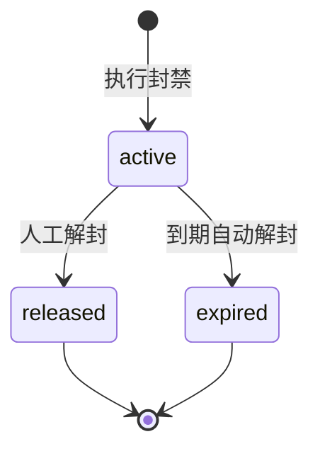

# 2.4 · 封禁管理

## 1. 用途
对违规玩家执行封禁/解封,支持批量与留痕。

## 2. 入口
菜单:用户管理 → 封禁管理 · 跳入:用户详情「封禁」按钮

## 3. 字段清单

**筛选**:用户ID/账号 · 封禁类型 · 是否封禁中 · 渠道 · 封禁时间 · 到期时间 · 操作人

**表格列**:`序号 | 用户ID | 昵称 | 封禁类型 | 原因 | 操作人 | 封禁时间 | 到期时间 | 状态 | 操作`

**封禁表单**
| 字段 | 类型 | 必填 |
|---|---|---|
| 封禁类型 | select(禁登录/禁出入金/禁投注/全面) | 是 |
| 原因 | textarea | 是 |
| 时长 | radio(永久 / 指定到期时间) | 是 |

## 4. 需求清单

| ID | 需求 | 验收标准 | 权限码 | 人日 |
|---|---|---|---|---|
| 2.4-R1 | 封禁记录列表 | 按封禁时间倒序;区分封禁中/已解封/已到期 | `user:ban:view` | 0.5 |
| 2.4-R2 | 6 项筛选 | 用户/类型/是否封禁中/渠道/封禁时间/到期时间生效 | `user:ban:view` | 0.5 |
| 2.4-R3 | 单个封禁 | 选类型+原因必填+时长(永久/指定);同步更新 `User.status`;写日志 | `user:ban` | 1 |
| 2.4-R4 | 单个解封 | 原因必填;校验无其他未到期封禁后才真正解除 | `user:ban` | 1 |
| 2.4-R5 | 批量封禁/解封 | 勾选后二次确认显示影响人数;返回成功N/失败M | `user:ban:batch` | 1.5 |
| 2.4-R6 | 到期自动解封 | 定时任务扫描到期记录并解除,写日志 | — | 0.5 |

## 5. 状态清单
空 / 加载 / 错误 / 无权限 / 封禁中(红标)/ 已解封(灰标)/ 已到期自动解封 / 批量选中

## 6. 交互流程

**关键规则**:封禁需同步更新 `User.status`;解封需校验是否有其他未到期封禁。

## 7. 涉及表
`UserBanRecord`(owner,新增)· `User.status` → `../表设计.prisma`

## 8. 关联页面
跳出:用户详情(2.1)· 风控档案(2.7)· 操作日志(M7.3)
