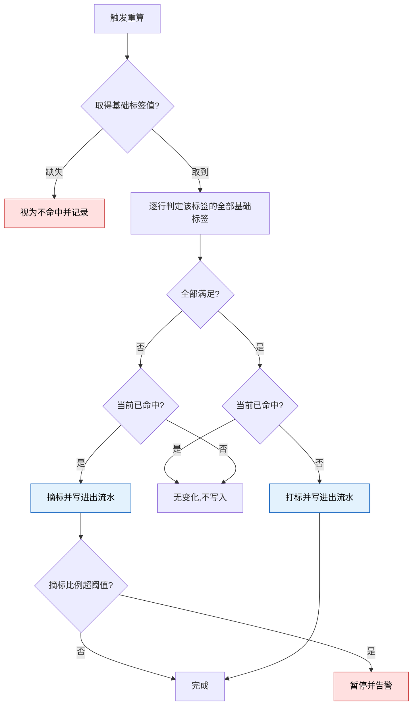
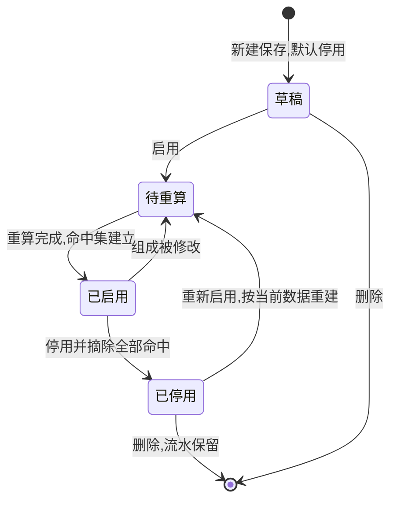

# 2.5 · 用户标签

## 1. 背景与目标

**目标**:让运营用平台预置的**基础标签**自行组合出**标签**,新增一类人群当天生效,不用等发版。

**谁在用**

| 角色 | 用来做什么 | 没有会怎样 |
|---|---|---|
| 运营 | 圈出目标人群做活动投放 | 只能用现成的几个固定标签,换个阈值就要提需求等排期 |
| 风控 | 把「小额多笔」这类特征固化成可复用的判断 | 各人凭经验判断,同一批人看出不同结论 |
| 客服 | 打开玩家资料一眼看出这人是什么类型 | 自己翻充提记录反推,慢且口径不一 |

**业务价值**:新增人群从「提需求 → 排期 → 发版」变成运营自助;
一个标签能装多个基础标签,过去要几十个名字才能表达的人群,现在几条就够,标签墙不再无限膨胀;
口径集中一处,活动、风控、客服看到同一个定义。

**不做什么**

- **不做人工打标** —— 标签一律由基础标签判定,不能给单个玩家手工挂上或摘掉
- **不做「或」与括号分组** —— 一个标签内的基础标签之间恒为「并且」;要表达「或」就建两个标签
- **运营不能新增基础标签** —— 基础标签由平台预置,见第 4 段
- **不做标签引用标签** —— 条件行的两侧只能是基础标签,标签不得作为另一个标签的条件;
  允许即出现依赖链与环,重算顺序、流水解释、删除预检全部复杂化(模块决策 D31)
- **不做带系数的比率条件** —— 「累计投注 ≥ 0.96 × 累计充值」类右值带系数的写法列二期(D31),
  首版右值只有常量或基础标签本身
- 不做当日、昨日这类时间切片的基础标签,首版只有累计类(A8)
- 不做人群导出与活动投放本身;不对玩家可见

**适用范围**

| 维度 | 取值 |
|---|---|
| 终端 | Web 后台,桌面优先(设计基准 1440px) |
| 响应式 | 最小支持 1280px;不做移动端适配 |
| 界面语言 | 后台界面简体中文 |
| 时区 | 时间按运营时区展示并标注 |
| 货币 | 金额类基础标签按标准计价币种判定,口径见 A9 |

## 2. 入口

- 菜单:用户管理 → 用户标签管理 → 用户标签
- 跳入:2.1 用户列表的标签筛选下拉 · 2.1 详情弹窗的标签区

## 3. 术语

> 通用词见 `../README.md` 第 2 段;资金语义见 `../2.1-用户列表/资金模型.md`,此处不重复。

| 术语 | 定义 |
|---|---|
| 基础标签 | 平台预置的玩家属性,如累计充值、充值次数。**运营不能新增**,清单见第 4 段 |
| 标签 | 由一到十个基础标签组合成的具名人群规则,以及当前命中它的玩家集合 |
| 运算符 | 基础标签与右值之间的比较关系,`= ≥ ≤ > <`,可用范围随基础标签类型 |
| 右值 | 条件行运算符右侧的比较对象:常量,或与左侧**同单位组**的基础标签(A12) |
| 单位组 | 可互相比较的基础标签分组,见 A12;跨组比较(如金额对次数)无意义,禁止 |
| 命中 | 某玩家同时满足该标签下的**全部**基础标签 |
| 重算 | 按最新数据重新判定命中,产生打标或摘标 |
| 进出流水 | 每一次打标与摘标的记录,含时间、原因与判定当时的值 |

## 4. 关键参数与假设

**基础标签清单(首版)**

金额与整数类可用 `= ≥ ≤ > <`;枚举与布尔类只有 `=`。

| 基础标签 | 类型 | 口径 |
|---|---|---|
| 累计充值金额 | 金额 | 成功到账的充值之和,**不含后台人工上分**。金额类一律为标准计价币种,见 A9 |
| 累计充值次数 | 整数 | 成功到账的充值笔数 |
| 累计提现金额 | 金额 | 成功放款的提现之和,不含审核中与失败 |
| 累计提现次数 | 整数 | 成功放款的提现笔数 |
| 累计投注金额 | 金额 | 历史投注总额 |
| 累计投注次数 | 整数 | 历史投注笔数 |
| 待完成流水 | 金额 | 进行中打码任务的剩余量合计,口径见 `资金模型.md` |
| 注册天数 | 整数 | 当前时间与注册时间的日历天差 |
| 距上次登录小时数 | 整数 | 与最近在线时间的小时差;从未登录视为不命中 |
| 渠道来源 | 枚举 | 注册渠道,只列启用中的 |
| 是否测试账号 | 布尔 | 是 / 否 |
| VIP等级 | 整数 | **未验证** —— 双 VIP 轨道未合并(见 `../README.md` D1),取哪条待定 |

**首版不含的基础标签**:今日充值、今日投注额等 8 个时间切片项(现有汇总不按日切片,无处取数)·
首充金额、最近一笔充值金额、最近一笔返奖金额、累计邀请人数(需另接数据源)· 预估余额(口径不明)。
**真金余额与彩金余额明确不做** —— `资金模型.md` R7 已定它是派生视图,不作判定依据。

> 清单可扩展。首版只做累计类是排期取舍,加一个基础标签就整体扩一圈,不改标签本身的模型。

**参数**

| 编号 | 参数 | 取值 | 依据 | 在哪配 |
|---|---|---|---|---|
| A1 | 单个标签容纳的基础标签数 | 最多 **10 个**,至少 1 个 | 已定 | 写死 |
| A2 | 启用中的标签总数上限 | 50 个 | **未验证假设**,每个启用标签每轮都要判定一次全体玩家,须按 A4 窗口倒推 | 系统配置 |
| A3 | 标签名称 | 全局唯一,最长 20 字符 | 假设 | 写死 |
| A4 | 重算方式与窗口 | 关键事件触发该玩家增量重算(5 分钟内完成),每日一次全量兜底(须在 60 分钟内完成) | **未验证假设**,须按玩家量实测 | 系统配置 |
| A5 | 停用标签的行为 | 停用即摘除全部命中并逐条留痕;重新启用后由下一次重算按当时数据重建,**不恢复旧集合** | 已定 | 写死 |
| A6 | 删除标签的前置条件 | 被活动或弹窗引用时拒绝删除 | 已验证,现有影响面预检已是此行为 | 写死 |
| A7 | 值的精度 | 金额类以**标准计价币种**表示,小数 2 位(阈值不需要账本那 8 位精度);次数、天数、小时数为非负整数 | 假设 | 写死 |
| A8 | 首版基础标签范围 | 只含累计类,不含当日、昨日等时间切片 | 已定 | 基础标签清单 |
| A9 | 金额类的币种口径 | 一律按**标准计价币种 USD** 判定;每笔账变按入账时刻汇率换算,累计值从账变上的换算记录汇总。换算尚未补算的账变**不计入**,该玩家该项视为数据缺失,按 R6 处理为不命中 | 已定,见 `../2.1-用户列表/标准计价.md` | 标准币写死(S1) |
| A10 | 每页条数 | 50 条/页,与 2.1 一致 | 已验证 | 写死 |
| A11 | 试算响应上限 | 10 秒,超时中断并提示,不返回半截结果 | **未验证假设** | 系统配置 |
| A12 | 右值类型 | 常量,或与左侧**同单位组**的基础标签。单位组:**金额组**(累计充值金额、累计提现金额、累计投注金额、待完成流水,均为标准计价 USD)· **次数组**(累计充值次数、累计提现次数、累计投注次数);注册天数、距上次登录小时数、枚举与布尔类不入组,右值仅常量。左右不得为同一基础标签 | 已定(2026-08-14,模块决策 D31) | 写死 |

## 5. 字段清单

**筛选字段**

| 字段 | 类型 | 可输入数据与校验 |
|---|---|---|
| 标签名称 | text | 模糊匹配,去首尾空格 |
| 状态 | select | 全部 / 启用 / 停用 |
| 基础标签 | select | 反查用到该基础标签的标签 |
| 更新时间 | daterange | 起止时间 |

**表格列**

| 列 | 说明 | 默认显示 |
|---|---|---|
| 标签名称 | | 是 |
| 组成 | 全部基础标签拼成一行,如「累计充值 ≥ 50 且 累计充值次数 < 2」;右值为基础标签的行同样拼出,如「累计充值金额 ≤ 累计提现金额」;超长折叠 | 是 |
| 命中人数 | 最近一次重算后的命中玩家数;从未重算过显示未成熟,**不显示 0** | 是 |
| 状态 | 启用 / 停用 | 是 |
| 最近重算时间 | | 是 |
| 更新人 / 更新时间 | | 是 |
| 操作 | 编辑 · 启停 · 删除 · 查看命中玩家 · 查看进出流水 | 是 |

**编辑标签 · 表单字段**

| 字段 | 必填 | 规则 |
|---|---|---|
| 标签名称 | 是 | A3 |
| 启用 | 是 | 开关。**新建默认关闭**,先试算确认人群合理再启用 |
| 基础标签行 | 是 | 1 到 A1 行,行与行之间恒为「并且」,界面须显式写出这个关系 |
| 行 · 基础标签 | 是 | 从清单下拉选,不可自由输入;同一基础标签允许出现多次 |
| 行 · 运算符 | 是 | 按所选基础标签的类型联动 |
| 行 · 右值 | 是 | 常量(按类型校验,精度见 A7),或基础标签(下拉仅列与左侧同单位组的项,见 A12);左右不得为同一基础标签 |
| 备注 | 否 | 说明圈的是什么人,最长 200 字符 |

> **区间用同一基础标签的两行表达**,如「累计充值 ≥ 30」且「累计充值 < 50」。
> 不引入「或」和括号后,这是表达区间的唯一方式,界面须在新增行时提示。

## 6. 需求清单

| ID | 需求 | 触发条件 | 验收标准 | 权限码 |
|---|---|---|---|---|
| 2.5-R1 | 查看标签列表 | 进入页面 · 点击查询 | 能按名称、状态、基础标签筛出标签,展示组成与命中人数 | `user:tag:view` |
| 2.5-R2 | 新增编辑标签 | 点击新增或编辑并保存 | 组成完整校验;保存不立即改变命中,由重算生效 | `user:tag:edit` |
| 2.5-R3 | 试算命中人数 | 在编辑态点击试算 | 返回命中人数与不超过 20 条样本玩家,**不产生任何打标** | `user:tag:edit` |
| 2.5-R4 | 启用停用标签 | 切换状态并二次确认 | 按 A5 摘除或重建,全过程留痕 | `user:tag:toggle` |
| 2.5-R5 | 删除标签 | 点击删除并二次确认 | 按 A6 校验引用;通过后标签与命中关系删除,**流水保留** | `user:tag:delete` |
| 2.5-R6 | 重算与自动打标摘标 | 关键事件触发 · 每日全量 · 标签保存后 | 命中即打标、不再命中即摘标,每次进出都写流水 | 系统触发,无界面权限 |
| 2.5-R7 | 查看命中玩家 | 点击命中人数 | 跳到用户列表并带上该标签筛选 | `user:list:view` |
| 2.5-R8 | 查看进出流水 | 点击流水入口 | 能按玩家或时间查到每次打标摘标、原因与当时的值 | `user:tag:view` |

## 7. 需求详述

### 2.5-R2

**触发条件**:持有编辑权限的账号新增标签,或修改已有标签的名称、组成、备注并保存。

**可输入数据**:第 5 段表单字段。基础标签只能从清单选,运算符按其类型联动,值按 A7 校验。

**功能范围**

| 归属 | 做什么 |
|---|---|
| 界面 | 基础标签行的增删、运算符联动、组成实时预览、离开前提示未保存 |
| 服务端 | 名称唯一、行数、基础标签有效性、值域与精度校验;判权限;保存后登记待重算 |

**处理逻辑**

1. 校验名称符合 A3 且全局唯一(编辑时排除自身),行数在 1 到 A1 之间
2. 校验每行的基础标签存在于当前清单且未下线,运算符与其类型匹配 ——
   枚举与布尔类只接受等于
3. 校验右值:常量按 A7 校验类型与精度,金额类的单位固定为标准计价币种,界面须显式标出,
   运营不选币种;基础标签按 A12 校验与左侧同单位组,且左右不得为同一基础标签
4. **检出恒不命中的组合**(如同一基础标签既要求 ≥ 50 又要求 < 30),保存前警示但**不阻断**;
   右值为基础标签的行随数据变化,不做静态检出
5. 保存只改规则本身,**不直接增删任何玩家的命中**;标签转入待重算,由 R6 生效,
   界面须明确告知「已保存,人群将在重算后更新」
6. 编辑已启用的标签时,展示改动前后的组成差异与当前命中人数
7. 全过程留痕:操作人、时间、改动前后的完整组成

**错误处理**

| 错误状况 | 提示 |
|---|---|
| 名称重复 | 标签名称已存在 |
| 超过 A1 | 单个标签最多 10 个基础标签,请拆成多个标签 |
| 启用数超过 A2 | 启用中的标签已达上限,请先停用其他标签 |
| 基础标签已下线 | 该基础标签已不可用,请更换 |
| 运算符与类型不符 | 该基础标签只支持等于 |
| 金额精度超限 | 金额阈值最多两位小数 |
| 右值与左侧不同单位组 | 两侧不可比较,请选择同单位组的基础标签(A12) |
| 左右为同一基础标签 | 条件恒成立或恒不成立,请更换其中一侧 |
| 组合恒不命中 | 当前组成互相排斥,人群将为空,确认保存吗 |

**测试案例**

- 正向:新建「大额低频」= 累计充值 ≥ 500 且 累计充值次数 < 3 → 保存成功,状态为停用待重算
- 正向:区间写成同一基础标签两行(≥ 30 且 < 50)→ 接受,组成正确拼出
- 正向:新建「净取款玩家」= 累计充值金额 ≤ 累计提现金额 → 保存成功,组成拼出两侧基础标签名
- 逆向:左侧为累计充值金额、右值选累计充值次数(跨单位组)→ 服务端拒绝(A12)
- 逆向:枚举类「渠道来源」选择大于等于 → 服务端拒绝
- 逆向:放 11 个基础标签 → 拒绝并提示上限
- 逆向:无编辑权限的账号提交 → 服务端拒绝,界面隐藏按钮不作为唯一防线

### 2.5-R6

**触发条件**:三种任一 —— 玩家侧关键事件(充值入账、提现放款、投注结算、登录),按 A4 只重算该玩家;
每日按 A4 的全量兜底;某标签保存或重新启用后,只重算该标签。

**可输入数据**:玩家的基础标签当前值 · 全部启用中标签的组成 · 该玩家当前的命中集合。

**功能范围**

| 归属 | 做什么 |
|---|---|
| 界面 | 展示各标签的最近重算时间与命中人数,待重算与重算中状态可见 |
| 服务端 | 取值、逐行判定、比对差集、写打标摘标与流水、通知下游,且不阻塞页面取数 |

**处理逻辑**

1. 取该玩家全部基础标签的当前值。**数据缺失视为不命中**,不按 0 处理 ——
   新注册玩家还没有汇总记录,按 0 会让「累计充值 < 10」把他误圈进去;
   右值为基础标签的行,**任一侧缺失即视为不命中**
2. 对每个启用中的标签逐行判定,**全部基础标签都满足才算命中**
3. 与当前命中集比对,**只对差集动作**:应命中而未命中的打标,已命中而不再满足的摘标
4. 每次打标与摘标都写一条进出流水,记录标签、玩家、方向、时间、原因,
   以及**判定当时的值**(右值为基础标签的行记**两侧**的值)——
   没有它,事后无法解释「他当时为什么被打上」
5. 无变化的玩家不产生任何写入与流水;停用中的标签不参与判定
6. 全量重算须可中断、可续跑,中途失败不得留下一半新一半旧的命中集
7. 本轮摘标比例超过阈值时暂停并告警,不批量摘除 —— 上游汇总一旦修正会波及全量玩家

**错误处理**

| 错误状况 | 提示 |
|---|---|
| 基础标签数据缺失 | 视为不命中,记录跳过原因,不打标 |
| 全量重算超出 A4 窗口 | 告警并保留上一轮结果,不得截断后当成完成 |
| 重算期间标签被修改 | 本轮按开始时的快照跑完,修改下一轮生效 |
| 单个玩家判定失败 | 跳过并记录,不中断整轮 |
| 摘标比例异常 | 暂停并告警,待人工确认 |

**测试案例**

- 正向:玩家充值使累计充值从 40 升到 60,标签要求 ≥ 50 → 5 分钟内打标,流水记下当时值 60
- 正向:玩家累计充值 380、累计提现 420,标签为「累计充值金额 ≤ 累计提现金额」→ 命中打标,
  流水记下两侧当时值(380 / 420);其后提现放款事件触发重算,持续命中则无写入
- 正向:玩家数据无变化 → 重算后无任何写入,无流水
- 逆向:新注册玩家无汇总记录,标签为 累计充值 < 10 → **不命中**,不得因取不到值就当成 0
- 逆向:全量重算跑到一半失败 → 命中集保持整轮开始前的状态,不出现半新半旧

> 配色:红色为异常与保护性中断(数据缺失、批量摘标熔断),蓝色为产生留痕的写入步骤 ——
> 这两步不留痕,标签结论就无法追溯。

## 8. 数据流向与系统串接

**数据流向**:运营组合基础标签保存标签 → 服务端校验并登记待重算(此时不动命中)→
重算按 R6 取值、判定、比对差集 → 打标摘标写入命中集并写进出流水 →
2.1 的标签筛选、玩家资料标签区、活动圈人、弹窗定向读取**当前命中集**。

**系统串接**:资金汇总(owner=M2,本模块内)· 活动圈人(owner=玩法,**本仓库范围外**)·
弹窗与推送定向(owner=运营,**本仓库范围外**)· 全站操作日志(owner=M6)。

- 下游一律**只读当前命中集**,不得反向写入 —— 活动不能因为某人参加了活动就给他打标
- 标签只回答「谁属于这个人群」,**不提供资格判定结论**。玩家摘标后进行中的活动资格如何处置,
  由活动自身规则决定,本页不承诺人群稳定不变
- 删除标签需向活动侧问「有没有引用」,这是本页对范围外能力的**唯一反向查询**,只用于阻断删除
- 基础标签的值来自资金汇总与玩家档案,本页**只读不写**;这些口径变化会直接改变全部标签的命中,
  改动须与本页同步评审

## 9. 异常与边界

| # | 场景 | 触发条件 | 预期处理 |
|---|---|---|---|
| E1 | 越权 | 无权限账号提交新增、编辑、启停或删除 | 服务端拒绝;界面隐藏按钮不作为唯一防线 |
| E2 | 并发编辑 | 两人基于同一版本改同一标签 | 后提交者发现版本过期,重新加载差异后再提交,不静默覆盖 |
| E3 | 组合恒不命中 | 同一基础标签的两行互相排斥 | 保存前警示但不阻断;命中数为 0 时列表显式标注而非留白 |
| E4 | 数据缺失 | 新注册玩家尚无汇总记录 | **视为不命中**,不按 0 判定,记录跳过原因 |
| E5 | 重算超窗 | 全量重算超过 A4 未完成 | 告警并保留上一轮命中集,不得截断后标记完成 |
| E6 | 汇总回滚 | 上游修正导致大批玩家值骤降 | 摘标比例超阈值时暂停告警,不批量摘除,需人工确认 |
| E7 | 删除被引用的标签 | 活动或弹窗正在引用 | 按 A6 拒绝,**列出具体引用方**;判定须精确定位到配置中的位置,不接受整体文本包含式判定 |
| E8 | 基础标签下线 | 某基础标签不再可用但仍被标签引用(含作为右值) | 引用它的标签自动停用并告警,不得静默按不命中跑 |
| E9 | 停用后重启 | 停用一段时间后重新启用 | 按 A5 不恢复旧命中集,由重算按当前数据重建 |
| E10 | 迁移期重复 | 旧的固定标识与新标签同时存在 | 迁移窗口内界面须区分两者来源,完成后旧标识一次性下线 |

## 10. 状态清单

| 状态 | 表现 |
|---|---|
| 待重算 | 已保存但命中集未更新,标注并展示上一轮人数,**不展示为 0** |
| 重算中 | 命中人数标注重算中,展示上一轮结果,启停与删除置灰 |
| 从未重算 | 首轮未完成时命中人数显示「未成熟」,**不显示 0** |
| 已停用 | 整行弱化,命中人数为 0 并标注停用时间,不出现在 2.1 的筛选下拉 |
| 基础标签失效 | 整行标红并说明哪一行失效,该标签已自动停用 |
| 错误 | 卡片级,保留筛选与编辑态草稿,可重试 |

## 11. 涉及表与职责

**数据归属**

- **拥有**(owner=M2):标签 · 标签的基础标签组成 · 命中关系 · 进出流水 · 基础标签清单
- **只读**:资金汇总(owner=M2,见 `../README.md` 第 4 段)· 玩家档案字段(owner=M2,定义在 2.1)·
  渠道枚举(owner=代理渠道,**本仓库范围外**)·
  活动与弹窗对标签的引用关系(owner=玩法 / 运营,**本仓库范围外**,只用于阻断删除)

> **进出流水是审计数据,只增不改不删。** 标签删除后流水仍须能解释,
> 因此要存标签名称与组成快照,不能只存标识后靠关联取名。

**前后端职责**

| 事项 | 归属 |
|---|---|
| 权限判定与可见范围过滤 | **服务端** |
| 名称唯一、行数、基础标签有效性、值域与精度校验 | **服务端** |
| 命中判定、差集比对、打标摘标与流水写入 | **服务端** |
| 重算调度、中断续跑、熔断与告警 | **服务端** |
| 删除前的引用精确判定与事务内复校 | **服务端** |
| 试算的只读保证与超时保护 | **服务端** |
| 基础标签行的增删、运算符联动、组成预览、互斥即时提示 | 界面 |

## 12. 关联页面

- 跳出:2.1 用户列表(带标签筛选查看命中玩家)· 6.3 操作日志(查标签变更留痕)
- 跳入:2.1 用户列表的标签筛选下拉 · 2.1 详情弹窗的标签区
