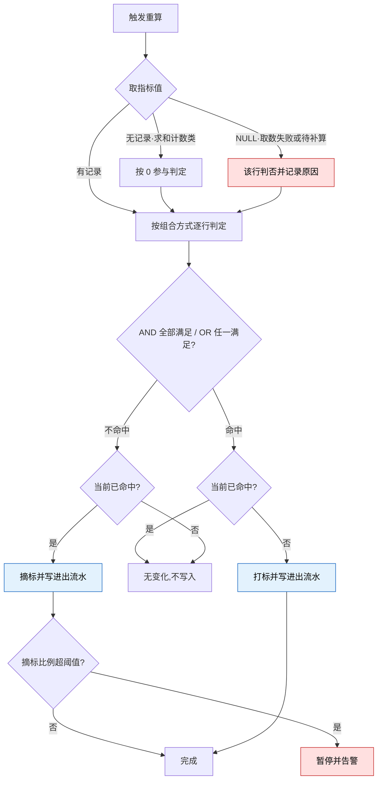
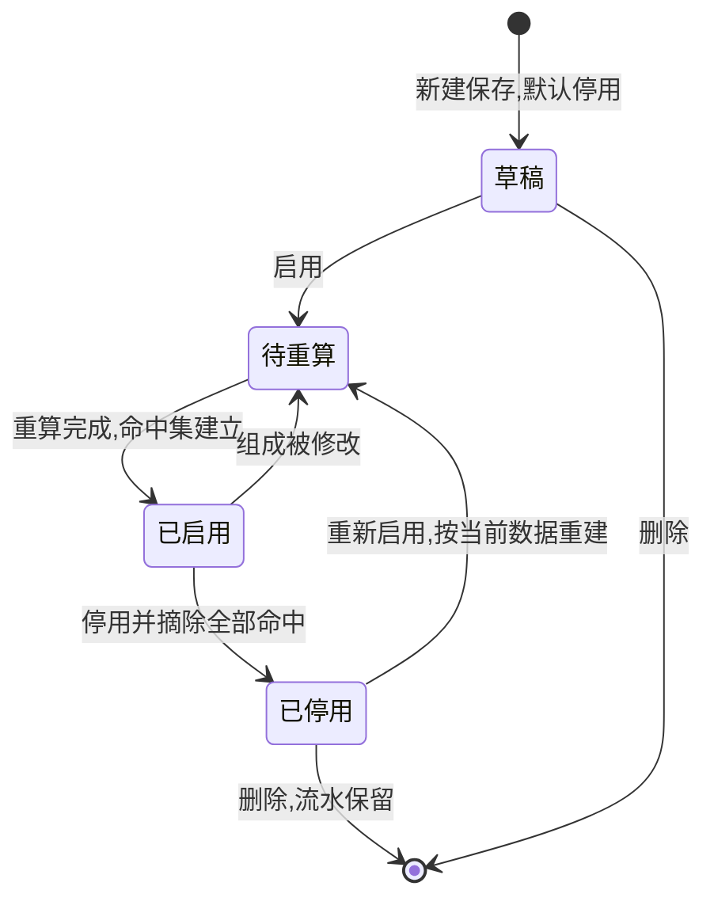

# 2.5 · 用户标签

> **规则模型**(基础指标、时间范围、可比白名单、0 与 NULL 的判定语义)见同目录
> [`条件模型.md`](./条件模型.md),本页不重复;本页只管页面、参数边界、需求验收与异常。
> 改版决策记录见 `../README.md` 第 7 段(D31 修订、D33–D35)。

## 1. 背景与目标

**目标**:让运营用平台预置的**基础指标**组合出**条件**,再由条件组合出**标签**,
新增一类人群当天生效,不用等发版。

**谁在用**

| 角色 | 用来做什么 | 没有会怎样 |
|---|---|---|
| 运营 | 圈出目标人群做活动投放 | 只能用现成的几个固定标签,换个阈值就要提需求等排期 |
| 风控 | 把「小额多笔」「多设备登录」这类特征固化成可复用的判断 | 各人凭经验判断,同一批人看出不同结论 |
| 客服 | 打开玩家资料一眼看出这人是什么类型 | 自己翻充提记录反推,慢且口径不一 |

**业务价值**:新增人群从「提需求 → 排期 → 发版」变成运营自助;
指标与时间范围分离,指标清单不随时间维度膨胀;一个标签能装多个条件,标签墙不再无限膨胀;
口径集中一处,活动、风控、客服看到同一个定义。

**不做什么**

- **不做人工打标** —— 标签一律由条件判定,不能给单个玩家手工挂上或摘掉(D23)
- **不做多层嵌套** —— 条件间为标签级单选的 AND 或 OR,不支持括号分组(D33)
- **运营不能新增基础指标** —— 指标由平台预置,清单见 `条件模型.md` 第 3 段
- **不做标签引用标签** —— 条件的左右两侧都不得出现标签(D31)
- **不做指标间运算** —— 四则运算、百分比、自定义公式不做,带系数的比率条件列二期(D31)
- 不做活动参与次数指标(第一阶段暂不,数据源未接)
- 不做人群导出与活动投放本身;不对玩家可见

**适用范围**

| 维度 | 取值 |
|---|---|
| 终端 | Web 后台,桌面优先(设计基准 1440px) |
| 响应式 | 最小支持 1280px;不做移动端适配 |
| 界面语言 | 后台界面简体中文 |
| 时区 | 判定与自然日切片统一按**业务时区**计算(A13);界面展示时间按运营时区并标注 |
| 货币 | 金额类指标按标准计价币种判定,口径见 A9 |

## 2. 入口

- 菜单:用户管理 → 用户标签管理 → 用户标签
- 跳入:2.1 用户列表的标签筛选下拉 · 2.1 详情弹窗的标签区

## 3. 术语

> 模型词(基础指标、时间范围、条件、比较符、可比白名单)的定义与示例见
> `条件模型.md` 第 2–5 段;通用词见 `../README.md` 第 2 段。此处只列页面词。

| 术语 | 定义 |
|---|---|
| 标签 | 由一到十个条件以 AND 或 OR 组合成的具名人群规则,以及当前命中它的玩家集合 |
| 命中 | AND 标签:玩家满足**全部**条件;OR 标签:满足**任一**条件 |
| 重算 | 按最新数据重新判定命中,产生打标或摘标 |
| 进出流水 | 每一次打标与摘标的记录,含时间、原因与判定当时的值 |

## 4. 关键参数与假设

**基础指标清单**见 `条件模型.md` 第 3 段,含各指标的口径与可用时间范围。
两处待决:账户余额口径未定(D35)· 登录次数统计口径未验证。清单可扩展,
加一个指标就整体扩一圈,不改标签本身的模型。

**参数**

| 编号 | 参数 | 取值 | 依据 | 在哪配 |
|---|---|---|---|---|
| A1 | 单个标签容纳的条件数 | 最多 **10 条**,至少 1 条 | 已定 | 写死 |
| A2 | 启用中的标签总数上限 | 50 个 | **未验证假设**,每个启用标签每轮都要判定一次全体玩家,须按 A4 窗口倒推 | 系统配置 |
| A3 | 标签名称 | 全局唯一,最长 20 字符 | 假设 | 写死 |
| A4 | 重算方式与窗口 | 业务期望:关键事件触发该玩家增量重算(5 分钟内完成),每日一次全量兜底(60 分钟内完成)。**未验证**,最终机制待开发评估回复:哪些指标可实时或准实时 · 哪些须定时计算 · 数据变化后标签最晚多久更新 · 全量重算的性能影响 | 待技术评估 | 系统配置 |
| A5 | 停用标签的行为 | 停用即摘除全部命中并逐条留痕;重新启用后由下一次重算按当时数据重建,**不恢复旧集合** | 已定 | 写死 |
| A6 | 删除标签的前置条件 | 被活动、弹窗或提现审核规则(`../../M5-财务管理/5.8-审核规则/README.md`)引用时拒绝删除 | 活动与弹窗已验证,现有影响面预检已是此行为;审核规则为新增引用方 | 写死 |
| A7 | 值的精度 | 金额类以**标准计价币种**表示,小数 2 位;净盈亏可为负,其余指标非负;次数、天数、数量为整数;最近N天的 N 为 1 到 365 的整数(上限为**假设**) | 假设 | 写死 |
| A8 | 时间范围 | 当前 / 今日 / 昨日 / 最近N天 / 累计,自然日按业务时区;定义与各指标可用范围见 `条件模型.md` 第 4 段 | 已定(D33) | 写死 |
| A9 | 金额类的币种口径 | 一律按**标准计价币种 USD** 判定;每笔账变按入账时刻汇率换算,累计与切片值从账变上的换算记录汇总,不新增汇率计算逻辑。换算尚未补算的账变**不计入**,该玩家该指标视为 **NULL**,按 R6 判否 | 已定(D24),见 `../2.1-用户列表/标准计价.md` | 标准币写死(S1) |
| A10 | 每页条数 | 50 条/页,与 2.1 一致 | 已验证 | 写死 |
| A11 | 试算响应上限 | 10 秒,超时中断并提示,不返回半截结果 | **未验证假设** | 系统配置 |
| A12 | 右值与可比白名单 | 右值为常量,或**左值白名单内**的「基础指标 + 时间范围」;左右时间范围可不同,唯一排除是同指标同时间范围。白名单语义、名单初值与允许/禁止示例见 `条件模型.md` 第 5 段,逐项名单待产品确认(**未验证**) | 已定(D31 修订) | 名单为系统配置 |
| A13 | 业务时区 | 系统级设置,全部自然日切片统一按它计算;**须新增设置项**,变更行为见 E11 | 已定(D33) | 系统配置 |
| A14 | 条件组合方式 | 标签级单选:**AND**(全部满足)或 **OR**(任一满足);不支持行级混用与嵌套分组 | 已定(D33) | 写死 |

## 5. 字段清单

**筛选字段**

| 字段 | 类型 | 可输入数据与校验 |
|---|---|---|
| 标签名称 | text | 模糊匹配,去首尾空格 |
| 状态 | select | 全部 / 启用 / 停用 |
| 基础指标 | select | 反查条件里用到该指标的标签,含用作右值的 |
| 更新时间 | daterange | 起止时间 |

**表格列**

| 列 | 说明 | 默认显示 |
|---|---|---|
| 标签名称 | | 是 |
| 组成 | 全部条件拼成一行,AND 显示为「且」、OR 显示为「或」,如「累计充值金额 ≥ 1000 且 最近7天投注金额 > 最近7天充值金额」;超长折叠 | 是 |
| 命中人数 | 最近一次重算后的命中玩家数;从未重算过显示未成熟,**不显示 0** | 是 |
| 状态 | 启用 / 停用 | 是 |
| 最近重算时间 | | 是 |
| 更新人 / 更新时间 | | 是 |
| 操作 | 编辑 · 启停 · 删除 · 查看命中玩家 · 查看进出流水 | 是 |

**编辑标签 · 表单字段**

| 字段 | 必填 | 规则 |
|---|---|---|
| 标签名称 | 是 | A3 |
| 启用 | 是 | 开关。**新建默认关闭**,先试算确认人群合理再启用 |
| 组合方式 | 是 | 单选 AND / OR(A14),界面显式写出「全部满足 / 任一满足」 |
| 条件行 | 是 | 1 到 A1 行 |
| 行 · 左值指标 | 是 | 从清单下拉选,不可自由输入;同一指标允许出现多次 |
| 行 · 左值时间范围 | 是 | 下拉,只列该指标的可用范围(A8);选最近N天须填 N(A7) |
| 行 · 比较符 | 是 | `= ≠ > ≥ < ≤` |
| 行 · 右值 | 是 | 先选类型(常量 / 基础指标),按 A7、A12 校验;金额单位固定为标准计价币种且界面显式标出,运营不选币种 |
| 备注 | 否 | 说明圈的是什么人,最长 200 字符 |

**条件行控件排布** —— 单条条件保持一行;选定左值指标后,系统自动确定其类型、单位、
可用时间范围与可比指标,动态限制后续选项:

```
右值为常量:  [充值金额 ▼] [累计 ▼] [≥ ▼] [常量 ▼] [1000] USD
右值为指标:  [充值金额 ▼] [累计 ▼] [> ▼] [基础指标 ▼] [提现金额 ▼] [累计 ▼]
```

> **区间用同一指标的两行 AND 表达**,如「累计充值金额 ≥ 30」且「累计充值金额 < 50」。
> 不引入括号分组后这是表达区间的唯一方式,界面须在新增行时提示;
> 组合方式切到 OR 时同一标签内无法表达区间,界面须提示拆成多个标签。

## 6. 需求清单

| ID | 需求 | 触发条件 | 验收标准 | 权限码 |
|---|---|---|---|---|
| 2.5-R1 | 查看标签列表 | 进入页面 · 点击查询 | 能按名称、状态、基础指标筛出标签,展示组成与命中人数 | `user:tag:view` |
| 2.5-R2 | 新增编辑标签 | 点击新增或编辑并保存 | 条件完整校验;保存不立即改变命中,由重算生效 | `user:tag:edit` |
| 2.5-R3 | 试算命中人数 | 在编辑态点击试算 | 返回命中人数与不超过 20 条样本玩家,**不产生任何打标** | `user:tag:edit` |
| 2.5-R4 | 启用停用标签 | 切换状态并二次确认 | 按 A5 摘除或重建,全过程留痕 | `user:tag:toggle` |
| 2.5-R5 | 删除标签 | 点击删除并二次确认 | 按 A6 校验引用;通过后标签与命中关系删除,**流水保留** | `user:tag:delete` |
| 2.5-R6 | 重算与自动打标摘标 | 关键事件触发 · 定时全量 · 标签保存后 | 命中即打标、不再命中即摘标,每次进出都写流水;新建或修改规则后对**已有全量玩家**重判,不得只覆盖此后有数据变化的玩家 | 系统触发,无界面权限 |
| 2.5-R7 | 查看命中玩家 | 点击命中人数 | 跳到用户列表并带上该标签筛选 | `user:list:view` |
| 2.5-R8 | 查看进出流水 | 点击流水入口 | 能按玩家或时间查到每次打标摘标、原因与当时的值 | `user:tag:view` |

## 7. 需求详述

### 2.5-R2

**触发条件**:持有编辑权限的账号新增标签,或修改已有标签的名称、组合方式、条件、备注并保存。

**可输入数据**:第 5 段表单字段。指标只能从清单选,时间范围与右值可选项按指标联动,值按 A7 校验。

**功能范围**

| 归属 | 做什么 |
|---|---|
| 界面 | 条件行的增删、时间范围与可比指标联动、组成实时预览、离开前提示未保存 |
| 服务端 | 名称唯一、行数、指标有效性、时间范围、白名单、值域与精度校验;判权限;保存后登记待重算 |

**处理逻辑**

1. 校验名称符合 A3 且全局唯一(编辑时排除自身),组合方式已选,行数在 1 到 A1 之间
2. 校验每行:指标存在于当前清单且未下线;时间范围在该指标可用范围内(A8),
   最近N天的 N 符合 A7
3. 校验右值:常量按 A7 校验类型与精度;基础指标按 A12 校验在左值白名单内、
   时间范围合法,且不得与左值同指标同时间范围。
   **白名单校验以服务端为准**,前端下拉过滤不作为防线
4. **检出恒不命中的组合**(AND 下同一指标同一时间范围互相排斥,如既要求 ≥ 50 又要求 < 30),
   保存前警示但**不阻断**;OR 组合与右值为指标的行随数据变化,不做静态检出
5. 保存只改规则本身,**不直接增删任何玩家的命中**;标签转入待重算,由 R6 生效,
   界面须明确告知「已保存,人群将在重算后更新」
6. 编辑已启用的标签时,展示改动前后的组成差异与当前命中人数
7. 全过程留痕:操作人、时间、改动前后的完整组成

**错误处理**

| 错误状况 | 提示 |
|---|---|
| 名称重复 | 标签名称已存在 |
| 超过 A1 | 单个标签最多 10 条条件,请拆成多个标签 |
| 启用数超过 A2 | 启用中的标签已达上限,请先停用其他标签 |
| 指标已下线 | 该基础指标已不可用,请更换 |
| 时间范围不可用 | 该指标不支持所选时间范围 |
| N 超出范围 | 最近N天的 N 须为 1 到 365 的整数 |
| 金额精度超限 | 金额阈值最多两位小数 |
| 右值不在白名单 | 两侧不可比较,请选择白名单内的基础指标(A12) |
| 左右同指标同时间范围 | 条件恒成立或恒不成立,请更换一侧的指标或时间范围 |
| 组合恒不命中 | 当前条件互相排斥,人群将为空,确认保存吗 |

**测试案例**

- 正向:新建「大额低频」= AND · 累计充值金额 ≥ 500 且 累计充值次数 < 3 → 保存成功,状态为停用待重算
- 正向:区间写成同一指标两行 AND(≥ 30 且 < 50)→ 接受,组成正确拼出
- 正向:「净取款玩家」= 累计充值金额 ≤ 累计提现金额 → 保存成功,组成拼出两侧指标与时间范围
- 正向:「充值升温」= 今日充值金额 > 昨日充值金额(同指标不同时间范围)→ 接受(A12)
- 正向:OR 标签 = 累计充值金额 ≥ 1000 或 最近7天投注金额 ≥ 500 → 接受,组成用「或」拼接
- 逆向:左值充值金额、右值选登录次数(不在白名单,虽同为数值)→ 服务端拒绝(A12)
- 逆向:左右同为「充值金额 + 累计」→ 服务端拒绝
- 逆向:注册天数选时间范围「今日」→ 服务端拒绝(A8)
- 逆向:放 11 条条件 → 拒绝并提示上限
- 逆向:无编辑权限的账号提交 → 服务端拒绝,界面隐藏按钮不作为唯一防线

### 2.5-R6

**触发条件**:三种任一 —— 玩家侧关键事件(充值入账、提现放款、投注结算、登录),按 A4 只重算该玩家;
按 A4 的定时全量兜底;某标签保存或重新启用后,只重算该标签,且覆盖**全量已有玩家**。

**可输入数据**:玩家各「指标 + 时间范围」的当前值 · 全部启用中标签的组成 · 该玩家当前的命中集合。

**功能范围**

| 归属 | 做什么 |
|---|---|
| 界面 | 展示各标签的最近重算时间与命中人数,待重算与重算中状态可见 |
| 服务端 | 取值、逐行判定、比对差集、写打标摘标与流水、通知下游,且不阻塞页面取数 |

**处理逻辑**

1. 取该玩家全部所需指标值。**无记录的求和/计数类指标按 0 参与判定;
   取数失败或口径未就绪为 NULL,该行判否**,记录原因,不按 0 顶替
   (语义与例子见 `条件模型.md` 第 7 段,口径依据见 D34);
   右值为指标的行,任一侧 NULL 即判否
2. 按组合方式逐行判定:**AND 全部满足才命中,OR 任一满足即命中**;净盈亏按带号值比较
3. 与当前命中集比对,**只对差集动作**:应命中而未命中的打标,已命中而不再满足的摘标
4. 每次打标与摘标都写一条进出流水,记录标签、玩家、方向、时间、原因,
   以及**判定当时的值**(右值为指标的行记**两侧**的值,均含时间范围;NULL 如实记 NULL)——
   没有它,事后无法解释「他当时为什么被打上」
5. 无变化的玩家不产生任何写入与流水;停用中的标签不参与判定
6. 全量重算须可中断、可续跑,中途失败不得留下一半新一半旧的命中集;
   规则修改后的重算期间,旧规则还是新规则继续生效由开发按现有架构定,
   但**最终须收敛到全量玩家都按新规则判定**,不得长期部分新部分旧
7. 本轮摘标比例超过阈值时暂停并告警,不批量摘除 —— 上游汇总一旦修正会波及全量玩家

**错误处理**

| 错误状况 | 提示 |
|---|---|
| 指标取数失败(NULL) | 该行判否,记录跳过原因,**不按 0 顶替** |
| 全量重算超出 A4 窗口 | 告警并保留上一轮结果,不得截断后当成完成 |
| 重算期间标签被修改 | 本轮按开始时的快照跑完,修改下一轮生效 |
| 单个玩家判定失败 | 跳过并记录,不中断整轮 |
| 摘标比例异常 | 暂停并告警,待人工确认 |
| 业务时区被修改 | 按 E11 触发全量重算并告警 |

**测试案例**

- 正向:玩家充值使累计充值金额从 40 升到 60,标签要求 ≥ 50 → 按 A4 时效打标,流水记下当时值 60
- 正向:玩家累计充值 380、累计提现 420,标签为「累计充值金额 ≤ 累计提现金额」→ 命中打标,
  流水记两侧当时值(380 / 420);其后提现放款事件触发重算,持续命中则无写入
- 正向:**从未充值的新注册玩家**,标签为 累计充值金额 < 100 → **按 0 判定,命中**,
  流水记当时值 0(D34;注意与改造前行为相反,旧口径是缺失一律不命中)
- 正向:玩家净盈亏 −600,标签为 净盈亏 ≤ −500 → 命中(亏损至少 500)
- 正向:今日充值 80、昨日充值 50,标签为 今日充值金额 > 昨日充值金额 → 命中,流水记 80 / 50
- 正向:玩家数据无变化 → 重算后无任何写入,无流水
- 逆向:玩家有一笔待补算账变(A9),标签含累计充值金额条件 → 该指标为 NULL,该行判否,
  **不得按已换算部分的和顶替**
- 逆向:全量重算跑到一半失败 → 命中集保持整轮开始前的状态,不出现半新半旧



> 配色:红色为异常与保护性中断(NULL 判否、批量摘标熔断),蓝色为产生留痕的写入步骤 ——
> 这两步不留痕,标签结论就无法追溯。无记录按 0(D34)走正常判定路径,不是异常。



## 8. 数据流向与系统串接

**数据流向**:运营组合条件保存标签 → 服务端校验并登记待重算(此时不动命中)→
重算按 R6 取值、判定、比对差集 → 打标摘标写入命中集并写进出流水 →
2.1 的标签筛选、玩家资料标签区、活动圈人、弹窗定向、提现自动审核(5.8)读取**当前命中集**。

**系统串接**:资金汇总与切片统计(owner=M2,本模块内;**时间切片是新增取数需求**,
现有汇总不按日切片,须补建)· 登录与设备记录(登录次数、登录天数、IP 数、设备数的取数来源,
**owner 未验证**,须开发确认)· 活动圈人(owner=玩法,**本仓库范围外**)·
弹窗与推送定向(owner=运营,**本仓库范围外**)· 提现审核规则(owner=M5,见
`../../M5-财务管理/5.8-审核规则/README.md`,只读当前命中集)· 全站操作日志(owner=M6)。

- 下游一律**只读当前命中集**,不得反向写入 —— 活动不能因为某人参加了活动就给他打标
- 标签只回答「谁属于这个人群」,**不提供资格判定结论**。玩家摘标后进行中的活动资格如何处置,
  由活动自身规则决定,本页不承诺人群稳定不变
- 删除标签需向活动侧问「有没有引用」,这是本页对范围外能力的**唯一反向查询**,只用于阻断删除
- 指标的值来自资金汇总、玩家档案与登录记录,本页**只读不写**;这些口径变化会直接改变全部标签的命中,
  改动须与本页同步评审

## 9. 异常与边界

| # | 场景 | 触发条件 | 预期处理 |
|---|---|---|---|
| E1 | 越权 | 无权限账号提交新增、编辑、启停或删除 | 服务端拒绝;界面隐藏按钮不作为唯一防线 |
| E2 | 并发编辑 | 两人基于同一版本改同一标签 | 后提交者发现版本过期,重新加载差异后再提交,不静默覆盖 |
| E3 | 组合恒不命中 | AND 下同一指标同一时间范围的两行互相排斥 | 保存前警示但不阻断;命中数为 0 时列表显式标注而非留白 |
| E4 | 无记录与取数失败 | 玩家在窗口内无任何记录 · 取数失败或待补算 | **两者必须区分**:求和/计数类无记录**按 0 判定**(D34);取数失败为 NULL,该行**判否**,记录原因,不按 0 顶替 |
| E5 | 重算超窗 | 全量重算超过 A4 未完成 | 告警并保留上一轮命中集,不得截断后标记完成 |
| E6 | 汇总回滚 | 上游修正导致大批玩家值骤降 | 摘标比例超阈值时暂停告警,不批量摘除,需人工确认 |
| E7 | 删除被引用的标签 | 活动、弹窗或提现审核规则正在引用 | 按 A6 拒绝,**列出具体引用方**;判定须精确定位到配置中的位置,不接受整体文本包含式判定 |
| E8 | 基础指标下线 | 某指标不再可用但仍被条件引用(含作为右值) | 引用它的标签自动停用并告警,不得静默按不命中跑 |
| E9 | 停用后重启 | 停用一段时间后重新启用 | 按 A5 不恢复旧命中集,由重算按当前数据重建 |
| E10 | 迁移期重复 | 旧的固定标识与新标签同时存在 | 迁移窗口内界面须区分两者来源,完成后旧标识一次性下线 |
| E11 | 业务时区变更 | A13 的业务时区被修改 | 全部含自然日切片的标签口径随之改变:修改须二次确认并留痕,触发全量重算并告警;切换后的今日、昨日按新时区取数 |

## 10. 状态清单

| 状态 | 表现 |
|---|---|
| 待重算 | 已保存但命中集未更新,标注并展示上一轮人数,**不展示为 0** |
| 重算中 | 命中人数标注重算中,展示上一轮结果,启停与删除置灰 |
| 从未重算 | 首轮未完成时命中人数显示「未成熟」,**不显示 0** |
| 已停用 | 整行弱化,命中人数为 0 并标注停用时间,不出现在 2.1 的筛选下拉 |
| 基础指标失效 | 整行标红并说明哪一行失效,该标签已自动停用 |
| 错误 | 卡片级,保留筛选与编辑态草稿,可重试 |

## 11. 涉及表与职责

**数据归属**

- **拥有**(owner=M2):标签 · 标签的条件组成 · 命中关系 · 进出流水 · 基础指标清单 ·
  可比白名单与各指标可用时间范围配置
- **只读**:资金汇总与切片统计(owner=M2,见 `../README.md` 第 4 段)· 玩家档案字段(owner=M2,定义在 2.1)·
  登录与设备记录(owner **未验证**,见第 8 段)·
  活动与弹窗对标签的引用关系(owner=玩法 / 运营,**本仓库范围外**,只用于阻断删除)

> **进出流水是审计数据,只增不改不删。** 标签删除后流水仍须能解释,
> 因此要存标签名称与条件组成快照(含各行的时间范围与判定当时的值),不能只存标识后靠关联取名。

**前后端职责**

| 事项 | 归属 |
|---|---|
| 权限判定与可见范围过滤 | **服务端** |
| 名称唯一、行数、指标有效性、时间范围、白名单、值域与精度校验 | **服务端** |
| 命中判定、差集比对、打标摘标与流水写入 | **服务端** |
| 重算调度、中断续跑、熔断与告警 | **服务端** |
| 删除前的引用精确判定与事务内复校 | **服务端** |
| 试算的只读保证与超时保护 | **服务端** |
| 条件行的增删、时间范围与可比指标联动、组成预览、互斥即时提示 | 界面 |

## 12. 关联页面

- 跳出:2.1 用户列表(带标签筛选查看命中玩家)· 6.3 操作日志(查标签变更留痕)
- 跳入:2.1 用户列表的标签筛选下拉 · 2.1 详情弹窗的标签区
