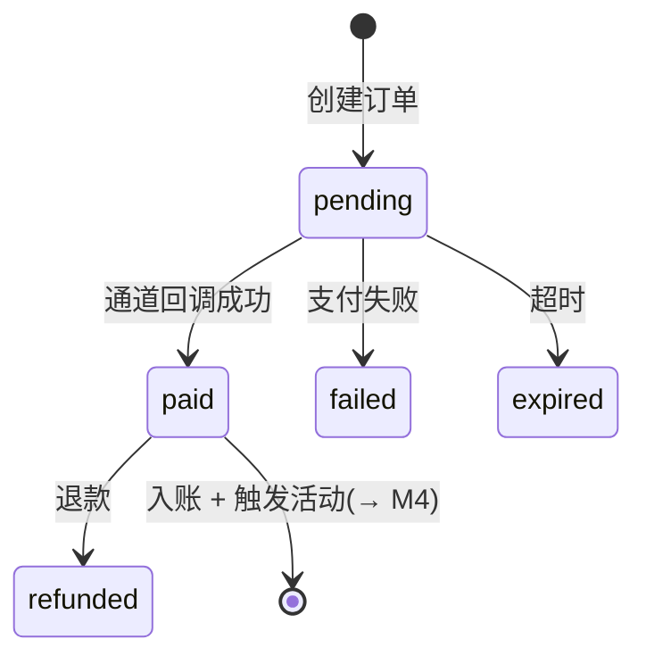

# 3.1 · 充值订单

## 1. 用途
充值订单查询与异常处理(补单、退款)。

## 2. 入口
菜单:财务管理 → 充值 → 充值订单 · 跳入:用户详情「充值记录」

## 3. 字段清单
**筛选**:订单号 · 用户ID/账号 · 订单状态 · 金额区间 · 币种 · 支付通道 · 渠道 · 商品ID · 是否首充 · 是否游客 · 创建时间 · 支付时间 · 三方流水号
**表格列**:`序号 | 订单号 | 用户ID | 币种 | 金额 | 状态 | 是否首充 | 支付通道 | 商品 | 渠道 | 创建时间 | 支付时间 | 操作`

## 4. 需求清单

| ID | 需求 | 验收标准 | 权限码 | 人日 |
|---|---|---|---|---|
| 3.1-R1 | 订单列表与分页 | 按创建时间倒序;分页与总数准确 | `finance:recharge:view` | 0.5 |
| 3.1-R2 | 12 项组合筛选 | 订单号/用户/状态/金额/币种/通道/渠道/商品/首充/游客/时间均生效 | `finance:recharge:view` | 1 |
| 3.1-R3 | 订单详情 | 显示用户、金额、通道、三方流水号、状态流转时间线 | `finance:recharge:view` | 0.5 |
| 3.1-R4 | 到账入账 | 通道回调 → 幂等入账 `balance` → 写 `Transaction` → 发充值事件给 M4 | — | 1.5 |
| 3.1-R5 | 手动补单 | 二次确认;重复补单被幂等拦截;写 `OperationLog` | `finance:recharge:repair` | 1 |
| 3.1-R6 | 导出 | 按当前筛选导出;写日志 | `finance:export` | 0.5 |

## 5. 状态清单
空 / 加载 / 错误 / 无权限 / 只读(已完成订单)

## 6. 交互流程

**关键规则**:到账后触发活动判定(充值类活动),活动以事件方式通知 M4,**M3 不感知具体活动**。

## 7. 涉及表
`RechargeOrder`(owner)· `Transaction` · `Wallet` · `RechargeProduct` → `../表设计.prisma`

## 8. 关联页面
跳出:用户详情(M2.1)· 充值商品配置(3.8)· 通道管理(3.9)
