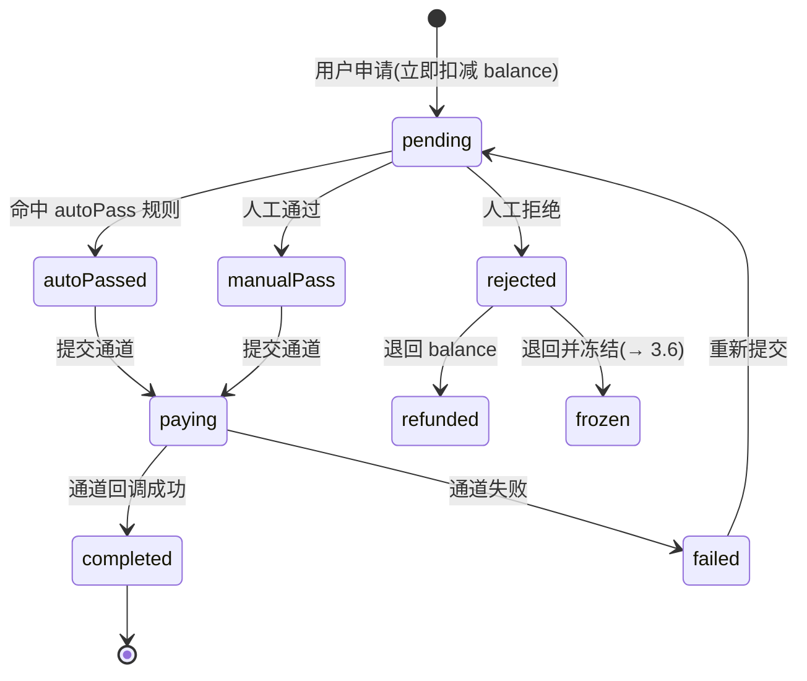

# 3.2 · 提现订单与审核

## 1. 用途
玩家提现申请的查询、审核、出款。**资损第一现场。**

## 2. 入口
- 菜单:财务管理 → 提现 → 提现订单
- 跳入:用户详情页「提现记录」· 大盘概览「待审核」角标

## 3. 字段清单

**筛选字段**
| 字段 | 类型 | 说明 |
|---|---|---|
| 订单号 | text | 精确匹配 |
| 用户ID/账号 | text | |
| 订单状态 | select | 见状态机 |
| 金额区间 | number ×2 | min / max |
| 币种 | select | |
| 渠道 | select | → M5 |
| 付款通道 | select | |
| 是否首次提现 | select | 风控关键 |
| 申请时间 | daterange | |
| 完成时间 | daterange | |
| 收款账号 | text | |

**表格列**
`序号 | 订单号 | 用户ID | 昵称 | 币种 | 申请金额 | 手续费 | 实际到账 | 状态 | 是否首提 | 打码是否达标 | 渠道 | 申请时间 | 操作`

**详情抽屉**:用户资料 · 余额四分账(真金/彩金/冻结/打码进度)· 历史提现统计 · 收款账户快照 · 命中的审核规则 · 审核记录

## 4. 需求清单

| ID | 需求 | 验收标准 | 权限码 | 人日 |
|---|---|---|---|---|
| 3.2-R1 | 订单列表与分页 | 按申请时间倒序;分页与总数准确 | `finance:withdraw:view` | 0.5 |
| 3.2-R2 | 12 项组合筛选 | 订单号/用户/状态/金额/币种/渠道/通道/首提/时间/收款账号均生效 | `finance:withdraw:view` | 1 |
| 3.2-R3 | 订单详情抽屉 | 显示用户资料、四分账余额、打码进度、收款账户快照、命中规则 | `finance:withdraw:view` | 1 |
| 3.2-R4 | 申请即扣款 | 用户提交时立即扣减 `balance`,防重复提现;失败回滚 | — | 1 |
| 3.2-R5 | 单条审核通过 | 二次确认 → 状态转 `paying` → 提交通道 → 写 `OperationLog` | `finance:withdraw:review` | 1 |
| 3.2-R6 | 单条审核拒绝 | 原因必填;可勾选「拒绝并冻结」→ 退回 `balance` 或转 `frozenBalance` | `finance:withdraw:review` | 1.5 |
| 3.2-R7 | 批量审核 | 勾选多单;确认框显示笔数与总额;返回成功N/失败M 明细 | `finance:withdraw:batch-review` | 1.5 |
| 3.2-R8 | 打码校验 | `wagerRequired=true` 时未达标订单标红,通过按钮禁用 | — | 0.5 |

## 5. 状态清单
| 状态 | 表现 |
|---|---|
| 空 | 「暂无提现订单」 |
| 加载 | 骨架屏 |
| 错误 | 错误提示 + 重试 |
| 无权限 | 菜单不可见 |
| 只读 | 已审核订单,审核按钮禁用 |
| 批量选中 | 顶部显示「已选 N 条」+ 批量操作条 |

## 6. 交互流程

**关键规则**
- 申请时**立即扣减** `balance`,不是审核通过才扣 —— 防重复提现
- 提现前校验 `WagerRequirement` 是否达标(受 `WithdrawConfig.wagerRequired` 控制)
- 首提 / 大额 / 命中风控标签 → 强制转人工(阈值见 3.3)

## 7. 涉及表
`WithdrawOrder`(owner)· `Wallet` · `WithdrawReviewRule` · `WithdrawConfig` · `FreezeRecord` · `Transaction`
→ `../表设计.prisma`

## 8. 关联页面
- 跳出:用户详情(M2.1)· 审核规则(3.3)· 冻结记录(3.6)· 打码核销(3.7)
- 跳入:用户详情 · 大盘概览待审核角标
