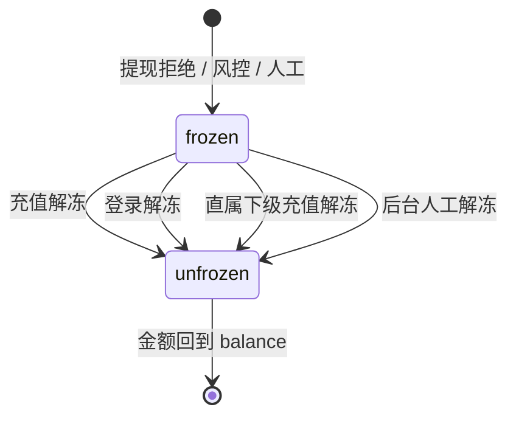

# 3.6 · 冻结与解冻

## 1. 用途
金额级资金冻结与多路径解冻。**现有只有账号级 `fundLocked`,无法冻结部分金额。**

## 2. 入口
菜单:财务管理 → 冻结解冻 · 跳入:提现订单「拒绝并冻结」· 用户详情「冻结资金」

## 3. 字段清单
**筛选**:用户ID/账号 · 冻结原因 · 状态(冻结中/已解冻)· 币种 · 冻结时间 · 关联单据号
**表格列**:`序号 | 用户ID | 币种 | 冻结金额 | 原因 | 关联单据 | 状态 | 冻结时间 | 解冻方式 | 解冻时间 | 操作`
**解冻规则配置**:各触发路径的开关与条件(充值解冻门槛、下级充值解冻门槛等)

## 4. 需求清单

| ID | 需求 | 验收标准 | 权限码 | 人日 |
|---|---|---|---|---|
| 3.6-R1 | 冻结记录列表 | 按冻结时间倒序;区分冻结中/已解冻 | `finance:freeze:view` | 0.5 |
| 3.6-R2 | 冻结扣减 | 冻结时从 `balance` 转入 `frozenBalance`,两者之和不变 | — | 1 |
| 3.6-R3 | 手动冻结/解冻 | 原因必填;二次确认;写 `OperationLog` | `finance:freeze:manage` | 1 |
| 3.6-R4 | 四条自动解冻路径 | 充值/登录/直属下级充值/后台 各自触发并记录 `unfreezeBy` | — | 2 |
| 3.6-R5 | 解冻规则配置 | 各路径开关与门槛可配;保存写日志 | `finance:config:edit` | 1 |
| 3.6-R6 | 筛选 | 用户/原因/状态/币种/时间/关联单据均生效 | `finance:freeze:view` | 0.5 |

## 5. 状态清单
空 / 加载 / 错误 / 无权限 / 冻结中 / 已解冻(只读)/ 部分解冻

## 6. 交互流程

**五条解冻触发路径**(参考竞品 action_type 97-101):
`withdrawRejected` 冻结 → `recharge` / `login` / `subordinateRecharge` / `manual` 解冻

## 7. 涉及表
`FreezeRecord`(owner,新增)· `Wallet.frozenBalance`(新增字段)· `Transaction` → `../表设计.prisma`

## 8. 关联页面
跳出:提现订单(3.2)· 用户详情(M2.1)· 操作日志(M7.3)
