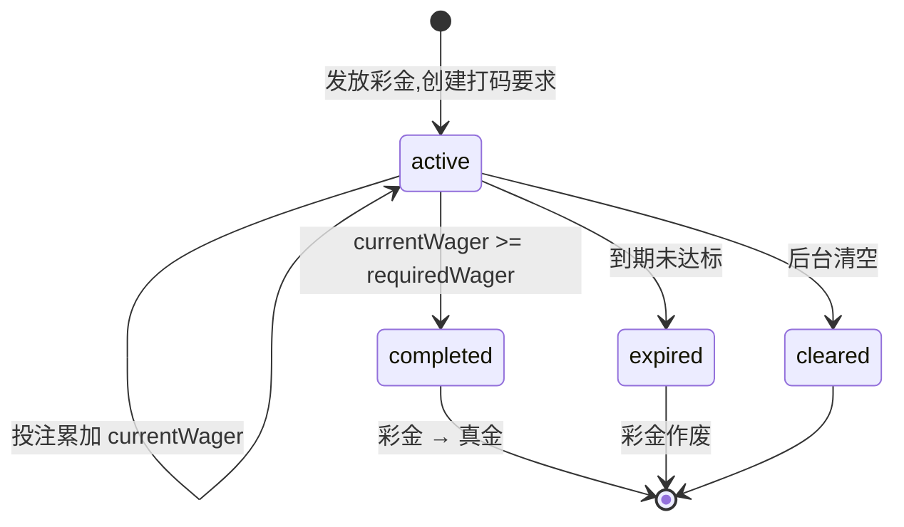

# 3.7 · 打码核销

## 1. 用途
追踪彩金的流水解锁进度。**没有这层,送出去的彩金可直接提走 —— 最大的薅羊毛入口。**

## 2. 入口
- 菜单:财务管理 → 打码核销
- 跳入:用户详情「打码进度」· 提现订单详情「打码是否达标」

## 3. 字段清单

**筛选字段**
| 字段 | 类型 |
|---|---|
| 用户ID/账号 | text |
| 来源类型 | select(活动/VIP/人工) |
| 来源标识 | text(活动 code) |
| 状态 | select(打码中/已完成/已过期/已清空) |
| 币种 | select |
| 创建时间 | daterange |

**表格列**
`序号 | 用户ID | 来源 | 彩金本金 | 倍数 | 需完成流水 | 已完成流水 | 进度% | 状态 | 创建时间 | 到期时间 | 操作`

## 4. 需求清单

| ID | 需求 | 验收标准 | 权限码 | 人日 |
|---|---|---|---|---|
| 3.7-R1 | 创建打码要求 | 发放彩金时按「本金 × 倍数」创建 `WagerRequirement` | — | 1 |
| 3.7-R2 | 流水累加(FIFO) | 投注结算累加 `currentWager`;多笔并存时按创建时间先进先出,单次投注只累加最早未完成的一笔 | — | 2 |
| 3.7-R3 | 有效投注判定 | 按 `01-模块总览` 决策清单 #6 定义过滤;不计入的投注不累加 | — | 1.5 |
| 3.7-R4 | 达标解锁 | `currentWager >= requiredWager` 时彩金转真金并写 `Transaction` | — | 1.5 |
| 3.7-R5 | 过期作废 | 到期未达标标记 `expired`,彩金作废 | — | 0.5 |
| 3.7-R6 | 后台清空 | 二次确认+原因必填;状态转 `cleared`;写 `OperationLog` | `finance:wager:clear` | 0.5 |
| 3.7-R7 | 进度列表与筛选 | 显示进度条与剩余流水;按用户/来源/状态/币种/时间筛选 | `finance:wager:view` | 1 |

## 5. 状态清单
| 状态 | 表现 |
|---|---|
| 空 | 「该用户暂无打码要求」 |
| 加载 | 骨架屏 |
| 错误 | 重试 |
| 无权限 | 菜单不可见 |
| 进行中 | 进度条 + 剩余流水 |
| 已完成 | 绿标 + 完成时间 |
| 已过期/已清空 | 灰标 + 原因 |

## 6. 交互流程

**现状**:已有 `CodingMultiple`(倍数**配置**),但**无任何进度追踪** —— 全库 grep `wager|turnover` 命中 0。
知道"要打几倍",不知道"打了多少"。

## 7. 涉及表
`WagerRequirement`(owner,新增)· `Wallet` · `CodingMultiple`(M8)· `Transaction` · `BetRecords`(只读)
→ `../表设计.prisma`

## 8. 关联页面
- 跳出:用户详情(M2.1)· 提现订单(3.2)· 活动领取记录(M4.3)
- 跳入:用户详情 · 提现订单详情
