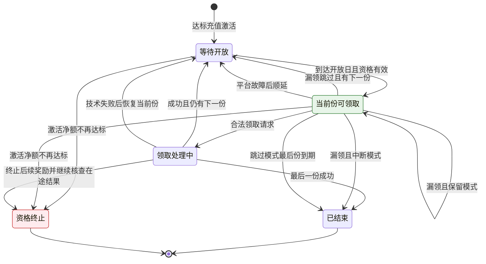

# 4.12 · 常规七日签到

## 1. 活动介绍

玩家充值达标后获得持续回访奖励,清楚知道今天可领多少及漏领后的影响。

### 使用者

| 角色 | 用来做什么 | 没有会怎样 |
|---|---|---|
| 运营 | 配置参与门槛、固定奖励及漏领规则 | 活动成本及参与条件难以解释 |
| 玩家 | 充值参与后按日领取奖励 | 不清楚再次充值和漏领是否影响进度 |
| 客服与财务 | 核查参与依据与发奖结果 | 无法解释奖励失效或重复发放 |

一次达标充值带来多次回访机会;观察领取率、回访率及实际奖励成本。

### 本次范围

- 不限定首充,不按充值金额比例返现,不随 VIP 等级调整奖励。
- 不设置逐日充值或投注领取门槛,不把奖励到账后的打码义务当成领取前提。
- 不添加连续签到额外奖励或充值补签;另外两类签到独立定义。
- 不承载玩家端视觉设计。

### 适用范围

| 维度 | 取值 |
|---|---|
| 终端 | 桌面运营后台 |
| 响应式 | 沿用现有后台规范 |
| 界面语言 | 简体中文 |
| 时区 | 平台业务时区 |
| 货币 | 参与门槛按平台标准计价币种;奖励按活动奖励币种,见 A9 |

## 2. 运营配置

| 字段 | 类型 | 可输入数据与校验 |
|---|---|---|
| 活动名称 | text | 见 A14 |
| 最低单笔充值金额 | number | 正金额,标注标准计价币种;见 A1/A9 |
| 奖励币种 | select | 已开通币种,见 A9 |
| 奖励日、固定奖励金额、打码倍数 | 只读序号 + number | 完整覆盖 A2 的奖励份数;不得缺项,见 A4 |
| 漏领处理 | select | A5 的互斥选项,选择后展示对应例子 |
| 正常结束后可再次参与 | switch | 默认及生效范围见 A7;中断结束与资格失效后重开不受此项限制 |
| 活动开关 | switch | 校验 A8/A10,展示旧轮继续履约的影响 |
| 活动说明 | text | 描述参与、领取、失效与奖励打码规则,不得与实际配置矛盾 |
| 当前版本、草稿、待生效时间 | 只读 | 展示 A8 的配置生效范围 |
| 当前新参与活动、拟切换活动 | 只读 + select | 选择目标前展示旧轮继续履约及保留模式阻止个人切换的影响,见 A10 |

发布前逐日展示奖励金额、打码倍数及需完成流水,并展示本轮奖励总额、漏领模式、重复参与及旧轮权益说明;确认时草稿已变化则重新核对。

### 配置限制与默认值

| 配置或参数 | 填写与执行规则 |
|---|---|
| 激活门槛(A1) | 单笔成功充值达到配置的最低金额即可参与,不限首充,不累计多笔凑门槛,不设最高激活金额。最低金额为正数,按标准币精度填写；参与门槛 |
| 固定奖励(A4) | 每份日奖分别配置固定彩金金额及打码倍数。激活后免费领取,不要求再次充值或先完成投注。金额为正数且符合奖励币种精度;倍数为正数,最多两位小数;不得缺项或默认为零。每笔实际奖励独立产生相应打码义务；日奖配置 |
| 范围与基础参数(A14) | 首版不设活动人群标签或独立渠道,使用平台账号资格及风险限制;活动名称 1–40 字符,默认关闭。奖励金额、最低充值门槛与倍数均无默认业务值,运营填齐才允许发布；基础设置 |

### 配置与启停(4.12-R1)

进入配置、保存或切换活动开关。

允许保存未完整草稿,发布必须完整;记录操作人、前后值及生效时间。按 A8 锁定旧轮依据;切换需同时拥有原活动与目标活动启停权限。无权限或冲突时整体拒绝,不能只关闭一边或同时开放两边。

## 3. 参与和领奖规则

### 周期起点(A2)

达标充值当天为第 1 天,本轮共 7 份日奖,当天即可领取。按平台业务时区切日,不提供滚动时长;临近午夜激活也归当天,参与前提示首日剩余领取时间。业务时区存在进行中轮次时不得修改。

### 进行中充值(A3)

本轮进行中再次充值不重置、不推进奖励日,也不开并行新轮;第二天充值仍领取第二天奖励。不储存进行中充值作为下轮激活券。

### 漏领模式(A5)

三选一:中断活动结束 / 跳过当日奖励 / 保留当日奖励。中断:允许领取日结束仍漏领,本轮结束且剩余未受理奖励失效,需要结束后的新达标充值重开。跳过:该份失效,次日继续下一奖励日,最后奖励日结束关闭本轮。保留:停留在未领份额,不设整轮到期日,允许超过七个自然日直至领完;不另设最长保留期限。

配置或来源：漏领处理。

### 领取节奏(A6)

玩家主动领取,同用户在本活动每业务日最多成功受理一份日奖,跨轮同样受限。正常受理锁定原业务日;入账延迟不挪占到账日名额。保留模式领取后次日开放下一份,不能同日连领。最后一份领取完成即结束;若同日已领旧轮末奖又用新充值激活新轮,新轮当天仅激活,次日开放首份且当天不算漏领。

### 重复参与(A7)

“正常结束后可再次参与”默认关闭。正常领完或跳过到期时锁定当时本轮配置的重复参与结果;开启则需结束后的新达标充值,关闭则不再接受该用户正常重复参与,后续修改开关不追改历史结果。中断模式结束及 A12 资格失效终止均允许新的达标充值重开,不受该开关限制。新轮仍需活动开放及互斥资格满足;旧充值不得复用,不存在靠改活动名称或版本绕过限制的入口。

配置或来源：正常结束后可再次参与。

### 版本与停用(A8)

激活时锁定门槛、逐日奖励、倍数、币种、漏领模式和重复参与开关。配置保存仅形成草稿,运营核对后发布;发布及正常启停从下一个业务日生效,每次仅允许一个待生效版本。已有轮继续按原配置履约,停用仅停止新激活。本活动首次有人参与后禁止修改奖励币种。

配置或来源：草稿、发布、活动开关。

### 充值与币种(A9)

仅真实成功充值,赠金和人工充值不计;用入账时标准币金额判门槛,不按当前汇率重算;全活动一个奖励币种。成功到账时间决定激活日期;取数未知按 A11 核查,不得当成不达标。相同到账时刻按财务稳定的充值序号排序,最早合格充值激活,后续充值遵循 A3。

配置或来源：奖励币种。

### 三类签到互斥(A10)

同一运营商最多开放一种签到接受新轮参与。切换通过同一生效边界关闭原活动新参与、开放目标活动,生效前再次校验冲突。已参与用户保留旧轮权益,直到旧轮完成或终止才可加入另一种;已受理结果未知时仍占旧轮资格。保留模式可能长期阻止切换用户参加新活动,首版不强制取消旧轮。关闭的 VIP 签到旧轮结束后不自动续轮;其他日奖规则不受影响。三类活动均须执行同一互斥校验才能上线切换能力。

配置或来源：跨活动启用校验。

**原表取舍**:「7日返现」的返现比例替换为固定奖励金额,不再以充值金额计算奖励;最高激活金额、人群及渠道字段首版不做,不要按旧表补回。循环字段明确为“正常结束后可再次参与”,不表示自动发奖或用旧充值循环激活。

系统故障豁免和每日名额限制导致的延后均不属于 A5 的用户漏领;正常无故障时按 A2 当天起算。

### 充值激活(4.12-R2)

财务确认成功充值到账。

输入信息：用户、充值依据、成功到账时刻及入账时标准币金额。

先按 A9/A11 还原充值时刻的资格、活动版本及启用状态,再检查已有轮、跨活动限制和历史重复参与结果,最后按 A1/A7 判定并建立本轮。存在未知的更早激活事实时保留核查,不另开轮;当前处于风险限制也不得新增受理。激活本身不自动领取奖励,同日换轮按 A6 开放领取。

### 领取与进度(4.12-R3)

玩家主动领取、领取结果恢复、业务日结束。

输入信息：当前用户及本轮领取意愿;金额与进度由服务端确定。

按最新财务退款事实和平台风险限制核对 A12/A13,再校验本轮状态及 A6 的领取资格;固定本次依据后交财务发奖。成功后记已领取;失败、未知与跨日恢复按 A11,不因技术原因误作漏领。日界先核查在途请求和平台故障豁免,再对允许领取但未领的日期按 A5 处理;风险限制不替代漏领处理。

### 业务流程

本轮状态按下图流转;具体开放日期、日界和重复参与见 A5–A13。红色表示资格终止,绿色表示允许领取;“已结束”不包含尚未核清的在途资金结果。

## 4. 特殊情况

### 技术延迟与恢复(A11)

充值事实迟到时按原成功到账时刻的活动版本、启用状态及参与资格还原,原本不合格不得借补算激活。原激活日期保留,此前无法参与的日期不判漏领、不消耗奖励日;确认恢复后从下一业务日开放首份,不自动补发。待核实的更早充值未解决前不以较晚充值另开轮。已合法受理的领取最终成功归原受理日;处理期间不开放下一份、不判漏领,受阻整日顺延。最终失败但请求原本合法,保留当前份,恢复后次日重开;资格明确不合法则按 A12/A13 处理。无在途请求却因平台故障整日无法领取时,该日同样不消耗奖励日。

配置或来源：系统恢复规则。

### 退款与拒付(A12)

仅重算本轮激活充值扣除已确认退款/拒付后的净标准币金额,部分退款按原换算比例扣减。不低于锁定门槛则继续;低于门槛立即终止未受理奖励,结束原轮,留原因及关联记录。已受理奖励不自动追回,在途资金结果继续核实;不把其他旧充值补作激活金额。退款结论后续撤销不自动恢复已终止轮,避免与新轮冲突;保留财务申诉复核记录,任何补偿走平台人工审批,不新增活动自动补发。新的达标充值须发生于资格终止之后且平台允许参与。

配置或来源：财务事实与终止规则。

### 风险限制(A13)

不合格账号不得激活或受理新奖励。已受理奖励继续按原依据核查;风控限制是个体限制,不豁免漏领,日界仍按 A5:中断结束、跳过失效或保留当前份。解除限制只允许领取仍有效份额,不补回已失效奖励,平台系统故障按 A11 区分处理。

配置或来源：平台风险判断。

### 边界处理

| # | 场景 | 触发条件 | 预期处理 |
|---|---|---|---|
| E1 | 越权配置 | 无权限保存或启停 | 拒绝,现有配置不变 |
| E2 | 重复到账通知 | 同笔充值重复到达 | 激活至多一次,旧充值不激活新轮 |
| E3 | 并发达标充值 | 同用户多笔同时到账 | 按到账事实只建立一个进行中轮次,其余按 A3 |
| E4 | 领取结果未知 | 日界前受理但资金结果未知 | 保留原请求及原日依据,核查后恢复,不重复发奖或提前结束 |
| E5 | 充值事实延迟 | 到账日后才获得可靠事实 | 按 A11 还原原日资格并顺延可领取日,不凭当前版本激活,不自动补发历史奖励 |
| E6 | 退款或拒付 | 激活充值撤销或部分退款 | 按 A12 判净额,低于锁定门槛终止未受理奖励,不自动追回已受理奖励 |
| E7 | 封禁或风险限制 | 平台禁止参与或领取 | 按 A13 拒绝新受理;各漏领模式照常执行,解除后不补回失效份额 |
| E8 | 同日完成并重新激活 | 已领末奖后发生新的达标充值 | 按 A6 激活新轮,次日开放首份,不得同日多领或将当天判为漏领 |
| E9 | 多活动同时切换 | 并发开启不同签到 | 按 A10 整体校验,最多一种接受新轮;旧轮继续履约 |
| E10 | 停用与版本变更 | 已激活后规则变动 | 按 A8 旧轮快照履约,不能将停用误作暂停旧轮日界 |
| E11 | 保留模式长期未领 | 跨自然周期再次回访 | 按 A5 保留原奖励份额及快照,没有隐含到期;仍占跨活动参与资格 |
| E12 | 充值事实乱序 | 较晚充值先通知 | 按 A9/A11 核清最早合格依据,至多激活一轮,不能将早充值留给后续轮 |
| E13 | 退款与领取并发 | 受理前获知已确认退款 | 用最新净额判资格;已合法受理结果按 A12 保留,双方依据可追溯 |

### 配置与启停遇到异常时(4.12-R1)

字段缺失或活动冲突时拒绝生效并指出原因。

### 充值激活遇到异常时(4.12-R2)

事实未知保留待核实;活动未启用或明确不达标不激活,不能影响充值入账。

### 领取与进度遇到异常时(4.12-R3)

重复领取返回已有结果;不得因超时另发一笔奖励。

### 页面状态

| 状态 | 表现 |
|---|---|
| 未完整配置 | 列明缺项,可存草稿,不能发布或开启 |
| 待生效 | 展示生效日期与旧轮不变的提示 |
| 已停用但旧轮履约 | 新参与关闭,旧轮仍按原规则领取 |
| 恢复待开放 | 展示恢复后开放日期,不展示为漏领 |
| 资格失效终止 | 显示退款或拒付依据及剩余未受理奖励终止原因 |
| 启用冲突 | 显示冲突签到活动及旧轮影响 |
| 进行中 | 显示本轮奖励日、已领及失效奖励、当前漏领模式 |
| 保留待领 | 明确保留哪份奖励,不显示已过期 |
| 处理中 | 不引导重复领取或承诺已到账 |
| 完成或中断结束 | 显示结束原因及是否可通过新充值再次参与 |

## 5. 验收场景

| 需求编号 | 场景与操作 | 预期结果 |
|---|---|---|
| 4.12-R1 | 配置与启停：查看、保存草稿、发布、切换开关 | 配置完整且合法;越权拒绝;旧轮依据可追溯 |
| 4.12-R2 | 充值激活：成功充值到账 | 按 A1–A3 激活,已有轮不重开 |
| 4.12-R3 | 领取与进度：玩家领取、业务日结束 | 正确发奖并执行 A5/A6;请求重复不重复发钱 |
| 4.12-R4 | 在本页打开活动记录,核查一轮参与与领取 | 能查玩家、激活充值、配置版本、轮次进度、漏领处置、奖励快照和资金结果;无查看权限或超出账号数据范围的查询被拒绝 |

### 配置与启停(4.12-R1)

正向,新配置只用于生效后新轮;逆向,缺少日奖配置不能发布,无权限不能保存或切换。

### 充值激活(4.12-R2)

正向,非首充单笔达标激活;逆向,多笔各自不达标不得合计激活,进行中充值不得新建轮次。

### 领取与进度(4.12-R3)

正向,保留模式跨自然日期仍领取未领的奖励日;逆向,同日多次请求不得领取下一份或重复入账。

## 6. 相关资料

关联工单：[KAN-219](https://bingobox.atlassian.net/browse/KAN-219)。

名称映射：原表“7日返现”对应本页固定奖励签到,不限首充。

### 入口与关联页面

- 菜单:活动管理 → 活动配置 → 常规七日签到。
- 跳入:活动配置菜单;任务路由由Jira维护。
- 本页内提供“活动记录”区,参与依据、轮次进度及领取结果的查询与活动配置一起交付并验收。

- 跳入:[活动管理](../README.md)。
- 记录入口:本页内“活动记录”。
- 相关但不合并:[签到奖励](../4.10-签到奖励/README.md)。

### 权限

| 操作 | 权限或执行方 |
|---|---|
| 配置与启停(4.12-R1) | `activity:seven-day-sign-in:view` / `activity:seven-day-sign-in:edit` / `activity:seven-day-sign-in:publish` / `activity:seven-day-sign-in:switch` |
| 充值激活(4.12-R2) | 系统触发 |
| 领取与进度(4.12-R3) | 系统触发 |
| 查询活动记录(4.12-R4) | `activity:seven-day-sign-in:view` |

页内活动记录必须能查玩家、激活充值、配置版本、轮次与当前奖励日、漏领处置、奖励快照、领取时间、处理结果及关联资金记录。记录区只读查询,服务端按查看权限、运营商及账号数据范围隔离结果。

### 术语与共用口径

| 术语 | 定义 |
|---|---|
| 激活充值 | 使用户取得本轮参与资格的达标充值 |
| 奖励日 | 本轮奖励配置中的顺序位置;保留模式下不等于激活后经过的自然日 |
| 漏领 | 一个允许领取的业务日结束,玩家未成功领取且没有待核实的合法领取请求 |
| 一轮 | 从达标充值激活到完成或中断结束的一次参与 |

资金及打码语义引用 [资金模型](../../M2-用户管理/2.1-用户列表/资金模型.md),金额判定引用 [标准计价](../../M2-用户管理/2.1-用户列表/标准计价.md)。

### 依赖与数据流

**数据流向**:运营配置 → 活动规则;财务成功充值事实 → 活动激活依据与进度;领取请求 → 活动判定 → 财务奖励入账及打码 → 领取结果与记录。

**系统串接**:引用 M2 账号资格和风险限制、M5 充值与资金结果、M6 权限及操作日志。不直接对接外部支付机构,不直接改钱包。财务失败或结果未知由活动保留领取依据并核查,不得自行视为成功。

### 数据归属与职责

**数据归属**

- 拥有(owner=M4):活动配置版本、本轮激活依据、进度、奖励快照、重复参与结果及发放记录;跨签到的新参与选择与个人进行中资格同属 M4。
- 只读:账号及风险状态(owner=M2)、充值与资金事实(owner=M5)、权限(owner=M6)。

**前后端职责**

| 事项 | 归属 |
|---|---|
| 权限、资格、币种与时区判定、进度正确性、重复发奖防护 | 服务端 |
| 配置输入、规则解释与状态展示 | 界面 |
| 奖励入账、打码及资金结果 | 财务能力 |

### 配置与启停的职责(4.12-R1)

界面展示规则与影响,服务端校验权限、配置完整性、币种和互斥。

### 充值激活的职责(4.12-R2)

服务端判定资格并记录激活依据,玩家端展示当前奖励日。

### 领取与进度的职责(4.12-R3)

活动负责资格和进度,财务负责奖励入账与打码义务。
