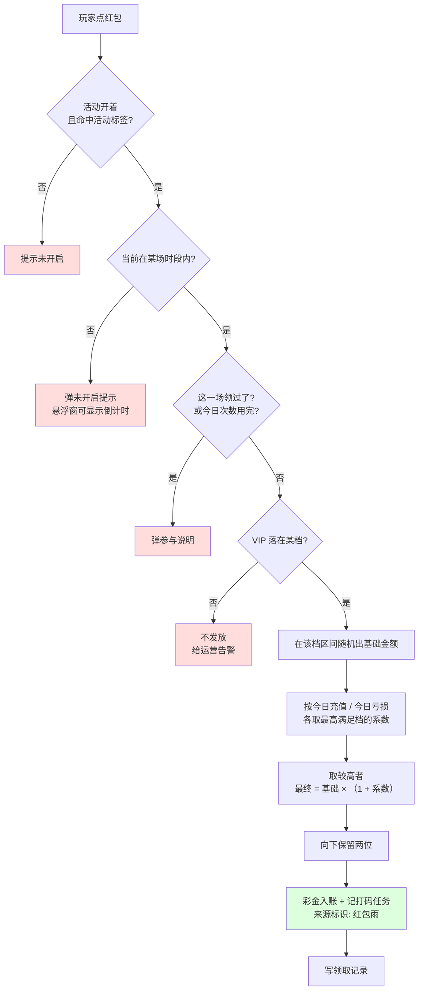

# 4.2 · 红包雨

## 1. 背景与目标

**目标**:让运营自己定"每天几点下红包雨、谁能领、领多少、领了要玩够多少才能取",
玩家到点在线就能点红包拿一笔小钱。这一页就管红包雨的所有规则:时段、金额、加成、文案、开关。

**谁在用**

| 角色 | 用来做什么 | 没有会怎样 |
|---|---|---|
| 运营 | 定时段、定金额档位、定充值和亏损加成、开关活动 | 想在高峰期加一场都得找程序员改 |
| 玩家 | 到点在线点红包领钱(在玩家端) | 没有理由在固定时间回来,活跃拉不起来 |
| 财务 / 风控 | 看每天发了多少、有没有被小号薅 | 发出去多少钱说不清,被薅了也查不到 |

**业务价值**:把玩家在固定时间拉回来,在线时长和留存靠这个撑;发的钱要玩够量才能提,
成本可控;每一笔都有记录,花了多少一目了然。

**不做什么**

- **不做玩家端的红包雨页面和动画** —— 这里只是后台,玩家看到的另外做
- **不做加钱和打码本身** —— 这里只定规则和触发,真正加钱、记打码由资金那边管
- **不做领取记录页** —— 谁领了多少在「红包雨活动记录」(4.3)里看,本页只放入口
- **不做多模板** —— 一个运营商一套配置,不做模板的新增、切换、删除;线上表单顶部的模板选择器不做
- **不做展示配置联动** —— 首页 Banner、悬浮窗、侧边栏的开关与图片归运营管理,本页不放入口
- **不做活动循环、活动周期、冷却天数** —— 红包雨是常驻活动,只靠活动开关控制;线上表单里
  这三项属于通用活动模型,本设计**移除**,不要补上
- **不做别的定时发奖活动** —— 签到、转盘等各是各的,不并进来

**适用范围**

| 维度 | 取值 |
|---|---|
| 终端 | 电脑后台,按 1440px 宽设计 |
| 响应式 | 最小支持 1280px;不做手机版 |
| 界面语言 | 后台用简体中文;活动名称和玩家可见文案按运营语言填(线上为葡语) |
| 时区 | 时段、每日次数重置、当日充值和亏损统计都按运营所在时区(GMT−3) |
| 货币 | 金额按运营商币种,默认巴西雷亚尔(R$);一个运营商一套配置 |

## 2. 入口

- 菜单:活动管理 → 活动配置 → 充值活动配置 → 红包雨
- 页内:右侧悬浮「保存」;「活动说明」卡片展开功能说明
- 跳入:首版仅从菜单进入

## 3. 术语

> 通用词(打码倍数、随机奖励)见 `../README.md` 第 2 段;彩金、打码任务、有效投注
> 见 `../../M2-用户管理/2.1-用户列表/资金模型.md`,这里不重复讲。

| 术语 | 定义 |
|---|---|
| 场次 | 某一天的第 N 场红包雨,由"日期 + 序号"确定,对应一个当天内的开始和结束时刻 |
| 时段 | 一场红包雨的开始到结束,玩家只有在这段时间内才能领 |
| 基础金额 | 玩家 VIP 等级落在哪一档,就在这档的最小和最大之间随机出一笔钱 |
| 加成 | 按玩家当天充了多少、输了多少,给基础金额再乘一个系数 |
| 今日充值 | 当天(运营时区)成功到账的充值总和 |
| 今日亏损 | 当天(运营时区)投注减去派彩的差额,**用彩金投注输掉的也算在内** |
| 未开启提示 | 不在任何时段内时,玩家点入口看到的说明文案 |
| 参与说明 | 在时段内但领不了(次数用完、不满足条件)时弹出的说明文案 |

## 4. 关键参数与假设

<!-- 所有阈值只在这里写一遍;数字本身在配置页填,这里只说有哪些、什么意思、在哪填。 -->

| 编号 | 参数 | 取值 | 依据 | 在哪配 |
|---|---|---|---|---|
| A1 | 每天场次数 | 1 ~ 12 场;改了场次数,所有时段清空重填 | 已验证(线上上限 12) | 本页 |
| A2 | 时段 | 每场填开始和结束时刻(精确到秒);开始 < 结束;各场按时间先后排、两两不重叠(端点也不能碰);最后一场不跨天,最晚 23:59:59 | 已验证(线上文案);**不重叠由服务端拦是假设**,线上界面未拦 | 本页 |
| A3 | 每场每人领几次 | **1 次** | 已定(2026-08-28 业务确认) | 写死 |
| A4 | 每日领取次数 | 正整数;一天最多领这么多次;因为每场只能领 1 次,所以不能大于场次数,超了保存时拦 | 语义已验证;**上限 ≤ 场次数是假设** | 本页 |
| A5 | 打码倍数 | 保留两位小数,≥ 0;领到的钱要玩够"金额 × 倍数"的流水才能提;线上建议 1 ~ 5 倍 | 已验证(线上例:3.00) | 本页 |
| A6 | 金额档位 | 按 VIP 等级分档,每档填等级区间和金额区间;等级区间两两不重叠(端点也不能碰);最小金额 ≤ 最大金额;至少一档最大金额 > 0;**所有档位合起来要盖住 0 到最高 VIP 等级**,有缺口保存时拦 | 前三条已验证(线上文案);**覆盖全部等级是假设** | 本页 |
| A7 | 加成档位 | 一张表,每行填"今日充值 ≥ 多少 → 系数 %"和"今日亏损 ≥ 多少 → 系数 %";系数保留一位小数,≥ 0;至少一行系数 > 0;门槛从小到大、系数随门槛不减 | 前三条已验证;**单调是假设** | 本页 |
| A8 | 加成怎么取档 | 充值和亏损各自取"满足门槛的最高一档"的系数;哪个都没到就是 0 | 已验证(线上文案"≥") | 写死 |
| A9 | 金额公式 | 最终金额 = 基础金额 × (1 + 系数 ÷ 100) | 已定(2026-08-28 业务确认) | 写死 |
| A10 | 充值系数和亏损系数怎么合 | **取两者中较高的一个**;不相加、不相乘 | 已定(2026-08-28 业务确认,D42) | 写死 |
| A11 | 金额进位 | 算完向下保留两位小数,不四舍五入 | **未验证假设** | 写死 |
| A12 | "今日"口径 | 运营时区的自然日,0 点重置;充值和亏损在玩家点领取那一刻算,不提前算 | 时区已验证;**领取时刻算是假设** | 写死 |
| A13 | VIP 不在任何档位 | **不发放**,按"不可领取"处理,并给运营告警提示补档;不按最低档发 | **未验证假设**,配合 A6 覆盖校验 | 写死 |
| A14 | 改配置什么时候生效 | 活动开关和纯文案立刻生效;时段、次数、金额、加成、打码倍数、标签**下一场才生效**,正在进行的一场按开场时的规则走 | **未验证假设**,见 `../README.md` 第 7 段 D43 | 写死 |
| A15 | 加成按标签分组 | 加成表可以按用户标签分成多组,每组一张表;按优先级取第一个命中的组,都没命中用默认表 | **未验证假设**,是否本期做见 `../README.md` 第 7 段 D44 | 本页 |
| A16 | 用户标签口径 | 活动绑定的标签和加成分组的标签,都按玩家在领取那一刻的命中集判断;多标签取并集 | 已定(沿用 D39;并集口径同 4.1-A7) | 本页 |
| A17 | 倒计时 | 开关打开时,玩家端悬浮窗显示距下一场开始还有多久 | 已验证 | 本页 |
| A18 | 名称长度 | 活动完整名称最多 20 字;侧边栏简称最多 10 字,建议 2 ~ 4 字 | 已验证 | 本页 |

> A14、A15 已按倾向写成明确假设,业务定了再改。
> 线上加成表只有一张、对所有人一样;A15 是为了让不同人群拿到不同加成。

## 5. 字段清单

本页是配置页,没有筛选和表格;字段按配置区分组列出。
现网界面见 `截图/配置页-整页.png`(从基础设置到悬浮窗配置);
「活动说明」卡片展开后的功能说明见 `截图/配置页-活动说明弹窗.png`。

**基础设置**

| 字段 | 类型 | 可输入数据与校验 |
|---|---|---|
| 用户标签 | 多选 | 命中的人才参与;不选 = 全部(A16) |
| 活动开关 | switch | 开 / 关;关了立刻停发(A14) |
| 活动完整名称 | text | 必填,≤ 20 字(A18) |
| 侧边栏显示的简称 | text | 必填,≤ 10 字(A18) |
| 说明开关 | switch | 开了才会在领不了时弹参与说明 |
| 参与说明 | textarea | ≤ 1000 字 |
| 玩家每日领取次数 | number | 必填,正整数,≤ 场次数(A4) |
| 打码倍数 | number | 必填,两位小数,≥ 0(A5) |
| 悬浮窗入口显示倒计时 | switch | 开 / 关(A17) |

> 截图里的「模板」选择器、「活动循环」「活动周期」「冷却天数」本设计**不做**(见第 1 段"不做什么"),
> 不要补回来。

**红包雨时间配置**

| 字段 | 类型 | 可输入数据与校验 |
|---|---|---|
| 红包雨每天次数 | select | 1 ~ 12(A1) |
| 第 N 场开始 - 结束时间 | timerange | 每场必填,精确到秒;按 A2 校验 |

**红包金额配置**(可增删行)

| 列 | 类型 | 可输入数据与校验 |
|---|---|---|
| VIP 等级(最小) | number | 整数 ≥ 0 |
| VIP 等级(最大) | number | 整数 ≥ 最小 |
| 最小金额 | number | 两位小数 ≥ 0,带运营商币种符号 |
| 最大金额 | number | 两位小数 ≥ 最小金额 |

整表校验见 A6。

**充值 / 亏损加成配置**(可增删行;A15 落地后每个标签分组各一张同结构的表)

| 列 | 类型 | 可输入数据与校验 |
|---|---|---|
| 今日充值(≥) | number | 两位小数 ≥ 0 |
| 充值奖励彩金系数(%) | number | 一位小数 ≥ 0 |
| 今日亏损(≥) | number | 两位小数 ≥ 0 |
| 亏损奖励彩金系数(%) | number | 一位小数 ≥ 0 |

整表校验见 A7。A15 分组字段:分组名(必填)、用户标签(至少选一个)、优先级(上移 / 下移)。

**活动说明**

| 字段 | 类型 | 可输入数据与校验 |
|---|---|---|
| 活动说明 | textarea | 玩家可见的规则:打码要求、注意事项、最终解释权 |
| 未开启状态提示弹窗说明 | textarea | 不在时段内时弹的整体说明 |

> 截图下半部分的「展示配置」(首页 Banner、活动主页 Banner、窗口 Banner、专属 Banner、悬浮窗、侧边栏)
> 本设计**不做**,不要补回来;悬浮窗上的倒计时开关(A17)是活动功能,保留在基础设置里。

## 6. 需求清单

| ID | 需求 | 触发条件 | 验收标准 | 权限码 |
|---|---|---|---|---|
| 4.2-R1 | 加载配置 | 进页面 | 显示当前运营商的全部配置;从没配过时各项为空、开关为关 | `activity:red-packet-rain:view` |
| 4.2-R2 | 保存配置 | 点「保存」 | 按 A1 ~ A7、A18 检查,全部通过才存;哪儿错了指到那一行 | `activity:red-packet-rain:edit` |
| 4.2-R3 | 活动开关 | 切换开关并保存 | 关了立刻停发,进行中的一场也停;开了到点就下 | `activity:red-packet-rain:switch` |
| 4.2-R4 | 到点下雨与领取算钱 | 定时到场次开始 / 玩家点红包 | 每场每人 1 次;按 A6 ~ A13 算出金额;彩金入账并记打码;写一条领取记录 | 无(服务端自动) |
| 4.2-R5 | 加成按标签分组 | 点「新增标签分组」 | 可加多组,每组选标签、排优先级、填一张加成表;领取时按 A15 取表 | `activity:red-packet-rain:edit` |

## 7. 需求详述

### 4.2-R2 · 保存配置

**触发条件**:有权限的运营改完任意一项,点右侧「保存」。

**可输入数据**:第 5 段全部字段。

**功能范围**

| 归属 | 做什么 |
|---|---|
| 界面 | 填表时当场提示:名称超长、时段顺序不对、最小大于最大、次数超过场次数;错在哪一行就在哪一行标红 |
| 服务端 | 把 A1 ~ A7、A18 全部再查一遍;查权限;通过才整份存下;记下谁改的、什么时候改的 |

**处理逻辑**

1. 查基础项:名称长度(A18);每日领取次数是正整数且 ≤ 场次数(A4);打码倍数 ≥ 0(A5)。
2. 查时段:数量 = 场次数;每场开始 < 结束;按时间排好后两两不碰;最后一场不过 23:59:59(A2)。
3. 查金额档:等级区间两两不碰;每档最小 ≤ 最大;至少一档 > 0;合起来盖住 0 到最高 VIP(A6)。
4. 查加成表:至少一行系数 > 0;门槛从小到大,系数不减(A7);有分组时每组同样查,分组名和标签不能空(A15)。
5. 全部通过才存;存完按 A14 决定什么时候生效;刷新页面显示。

**错误处理**

| 错误状况 | 提示 |
|---|---|
| 时段有重叠或顺序颠倒 | 第 N 场与第 M 场时间重叠,请调整 |
| 最后一场跨天 | 最后一场结束时间不能晚于 23:59:59 |
| 每日领取次数大于场次数 | 每日领取次数不能大于每天场次数 |
| VIP 档位重叠 | 第 N 行与第 M 行 VIP 等级重叠 |
| VIP 档位有缺口 | VIP X ~ Y 等级没有配置金额,请补齐 |
| 最小金额大于最大金额 | 第 N 行最小金额不能大于最大金额 |
| 加成表全是 0 | 至少配置一档系数大于 0 |
| 没有权限 | 没有操作权限(服务端也会拦,不靠藏按钮) |

**测试案例**

- 正向:6 场、每日 6 次、VIP 0 ~ 30 分六档、加成六档、打码 3 倍 → 保存成功,重进页面数据一致。
- 逆向:第 2 场 14:00 ~ 15:00、第 3 场 14:30 ~ 16:00 → 界面和服务端都拦,指到第 2、3 场。
- 逆向:VIP 档位只配到 25,系统最高 30 → 拦下,提示 26 ~ 30 没配。
- 逆向:每日领取次数填 8、场次数 6 → 拦下。

### 4.2-R4 · 到点下雨与领取算钱

**触发条件**:到了某场开始时刻,服务端自动开场;时段内玩家在玩家端点红包。

**可输入数据**:玩家的点击;没有别的输入。

**功能范围**

| 归属 | 做什么 |
|---|---|
| 界面(玩家端,本仓库范围外) | 时段内显示红包,点了显示领到多少;领不了时弹参与说明或未开启提示 |
| 服务端 | 开场时把这一场用的规则定下来(A14);领取时查资格、算金额、通知加钱和记打码、写记录;同一人同一场只成功一次 |

**处理逻辑**

红色为拒绝分支;绿色为资金动作,必须走财务账变、带来源标识。

1. 开场:到开始时刻,把这一场要用的规则(时段、金额档、加成表、次数、倍数)固定下来,本场内不再变(A14)。
2. 资格:活动开着、命中活动标签、在时段内、本场没领过、今日次数没用完(A3、A4、A16)。
3. 金额:按 A6 随机基础金额;按 A8 取充值和亏损系数;按 A10 合并;按 A9 算;按 A11 进位。
4. 入账:通知财务加彩金、按 A5 记打码任务,带上"红包雨"来源标识;这里不直接改余额。
5. 记录:写一条领取记录(玩家、场次、VIP、基础金额、系数、最终金额、时间);在 4.3 里看。

**错误处理**

| 错误状况 | 提示 |
|---|---|
| 不在时段内 | 弹未开启状态提示;有倒计时就显示倒计时 |
| 本场已领 / 今日次数用完 | 弹参与说明(说明开关开着时);否则只提示"今天领完了" |
| VIP 不在任何档 | 玩家侧按"不可领取";运营侧告警"VIP X 无金额档位" |
| 加钱失败 | 不写领取记录、不扣次数;玩家侧提示稍后再试 |

**测试案例**

- 正向:VIP 12、今日充值 200、今日亏损 600,档位 1 ~ 3 元、充值 ≥150 → 60%、亏损 ≥500 → 70%,随机到 2.00 → 领到 3.40,打码要求 10.20(3 倍)。
- 正向:充值和亏损都没到任何门槛 → 系数 0,领到基础金额本身。
- 逆向:同一人同一场连点三次 → 只成功一次,只加一次钱。
- 逆向:时段外点红包 → 拒绝并弹未开启提示,不加钱不记账。
- 逆向:VIP 31、档位只配到 30 → 不发放,告警。

### 4.2-R5 · 加成按标签分组

**触发条件**:运营在「充值 / 亏损加成配置」区点「新增标签分组」。

**可输入数据**:分组名、用户标签(从 2.5 拉,至少一个)、优先级、一张与默认表同结构的加成表(A7)。

**功能范围**

| 归属 | 做什么 |
|---|---|
| 界面 | 默认表之外可加多组,每组一个折叠面板;能上移下移排优先级;能删 |
| 服务端 | 保存时每组按 A7 查;领取时按 A15 挑表:按优先级从上到下,第一个命中的组;都没命中用默认表 |

**处理逻辑**

1. 保存:分组名必填、标签至少一个、表按 A7 查;分组数上限 10。
2. 领取:先看玩家当下命中哪些标签(A16),按优先级找第一个命中的组,取那张表;没命中用默认表。
3. 之后按 4.2-R4 第 3 步算钱;领取记录里记下用了哪个分组。
4. 没有配任何分组时,行为和现在完全一样。

**错误处理**

| 错误状况 | 提示 |
|---|---|
| 分组没选标签 | 请为分组「X」至少选一个用户标签 |
| 分组表全是 0 | 分组「X」至少配置一档系数大于 0 |
| 超过 10 组 | 最多 10 个标签分组 |

**测试案例**

- 正向:默认表 50% 起步;新建分组「高价值」绑标签 T1、充值 ≥50 → 80%;命中 T1 的玩家充 60 领取 → 用 80%;没命中的用 50%。
- 正向:两组都命中,优先级高的那组生效。
- 逆向:分组不选标签就保存 → 拦下。

## 8. 数据流向与系统串接

**数据流向**:运营填表 → 服务端整份校验后存成配置 → 到点开场时把规则固定下来 →
玩家领取时查资格、算金额、通知加钱记打码、写领取记录 → 本页读出配置显示,4.3 读出记录显示。

**系统串接**:

- 钱包和账变、打码任务(归财务):加彩金和记打码都走财务那边,带"红包雨"来源标识;
  这里只触发,不自己改余额。资金域不反向依赖本活动。
- 用户标签(归 M2,2.5):活动绑定的标签和加成分组的标签,领取时按当下命中集判断。
- VIP 等级(归 M2):领取那一刻的等级决定金额档。
- 充值汇总与投注派彩(归财务 / 玩法,本仓库范围外):算今日充值和今日亏损用,本页不直接读。
- **除了平台自己的钱包 / 标签 / 充值投注数据,没有别的外部系统。**

## 9. 异常与边界

| # | 场景 | 触发条件 | 预期处理 |
|---|---|---|---|
| E1 | 越权 | 没权限的账号改配置 / 切开关 | 服务端拦下,不靠藏按钮 |
| E2 | 同一人连点 | 同一玩家同一场次并发点击 | 只成功一次,只加一次钱,不多扣次数 |
| E3 | 时段刚结束时点 | 玩家点击到达服务端时已过结束时刻 | 按服务端时间判定,拒绝;不以玩家端时间为准 |
| E4 | 进行中改配置 | 一场进行中运营改了金额档并保存 | 本场按开场时的规则走,下一场才用新的(A14) |
| E5 | 进行中关活动 | 一场进行中运营关掉开关 | 立刻停发,已领的不收回 |
| E6 | 场内升级 VIP | 玩家在一场内从 VIP 5 升到 6 | 以点领取那一刻的等级为准 |
| E7 | 高 VIP 无档位 | 系统新增了更高 VIP,档位没跟上 | 不发放,告警提示补档(A13);保存时 A6 覆盖校验兜底 |
| E8 | 加钱失败 | 财务那边入账没成功 | 不记领取、不扣次数,玩家可重试 |
| E9 | 场内标签变化 | 玩家在一场内被打上或摘掉标签 | 以点领取那一刻的命中集为准(A16),不回溯已领的 |
| E10 | 时段跨 0 点 | 运营把最后一场填到 23:30 ~ 00:30 | 保存时拦下(A2) |

## 10. 状态清单

| 状态 | 表现 |
|---|---|
| 错误 | 保存失败在页面顶部报错并把错误行标红,能改了再存;不整页崩 |
| 配置完整度 | 右侧显示已填必填项的百分比,没填完也能保存草稿但活动开不了 |
| 时段待重填 | 改了场次数后所有时段清空,每一场标"必填"直到填完 |
| 已关闭 | 活动开关关着时,页面顶部标"已关闭",配置仍可改 |
| 分组为空 | 没有任何标签分组时只显示默认表,不显示空面板 |

## 11. 涉及表与职责

**数据归属**

- 拥有(owner=M4):红包雨配置(含时段、金额档、加成表与分组、文案、开关)、场次开场时固定下来的规则、领取记录
- 只读:钱包和账变、打码任务、充值汇总(归财务)· 投注与派彩(归玩法,本仓库范围外)· 用户标签命中集、VIP 等级(归 M2)

**前后端职责**

| 事项 | 归属 |
|---|---|
| 整份配置校验(A1 ~ A7、A18)、开场固定规则、资格判定、随机金额、加成计算、防重复领取 | **服务端** |
| 权限判定、只给看该看的运营商 | **服务端** |
| 触发加钱与打码、写领取记录、失败不落账 | **服务端** |
| 填表、当场格式提示、错误行标红、完整度显示 | 界面 |

## 12. 关联页面

- 跳出:4.3 红包雨活动记录(谁领了多少)、2.5 用户标签(活动定向和加成分组)、
  `资金模型.md`(彩金和打码怎么算)
- 跳入:活动管理菜单;活动配置总览(不在本仓库)
