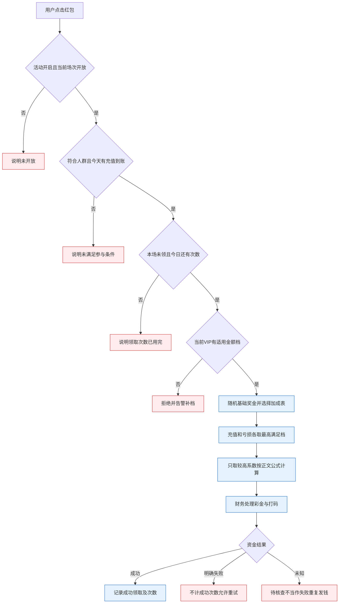

# 4.2 · 红包雨

## 1. 活动介绍

红包雨在每天指定的时间开放。用户当天有过成功到账的充值,并符合参与人群要求,就可以在场次开放期间点击红包领取彩金。每场每人只能领取一次,一天还受总领取次数限制。

奖金先按用户领取时的VIP等级随机产生基础金额,再根据当天充值和亏损情况增加。充值加成和亏损加成取较高的一个,不叠加。奖金到账后产生打码要求。

一个运营商只有一套红包雨配置。运营可以设置每天的场次、金额档位、加成、人群和说明,不用每次活动重新创建模板。本页包含后台配置与玩家领取规则,不包含玩家页面、红包动画或领取记录页的视觉设计。

不增加多模板、活动循环、活动周期或冷却天数。Banner、悬浮窗及侧边栏的图片和展示开关由其他运营功能维护;本页只保留活动名称、简称和下一场倒计时的业务设置。签到、转盘等活动另行定义。

后台使用简体中文,玩家名称和说明按运营语言填写。以1440px为参考,最小支持1280px,不做移动后台。场次、每天的领取次数及当天金额按GMT−3业务日计算;原稿金额按运营商币种、默认BRL。跨币种事实如何统一见D87。

已定玩法沿用[模块D42至D45、D51](../README.md#7-决策清单)。补充规则见D87,与正文共同作为实施依据。

## 2. 运营配置

### 基础设置

| 配置项 | 含义和填写规则 |
|---|---|
| 活动开关 | 决定是否允许领取;关闭立即生效,包括正在进行的场次 |
| 活动完整名称、侧边栏简称 | 玩家看到的活动名称,长度见A18 |
| 参与用户标签 | 不选表示不限制人群;选多个时满足任意一个即可 |
| 玩家每日领取次数 | 每个业务日最多成功领取几次 |
| 打码倍数 | 领取彩金后对应的打码要求 |
| 说明开关、参与说明 | 是否展示运营填写的不可领取说明 |
| 倒计时开关 | 是否展示距离下一场开始的剩余时间 |
| 活动说明 | 玩家可见的玩法和打码要求 |
| 未开启提示 | 不在任何场次内时展示的说明 |

### A1、A2、A4 · 每天什么时候开放

每天可配置1至12场。每场填写精确到秒的开始和结束时间,开始必须早于结束,按时间顺序排列。两场不能重叠,结束和下一场开始也不能是同一时刻。场次不能跨日,最晚结束时间为23:59:59。

修改每天场次数后,原来的时段清空,需要重新填写。这个动作不能立即清空正在执行的场次规则;规则修改从下一场生效。

每日领取次数为正整数,不能大于每天场次数。

### A5、A18 · 打码和文字限制

打码倍数不小于0,最多两位小数。每笔奖金产生的打码量为“实际奖金×倍数”。原稿中的1至5倍只是运营参考,不是强制范围或默认值。

完整名称必填,最多20字;侧边栏简称必填,最多10字,推荐显示长度2至4字,不作为保存限制。参与说明最多1000字。活动说明与未开启提示均最多1000字符。

### A6 · 按VIP等级设置基础奖金

| 每档字段 | 填写规则 |
|---|---|
| 最小VIP等级、最大VIP等级 | 不小于0的整数,最大不小于最小 |
| 最小奖金、最大奖金 | 运营商币种金额,两位小数;最小不小于0,最大不小于最小 |

等级区间不能重叠,端点也不能重合。所有档位合起来必须覆盖当前存在且启用的全部VIP等级;至少一档最大奖金大于0。保存时提示具体缺少哪些等级。

等级序号允许不连续。例如启用等级为0、1、2、4、5时,没有3不是配置缺口,区间也可以跨过这个空号。已经停用的等级上仍有用户时如何领奖,见特殊情况及D87。

### A7、A15 · 充值与亏损加成表

先配置一张默认加成表;还可以为不同标签人群配置专用表。

| 每行字段 | 含义和限制 |
|---|---|
| 今日充值门槛 | 累计成功到账充值达到多少,两位小数且不小于0 |
| 充值加成百分比 | 达到该充值门槛获得的加成,一位小数且不小于0 |
| 今日亏损门槛 | 当日亏损达到多少,两位小数且不小于0 |
| 亏损加成百分比 | 达到该亏损门槛获得的加成,一位小数且不小于0 |

每张表至少有一个系数大于0。门槛必须从低到高、对应系数不能下降。

最多增加10个标签分组。每组填写名称、至少一个用户标签、优先级及一张完整加成表,支持删除和调整顺序。默认表不算标签分组。没有分组时,全部用户使用默认表。

### 保存配置

首次进入尚未配置的活动时,各项为空、活动关闭。保存正式配置前,服务端检查名称、次数、时段、VIP覆盖、金额、加成和权限,全部通过才生效,并记录谁在什么时候修改。

草稿可保存但不生效,完整配置通过校验后才能提交生效。界面可提示必填项完成情况,不用规定百分比放在哪里。

## 3. 参与和领奖规则

### A3、A16、A19 · 用户什么时候可以领

领取时必须同时满足:

1. 活动已开启,当前正处于一个开放场次。
2. 符合活动选择的人群标签;未选择标签时不限制人群。
3. 当天已有至少一笔成功到账的充值,金额不限。
4. 本场还没有领取过,当天领取次数也没有用完。

每场每人最多成功领取1次。发起充值但尚未到账不算;如果用户先点红包被拒,之后在本场结束前充值到账,可以再点并重新判断资格。下一天的充值不能算作前一天的条件。

活动人群标签和加成分组标签都按点击领取时的命中情况判断;同组选多个标签时满足任意一个即可。运营修改所选标签要等下一场生效,但用户自身标签变化按当前领取时判断。

### A8、A9、A10 · 奖金怎么算

先按领取时的VIP等级找到基础奖金区间,随机得到一笔基础金额。再按以下顺序计算加成:

1. 按优先级检查标签分组,只使用第一个匹配组的加成表;一个都不匹配就用默认表。
2. 在这张表里,充值与亏损分别取已达到门槛中的最高一档。未达到任何门槛时,该项系数为0。
3. 充值系数与亏损系数只取较高的一个,不相加、不相乘。
4. 最终奖金 = 基础金额 × (1 + 较高系数 ÷ 100)。

**示例**:基础金额随机为2.00 BRL,充值达到的加成为60%,亏损达到的加成为70%,则使用70%,最终奖金为3.40 BRL。如果打码倍数为3,打码要求为10.20 BRL。示例不是默认配置。

当天有充值到账,但两个加成门槛都未达到,仍可以领取基础金额;“参与所需充值”与“加成所需充值”是两件事。

### A11、A12 · 当天金额与小数

“当天”按运营时区自然日,从0点计算。今日充值为当天成功到账充值总和;今日亏损为当天投注减去派彩的差额,包括用彩金投注产生的输赢。

按点击领取时的充值、亏损累计值计算,不提前固定用户的累计金额。计算最终奖金后向下保留两位小数,不四舍五入。充值资格本身必须在领取时判断,这点已由D51确定。

### A13 · 找不到VIP金额档位

领取时的VIP没有适用档位,不发奖金,向用户说明不可领取,同时向运营告警补齐档位。不能偷偷改用最低档。

场内升级或降级都按点击领取时的等级计算。已经领取后再变等级,不会补差或追回。

### 领取结果

资格通过后,将奖金和打码要求交财务处理,记录用户、场次、领取时VIP、基础金额、采用的加成表、系数、最终金额和时间。

同一用户同一场重复点击只成功一次,不重复发钱或扣次数。已明确入账失败时,沿用原规则:不算成功领取、不扣次数,用户可重试;失败仍需保留核查依据,不能混入成功领取统计。资金结果未知如何处理见特殊情况。

蓝色是计算与发奖流程,红色是拒绝或异常分支。资金结果未知时保留原领取和次数占用,查询原申请恢复。

## 4. 特殊情况

### A14 · 修改规则或关闭活动

活动开关和纯文案保存后立即生效;时段、次数、奖金档、加成、打码倍数和标签配置从下一场生效。正在进行的场次使用开场时确定的规则。

用户在本场内的VIP、标签和当日累计金额,仍按本文领取时的规定判断。固定的是场次使用的配置,不是提前固定每个用户的全部数据。

进行中关闭活动,本场也立即停止接受新领取;已发奖金不收回。修改场次表和每日次数从下一个尚未开始的场次生效;新场开始时刻必须晚于已开始场次的结束时刻,不得补开过去时段。同日已使用与处理中次数继续计入新上限,低于已用时剩余显示0。场次标识一经开始不因改表重建,同场不能再领。

### A17 · 倒计时和不可领取提示

倒计时开关打开时,展示距离下一场开始还有多久。入口的图片和显示位置不由本页配置。

不在场次内时显示未开启提示。未充值、标签不符、本场已领或今日次数用完时,需要说明具体原因。说明开关关闭时仅隐藏运营自定义说明,仍显示简短拒绝原因。

### 边界情况

保留原E编号供其他文档引用,当前处理如下。

| 编号 | 情况 | 如何处理 |
|---|---|---|
| E1 | 没权限改配置或启停 | 服务端拒绝,不能只隐藏按钮 |
| E2 | 同人同场连续或并发点击 | 最多成功领取一次,不重复发钱或扣次数 |
| E3 | 请求到达时场次已结束 | 以服务端收到请求的时间判断,不能用玩家设备时间补进场次;恰好等于结束时刻的边界见D87 |
| E4 | 本场中途修改金额等规则 | 本场仍按原规则,下一场使用新配置 |
| E5 | 本场中途关闭活动 | 立即停止新领取,已发奖金不收回 |
| E6 | 场内VIP升降级 | 点击领取时按当前等级,已领不补差、不追回 |
| E7 | 新增VIP但未配红包档位 | 找不到适用档位时拒绝并告警,保存配置时检查覆盖 |
| E8 | 明确入账失败 | 不算成功领取,不扣次数,允许重试;结果未知不能直接套用失败分支 |
| E9 | 场内用户标签变化 | 按领取时标签判断,不回溯已领结果 |
| E10 | 时段跨0点或两场重叠 | 拒绝保存并指出具体场次 |
| E11 | 先点后充值 | 同场内充值到账后可重新申请,未到账或跨日充值不算原日条件 |
| E12 | 用户所在VIP被停用 | 迁移前继续使用原等级领取,该等级仍有用户时必须保留红包雨适用档位;迁移后按新等级判断 |

领取受理时占用本场一次与原业务日一次名额,锁定金额和倍数。结果未知保留占用并查询原申请,明确失败且确认未入账后释放名额;同场仍开放时可恢复同一奖金申请。关闭或跨场后只继续完成此前受理的申请,不新发一笔。充值和亏损门槛统一使用标准计价金额,充值按到账时、投注按结算时的历史换算结果累计;基础奖金与实际入账使用活动奖励币种,不直接比较不同币种数值。每场包含开始时刻、不包含结束时刻;基础金额在配置上下限内按奖励币种最小单位等概率抽取。

配置未填完、时段待重填、无标签分组、活动关闭等状态应有明确提示。没有标签分组时直接使用默认表;保存失败指出错误字段,可以修改后重试。空、加载、取数失败及无权限沿用公共要求。

## 5. 验收场景

| 需求编号 | 场景与操作 | 预期结果 |
|---|---|---|
| 4.2-R1 | 有权限进入已配置或未配置的活动 | 显示本运营商配置;未配置时各项为空且活动关闭 |
| 4.2-R1 | 越权读取配置 | 拒绝,不泄露其他运营商数据 |
| 4.2-R2 | 填齐合法时段、VIP档及加成后保存 | 完整校验通过,记录修改人和时间,按规则生效 |
| 4.2-R2 | 时段重叠、端点相碰或跨日 | 拒绝并定位冲突场次 |
| 4.2-R2 | VIP档重叠或遗漏启用等级 | 拒绝;归档造成的空号不误报缺口 |
| 4.2-R2 | 金额上下限反转、倍数非法或加成表全为0 | 拒绝并指出字段;每日次数不超过场次数,加成系数随门槛不下降 |
| 4.2-R2 | 修改场次数后保存未填完整的配置 | 时段要求重填;草稿不生效,完整配置从下一场生效 |
| 4.2-R3 | 正在一场中关闭活动 | 立即停止新领取,已发奖金不收回 |
| 4.2-R3 | 无权限启停 | 拒绝,原状态保持不变 |
| 4.2-R4 | 当日充值已到账,两个加成都未达门槛 | 仍可领基础奖金 |
| 4.2-R4 | 充值和亏损分别满足不同加成 | 各取最高满足档,最终只用较高系数,按正文示例计算 |
| 4.2-R4 | 今日未充值被拒后,同场充值到账再点 | 再次符合全部条件即可领,发起但未到账不算 |
| 4.2-R4 | 时段外领取、本场已领或每日次数用完 | 拒绝并解释原因,不增加彩金 |
| 4.2-R4 | VIP或标签在场内变化 | 按领取时情况判断;已领结果不回溯 |
| 4.2-R4 | VIP无适用档或被停用 | 无适用档拒绝并告警;停用等级在迁移前保留原等级档位 |
| 4.2-R4 | 同场重复点击或明确入账失败 | 重复操作不多发;明确失败不计成功次数,可重试 |
| 4.2-R4 | 资金结果未知 | 核查原申请,不按失败直接重复发钱;跨场恢复见D87 |
| 4.2-R5 | 两个标签分组均命中 | 只使用优先级最高的一个分组,不叠加多张表 |
| 4.2-R5 | 未命中任何分组或根本未配分组 | 使用默认表 |
| 4.2-R5 | 分组无名称、无标签、表全为0或超过组数上限 | 拒绝保存并指出分组 |

## 6. 相关资料

**入口**:活动管理 → 活动配置 → 充值活动配置 → 红包雨。

| 操作 | 权限码 |
|---|---|
| 查看配置 | `activity:red-packet-rain:view` |
| 保存配置及加成分组 | `activity:red-packet-rain:edit` |
| 启停活动 | `activity:red-packet-rain:switch` |

**记录查询**:4.3红包雨活动记录当前只有页面登记,需补齐查询规格。至少能查用户、场次、领取时VIP、基础奖金、使用的分组和加成表、充值与亏损系数、最终采用系数、实际彩金、币种、打码倍数、领取时间及关联资金结果。失败与核查依据和成功领取统计分开。

**责任与共用规则**:

- M4负责配置、每场采用的规则、资格判断和领取记录;VIP等级由同模块VIP配置提供,本页不另建等级体系。
- M2提供用户标签,M5提供充值与资金结果,玩法提供投注及派彩事实(本仓库范围外)。本活动消费这些事实或汇总结果,不另算一套来源不明的充值、亏损。
- 财务负责彩金入账与打码,活动带上红包雨来源和本笔奖励依据,不直接修改余额。没有本活动直接调用的外部支付机构。
- 共用说明见[VIP配置](../4.6-VIP配置/README.md)、[用户标签](../../M2-用户管理/2.5-用户标签/README.md)、[资金模型](../../M2-用户管理/2.1-用户列表/资金模型.md)及[模块决策](../README.md#7-决策清单)。

参考截图用于辨认原有字段,不决定页面布局:[原配置页](截图/配置页-整页.png)、[说明内容](截图/配置页-活动说明弹窗.png)。截图中的模板、循环、周期、冷却及Banner展示配置均不收入本页,下一场倒计时保留。

保存VIP金额档时,必须覆盖全部启用等级以及仍有用户的停用等级。迁移前继续按停用等级匹配原档,不能因停用把原用户降到最低档或排除领奖。
