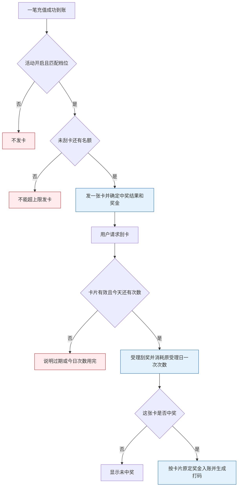

# 4.4 · 刮刮乐

## 1. 活动介绍

用户每成功充值一笔,如果金额和参与人群符合某个档位,就获得一张刮刮卡。用户刮开卡片后看到是否中奖;中奖时,彩金自动到账,并产生对应打码要求,不需要再次充值才能领。

运营可以为不同充值金额和人群设置中奖概率、奖金范围及打码倍数。用户可以持有多张未刮卡,但每天能刮的次数、同时能持有的未刮卡数量和卡片有效期都有配置限制。

这里定义后台配置、页内活动记录查询及玩家取得、使用卡片的业务规则,不规定刮奖动画、页面布局或组件样式。活动不单独做跨账号IP/设备去重或渠道字段;参与人群使用用户标签。异常充值、退款、封禁处置不在本次修订范围内。

后台使用简体中文,玩家可见名称和说明按运营语言填写。后台以1440px为参考、最小支持1280px,不做移动后台。每日次数按GMT−3业务日计算;显示时间需标明时区。

**需求依据**:本文合并了仓库中2026-09-02、标注KAN-215的卡片机制修订。2026-09-09核对时,Jira描述仍为旧版直接发奖,不能用它覆盖本文。卡片规则以本文及[模块决策D85](../README.md#7-决策清单)为实施依据。

## 2. 运营配置

### A1、A2 · 档位设置

支持1至30个配置组,下文称为档位。每档可以命名、调整顺序、启用或停用。采用“开启活动时至少有一个启用档位”的校验规则。

| 每档配置项 | 含义和填写规则 |
|---|---|
| 档位名称 | 便于运营识别,长度见A18 |
| 顺序 | 同时符合多个档位时,先判断排在前面的 |
| 启用开关 | 停用档位不用于新发卡,配置仍保留 |
| 充值金额下限、上限 | 这笔充值需要落在什么区间,按标准计价币种填写 |
| 用户标签 | 留空表示不限人群;选多个时满足任意一个即可 |
| 中奖概率 | 这张卡中奖的概率,不决定是否发卡 |
| 彩金最小、最大金额 | 中奖后奖金的范围,按奖励币种填写 |
| 打码倍数 | 中奖奖金到账后对应的打码要求 |

### A4、A6 · 金额范围和人群

充值区间包含下限、不包含上限。例如区间为10至20时,金额10符合,金额20不符合;这是区间示例,不是默认金额。下限不能小于0,上限必须大于下限,上限留空表示不封顶,金额支持两位小数。

判断的是本笔充值到账时的标准计价金额,不是用户当天累计充值,也不是充值原币的裸数值。多个标签满足任意一个即可,标签为空合法。保存时选中的标签必须存在且启用。

### A7、A8、A9 · 中奖和奖金

中奖概率为0至100的整数百分比。符合发卡条件且未超过持卡上限就会获得卡片;概率为0的卡仍会发出,但不会中奖,概率为100则必中奖。

中奖时在该档最小、最大金额之间均匀随机出奖金。最小金额不能小于0,最大金额必须大于0且不小于最小金额。金额按奖励币种精度向下保留,法币两位、加密货币八位。

打码倍数不小于0、最多两位小数。奖金到账后,对应打码量为“奖金金额×倍数”。中奖结果、奖金金额、奖励币种和倍数在发卡时确定,之后不重新抽奖或随配置改变。

### A10、A25、A26 · 三个不同的限制

| 配置 | 控制什么 | 不能混淆的地方 |
|---|---|---|
| 每用户每日刮奖次数 | 同一用户在业务日内最多刮几张 | 所有档位共用;发卡不占次数,未中奖的刮奖也占一次 |
| 每用户未刮卡总上限 | 同时最多持有多少张未刮卡 | 可以持有多张;过期卡不占上限 |
| 卡片有效期 | 卡片可以保留多久 | 过期后不能刮,也不占未刮卡上限 |

每日刮奖次数和未刮卡上限均为1至1000的整数,有效期为1至365的整数天,三项必填且无默认值。有效期从发卡时刻起按每24小时一天计算,到期时刻不可刮。持卡满额时本笔充值不发卡、不排队补卡。

### A16、A23 · 奖励币种

整个活动选择一个已开通的奖励币种,不逐档选择,也不跟随用户充值币种变化。所有彩金范围都按这个币种填写和入账。

充值区间使用标准计价币种,奖金使用奖励币种。两者可以不同,不做等值校验或自动换算。界面必须分别标明币种,避免误填。

修改奖励币种时,各档奖金数值保持原样,不会自动按汇率转换;保存前需再次确认并提示运营复核。新卡采用新配置,已发卡币种和金额不变。

### A18 · 名称、说明和保存

活动名称、档位名称必填,采用最多20字;活动说明采用最多1000字。说明应解释怎么获得卡、何时失效、刮奖限制与打码要求。

首次进入未配置的活动,显示空配置、关闭的活动开关,不预填业务金额。保存时完整校验币种、档位、金额、概率、倍数及标签;有错误就不保存,指出哪个字段需要修改。档位区间重叠时提醒运营排在前面的档位会优先匹配,但不因此禁止保存。

保存时同时校验每日刮奖次数、未刮卡上限和卡片有效期:三项必填,前两项为1至1000的整数,有效期为1至365的整数天,不自动补默认值。

## 3. 参与和领奖规则

### A3、A5 · 充值到账后获得卡片

每笔充值成功到账时,按当时生效的活动配置判断:

1. 活动是否开启。
2. 本笔标准计价金额和用户标签,是否符合某个启用档位。
3. 按顺序取第一个同时满足金额和人群条件的档位。
4. 检查未刮卡总上限,符合发卡条件时获得一张卡。

同一笔充值最多发一张卡。符合多个档位也不会叠加发卡;这张卡未中奖时,不会再使用后面的档位抽一次。同一笔充值消息重复到达,不能重复发卡。

未落入任何档位是不符合活动条件,不是系统故障。

### A11、A12 · 刮开时才结算

拿到卡片不代表彩金已经到账。用户主动刮开仍有效的卡片时,检查当天是否还有刮奖次数。

受理一次刮奖时,无论中奖与否都消耗原受理日一次次数,卡片即计为已使用并释放持卡名额,同一张卡不能重复使用。未中奖则显示未中奖;中奖则按发卡时确定的金额和币种自动发放彩金,同时产生打码要求,无需后续充值。奖金未到账时按第4部分保留原申请并核查恢复。

本页定义上述行为,不要求“只能在充值成功动画中展示”,也不恢复旧版登录弹窗规则。

### A10、A15 · 今天刮完了,仍可能继续拿卡

每日刮奖次数由所有档位共用,按GMT−3自然日计算。发卡不扣刮奖次数。

今天刮奖次数已用完,后续符合条件的充值仍可以得到卡片,直到未刮卡达到总上限。这些卡在之后的业务日仍有效、且当天有次数时可以刮。

达到持卡上限后,本笔充值不发卡、不排队补卡。之后空出位置,只有后续新的合格充值可获得卡片。

### A17、A21、A22 · 与其他活动和人群的关系

同一笔充值可以同时享受充值本身的额外赠送。充值赠送与刮刮乐中奖奖金分别入账、分别产生打码要求,互不抵扣。

首充、复充不增加专用字段;需要区分时,通过累计充值次数等用户标签配置不同档位。活动只负责本笔充值金额,其他人群条件由标签提供。

本版不增加活动专用渠道字段,也不增加跨账号IP或设备去重。已有渠道属性可通过用户标签表达,不把“没有专用字段”理解为全平台没有渠道能力。

蓝色表示发卡或刮奖的主要步骤,红色表示不能继续的分支。图展示正常业务顺序,结果未知或入账失败的处理见下文,不能通过重刮改变结果。

## 4. 特殊情况

### A13、A14 · 修改配置或关闭活动

保存后的配置影响后续充值。已发卡的中奖结果、金额、币种和倍数保持不变;修改配置不能让旧卡重新抽奖。

活动关闭后立即停止新发卡,已有有效卡仍可刮,已入账彩金和打码任务不收回。已发卡保留原期限;新的每日刮奖次数从下一业务日生效,当天已用次数不清零。新的持卡上限立即影响新发卡,不删除已有卡片;超过新上限时停止发卡,直到持卡量回落。

保存和充值同时发生时,以该笔充值到账时已生效的配置为依据,保留记录供查询。存在有效卡或未完成奖金申请期间禁止修改业务时区。

### A19、A20 · 封禁、退款和异常充值

这两项编号保留原主题,本期不规定封禁用户发卡/刮卡及充值退款后的追回规则。它们已被最新修订明确移出范围,不能继续使用旧稿“封禁不发”“退款一律不追回”作为本活动验收条件。

本活动不扩大或解除平台已有的账号和资金限制;本版不增加活动独有的封禁或退款处置。

### A24 · 标准计价金额缺失

没有本笔标准计价金额,就无法可靠判断充值档位。不能用原币金额直接代替,也不能阻塞充值本身正常入账。

记录该笔充值异常并告警,该笔不发卡、事后不补发。原币充值照常入账,后续新充值正常判断资格。

### 重复操作、并发和奖金处理失败

- 同一笔充值不能重复发卡,同一张卡不能重复刮或重复入账。
- 同时处理多笔充值不能超过未刮卡总上限;同时刮多张卡不能突破每日次数。
- 奖金结果未知时应显示处理中并保留原卡和资金记录,不能通过再次抽奖来重试。
- 刮奖受理时卡片即计为已使用,消耗原受理日一次刮奖次数并释放持卡名额。未中奖直接完成;中奖入账失败或未知时保留该次消耗,查询并恢复同一笔奖金申请,不重新抽奖、不再次计次。超过原卡有效期仍继续完成已受理申请。
- 标签被停用时,该档按不匹配处理并告警,继续检查后面的启用档位;保存时提示重新选择。奖励币种停用时停止新发卡并告警,不能自行换币。停用币种的已有卡暂停刮奖,恢复时按暂停时长延长有效期;已受理奖金保留原币种恢复入账。

### 需要清楚展示的状态

| 情况 | 需要展示什么 |
|---|---|
| 保存有误或无权限 | 错误字段或拒绝原因,不能部分保存 |
| 活动关闭或无启用档位 | 为什么不能新发卡,配置仍保留 |
| 不限人群或档位重叠 | 留空标签的含义,以及前序档位优先的提醒 |
| 标签或奖励币种失效 | 哪项已失效,需要运营处理 |
| 有未刮卡 | 可用卡片数量和各卡有效期 |
| 当日次数用完 | 今天不能继续刮,仍可能获得新卡 |
| 持卡已满 | 已达到未刮卡上限,不能继续增加卡片 |
| 卡片过期 | 已失效,不再可刮,不占持卡上限 |
| 已刮未中奖 | 本次未中奖,当天次数已使用 |
| 中奖处理未完成 | 奖金处理中,避免引导重复刮卡 |
| 中奖到账 | 原卡对应奖金、币种和打码要求 |

空、加载、错误和无权限沿用公共要求,不在本文规定组件布局。

## 5. 验收场景

R1至R4保留既有需求主题,R4覆盖充值发卡与后续刮奖结算。

| 需求编号 | 场景与操作 | 预期结果 |
|---|---|---|
| 4.4-R1 | 有权限进入配置页 | 显示当前运营商配置;从未配置时为空且活动关闭 |
| 4.4-R1 | 无权限或尝试读取其他运营商配置 | 拒绝,不得泄露配置 |
| 4.4-R2 | 填写完整配置,排序并保存 | 全部校验通过才保存,记录操作者和时间 |
| 4.4-R2 | 金额区间错误、概率越界、标签失效或币种未选 | 拒绝并指出字段;重叠区间仅提醒,不因此拒绝 |
| 4.4-R2 | 刮奖次数、持卡上限或有效期未填、为小数或超出范围 | 拒绝保存;次数和持卡上限须为1至1000的整数,有效期须为1至365的整数天,不代填默认值 |
| 4.4-R2 | 修改奖励币种 | 数值不自动换算,保存前确认;新卡用新币种,旧卡保留原币种 |
| 4.4-R4 | 持卡达到上限后充值,之后刮掉一张 | 原充值不补卡;只有后续新合格充值可再发卡 |
| 4.4-R4 | 关闭活动或降低持卡上限时已有有效卡 | 旧卡仍可按原期限刮,不删除旧卡;新发卡受开关及新上限限制 |
| 4.4-R4 | 中奖入账超时,卡片随后过期 | 原申请继续核查并完成,不重新抽奖、不重复计次 |
| 4.4-R3 | 无启用档位时打开活动 | 按至少启用一档校验,拒绝开启 |
| 4.4-R3 | 关闭活动后发生新充值 | 不再新发卡;已有有效卡仍可按原期限刮,已入账彩金和打码不收回 |
| 4.4-R4 | 一笔充值同时符合多个档位 | 只按第一个匹配档位发一张卡,发卡时不增加余额 |
| 4.4-R4 | 概率为0的档位匹配且持卡未满 | 仍发卡;刮后未中奖且消耗一次次数,不尝试下一档 |
| 4.4-R4 | 不同充值币种换算后落在同一档位 | 使用同一奖金范围和活动奖励币种 |
| 4.4-R4 | 当日次数已满但持卡未满,再次合格充值 | 可继续拿卡,当天不能继续刮 |
| 4.4-R4 | 持卡只剩一个名额时两笔合格充值同时处理 | 最多发一张卡;因满额未发卡的充值不排队、之后也不补卡 |
| 4.4-R4 | 每日只剩一次时同时刮两张卡 | 最多完成一次刮奖,中奖与否都只扣该次 |
| 4.4-R4 | 同一充值重复通知、同一卡重复刮 | 不重复发卡、计次或发奖 |
| 4.4-R4 | 刮开中奖卡 | 按发卡时奖金与倍数结算,无需再次充值;改配置不重抽 |
| 4.4-R4 | 卡片到达发卡时刻加有效期的期限 | 有效期按每24小时一天计算;到期时刻不可刮,不占持卡上限 |
| 4.4-R4 | 没有匹配档位或标准计价缺失 | 前者正常不发卡;后者记录异常并告警,不阻塞充值,该笔不发卡且事后不补发 |
| 4.4-R4 | 中奖入账失败或资金结果未知 | 保留原受理日已消耗的次数和已使用卡片;核查恢复同一笔奖金申请,过期后仍继续处理,不重抽、不重复发钱或计次 |
| 4.4-R5 | 在本页打开活动记录,核查发卡及刮奖结果 | 能查充值依据、卡片状态、锁定奖励、刮奖次数及资金结果;失败和结果未知仍可追溯;无查看权限或超出账号数据范围的查询被拒绝 |

## 6. 相关资料

**入口**:活动管理 → 活动配置 → 充值活动配置 → 刮刮乐。

| 操作 | 权限码 |
|---|---|
| 查看配置与活动记录 | `activity:scratch-card:view` |
| 保存配置及档位增删排序 | `activity:scratch-card:edit` |
| 启停活动 | `activity:scratch-card:switch` |

服务端须再次检查权限和配置,不能只靠界面隐藏按钮。发卡、抽奖、计数及发奖资格由服务端判断,不接受玩家指定奖金。

**数据与责任**:M4拥有配置、匹配依据、卡片、发卡时确定的奖励、刮奖次数与结果记录。M5提供充值到账事实、原币和标准计价金额、奖金入账及打码结果;M2提供用户标签。活动不自行换算汇率,不直接修改钱包,财务不根据后续活动配置重算已受理奖金。没有本活动直接对接的外部支付机构。

**记录查询**:本页内提供“活动记录”区,与活动配置一起交付并验收。必须能查清用户、原充值、匹配档位、发卡时间、有效期、卡片状态、锁定的奖金币种金额与倍数、刮奖时间、当日次数、未中奖或中奖结果及关联资金记录。失败和结果未知也要可追溯,不能只保留成功入账记录。记录区只读查询,服务端按查看权限、运营商及账号数据范围隔离结果。

共用规则见[资金模型](../../M2-用户管理/2.1-用户列表/资金模型.md)、[标准计价](../../M2-用户管理/2.1-用户列表/标准计价.md)、[用户标签](../../M2-用户管理/2.5-用户标签/README.md)及[公共能力与复用边界](../公共能力与复用边界.md)。[竞品实测](竞品实测.md)仅作历史研究依据,不能覆盖我方卡片规则。

**Jira**:[KAN-215](https://bingobox.atlassian.net/browse/KAN-215)。该票标题和描述仍是旧机制,与本文的差异已列入D85;开发进度只在Jira维护,本文不复制状态。
