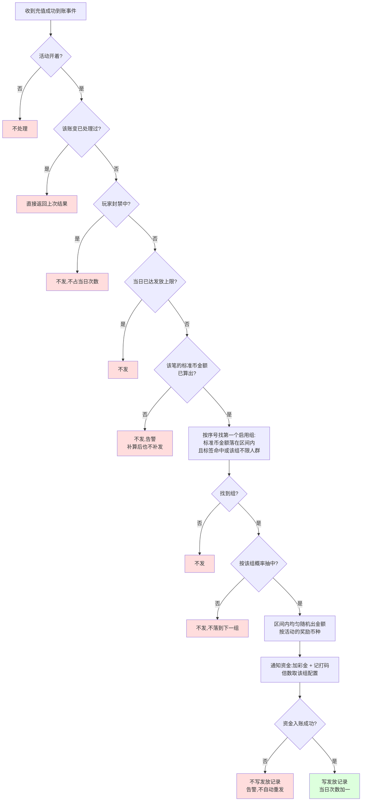
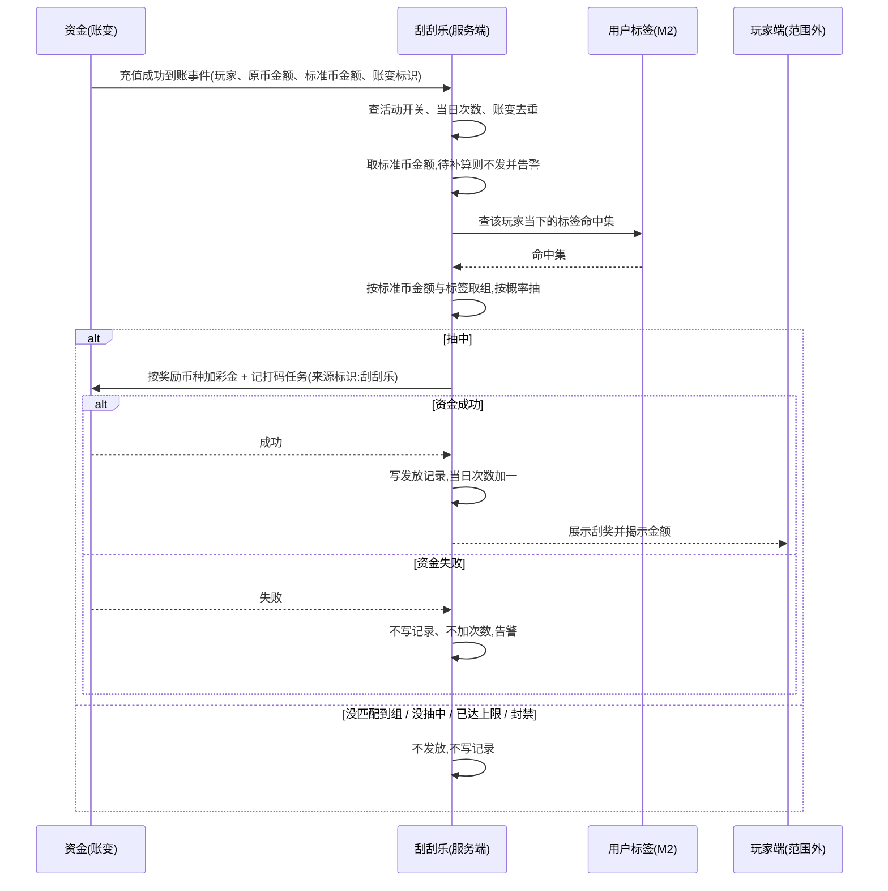

# 4.4 · 刮刮乐

> **KAN-215 修订（2026-09-02，优先级高于本文其余旧版描述）**
>
> 本期改为“充值到账即发卡、刮开即结算”：每笔成功充值按标准计价金额命中第一个启用档位，立即获得 1 张卡；档位为左闭右开区间，可配置 1～30 个并排序，标签为空表示全体，配置多个标签时命中任意一个即可。中奖结果、彩金金额、币种及打码倍数在发卡时锁定，玩家完成刮奖时无论中奖与否均消耗当日 1 次；中奖彩金自动进入彩金余额并生成打码任务，不再需要后续充值领取。
>
> 所有档位共享“每用户每日刮奖次数”，按运营业务日（GMT−3）计算。未刮卡可同时存在多张，后台配置每用户未刮卡总上限和卡片有效期；过期卡不占上限。达到每日刮奖上限后仍可继续获得卡片（直到未刮卡上限），但当天不能继续刮。发卡本身不消耗刮奖次数。异常充值、退款、封禁等规则不在本期范围。
>
> 因此，本文下方旧版的“次日标签批量判定、最多一张未领取卡、刮后再充值领取、永久有效”等流程与字段均已废止，仅保留作历史设计记录。

## 1. 背景与目标

**目标**:让运营自己定"充多少起算、什么人参与、多大概率中、能刮出多少、领了要玩够几倍才能提",
玩家每充一笔钱,只要落在规则里就当场刮出一笔彩金直接到账,充完就知道自己多拿了多少。

**谁在用**

| 角色 | 用来做什么 | 没有会怎样 |
|---|---|---|
| 运营 | 定充值门槛与档位、选人群、定彩金区间和中奖概率、定打码倍数、开关活动 | 想在充值这一刻给玩家一个惊喜、把小额充值往上抬,只能找程序员写死一版 |
| 玩家 | 充值成功后当场刮开,看到多拿了多少,钱已经在账上(在玩家端) | 充值就是充值,没有任何即时反馈,小额和大额体验一样 |
| 财务 / 风控 | 看每天发了多少笔、发了多少钱、哪一档哪群人在拿 | 发出去的钱说不清是哪条规则给的,超支了也不知道调哪一格 |

**业务价值**:把彩金压在"充值成功"这一刻发,链路上只有一个环节,不依赖玩家第二天回不回来;
按充值档位给不同区间,能把玩家从小额往大额档推;按人群分层给不同区间,新玩家给得厚、
老玩家给得薄,同样的预算花在更需要的人身上;彩金要玩够量才能提,成本可控;每一笔发放逐笔留痕。

**不做什么**

- **不做玩家端的刮奖动画和充值页展示** —— 这里只是后台,玩家看到的另外做;本页只定什么时候展示、展示什么
- **不做加钱和打码本身** —— 这里只定规则和触发,真正加钱、记打码由资金那边管
- **不做人群怎么算** —— "注册几天、累计充了多少、充了几次、几个设备登录"全部是用户标签的事,本页只选标签
- **不做发放记录页** —— 谁在什么时候拿了多少在「刮刮乐活动记录」里看,本页只放入口
- **不做卡、不做未领取、不做有效期** —— 判定通过就直接入账,不存在"发一张卡等玩家来刮"的中间态
- **不做跨账号去重** —— "同一 IP、同一设备只发一份"首版不做,以后要做走用户标签补指标,活动侧不加逻辑
- **不做参与渠道定向** —— 首版全渠道同一套规则
- **不做活动周期、冷却天数** —— 刮刮乐是常驻活动,只靠活动开关控制

**适用范围**

| 维度 | 取值 |
|---|---|
| 终端 | 电脑后台,按 1440px 宽设计 |
| 响应式 | 最小支持 1280px;不做手机版 |
| 界面语言 | 后台用简体中文;活动名称和玩家可见文案按运营语言填(线上为葡语) |
| 时区 | "每日发放次数"的自然日按业务时区切;界面展示时间按运营所在时区(GMT−3)并标注 |
| 货币 | 两套口径,互不换算:**充值档位按平台标准计价币种判定**,与用户标签里的金额同一把尺子;**彩金区间与入账按活动自己选的奖励币种**。一个运营商一套配置 |

## 2. 入口

- 菜单:活动管理 → 活动配置 → 充值活动配置 → 刮刮乐(路由为拟定,待前端确认)
- 页内:右侧悬浮「保存」;「活动说明」卡片展开功能说明
- 跳入:首版仅从菜单进入

## 3. 术语

> 通用词(打码倍数、随机奖励)见 `../README.md` 第 2 段;彩金、打码任务、有效投注
> 见 `../../M2-用户管理/2.1-用户列表/资金模型.md`;标签、命中、重算见
> `../../M2-用户管理/2.5-用户标签/README.md` 第 3 段,这里不重复讲。
> 本页所有"竞品实测"依据的原始数据见同目录 `竞品实测.md`。

| 术语 | 定义 |
|---|---|
| 发放 | 一次刮刮乐的完整结果:抽中、随机出金额、以彩金入账并记打码。没有中间态,一步完成 |
| 配置组 | 一条规则:充多少、什么人、彩金在什么区间、多大概率中、打码几倍。活动里最多三十组,按序号定先后 |
| 充值金额区间 | 这一笔充值本身的金额范围,是配置组的匹配条件之一,按平台标准计价币种填与判。注意不是"昨日充了多少"那种历史累计,那是标签的事 |
| 奖励币种 | 这个活动发出去的彩金用哪个币种记账和入账。整个活动一个,不逐组配 |
| 触发概率 | 匹配上某组的每一笔充值,有多大比例真的发出彩金;100% 就是笔笔都发 |
| 每日发放上限 | 同一玩家同一自然日最多能拿到几次刮刮乐,与他当天充了几笔无关 |

## 4. 关键参数与假设

<!-- 所有阈值只在这里写一遍;数字本身在配置页填,这里只说有哪些、什么意思、在哪填。
     "竞品实测"依据的原始数据、样本量与口径见同目录 竞品实测.md,不在正文重复数值。 -->

| 编号 | 参数 | 取值 | 依据 | 在哪配 |
|---|---|---|---|---|
| A1 | 配置组数量 | 1 ~ 30 组;活动开关打开时至少一组启用,否则开不了 | 上限 30 由竞品实测的配置规模反推(`竞品实测.md` 第 5、6、7 段:约六个充值档 × 三个人群层 × 首充复充两套,合计二十余组);"至少一组"是**假设** | 本页 |
| A2 | 配置组的构成 | 每组:充值金额区间、用户标签(可留空)、彩金最小 / 最大金额、触发概率、打码倍数、组开关、序号、分组名 | 已定(2026-09-01,D52 / D53) | 本页 |
| A3 | 触发时机 | 每一笔充值**成功到账**时当场判定并发放,同步完成;不设定时任务,不跨日,不看历史充值 | 竞品实测(`竞品实测.md` 第 3 段):五万余笔隔离样本全部落在到账时刻 ±60 秒内,无跨日、无人工介入 | 写死 |
| A4 | 充值金额区间 | 左闭右开;最大留空表示不封顶;**按平台标准计价币种填**(币种本身见 `标准计价.md` S1,本页不复述),两位小数;判定时拿这笔充值在入账时刻的标准币金额去比,不用原币金额。低于所有组下限的充值不发 | 已定(2026-09-01,D55):与 2.5 标签的金额口径统一(2.5-A9),标准计价币种见 `标准计价.md` S1、取哪一刻汇率见 S3;竞品实测(第 4、5 段)只证实"存在硬性最低门槛、不同档位待遇不同",币种口径是我方选择 | 本页 |
| A5 | 命中与取组 | 按序号从小到大,取第一个「该笔充值的**标准币金额**落在区间内**且**标签命中」的启用组;没抽中不落到下一组;一笔充值最多发一次 | 已定(2026-09-01,D52);序号优先与 D44 / D48 同口径 | 写死 |
| A6 | 用户标签 | 多选取并集(满足其一即命中);**留空表示该组不限人群**,只按充值金额匹配 | 已定(2026-09-01,D53):人群仍全部用标签表达,只有"这一笔充多少"回到活动侧 | 本页 |
| A7 | 触发概率 | 0 ~ 100 的整数百分比;匹配到该组的每一笔充值各自独立抽一次,抽中才发;100 笔笔发,0 等于不发 | 竞品实测(第 11 段)证实确有概率配置(同格内稳定在 69% ~ 98%);**具体取值不可分离**,不作推荐值 | 本页 |
| A8 | 彩金金额 | 在该组的最小 ~ 最大之间均匀随机,向下保留;**按活动配的奖励币种(A23)**,小数位随该币种:法币 2 位、加密货币 8 位 | 竞品实测(第 9 段):同一档位彩金区间恒定、区间内分布平坦、五个月零漂移;进位方向为**假设**,沿用 4.2-A11;小数位沿用 `../../00-公共约定/README.md` 第三节 | 本页 |
| A9 | 打码倍数 | 两位小数,≥ 0;发到的钱要玩够"金额 × 倍数"的流水才能提;按发放那一刻的组配置算,发放后改配置不影响已发的 | 已定(2026-09-01,D52 沿用原 D49 的快照口径);**竞品不可观测**(`竞品实测.md` 第 13 段) | 本页 |
| A10 | 每日发放上限 | 同一玩家同一自然日最多 N 次,达上限后当日不再发,与他当天充了几笔无关;N 为正整数 | 竞品实测(第 8 段):存在硬性日上限,当日充值笔数再多也不突破;默认取值见 D54 | 本页 |
| A11 | 入账时机 | 判定通过即以彩金入账并同时生成打码任务,一步完成;**不设未领取态、不设有效期、不设过期作废** | 已定(2026-09-01,D52);竞品实测(第 3 段)证实发放与到账同刻,无等待领取的环节 | 写死 |
| A12 | 玩家端表现 | 充值成功页展示刮奖动画揭示金额;动画只是揭示,不刮也已经到账;不做登录弹窗 | 已定(2026-09-01,D52);**竞品不可观测**,本项为我方选择 | 写死 |
| A13 | 改配置什么时候生效 | 活动开关、活动说明、配置组的任何改动都**保存即生效**,下一笔到账按新配置判定;已发放的不受影响 | 已定(2026-09-01,D52):没有卡就没有"生成时快照"的问题,无需延后到下一周期 | 写死 |
| A14 | 关闭活动 | 关掉后立刻停止发放;已发放的彩金和打码任务不收回、不作废 | 已定(2026-09-01,D52) | 本页 |
| A15 | 时区口径 | 每日发放上限的自然日按业务时区(2.5-A13);界面展示按运营时区 | 沿用 2.5 | 系统配置 |
| A16 | 币种口径 | **入口侧统一、出口侧可选**:充值区间与标签金额同为标准计价币种(A4、2.5-A9);彩金区间与入账为奖励币种(A23)。两者**不做等值校验、不互相换算** —— 充 10 USD 发 8 BRL 是合法配置,合不合算由运营自己判断 | 已定(2026-09-01,D55) | 写死 |
| A17 | 与其他充值赠送叠加 | 这一笔充值同时享受它本身的充值额外赠送;两笔彩金各自入账、各自记打码,互不影响 | 已定(业务原文:可叠加享受) | 写死 |
| A18 | 名称长度 | 活动名称最多 20 字;分组名最多 20 字 | **假设**,同 4.2-A18 | 本页 |
| A19 | 封禁玩家 | 判定时排除封禁中的玩家,不发放也不占用当日次数 | **未验证假设** | 写死 |
| A20 | 充值退款 | 发放以"充值成功到账"为准,之后该笔充值退款或冲正不追回已入账的彩金 | **未验证假设**,待与资金模型的冲回口径对齐 | 写死 |
| A21 | 首充与复充 | 不设专门字段;"这是不是他第一笔充值"用「累计充值次数」标签表达,配成独立的组 | 已定(2026-09-01,D53);竞品实测(第 7 段)证实首充与复充确实是两套不同的门槛与区间 | 本页 |
| A22 | 跨账号去重与参与渠道 | **首版都不做**。单玩家能表达的(登录 IP 数、设备数)由标签承担;渠道定向竞品实测(第 10 段)显示全渠道无差异,不做 | 已定(沿用 D50,并由竞品实测补充支持) | 写死 |
| A23 | 奖励币种 | 活动级一个,必填;彩金区间按它填、彩金按它入账、打码义务按它在原币种内计算。**不逐组配、不跟随充值币种** | 已定(2026-09-01,D55):彩金区间的数值只有在币种确定时才有意义,逐组配或跟随充值币种都会让同一组的区间在不同币种下含义不同 | 本页 |
| A24 | 标准币金额尚未算出 | 该笔充值的标准币金额处于待补算(`标准计价.md` 第 2 段)时,**本次不发放**;不阻塞充值本身入账,事后补算完也**不补发** | 已定(2026-09-01,D55):与 2.5 对待补算指标"判否"同口径;补发会破坏"充值那一刻当场刮"的语义,也无法与玩家端的展示对齐。发生即告警,见第 9 段 E14 | 写死 |

> **与 D46 的差异**:原设计要求"活动侧零筛选逻辑,人群一律用标签表达"。改为即时发放后,
> 「这一笔充了多少」标签表达不了 —— 2.5 的充值金额指标只有今日 / 昨日 / 最近 N 天 / 累计
> 四种时间范围,没有"当前这一笔"。所以充值金额区间回到活动侧(A4、D53),
> **其余人群条件仍然全部走标签**(A6、A21)。

> **两处币种为什么不一样**:充值区间是**判定条件**,和标签里的金额是同一类东西 ——
> 运营在同一个面板上一边填"充 10 ~ 20"、一边选"累计充值 ≥ 100"的标签,两个数必须能对上,
> 所以统一走标准计价(A4)。彩金区间是**要发出去的钱**,钱得落进玩家的某个币种钱包,
> 换算结果按 `标准计价.md` 是不可入账的派生视图,所以必须指定一个真实币种(A23)。
> 判定用尺子、入账用真钱,是两件事,不做等值校验(A16)。

## 5. 字段清单

本页是配置页,没有筛选和表格;字段按配置区分组列出。首版为新建功能,无线上截图。

**基础设置**

| 字段 | 类型 | 可输入数据与校验 |
|---|---|---|
| 活动开关 | switch | 开 / 关;开时至少一组启用(A1);关了立刻停发(A14) |
| 活动名称 | text | 必填,≤ 20 字(A18) |
| 奖励币种 | select | 必填,单选,从平台已开通的币种里选;整个活动一个(A23)。已有配置组时改动它需二次确认,见第 10 段 |
| 每日发放上限次数 | number | 必填,正整数(A10) |
| 活动说明 | textarea | ≤ 1000 字;玩家可见的规则:怎么拿、打码要求、最终解释权 |

**配置组**(可增删,最多 30 组,可上移下移;每组一个折叠面板)

| 字段 | 类型 | 可输入数据与校验 |
|---|---|---|
| 序号 | 只读 | 由面板顺序自动得出,即优先级(A5) |
| 分组名 | text | 必填,≤ 20 字(A18) |
| 充值金额下限 | number | 必填,两位小数 ≥ 0,**显式标注标准计价币种**(A4) |
| 充值金额上限 | number | 两位小数 > 下限;留空表示不封顶;同上标注币种(A4) |
| 用户标签 | 多选 | 从 2.5 拉;可留空表示不限人群;多选取并集(A6) |
| 彩金最小金额 | number | 必填 ≥ 0,**显式标注奖励币种**,小数位随该币种(A8、A23) |
| 彩金最大金额 | number | 必填 ≥ 最小金额,且 > 0;同上标注币种(A8、A23) |
| 触发概率 | number | 0 ~ 100 的整数(A7) |
| 打码倍数 | number | 必填,两位小数 ≥ 0(A9) |
| 组开关 | switch | 关了这组不参与判定,配置保留(A13) |

**原始需求表里有、本设计不做的项**(不要补回来)

| 原始项 | 处理 |
|---|---|
| 发放时间「日次(0:00-24:00)」 | 改为每笔充值到账即时发放(A3),不设字段 |
| 充值计算日期 / 前端充值页面档位 | 即时发放只看当前这一笔,不看历史充值日期;档位由配置组的充值金额区间承担(A4) |
| 符合条件「同注册 IP / 同设备码 / 同登录 IP = 1」 | 单玩家能表达的(登录 IP 数、设备数)归标签;跨账号去重首版不做(A22) |
| 参与渠道 | 首版不做;竞品实测第 10 段显示全渠道无差异(A22) |
| 有效期(天) | 即时入账,没有未领取的卡,有效期无处可用(A11) |
| 添加 / 删除 | 是配置组的行操作,不是字段 |

## 6. 需求清单

| ID | 需求 | 触发条件 | 验收标准 | 权限码 |
|---|---|---|---|---|
| 4.4-R1 | 加载配置 | 进页面 | 显示当前运营商的全部配置;从没配过时各项为空、开关为关、没有配置组 | `activity:scratch-card:view` |
| 4.4-R2 | 保存配置 | 点「保存」 | 按 A1、A2、A4、A7、A9、A10、A18、A23 检查,全部通过才存;哪儿错了指到那一组 | `activity:scratch-card:edit` |
| 4.4-R3 | 活动开关 | 切换开关并保存 | 开时至少一组启用;关了立刻停止发放,已发放的不受影响(A14) | `activity:scratch-card:switch` |
| 4.4-R4 | 充值到账即时发放 | 一笔充值成功到账(资金那边的账变事件) | 按序号取第一个匹配组,查当日上限与封禁,按概率抽,抽中则区间内随机金额、以彩金入账并记打码、写发放记录;同一账变只处理一次 | 无(服务端自动) |

## 7. 需求详述

### 4.4-R2 · 保存配置

**触发条件**:有权限的运营改完任意一项,点右侧「保存」。

**可输入数据**:第 5 段全部字段。

**功能范围**

| 归属 | 做什么 |
|---|---|
| 界面 | 填表时当场提示:名称超长、奖励币种未选、彩金最小大于最大、充值上限不大于下限、概率超出 0 ~ 100、每日上限非正整数;错在哪一组就在哪一组标红;充值区间与前面某组完全重叠时给出提醒(不拦);改奖励币种时二次确认并说明各组彩金区间的数值不会跟着换算 |
| 服务端 | 把 A1、A2、A4、A7、A9、A10、A18、A23 全部再查一遍;查权限;查标签存在且启用;通过才整份存下;记下谁改的、什么时候改的 |

**处理逻辑**

1. 查基础项:名称长度(A18);奖励币种必填且为平台已开通的币种(A23);每日发放上限为正整数(A10)。
2. 查配置组:数量 1 ~ 30;每组分组名必填、充值下限 ≥ 0、上限留空或大于下限、彩金最小 ≤ 最大且最大 > 0、概率为 0 ~ 100 整数、倍数 ≥ 0(A2、A4、A7、A9)。充值金额按标准计价币种的精度校验,彩金金额按奖励币种的精度校验(A4、A8)。
3. 查标签:选了标签的组,标签须在 2.5 里存在且启用;留空视为不限人群,合法(A6)。
4. 查开关:活动开关为开时至少一组组开关为开(A1)。
5. 全部通过才存;存完立即生效(A13);刷新页面显示。

**错误处理**

| 错误状况 | 提示 |
|---|---|
| 配置组为空或超过 30 组 | 至少配置 1 个、最多 30 个配置组 |
| 没选奖励币种 | 请选择奖励币种 |
| 奖励币种已在平台停用 | 奖励币种「X」已停用,请重新选择 |
| 金额小数位超出币种精度 | 分组「X」金额小数位超出该币种精度(充值按标准计价币种、彩金按奖励币种) |
| 标签已被停用或删除 | 分组「X」引用的标签已失效,请重新选择 |
| 充值上限不大于下限 | 分组「X」充值金额上限必须大于下限,或留空表示不封顶 |
| 彩金最小金额大于最大金额 | 分组「X」彩金最小金额不能大于最大金额 |
| 彩金最大金额为 0 | 分组「X」彩金最大金额必须大于 0 |
| 概率超出范围 | 分组「X」触发概率须为 0 ~ 100 的整数 |
| 每日发放上限非正整数 | 每日发放上限须为大于 0 的整数 |
| 开关打开但没有启用的组 | 至少启用一个配置组才能开启活动 |
| 没有权限 | 没有操作权限(服务端也会拦,不靠藏按钮) |

**测试案例**

- 正向:奖励币种选 BRL,六组,充值区间(标准计价)分别为 3 ~ 4、4 ~ 6、6 以上各配「注册 0 ~ 6 天」与「注册 7 天以上」两个标签组,彩金区间与概率各不相同,每日上限 10 → 保存成功,重进页面数据一致,充值栏显示标准计价币种、彩金栏显示 BRL。
- 正向:某组不选标签、只填充值区间 3 ~ 4 → 保存成功,该组对所有人生效。
- 正向:奖励币种从 BRL 改为 USDT 并确认 → 保存成功,各组彩金区间的**数值原样保留、不换算**,只是币种标注变了。
- 逆向:第 2 组彩金最小 15、最大 10 → 界面和服务端都拦,指到第 2 组。
- 逆向:第 3 组充值下限 30、上限 30 → 拦下,提示上限必须大于下限。
- 逆向:不选奖励币种直接保存 → 拦下,提示请选择奖励币种。
- 逆向:活动开关打开,所有组开关全关 → 拦下。
- 逆向:某组引用的标签在 2.5 被停用后再保存 → 拦下,提示重新选择。

### 4.4-R4 · 充值到账即时发放

**触发条件**:该玩家一笔充值成功到账(资金那边的账变事件)。只在活动开关为开时处理。

**可输入数据**:到账事件带的玩家、原币金额、**该笔的标准币金额**与账变标识;各启用配置组的规则;活动的奖励币种;该玩家当下的标签命中集、当日已发放次数、封禁状态。没有人工输入。

**功能范围**

| 归属 | 做什么 |
|---|---|
| 界面(玩家端,本仓库范围外) | 充值成功页展示刮奖动画并揭示金额,金额带奖励币种符号(A12、A23) |
| 服务端 | 判活动开关、封禁、当日上限;取该笔的标准币金额,取不到就不发(A24);按序号取第一个匹配组;按概率抽;抽中则在区间内按奖励币种随机金额,通知资金加彩金并按该组倍数记打码,带"刮刮乐"来源标识;成功后写发放记录;同一账变只处理一次 |

**处理逻辑**

红色为不发放分支;绿色为发放成功,是唯一的写入动作。

1. 前置:活动开关为开(A14);同一账变事件重复送达只处理一次,返回上次结果。
2. 排除:封禁中的玩家不发,也不占用当日次数(A19);当日已达发放上限的不发(A10)。
3. 取金额:取该笔充值在入账时刻的标准币金额(A4)。处于待补算时不发、告警、事后不补发(A24)。
4. 取组:按序号从小到大遍历组开关为开的组,取第一个满足「标准币金额落在该组区间内」且「该组标签命中,或该组没选标签」的组(A4、A5、A6)。都不满足就不发。
5. 抽签:按该组概率独立抽一次(A7);没抽中就不发,**不落到下一组**(A5)。
6. 发放:在该组彩金区间内均匀随机出金额,币种为活动配的奖励币种(A8、A23),通知资金按该币种该金额加彩金、按该组倍数在同一币种内记打码任务(A9),带"刮刮乐"来源标识。
7. 落账:资金入账成功后写发放记录(玩家、账变标识、命中的组、充值原币金额与币种、判定用的标准币金额、彩金金额与奖励币种、打码倍数、时间),当日次数加一。入账失败不写记录、不加次数、不自动重发,告警。
8. 这笔充值本身的充值额外赠送照常走,与本活动互不影响(A17)。

**错误处理**

| 错误状况 | 提示 |
|---|---|
| 加钱失败 | 不写发放记录、不占当日次数;告警,不自动重发;玩家端不展示刮奖 |
| 玩家封禁中 | 不发放,不占当日次数(A19) |
| 某组引用的标签已停用 | 该组按不命中处理并告警,继续看下一组;不静默当作命中 |
| 该笔的标准币金额待补算 | 不发放、不占当日次数;告警"刮刮乐跳过:该笔充值尚无标准币金额";补算完不补发(A24) |
| 奖励币种在配置保存后被平台停用 | 停止发放并告警,不擅自换币种;运营改配置后恢复 |
| 到账事件缺金额或玩家标识 | 不处理,记异常日志告警 |

**测试案例**

- 正向:奖励币种 BRL,玩家注册第 3 天,充一笔折合标准计价 3.5 的钱,匹配「充值 3 ~ 4 × 注册 0 ~ 6 天」组,概率 100、彩金区间 16 ~ 18、倍数 10 → 到账当场发放,彩金落在 16 ~ 18 BRL 之间,打码要求为该金额的 10 倍(在 BRL 内计);充值本身的赠送另算。
- 正向:两个玩家分别用 BRL 和 USDT 充值,折合标准计价后都是 3.5 → 匹配同一组,拿到同样区间的彩金,且都以 BRL 入账。
- 正向:玩家同时匹配第 1 组和第 3 组 → 只按第 1 组发,金额区间是第 1 组的。
- 正向:某组概率 30%,一天内匹配到该组的充值 1000 笔 → 发放数在 300 附近,每笔互不影响。
- 正向:玩家当日第 11 笔合格充值,上限配 10 → 前 10 笔正常参与判定,第 11 笔不发。
- 逆向:玩家充的钱折合标准计价 2.5,所有组的充值下限都是 3 → 不发,不写记录。
- 逆向:汇率服务不可用,该笔充值原币已入账但标准币金额待补算 → 充值正常到账,刮刮乐不发并告警;半小时后补算完成,仍不补发。
- 逆向:同一笔到账事件送了两次 → 只发一次,第二次返回上次结果。
- 逆向:玩家匹配上组但没抽中 → 不发,且不再拿去和后面的组比。
- 逆向:资金加钱失败 → 不写发放记录,当日次数不变,运营收到告警。
- 逆向:封禁中的玩家充值到账 → 不发,当日次数不变。

## 8. 数据流向与系统串接

**数据流向**:运营填表 → 服务端整份校验后存成配置 → 玩家充值到账时按配置当场判定 →
抽中则通知资金加彩金记打码 → 写发放记录 → 本页读出配置显示,4.5 读出发放记录显示。

**系统串接**:

- 钱包和账变、打码任务(归资金):加彩金和记打码都走资金那边,带"刮刮乐"来源标识;这里只触发,不自己改余额。资金域不反向依赖本活动。
- 充值到账事件(归资金):发放的唯一触发源;本页不轮询充值记录。事件须带该笔的标准币金额(判定用)与原币金额及币种(留痕用);取不到标准币金额的处理见 A24。
- 标准计价换算(归资金,规则见 `../../M2-用户管理/2.1-用户列表/标准计价.md`):本页只读用,不自己算汇率、不自己换算;换算结果只用于**匹配充值档位**,不参与任何入账与打码计算。
- 用户标签(归 M2,2.5):配置组绑定的标签,按到账那一刻的命中集判断;不依赖当天的全量重算是否完成 —— 命中集读的是当下值,重算未跑完只是值旧一点,不阻塞发放。
- 封禁状态(归 M2):判定时查。
- 玩家端(本仓库范围外):充值成功页的刮奖展示;本页只定时机与内容。
- **除了平台自己的钱包 / 账变 / 标签 / 封禁数据,没有别的外部系统。**

## 9. 异常与边界

| # | 场景 | 触发条件 | 预期处理 |
|---|---|---|---|
| E1 | 越权 | 没权限的账号改配置 / 切开关 | 服务端拦下,不靠藏按钮 |
| E2 | 重复事件 | 同一账变事件重复送达 | 只发一次,第二次返回上次结果(4.4-R4 第 1 步) |
| E3 | 并发到账 | 同一玩家两笔充值几乎同时到账 | 各自独立判定,但当日次数按序扣减,合计不超过上限(A10) |
| E4 | 卡在上限边界 | 当日次数还剩 1,两笔到账同时抽中 | 只有一笔真正发放,另一笔按已达上限不发 |
| E5 | 金额不落在任何组 | 该笔的标准币金额低于所有组下限,或落在配置的空隙里 | 不发放、不写记录、不告警 —— 这是正常结果,不是异常 |
| E6 | 区间重叠 | 两组充值区间有交集且标签也重合 | 按序号取第一个(A5);保存时提醒运营,不拦 |
| E7 | 标签停用 / 删除 | 配置组引用的标签在 2.5 被停用;删除按 2.5-A6 会被拒绝 | 该组按不命中处理并告警,继续看下一组;保存时提示重新选择 |
| E8 | 封禁玩家充值 | 封禁中的玩家有一笔充值到账 | 不发放,不占用当日次数(A19) |
| E9 | 加钱失败 | 资金那边入账没成功 | 不写发放记录、不加次数;告警;不自动重发 —— 重发会让同一笔充值发两次 |
| E10 | 改配置的瞬间有到账 | 运营保存的同时有充值到账 | 以到账那一刻已生效的配置为准;已发放的不因后续改配置而变(A13) |
| E11 | 关活动后到账 | 活动关闭后玩家充值到账 | 不发放;已发放的彩金和打码任务不收回(A14) |
| E12 | 发放后退款 | 触发发放的那笔充值之后被退款或冲正 | 不追回彩金(A20) |
| E13 | 业务时区变更 | 2.5-A13 的业务时区被改 | 每日次数的自然日随之切;已计数的不重算 |
| E14 | 标准币金额待补算 | 汇率取不到,该笔充值原币已入账但标准币金额尚未算出 | 充值照常到账(标准计价 S7),刮刮乐本次不发、不占次数、告警;补算完成后**不补发**(A24) |
| E15 | 汇率波动跨档 | 同样金额的原币充值,因汇率变动落进了不同的充值档 | 按到账那一刻的标准币金额判定,不追溯、不补偿 —— 与 2.5 标签的金额条件同一口径 |
| E16 | 奖励币种被停用 | 平台停用了活动正在用的奖励币种 | 停止发放并告警,不擅自换币种或按汇率折算;已发放的不受影响 |
| E17 | 改奖励币种 | 运营把奖励币种从 A 改成 B 并保存 | 各组彩金区间的**数值原样保留,不换算**;保存前二次确认;改后立即按 B 发放(A13) |

## 10. 状态清单

| 状态 | 表现 |
|---|---|
| 错误 | 保存失败在页面顶部报错并把错误组标红,能改了再存;不整页崩 |
| 已关闭 | 活动开关关着时,页面顶部标「已关闭」,配置仍可改 |
| 无启用组 | 所有组开关都关时,活动开关不可打开并提示原因 |
| 组已停用 | 组开关关着的组面板灰显折叠,配置保留可再启用 |
| 组不限人群 | 没选标签的组,面板上标「不限人群」,提醒运营这一组对所有人生效 |
| 区间重叠 | 某组的充值区间与序号更靠前的组有交集时,面板标「被前序组覆盖」,不拦保存(E6) |
| 标签失效 | 引用的标签被停用时,该组面板标「标签已失效」 |
| 币种口径提示 | 充值区间的输入框标标准计价币种并注明"与标签金额同一口径",彩金区间的输入框标当前奖励币种;两处币种不同是设计如此,不提示为错误(A16) |
| 改奖励币种 | 已有配置组时切换奖励币种,弹二次确认,写明"各组彩金区间的数值不会跟着换算,请自行复核"(E17) |
| 奖励币种失效 | 配置里的奖励币种被平台停用时,页面顶部标「奖励币种已停用,活动已停止发放」,并把币种选择器标红(E16) |

## 11. 涉及表与职责

**数据归属**

- 拥有(owner=M4):刮刮乐配置(含配置组、奖励币种、每日发放上限、文案、开关)、发放记录(含命中的组、充值原币金额与币种、判定用的标准币金额、彩金金额与奖励币种、打码倍数、触发的账变标识)、每玩家每日发放次数
- 只读:钱包和账变、打码任务、充值到账事件、**标准计价换算结果**、平台已开通币种(归资金)· 用户标签命中集、封禁状态(归 M2)

**前后端职责**

| 事项 | 归属 |
|---|---|
| 整份配置校验(A1、A2、A4、A7、A9、A10、A18、A23)、标签有效性检查 | **服务端** |
| 取该笔的标准币金额并据此取组、按概率抽签、按奖励币种随机金额、当日上限计数 | **服务端** |
| 标准币金额待补算时跳过并告警、不补发 | **服务端** |
| 账变去重、并发下的上限扣减、失败不落账 | **服务端** |
| 触发加钱与打码、写发放记录 | **服务端** |
| 权限判定、只给看该看的运营商 | **服务端** |
| 填表、当场格式提示、错误组标红、组的增删排序、重叠与不限人群的提醒、两处币种的标注与改币种的二次确认 | 界面 |

## 12. 关联页面

- 跳出:4.5 刮刮乐活动记录(谁在什么时候拿了多少、哪一组发的)、2.5 用户标签(配置组绑定的人群)、
  `资金模型.md`(彩金和打码怎么算)、`标准计价.md`(充值档位判定用的那把尺子怎么来的、待补算是什么)、
  同目录 `竞品实测.md`(第 4 段各条「竞品实测」依据的原始数据)
- 跳入:活动管理菜单;活动配置总览(不在本仓库)
