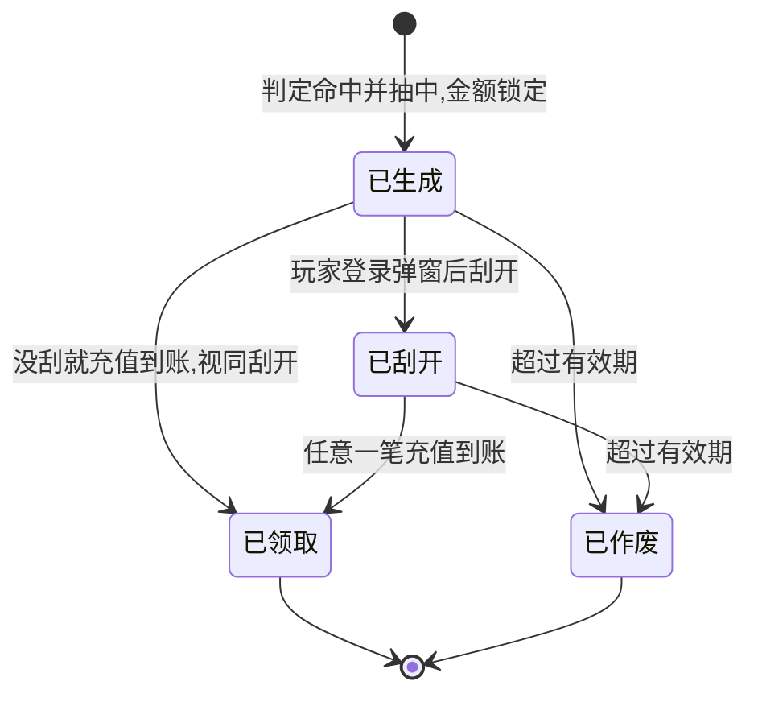
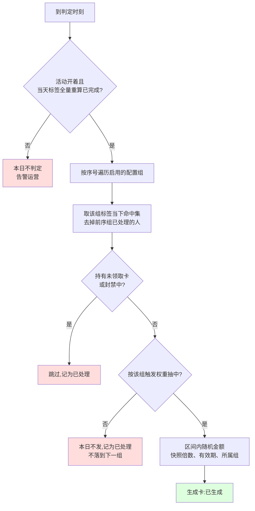
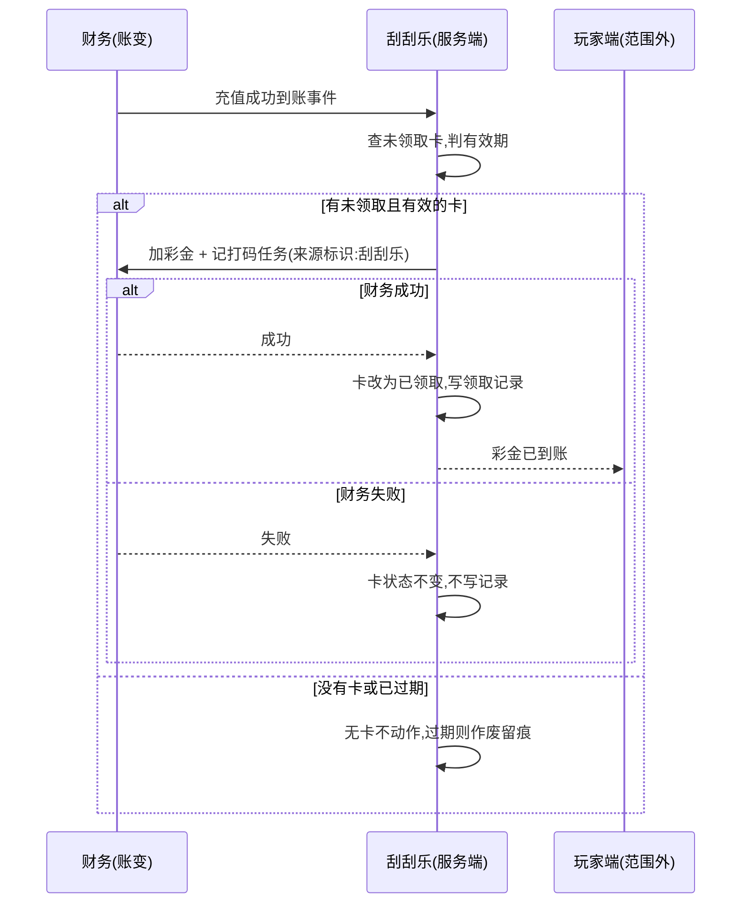

# 4.4 · 刮刮乐

## 1. 背景与目标

**目标**:让运营自己定"哪群人第二天能拿到一张刮刮乐、刮出来的钱在什么区间、领了要玩够多少才能取",
玩家昨天充过钱,今天一登录就先看到一张卡,刮开知道能拿多少,再充任意一笔钱就自动到账。
这一页管刮刮乐的所有规则:给谁、给多少、发多大比例、打码几倍、开关。

**谁在用**

| 角色 | 用来做什么 | 没有会怎样 |
|---|---|---|
| 运营 | 选人群标签、定彩金区间、定发放比例和打码倍数、开关活动 | 想给昨天充过钱的人一个回来再充的理由,只能找程序员写死一版 |
| 玩家 | 登录看到刮刮乐,刮开看到金额,充一笔就拿到(在玩家端) | 充完钱第二天没有任何再来一次的动力 |
| 财务 / 风控 | 看每天发了多少张、领了多少钱、哪群人在领 | 发出去的钱说不清归哪个人群,被小号薅了也查不到 |

**业务价值**:把昨天充过钱的玩家在第二天拉回来再充一笔,次日留存和复充靠这个撑;
彩金要玩够量才能提,成本可控;发放比例可调,想给多少人发就给多少人发;每张卡从生成到领取逐笔留痕。

**不做什么**

- **不做玩家端的弹窗、刮奖动画和充值页提示** —— 这里只是后台,玩家看到的另外做;本页只定"什么时候弹、弹什么"
- **不做加钱和打码本身** —— 这里只定规则和触发,真正加钱、记打码由资金那边管
- **不做人群怎么算** —— "谁昨天充了多少、投了多少、输了多少、几个设备登录"全部是用户标签(2.5)的事,本页只选标签
- **不做领取记录页** —— 谁拿到了卡、谁领了多少在「刮刮乐活动记录」(4.5)里看,本页只放入口
- **不做跨账号去重** —— "同一 IP、同一设备只发一张"首版不做(见模块决策清单 D50),以后要做走 2.5 补指标,活动侧不加逻辑
- **不做多张卡并存** —— 一个玩家同一时间只有一张没领的卡,领了才有下一张
- **不做活动周期、冷却天数** —— 刮刮乐是常驻活动,只靠活动开关控制

**适用范围**

| 维度 | 取值 |
|---|---|
| 终端 | 电脑后台,按 1440px 宽设计 |
| 响应式 | 最小支持 1280px;不做手机版 |
| 界面语言 | 后台用简体中文;活动名称和玩家可见文案按运营语言填(线上为葡语) |
| 时区 | "每天判定一次"的自然日按业务时区切;界面展示时间按运营所在时区(GMT−3)并标注 |
| 货币 | 彩金区间和入账按运营商币种,默认巴西雷亚尔(R$);一个运营商一套配置 |

## 2. 入口

- 菜单:活动管理 → 活动配置 → 充值活动配置 → 刮刮乐(路由为拟定,待前端确认)
- 页内:右侧悬浮「保存」;「活动说明」卡片展开功能说明
- 跳入:首版仅从菜单进入

## 3. 术语

> 通用词(打码倍数、随机奖励)见 `../README.md` 第 2 段;彩金、打码任务、有效投注
> 见 `../../M2-用户管理/2.1-用户列表/资金模型.md`;标签、命中、重算见
> `../../M2-用户管理/2.5-用户标签/README.md` 第 3 段,这里不重复讲。

| 术语 | 定义 |
|---|---|
| 卡 | 一张刮刮乐。生成时金额就定了,玩家刮开只是看到它;充一笔钱后自动变成彩金到账 |
| 配置组 | 一组规则:哪些标签的人、彩金在什么区间、发多大比例、打码几倍。活动里最多十组,按序号定先后 |
| 判定 | 每天固定时刻跑一次,看每个配置组的标签当下命中了谁,决定给谁生成卡 |
| 触发权重 | 命中了标签的人里,有多大比例真的拿到卡;100% 就是人人有 |
| 未领取卡 | 已生成但还没领的卡,不管刮没刮开 |
| 领取 | 卡持有人任意一笔充值成功到账,卡上的金额以彩金入账并记打码 |

## 4. 关键参数与假设

<!-- 所有阈值只在这里写一遍;数字本身在配置页填,这里只说有哪些、什么意思、在哪填。 -->

| 编号 | 参数 | 取值 | 依据 | 在哪配 |
|---|---|---|---|---|
| A1 | 配置组数量 | 1 ~ 10 组;活动开关打开时至少一组启用,否则开不了 | 10 组已验证(原始配置表有配置 1 ~ 10);"至少一组"是**假设** | 本页 |
| A2 | 配置组的构成 | 每组:用户标签(至少一个,多选取并集)、彩金最小 / 最大金额、触发权重、打码倍数、组开关、序号 | 已定(2026-08-28 业务确认,D46):人群一律用标签表达,原始表的充值档位拆成多个标签组 | 本页 |
| A3 | 判定时机 | 每天一次,判定时刻为系统配置;须晚于当天用户标签全量重算完成;同一自然日不重复判定 | **未验证假设** —— 依赖 2.5-A4 的重算窗口,待开发评估后定时刻 | 系统配置 |
| A4 | 命中与取组 | 按判定那一刻的标签命中集判断;一个玩家命中多组时,只在**序号最小且启用**的组参与,不落到下一组;一次判定最多发一张 | 已定(2026-08-28 业务确认,D48) | 写死 |
| A5 | 触发权重 | 0 ~ 100 的整数百分比;命中该组的每个玩家各自按这个概率独立抽一次,抽中才生成卡;100 全发,0 等于不发 | 语义为**未验证假设**(原始表只写 0%-100%) | 本页 |
| A6 | 持卡上限 | 同一玩家同一时间最多一张未领取卡;判定时已持卡的跳过,不生成新卡 | 已定(2026-08-28 业务确认,D48) | 写死 |
| A7 | 彩金金额 | 卡生成时在该组的最小 ~ 最大之间均匀随机,两位小数,向下保留;生成即锁定,刮开只是揭示,不重算 | 纯随机已定(2026-08-28 业务确认);小数位与进位为**假设**,沿用 4.2-A11 | 写死 |
| A8 | 打码倍数 | 两位小数,≥ 0;领到的钱要玩够"金额 × 倍数"的流水才能提;卡生成时快照,之后改配置不影响已生成的卡 | 已定(2026-08-28 业务确认,D49) | 本页 |
| A9 | 领取条件 | 卡生成后,玩家**任意一笔**充值成功到账即自动领取,金额不限、方式不限;不要求先刮开,没刮就充的视同刮开并领取 | 已定(2026-08-28 业务确认,含"不要求先刮开") | 写死 |
| A10 | 有效期 | 按天填,留空 = 永久;默认永久;非永久时,生成后超过有效期还没领的卡作废,不入账;有效期在卡生成时快照 | 永久已定(2026-08-28 业务确认,D47);配置项为 D47 附带建议,已采纳 | 本页 |
| A11 | 弹窗时机 | 有没刮开的卡时,玩家每次登录都先弹,直到刮开;已刮开没领的不再弹,改为在充值页显示待领取金额 | 已定(2026-08-28 业务确认,含弹窗频次与充值页提示) | 写死 |
| A12 | 改配置什么时候生效 | 活动开关和活动说明立刻生效;配置组的任何改动(标签、区间、权重、倍数、序号、组开关)和有效期**下一次判定才生效**;已生成的卡按生成时快照走 | 已定(2026-08-28 业务确认,D49) | 写死 |
| A13 | 关闭活动 | 关掉后停止判定、不再生成卡;已生成的卡照常弹窗、刮开、领取,不收回 | 已定(2026-08-28 业务确认,D49) | 写死 |
| A14 | 时区口径 | 判定的自然日按业务时区(2.5-A13);界面展示按运营时区 | 沿用 2.5 | 系统配置 |
| A15 | 币种口径 | 彩金区间与入账按运营商币种;标签里的金额按标准计价 USD 判定,那是 2.5 的事,本页不换算 | 沿用 4.2 与 2.5-A9 | 写死 |
| A16 | 与其他充值赠送叠加 | 领取那笔充值同时享受它本身的充值额外赠送;两笔彩金各自入账、各自记打码,互不影响 | 已定(业务原文:可叠加享受) | 写死 |
| A17 | 名称长度 | 活动名称最多 20 字;分组名最多 20 字 | **假设**,同 4.2-A18 | 本页 |
| A18 | 跨账号去重 | "同注册 IP / 同设备 / 同登录 IP 只发一张"**首版不做**;标签是单个玩家的规则,表达不了跨账号约束 | 已定(2026-08-28 业务确认,D50):首版不做;后续路径是 2.5 补跨账号指标,见 `../README.md` 第 7 段 D50 | 写死 |
| A19 | 封禁玩家 | 判定时排除封禁中的玩家;已持卡的玩家被封禁,充值到账时不入账、卡保留,解封后再充一笔才领 | **未验证假设** | 写死 |
| A20 | 充值退款 | 领取以"充值成功到账"为准,之后该笔充值退款或冲正不追回已入账的彩金 | **未验证假设**,待与资金模型的冲回口径对齐 | 写死 |

> 原始需求表里的「充值金额范围」「充值计算日期」「前端充值页面档位」都是"谁能拿"的条件,
> 按 D46 全部用标签表达:一个充值档位配一个标签(如「昨日充值金额 ≥ 20 且 < 30」),
> 再配一个组给它一个彩金区间。活动本身不再读充值数据。

## 5. 字段清单

本页是配置页,没有筛选和表格;字段按配置区分组列出。首版为新建功能,无线上截图。

**基础设置**

| 字段 | 类型 | 可输入数据与校验 |
|---|---|---|
| 活动开关 | switch | 开 / 关;开时至少一组启用(A1);关了立刻停发(A13) |
| 活动名称 | text | 必填,≤ 20 字(A17) |
| 有效期(天) | number | 正整数或留空;留空显示"永久"(A10) |
| 活动说明 | textarea | ≤ 1000 字;玩家可见的规则:怎么拿、打码要求、最终解释权 |

**配置组**(可增删,最多 10 组,可上移下移;每组一个折叠面板)

| 字段 | 类型 | 可输入数据与校验 |
|---|---|---|
| 序号 | 只读 | 由面板顺序自动得出,即优先级(A4) |
| 分组名 | text | 必填,≤ 20 字(A17) |
| 用户标签 | 多选 | 从 2.5 拉,至少选一个;多选取并集 |
| 最小金额 | number | 两位小数 ≥ 0,带运营商币种符号 |
| 最大金额 | number | 两位小数 ≥ 最小金额,且 > 0 |
| 触发权重 | number | 0 ~ 100 的整数(A5) |
| 打码倍数 | number | 必填,两位小数 ≥ 0(A8) |
| 组开关 | switch | 关了这组不参与判定,配置保留(A12) |

**原始需求表里有、本设计不做的项**(不要补回来)

| 原始项 | 处理 |
|---|---|
| 发放时间「日次(0:00-24:00)」 | 写死每天判定一次(A3),不设字段 |
| 符合条件「同注册 IP / 同设备码 / 同登录 IP = 1」 | 单玩家能表达的(登录 IP 数、设备数)归标签;跨账号去重首版不做(A18,D50) |
| 充值金额范围 / 充值计算日期 / 前端充值页面档位 | 归标签条件(2.5 的「充值金额 + 昨日 / 最近N天」),一个档位一个组;本页不设 |
| 参与渠道 | 2.5 首版没有渠道属性,不设;见 D50 |
| 添加 / 删除 | 是配置组的行操作,不是字段 |

## 6. 需求清单

| ID | 需求 | 触发条件 | 验收标准 | 权限码 |
|---|---|---|---|---|
| 4.4-R1 | 加载配置 | 进页面 | 显示当前运营商的全部配置;从没配过时各项为空、开关为关、没有配置组 | `activity:scratch-card:view` |
| 4.4-R2 | 保存配置 | 点「保存」 | 按 A1、A2、A5、A8、A10、A17 检查,全部通过才存;哪儿错了指到那一组 | `activity:scratch-card:edit` |
| 4.4-R3 | 活动开关 | 切换开关并保存 | 开时至少一组启用;关了立刻停止判定,已生成的卡不受影响(A13) | `activity:scratch-card:switch` |
| 4.4-R4 | 每日判定与发卡 | 定时到判定时刻(A3) | 按序号遍历启用组,取命中集,排除持卡与封禁,按权重抽,生成卡并锁定金额、倍数、有效期;同一天重跑不重复发 | 无(服务端自动) |
| 4.4-R5 | 登录弹窗与刮开 | 玩家登录 / 玩家点刮开 | 有没刮开的卡就弹;刮开只揭示已锁定的金额;卡变为已刮开 | 无(服务端自动) |
| 4.4-R6 | 充值到账自动领取 | 一笔充值成功到账 | 有未领取且未过期的卡就彩金入账、记打码、写领取记录;一张卡只领一次;没有卡不做任何事 | 无(服务端自动) |
| 4.4-R7 | 过期作废 | 定时 / 领取时判定(A10) | 有效期非永久时,超期未领的卡标作废、不入账、留记录 | 无(服务端自动) |

## 7. 需求详述

### 4.4-R2 · 保存配置

**触发条件**:有权限的运营改完任意一项,点右侧「保存」。

**可输入数据**:第 5 段全部字段。

**功能范围**

| 归属 | 做什么 |
|---|---|
| 界面 | 填表时当场提示:名称超长、最小大于最大、权重超出 0 ~ 100、组没选标签;错在哪一组就在哪一组标红 |
| 服务端 | 把 A1、A2、A5、A8、A10、A17 全部再查一遍;查权限;查标签存在且启用;通过才整份存下;记下谁改的、什么时候改的 |

**处理逻辑**

1. 查基础项:名称长度(A17);有效期为空或正整数(A10)。
2. 查配置组:数量 1 ~ 10;每组分组名必填、标签至少一个且在 2.5 里存在、最小 ≤ 最大且最大 > 0、权重 0 ~ 100 整数、倍数 ≥ 0(A2、A5、A8)。
3. 查开关:活动开关为开时至少一组组开关为开(A1)。
4. 全部通过才存;存完按 A12 决定什么时候生效;刷新页面显示。

**错误处理**

| 错误状况 | 提示 |
|---|---|
| 配置组为空或超过 10 组 | 至少配置 1 个、最多 10 个配置组 |
| 分组没选标签 | 请为分组「X」至少选一个用户标签 |
| 标签已被停用或删除 | 分组「X」引用的标签已失效,请重新选择 |
| 最小金额大于最大金额 | 分组「X」最小金额不能大于最大金额 |
| 最大金额为 0 | 分组「X」最大金额必须大于 0 |
| 权重超出范围 | 分组「X」触发权重须为 0 ~ 100 的整数 |
| 开关打开但没有启用的组 | 至少启用一个配置组才能开启活动 |
| 没有权限 | 没有操作权限(服务端也会拦,不靠藏按钮) |

**测试案例**

- 正向:三组分别绑「昨日充值 20 ~ 50」「50 ~ 200」「≥ 200」标签,区间 1 ~ 10、1 ~ 15、1 ~ 20,权重 100,打码 10 倍,有效期留空 → 保存成功,重进页面数据一致,有效期显示"永久"。
- 逆向:第 2 组最小 15、最大 10 → 界面和服务端都拦,指到第 2 组。
- 逆向:活动开关打开,三组组开关全关 → 拦下。
- 逆向:某组引用的标签在 2.5 被停用后再保存 → 拦下,提示重新选择。

### 4.4-R4 · 每日判定与发卡

**触发条件**:到了判定时刻(A3),服务端自动跑;只在活动开关为开时跑。

**可输入数据**:各启用配置组的规则 · 各组标签当下的命中集 · 玩家的持卡状态与封禁状态。没有人工输入。

**功能范围**

| 归属 | 做什么 |
|---|---|
| 界面 | 无 |
| 服务端 | 确认标签全量重算已完成;按序号遍历组;排除持卡与封禁的玩家;按权重抽;生成卡并快照金额、倍数、有效期、所属组;同一自然日重跑不重复发;跑完记一条判定日志(组、命中数、发卡数) |

**处理逻辑**

卡的一生:

判定流程:

红色为不发卡分支;绿色为生成卡,是唯一的写入动作。

1. 前置:活动开关为开;当天的标签全量重算已完成(A3)。没完成就不跑,告警,当天不补跑。
2. 取人:按序号从小到大遍历组开关为开的组,取标签命中集(A4);被前序组处理过的人不再看。
3. 排除:已持有未领取卡的、封禁中的跳过(A6、A19)。
4. 抽签:剩下的人按该组权重各自独立抽一次(A5);没抽中的本日不再落到别的组。
5. 生成:抽中的在区间内随机金额(A7),快照打码倍数(A8)、有效期(A10)、所属组,写一张状态为已生成的卡。
6. 幂等:同一自然日同一玩家最多一张,重跑只补没跑完的,不重复生成。
7. 日志:每组记命中数、跳过数、发卡数,在 4.5 里看。

**错误处理**

| 错误状况 | 提示 |
|---|---|
| 标签重算未完成 | 本日不判定,告警"刮刮乐判定跳过:标签未就绪" |
| 某组引用的标签已停用 | 该组按命中为空处理,告警运营;其余组照常 |
| 判定中途失败 | 已生成的卡保留,重跑只补剩下的人,不重复发 |

**测试案例**

- 正向:玩家昨天充 30,命中「20 ~ 50」组,权重 100 → 今天判定生成一张卡,金额在 1 ~ 10 之间,倍数 10。
- 正向:玩家同时命中第 1 组和第 3 组 → 只按第 1 组发一张,金额区间是第 1 组的。
- 正向:权重 30%,命中 1000 人 → 发卡数在 300 附近,每人是否发卡互不影响。
- 逆向:玩家手上还有一张没领的卡 → 今天不发新卡。
- 逆向:判定任务跑到一半重启 → 已发的人不重复收到第二张。
- 逆向:标签全量重算超时未完成 → 当天不判定,运营收到告警。

### 4.4-R5 · 登录弹窗与刮开

**触发条件**:玩家登录成功;玩家在弹窗里点刮开。

**可输入数据**:玩家的登录事件与刮开动作;没有别的输入。

**功能范围**

| 归属 | 做什么 |
|---|---|
| 界面(玩家端,本仓库范围外) | 登录后有没刮开的卡就先弹刮刮乐;刮开显示金额和"充任意金额即到账"的提示;已刮开没领的在充值页显示待领取金额 |
| 服务端 | 登录时告诉玩家端有没有没刮开的卡;刮开时把卡改为已刮开并返回锁定的金额;重复刮开返回同一金额 |

**处理逻辑**

1. 登录:查该玩家是否有状态为已生成且未过期的卡,有就让玩家端弹窗(A11)。
2. 刮开:把卡改为已刮开,返回生成时锁定的金额(A7);不在这时随机。
3. 已刮开没领的卡不再弹窗,改为充值页提示(A11)。
4. 弹窗与刮开都不动钱,不记打码。

**错误处理**

| 错误状况 | 提示 |
|---|---|
| 刮开时卡已过期 | 提示"活动已过期",卡标作废 |
| 刮开时卡已领取 | 返回已领取状态,不再显示刮开 |
| 同一张卡并发刮开 | 只改一次状态,两次都返回同一金额 |

**测试案例**

- 正向:第一天充值,第二天没登录,第三天登录 → 第三天登录弹窗,刮开看到金额。
- 正向:刮开后关掉弹窗再登录 → 不再弹,充值页显示待领取金额。
- 逆向:连点刮开三次 → 金额一致,不会刮出三个数。
- 逆向:有效期 1 天,第三天才登录 → 弹窗提示已过期,不能刮。

### 4.4-R6 · 充值到账自动领取

**触发条件**:该玩家一笔充值成功到账(财务那边的账变事件)。

**可输入数据**:到账事件带的玩家与账变标识;没有人工输入。

**功能范围**

| 归属 | 做什么 |
|---|---|
| 界面(玩家端,本仓库范围外) | 到账后显示"刮刮乐彩金 X 已到账" |
| 服务端 | 查未领取卡;没有就结束;过期就作废;有效就通知财务加彩金并按快照倍数记打码,带"刮刮乐"来源标识;成功后卡改为已领取并写领取记录;一张卡只领一次,同一账变只触发一次 |

**处理逻辑**

1. 收到到账事件,查该玩家状态为已生成或已刮开的卡;没有就什么都不做。
2. 有卡但已过有效期 → 改为已作废,写记录,不入账(A10)。
3. 有效 → 已生成的先视同刮开(A9);通知财务按卡上金额加彩金、按快照倍数记打码任务,来源标识"刮刮乐"。
4. 财务成功 → 卡改为已领取,写领取记录(玩家、卡、所属组、金额、倍数、触发的充值账变、时间)。
5. 财务失败 → 卡状态不变,不写领取记录;下一笔充值到账再试。
6. 这笔充值本身的充值额外赠送照常走,与本活动互不影响(A16)。
7. 同一账变事件重复送达只处理一次。

**错误处理**

| 错误状况 | 提示 |
|---|---|
| 加钱失败 | 不改卡状态、不写记录;玩家侧不提示,等下一笔充值 |
| 玩家封禁中 | 不入账,卡保留(A19) |
| 卡已过期 | 作废,写记录;玩家侧提示"刮刮乐已过期" |

**测试案例**

- 正向:卡金额 8.50、倍数 10,玩家充 1 元 → 彩金 8.50 入账,打码要求 85.00;充值本身的赠送另算。
- 正向:玩家没刮开就直接充值 → 卡直接变已领取,彩金入账。
- 逆向:同一笔到账事件送了两次 → 只入账一次。
- 逆向:两笔充值几乎同时到账 → 只有一笔领到卡,另一笔什么都不做。
- 逆向:财务加钱失败 → 卡还在,玩家下一笔充值再领。

## 8. 数据流向与系统串接

**数据流向**:运营填表 → 服务端整份校验后存成配置 → 每天判定时刻按标签命中集生成卡(快照规则)→
玩家登录弹窗、刮开揭示金额 → 充值到账时通知加钱记打码、写领取记录 → 本页读出配置显示,4.5 读出卡与记录显示。

**系统串接**:

- 钱包和账变、打码任务(归财务):加彩金和记打码都走财务那边,带"刮刮乐"来源标识;这里只触发,不自己改余额。资金域不反向依赖本活动。
- 充值到账事件(归财务):领取的唯一触发源;本页不轮询充值记录。
- 用户标签(归 M2,2.5):配置组绑定的标签,判定时按当下命中集判断;判定依赖当天全量重算已完成(A3)。
- 封禁状态(归 M2):判定与领取时查。
- 玩家端(本仓库范围外):登录弹窗、刮开、充值页提示、到账提示;本页只定时机与内容。
- **除了平台自己的钱包 / 账变 / 标签 / 封禁数据,没有别的外部系统。**

## 9. 异常与边界

| # | 场景 | 触发条件 | 预期处理 |
|---|---|---|---|
| E1 | 越权 | 没权限的账号改配置 / 切开关 | 服务端拦下,不靠藏按钮 |
| E2 | 判定任务重跑 | 同一天判定任务失败后重跑或被手动重跑 | 已发的人不重复发;只补没处理的(4.4-R4 第 6 步) |
| E3 | 标签未就绪 | 判定时刻到了,标签全量重算还没完成 | 当天不判定,告警;不补跑,不拿昨天的命中集凑数 |
| E4 | 并发到账 | 两笔充值几乎同时到账 | 只有一笔领到卡,另一笔不重复入账 |
| E5 | 重复事件 | 同一账变事件重复送达 | 只处理一次 |
| E6 | 关活动后充值 | 活动关闭后持卡玩家充值 | 照常领取(A13);只是不再生成新卡 |
| E7 | 改配置后 | 运营改了某组区间或倍数并保存 | 已生成的卡按快照走,下一次判定用新的(A12) |
| E8 | 标签被停用 / 删除 | 配置组引用的标签在 2.5 被停用;删除按 2.5-A6 会被拒绝 | 停用的组按命中为空处理并告警;保存时提示重新选择 |
| E9 | 持卡期间被封禁 | 玩家有未领取卡,之后被封禁并充值 | 不入账,卡保留;解封后再充一笔才领(A19) |
| E10 | 有效期从永久改为 N 天 | 运营填了有效期并保存 | 只影响之后生成的卡;已生成的按生成时快照仍为永久(A10、A12) |
| E11 | 加钱失败 | 财务那边入账没成功 | 不改卡状态、不写记录;下一笔充值再试 |
| E12 | 领取后退款 | 触发领取的那笔充值之后被退款 | 不追回彩金(A20) |
| E13 | 业务时区变更 | 2.5-A13 的业务时区被改 | 判定自然日随之变;当天若已判定过不再二次判定 |

## 10. 状态清单

| 状态 | 表现 |
|---|---|
| 错误 | 保存失败在页面顶部报错并把错误组标红,能改了再存;不整页崩 |
| 已关闭 | 活动开关关着时,页面顶部标"已关闭",配置仍可改 |
| 无启用组 | 所有组开关都关时,活动开关不可打开并提示原因 |
| 组已停用 | 组开关关着的组面板灰显折叠,配置保留可再启用 |
| 有效期永久 | 有效期留空时显示"永久" |
| 标签失效 | 引用的标签被停用时,该组面板标"标签已失效" |

## 11. 涉及表与职责

**数据归属**

- 拥有(owner=M4):刮刮乐配置(含配置组、有效期、文案、开关)、卡(含生成时快照的金额、倍数、有效期、所属组与状态)、判定日志、领取记录
- 只读:钱包和账变、打码任务、充值到账事件(归财务)· 用户标签命中集、封禁状态(归 M2)

**前后端职责**

| 事项 | 归属 |
|---|---|
| 整份配置校验(A1、A2、A5、A8、A10、A17)、标签有效性检查 | **服务端** |
| 每日判定、按权重抽签、随机金额、规则快照、同日幂等 | **服务端** |
| 登录时查卡、刮开改状态、到账时领取、防重复领取 | **服务端** |
| 触发加钱与打码、写领取记录、失败不落账 | **服务端** |
| 权限判定、只给看该看的运营商 | **服务端** |
| 填表、当场格式提示、错误组标红、组的增删排序 | 界面 |

## 12. 关联页面

- 跳出:4.5 刮刮乐活动记录(谁拿到了卡、谁领了多少)、2.5 用户标签(配置组绑定的人群)、
  `资金模型.md`(彩金和打码怎么算)
- 跳入:活动管理菜单;活动配置总览(不在本仓库)
