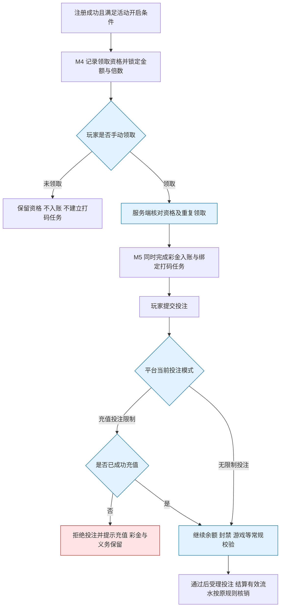

# 4.8 · 注册送好礼

## 1. 活动介绍

新玩家注册后获得一次固定彩金的领取资格。玩家手动领取成功后,彩金才入账并同时建立对应打码任务;未领取不入账、不产生打码义务。领取后的彩金能否在充值前用于游戏,由平台统一投注模式决定。

### 使用者

| 角色 | 用来做什么 | 没有会怎样 |
|---|---|---|
| 运营 | 设置注册彩金金额与打码倍数 | 注册激励难以配置与核算 |
| 玩家 | 查看奖励与流水要求,选择是否领取,了解领取后的投注及提现条件 | 把待领取奖励误认为余额,或未了解打码要求就领取 |
| 客服 | 区分未领取、领取处理中和已到账后的投注限制 | 将未领取或平台投注限制误报为发奖失败 |

注册即可查看可领金额及领取条件,是否领取由玩家决定。平台可选择领取后先充值再游戏,也可允许玩家先用已领取赠金体验。

### 本次范围

- 充值翻倍后期开发;本期不提供翻倍开关、充值档位、翻倍选择或关联充值发奖。
- 受众用户设置暂不做;不配置 APK/PWA/H5、用户标签或渠道定向。
- 不在本活动额外要求手机号或 CPF;玩家完成平台自身注册要求即可进入本活动。
- 不做虚拟奖金、谢谢参与、转盘抽奖;固定奖励金额是本稿简化规则,见 D67。
- 不做平台基础设置页或玩家端视觉设计;本期包含玩家手动领取入口,并定义如何消费统一投注规则。
- 不做新的钱包、冻结余额或提现规则。
- 手动领取后才入账并产生绑定打码任务,是活动的基本规则,不提供自动领取开关。领取成功后不提供玩家退回奖励或取消对应打码任务的功能。

### 适用范围

| 维度 | 取值 |
|---|---|
| 终端 | 桌面运营后台;玩家业务不按 APK/PWA/H5 区分 |
| 响应式 | 按最小宽度 1280px,不做手机版后台 |
| 界面语言 | 后台简体中文;玩家提示按运营语言展示 |
| 时区 | 注册、领取受理与到账分别保存服务端原始时间,业务归属按平台业务时区判断;后台展示注明时区(现有组件UTC−3),不按展示时区重算注册边界 |
| 货币 | 活动级奖励币种;打码在奖励原币种内计算 |

## 2. 运营配置

| 字段 | 类型 | 可输入数据与校验 |
|---|---|---|
| 活动名称 | text | 见 A1 |
| 奖励币种 | select | 见 A4 |
| 注册赠送金额 | number | 见 A3,始终显示币种 |
| 彩金打码倍数 | number | 见 A5 |
| 平台投注模式 | 只读 | 显示 A6 当前值及对应玩家提示,不可在本页修改 |
| 活动开关 | switch | 见 A8 |

**只读核对信息**:发布版本、赠送金额、打码倍数、领取后该笔需完成流水、平台投注模式。领取前的流水展示仅供说明,不计入玩家实际待打码量。
理论发放额按“成功发放人数 × 配置金额”计算;跨版本须分别汇总实际记录,不按最新配置回算。

**旧字段处理**:受众用户、标签、开放渠道本期不提供;手机号/CPF 不作为新增活动条件。
奖池、虚拟奖金和未中奖项按 D67 暂不提供。充值翻倍、关联订单、互斥赠送、翻倍打码等延后。
本期领取资格不设有效期,不增加有效期配置项。未领取只保留资格;已到账资产与打码义务也不设置活动过期时间。

### 配置限制与默认值

| 配置或参数 | 填写与执行规则 |
|---|---|
| 配置范围(A1) | 每运营商一套活动;名称按 1–40 字符;保存草稿后发布生效 |
| 奖励金额(A3) | 单个正数,符合奖励币种精度与资金金额安全边界;不设中奖概率或未中奖；固定金额为简化规则,D67 |
| 奖励币种(A4) | 活动级一个,平台已开通币种;变更须确认金额数值不自动换算；沿用活动奖励币种约定 |
| 彩金打码倍数(A5) | 必填,正数、最多两位小数;缺失不得当作零倍,金额乘倍数不得超出资金存储范围。注册取得资格时与金额同时锁定,手动领取成功入账时才建立独立任务,见D72 |

### 查看与保存草稿(4.8-R1)

进入页面、编辑保存草稿。

输入信息：“运营配置”可编辑配置;平台投注模式只读。

查看用 activity:register-gift:view,保存用 activity:register-gift:edit。
允许不完整草稿,但已填写字段须合法;以配置修订号防止并发覆盖,冲突时拒绝并保留输入。展示当前模式及其解释,不在活动草稿保存模式值。

### 核对与发布(4.8-R2)

核对并发布草稿。

输入信息：完整草稿与当前版本。

按 A1/A3–A5 校验名称、币种、金额和倍数,确认时再次校验草稿修订号及币种状态,形成不可变发布版本;确认期间草稿改变则重新核对。
首次发布仍需开启;后续发布按 A8 生效。不把充值翻倍、标签、CPF 或活动互斥能力作为发布条件。

### 开启与停用(4.8-R3)

开启或关闭活动。

输入信息：目标状态。

开启须有可用发布版本;关闭按 A8 执行,不修改平台投注模式。
发布及启停均记录原始生效时间,可追溯注册时规则;关闭前明确提示“停止新增资格,已有资格仍可领取”。
重新开启不重建已有资格,不重新奖励已经领取的玩家。

## 3. 参与和领奖规则

### 触发与次数(A2)

注册成功时活动已开启且有可用发布版本,玩家获得一次领取资格。资格保存服务端注册成功时间、当时的版本、固定金额、币种和打码倍数;每运营商每玩家最多一份资格、一次成功领取,重开或换版本不重置。

注册成功时活动尚未开启或处于关闭期间的玩家不获得资格,之后开启也不补发。注册事件延迟处理时仍按注册成功时的开关与版本判断,不得用处理时的新配置为老用户增加资格。

未领取不增加钱包余额、不建立打码任务,不增加、重置或抵扣已有任务,不因这份资格限制充值、投注或提现;其他既有条件仍照常执行。注册、登录、充值到账、打开活动页及后台重试都不得代替玩家首次领取。

配置或来源：活动基本领取规则与D66。

### 平台投注模式(A6)

默认充值投注限制,可切换为无限制投注;准确语义见资金模型“平台充值前投注资格”。平台设置实时决定后续投注资格,不绑定活动版本。

配置或来源：平台基础设置,本页只读；D73;动态切换为执行规则。

### 已充值判定(A7)

按玩家在当前运营商内至少一笔成功到账充值的原币净额大于0判断,不要求从活动入口充值,不额外设金额门槛;人工充值、充值发起、失败和赠金不算充值;退款或拒付后净额全部归零则恢复限制。

配置或来源：财务提供事实,投注侧判定；D73;非人工充值,退款后净额归零则恢复限制。

### 生效与关闭(A8)

发布仅影响之后注册成功取得的新资格,已有资格的版本、金额、币种和倍数保持不变。关闭停止新增资格,不撤销已经获得的资格;旧资格仍可由玩家手动领取,不得因活动关闭自动代领。

已经受理的领取请求继续按原资格快照处理。已入账彩金不因活动关闭或未充值作废,对应任务继续按资金规则执行。

配置或来源：资格、发布及关闭边界见D69。

### 注册获得资格(4.8-R4)

平台注册成功时,按A2查询原注册时的启停状态与发布版本,幂等保存唯一资格和奖励快照。注册及资格处理不会调用资金入账;注册初始化未完成或资格处理失败时核查原时点,不撤销已经成功的注册,恢复只补回按原注册时点应有的资格。

### 玩家手动领取(4.8-R5)

玩家查看奖励并主动点击领取时才受理发奖。

输入信息：登录玩家、已有资格及领取请求;玩家身份和运营商由服务端确定,金额、币种和倍数从资格快照读取,客户端不得提交玩家ID、奖励金额或倍数决定归属与发放。

1. 读取按A2形成的原资格及奖励快照;不存在资格时拒绝领取,不按当前配置临时生成新奖励。
2. 领取前展示可领金额、币种、倍数、领取后新增流水及平台投注模式,明确提示“领取后不能自行取消;该币种仍有未完成打码任务时,包含后续充值在内的全部余额均按资金规则限制提现”。预计流水不作为已生效任务展示。
3. 玩家主动领取时,服务端核对登录身份、运营商、资格归属、账号资金限制、奖励币种、钱包状态及原领取结果;资金处理前再次校验账号限制。受限时保留资格并提示。无论平台采用哪种投注模式,都不以是否充值作为领取前提。已领取返回原结果,处理中查询原请求,不得创建另一笔奖。
4. 同一资格的跨设备并发点击与不同请求编号也只能受理同一份奖励,记录玩家已提交领取后进入处理中。彩金入账、绑定的独立打码任务和领取成功结果在同一事务提交,任一步失败全部回滚;不得出现余额已增加但任务缺失,也不得先建立无对应到账奖励的生效任务。
5. 只有资金确认入账和任务均完成才显示已领取,并展示实际到账金额及任务。未知或失败按A9恢复原领取动作;未有玩家主动请求的资格不得自动进入恢复发奖流程。
6. 领取成功后暂不支持玩家退回奖励或取消对应任务。奖励被使用、输完、活动关闭或平台模式变化,都不自动取消任务;后台受控人工清除仍按资金模型R17执行,不作为本活动提供给玩家的取消入口。
7. 充值到账不代领未领奖励、不补发或翻倍已领奖励,也不清空或重建原任务。领取前已结算的有效投注不追溯抵扣之后才建立的本奖励任务。

每笔奖励独立建立任务,原币FIFO核销及超额流水不留作未来任务使用均遵循资金模型。任意active任务阻止该币种整个钱包提现,其他币种独立判断。

### 展示与执行平台投注限制(4.8-R7)

查看奖励说明、充值成功到账、每次提交投注或平台模式改变。

输入信息：当前平台模式、可信充值事实;钱包余额、封禁和游戏状态按原有规则校验。

1. 按资金模型“平台充值前投注资格”执行 A6,不能仅靠隐藏游戏按钮。
2. 未领取时只展示待领取资格和领取说明。手动领取成功后,充值投注限制下的未充值玩家可看到已到账彩金和打码义务,提示“彩金已到账,完成充值后可用于游戏”;投注拒绝时不扣款,不产生有效投注与打码核销。
3. 充值成功后按 A7 更新事实,下一笔投注重新判断;不会因旧彩金在充值前发放而永久不可用。
4. 无限制投注下,不要求先充值,允许使用已获赠彩金;提示“彩金可用于游戏,提现仍需满足流水及其他提现条件”。
5. 切换模式影响后续投注,不撤销已受理投注,不改资产或打码任务;模式或充值事实无法确认时暂拒新投注并提示重试。
6. 投注许可、打码完成与提现资格分别校验;充值、模式切换均不算完成打码。

红色为本次投注被拦截;蓝色为领取选择与服务端校验。是否充值不影响手动领取资格,未领取的资格不会进入入账和打码流程。

## 4. 特殊情况

### 发放恢复(A9)

仅恢复玩家已经主动提交的领取请求。结果未知保持处理中并查询原结果,不释放为可再次发奖的新资格;确认未入账后可自动重试原请求或由玩家重试,沿用原资格、金额、币种、倍数和领取依据。资金成功与对应任务只记录一次,恢复不得清空已核销进度。

尚未领取的资格不进入资金重试。重复注册消息只返回原资格,重复领取请求只查询或恢复原结果,都不增加另一份奖励。

旧自动发放记录已经到账的,不得再次奖励;历史处理中记录缺少玩家手动领取凭据时进入核查,不能直接自动付款。

配置或来源：幂等要求,恢复细节为,D72。

### 边界处理

| # | 场景 | 触发条件 | 预期处理 |
|---|---|---|---|
| E1 | 越权 | 跨运营商访问或修改 | 服务端拒绝 |
| E2 | 重复注册或领取 | 注册消息重放、多端并发点击或不同编号的重复领取 | 注册只返回原资格;领取只受理一次,返回原请求或结果,不重复入账或建立任务 |
| E3 | 发奖结果未知 | 资金回执超时 | 保持处理中,查原依据后恢复 |
| E4 | 缺打码倍数 | 配置不完整 | 拒绝发布/发奖并告警,不默认为零 |
| E5 | 未充值使用赠金 | 受限模式提交投注 | 拒绝本次投注,保留彩金及义务 |
| E6 | 充值未成功 | 仅创建订单或支付失败 | 不改变充值前限制 |
| E7 | 模式切换 | 后台改平台设置 | 只影响后续投注,不追回已发奖、不清空义务 |
| E8 | 配置取数失败 | 无法确认模式或受限时充值事实 | 暂拒新投注,不按无限制放行 |
| E9 | 活动关闭 | 仍有待领取资格、领取处理中或已到账奖励 | 旧资格保留并可手动领取;原领取请求继续,已入账不作废 |
| E10 | 充值拒付 | 已解锁后充值被冲正 | 按资金模型处理拒付;是否重新限制投注见 D73,本活动不新增扣奖动作 |
| E11 | 未领取时充值或投注 | 已有资格但玩家没有点击领取 | 不入账、不建立奖励任务,不代领;投注只按当时已有任务核销 |
| E12 | 领取后申请取消 | 玩家尝试退回奖励或取消绑定任务 | 不提供取消操作,服务端拒绝该请求,已到账和任务记录保持原状 |
| E13 | 资格形成后改版或事件延迟 | 注册后发布新金额、关闭后才处理旧注册事件 | 按服务端注册成功时的开关和版本形成资格;已有资格不重算 |
| E14 | 原奖励币种不可用 | 领取或资金处理时原币种停用、不可入账 | 保留资格或原请求并提示暂不可领取,告警后恢复原币种处理,不改币种或套用新金额 |
| E15 | 领取无效或账号受限 | 未登录、无资格、跨用户领取或账号资金限制 | 服务端拒绝,不入账不建任务,已有合法资格与记录保留 |
| E16 | 旧自动发放记录 | 历史记录已到账或处理中但缺少手动凭据 | 已到账不重复奖励;缺少凭据的处理中记录进入核查,不直接自动付款 |

### 查看与保存草稿遇到异常时(4.8-R1)

无权限拒绝;保存失败保留输入;基础设置取数失败显示“投注模式暂不可用”,不可默认显示无限制。

### 核对与发布遇到异常时(4.8-R2)

缺倍数、非法金额或币种失效拒绝发布;不得以默认倍数补齐缺失配置。

### 开启与停用遇到异常时(4.8-R3)

无生效配置禁止开启;失败返回实际状态。

### 注册资格与手动领取遇到异常时(4.8-R4/R5)

注册时配置或资格事实无法确认,保留注册事件并核查原时点,不按最新配置补造奖励。领取资金超时保持处理中;缺倍数或币种不可用保留资格或原请求并告警,不显示虚假已到账,不先给玩家增加打码义务。

### 展示与执行平台投注限制遇到异常时(4.8-R7)

未成功充值不能用“已发起充值”放行;配置未知不可默认无限制;重复充值通知不触发本活动发奖。

### 页面状态

| 状态 | 表现 |
|---|---|
| 草稿未完整 | 指明缺少金额、币种或倍数,不可发布 |
| 活动关闭 | 停止新增资格,旧资格仍可手动领取,原资产不受影响 |
| 无领取资格 | 说明当前无可领取注册奖励,不展示可领取操作 |
| 待领取 | 显示金额、币种、领取后流水及不可取消说明,提供领取操作;不计入余额或实际待打码量 |
| 领取处理中 | 显示已提交领取及处理中,查询原请求,不显示已到账或再次发起独立领取 |
| 暂不可领取 | 说明币种或账号限制等原因,保留已有资格;恢复后使用原资格 |
| 已到账但未满足充值条件 | 同时显示彩金与需充值提示,不称奖励未领取/过期 |
| 已到账且无需先充值 | 提示可用于游戏及提现流水要求 |
| 模式取数失败 | 显示暂不可确认,不误报无限制 |

## 5. 验收场景

| 需求编号 | 场景与操作 | 预期结果 |
|---|---|---|
| 4.8-R1 | 查看与保存草稿：进入、编辑后保存 | 草稿不改变生效配置;投注模式只读 |
| 4.8-R2 | 核对与发布：点击发布并确认 | 金额与倍数完整有效;已有资格及领取快照不变 |
| 4.8-R3 | 开启与停用：切换开关 | 控制新资格;旧资格仍可手动领取,不追回已发奖 |
| 4.8-R4 | 注册成功但未手动领取 | 只生成唯一资格,余额和实际待打码量不变,不改变原有提现资格 |
| 4.8-R4 | 同一注册消息重复或延迟到达 | 只保留一份按原注册时间确定的资格,不补开启前或关闭期间注册用户 |
| 4.8-R5 | 玩家查看说明并主动领取 | 不要求先充值;彩金、绑定任务和领取成功结果原子提交,任务按资格快照金额乘倍数建立 |
| 4.8-R5 | 跨设备并发领取或资金超时重试 | 同一玩家同一运营商只有一笔奖励及一条对应任务;未知结果恢复原请求,不重置任务进度 |
| 4.8-R5 | 已领取后请求取消、奖励输完或长期未完成任务 | 不提供玩家取消,服务端拒绝取消请求;任务不因输完或时间经过而清除 |
| 4.8-R5 | 原币种停用或账号资金受限时点击领取 | 拒绝新入账并说明原因,保留资格或原请求,不创建无到账奖励的生效任务 |
| 4.8-R5 | 旧自动发放记录恢复 | 已到账不再奖励;缺少玩家手动凭据的处理中记录进入核查,不得直接付款 |
| 4.8-R7 | 展示与执行平台投注限制：查看活动、玩家提交投注、充值到账 | 两种模式只改变充值前投注资格,不改变发奖额或打码义务 |
| 4.8-R8 | 在本页打开活动记录,核查注册赠金 | 能区分待领取、处理中与已领取,查注册时间、资格快照、领取时间、到账及任务引用;无查看权限或超出账号数据范围的查询被拒绝 |

### 查看与保存草稿(4.8-R1)

- 正向:修改金额保存草稿 → 新注册资格仍按原生效版锁定,已有资格不变。
- 逆向:试图通过本页更改投注模式 → 服务端拒绝该字段写入。

### 核对与发布(4.8-R2)

- 正向:发布新金额 → 之后注册的资格使用新版本;之前注册但尚未领取的玩家仍按旧快照领取。
- 逆向:金额合法但倍数为空 → 禁止发布。

### 开启与停用(4.8-R3)

- 正向:关闭活动 → 不新增资格,旧资格继续可手动领取;已领取玩家仍按平台模式与正常规则使用资产。
- 逆向:关闭再开 → 不给已有资格或已经领取的玩家增加另一份资格。
- 边界:关闭期间注册,重开后才处理事件 → 不生成资格;关闭前已符合条件的注册事件迟到 → 恢复原注册时点资格,不自动入账。

### 注册资格与手动领取(4.8-R4/R5)

- 正向:注册获得10 USDT、20倍的资格,未领取 → 仅显示待领取10 USDT及领取后需完成200 USDT有效流水,钱包余额与任务均不增加。
- 正向:上述玩家主动领取且资金成功 → 同时入账10 USDT并建立200 USDT的独立打码任务,资格显示已领取。
- 正向:从未充值玩家在受限模式下领取 → 奖励与任务正常入账,投注仍需成功充值;无限制模式下领取 → 通过其他校验后可使用。
- 边界:玩家已有充值并完成其流水,注册奖励仍未领取 → 原有提现资格不受该资格影响;此后主动领取 → 新增赠金任务,该币种按全部任务重新判断提现。
- 边界:领取前已有结算完成的有效投注,之后领取 → 不用此前投注追溯抵扣新任务。
- 逆向:同一资格从两端同时领取,即使请求编号不同 → 只有一笔到账及一条任务。
- 逆向:资金已成功但回执丢失,玩家重试或后台恢复 → 查询原结果,不再次入账、不重建或重置任务。
- 逆向:余额入账与任务创建任一步失败 → 不留下可用奖励与打码义务不一致的结果,恢复原请求。
- 逆向:从未点击领取,发生登录、充值、活动页访问或后台定时扫描 → 仍保持待领取,不调用发奖流程。
- 边界:领取后彩金输完或长期未完成任务 → 不自动取消剩余义务;玩家取消请求被拒绝。

### 展示与执行平台投注限制(4.8-R7)

- 正向:先手动领取彩金,受限模式未充值不能投注;成功充值后可用原彩金,打码剩余量未因充值而减少。
- 正向:无限制模式未充值投注并产生有效流水 → 正常核销赠金打码任务。
- 逆向:受限模式通过其他入口直接提交投注 → 服务端仍拒绝,不扣款、不核销。
- 边界:无限制切到受限且玩家未充值 → 下一笔投注被拒,已结算投注与原资产不回滚。

## 6. 相关资料

> 平台基础设置拥有“充值投注限制 / 无限制投注”,本活动不另设同名开关。
> 来源 Excel 的旧翻倍方案已不属于本期;执行结论见 [M4 决策清单](../README.md#7-决策清单) D66–D73。

### 入口与关联页面

- 菜单:活动管理 → 活动配置 → 注册送好礼;任务路由由Jira维护。
- 操作顺序:填写名称、奖励币种、奖励金额和打码倍数 → 保存草稿 → 核对并发布 → 开启。
- 玩家顺序:注册取得资格 → 查看金额及领取条件 → 手动领取 → 查看到账奖励与绑定任务。
- 后台路由:`/admin/activity/register-gift`;玩家入口:`/register-gift`,账户菜单及侧栏可访问。
- 平台投注模式在平台基础设置维护,本页只读展示并说明影响。
- 本页内提供“活动记录”区,注册赠金查询与活动配置一起交付并验收。

- 跳入:活动管理菜单。
- 记录入口:本页内“活动记录”。
- 规则引用:[资金模型](../../M2-用户管理/2.1-用户列表/资金模型.md)、[系统设置归属](../../M8-系统设置/README.md)。
- 交付范围:[KAN-217](https://bingobox.atlassian.net/browse/KAN-217)总票;KAN-237后端、KAN-238后台、KAN-239玩家端、KAN-240全流程验收。

### 权限

| 操作 | 权限或执行方 |
|---|---|
| 查看与保存草稿(4.8-R1) | activity:register-gift:edit(查看用 view) |
| 核对与发布(4.8-R2) | activity:register-gift:publish |
| 开启与停用(4.8-R3) | activity:register-gift:switch |
| 注册获得资格(4.8-R4) | 注册成功由系统记录资格,不触发资金入账 |
| 玩家手动领取(4.8-R5) | 必须由登录玩家本人主动请求,服务端校验归属及去重,不提供后台代领接口 |
| 展示与执行平台投注限制(4.8-R7) | 本页查看用 view;投注为系统判定 |
| 查询活动记录(4.8-R8) | `activity:register-gift:view` |

> R4描述注册资格,R5描述玩家手动领取;R6关联充值翻倍本期不提供。
> 本活动遵循手动领取后才入账并建立对应打码任务的基本规则,见D66与D72。

### 术语与共用口径

> 彩金、钱包、打码及提现以 [资金模型](../../M2-用户管理/2.1-用户列表/资金模型.md)为唯一出处。
> 两种投注模式及其与资金的关系见该文“平台充值前投注资格”。

| 术语 | 定义 |
|---|---|
| 领取资格 | 注册成功时记录的固定奖励及规则,尚未成为余额或生效打码任务 |
| 注册赠金 | 玩家主动领取成功后入账的一笔真实彩金,领取不以先充值为条件 |
| 注册赠金打码量 | 实际领取入账金额 × 资格快照的打码倍数;领取前可展示预计值,不形成实际义务 |
| 已发放 | 资金确认彩金到账及对应打码结果,不代表已获投注或提现资格 |
| 资格及发奖快照 | 注册取得资格时锁定版本、金额、币种与倍数,领取及异常恢复沿用,后续改配置不追溯 |

### 依赖与数据流

**数据流向**:注册成功 → 活动记录资格并锁定规则 → 玩家手动领取 → 服务端校验资格及去重 → 资金同时入账并建立绑定任务 → 玩家投注时读取平台模式与充值事实 → 常规投注与流水核销。未领取停留在资格阶段。

**系统串接**:

- 注册事实来自平台/M2,只用于形成领取资格;玩家端提供本人主动领取请求。活动不新增手机号、CPF、终端或标签准入规则。
- M5 提供真实到账及充值事实,负责彩金账变与打码。
- 平台基础设置(owner=系统设置,该配置页面尚未收入本仓库)维护投注模式。
- 游戏/投注服务端(owner=玩法,本仓库范围外)统一判定充值前投注资格,不反查注册活动配置决定是否可投注。
- 本页无新增外部系统;玩家手动领取入口与后台采用同一资格和资金规则,游戏入口只消费平台统一投注资格并展示一致解释。

### 数据归属与职责

**数据归属**

- 拥有(owner=M4):活动配置与版本、历史启停及原始生效时间、注册领取资格及快照、领取受理依据、实际发放结果及时间;不保存翻倍订单或奖池结果。
- 只读(owner=M2/平台注册流程):注册成功事实、玩家与运营商。
- 只读(owner=M5):币种、真实充值与赠金到账、钱包及打码结果。
- 平台基础设置拥有投注模式,游戏/投注服务端消费;本活动仅只读解释,不拥有或冻结模式。
- 运营商隔离沿用当前一部署/数据库一运营商边界,不接受客户端切换运营商;玩家身份由登录会话确定。
- 页内活动记录必须能查玩家、注册成功时间、资格生成时间、规则版本、金额币种、倍数、待领取/处理中/已领取状态、领取受理时间、到账时间、账变及绑定任务引用。未领取只能展示预计流水,没有实际到账及任务编号;领取后实际任务与剩余量从资金侧读取。记录区只读查询,服务端按查看权限、运营商及账号数据范围隔离结果。

**前后端职责**

| 事项 | 归属 |
|---|---|
| 权限、隔离、发布、资格生成、本人领取校验及去重 | 活动服务端 |
| 彩金入账、打码义务、到账核查 | M5 服务端 |
| 平台投注模式配置 | 平台基础设置 |
| 实时充值资格及其他投注校验 | 游戏/投注服务端 |
| 待领取、处理中、已到账、不可取消及投注提现条件的准确展示 | 后台与玩家界面 |

### 查看与保存草稿的职责(4.8-R1)

界面提供格式提示;服务端隔离运营商、判权限和草稿版本。

### 核对与发布的职责(4.8-R2)

界面显示实际彩金与需打码量;服务端校验发布与留痕。

### 开启与停用的职责(4.8-R3)

界面说明影响;服务端执行权限与开关留痕。

### 注册资格与手动领取的职责(4.8-R4/R5)

注册流程提供可信成功事实;活动记录资格并受理玩家主动领取;资金负责同笔入账与绑定任务及原请求恢复。后台无代领按钮,自动处理只能恢复已主动提交的领取。

### 展示与执行平台投注限制的职责(4.8-R7)

平台基础设置拥有模式;投注服务端统一判定,活动只展示和发奖。
