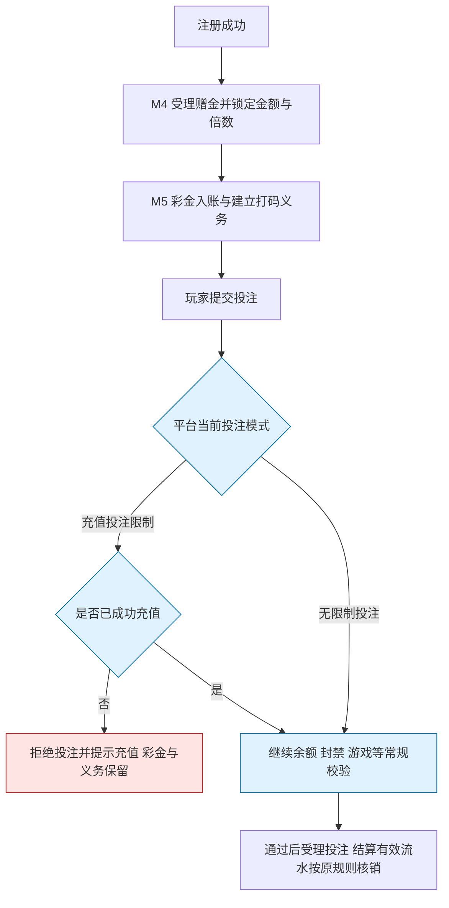

# 4.8 · 注册送好礼

## 1. 活动介绍

新玩家注册后获得一笔彩金,清楚看到金额及流水要求;能否在充值前使用彩金游戏,由平台统一投注模式决定。

### 使用者

| 角色 | 用来做什么 | 没有会怎样 |
|---|---|---|
| 运营 | 设置注册彩金金额与打码倍数 | 注册激励难以配置与核算 |
| 玩家 | 查看注册赠金、是否可投注及提现前流水要求 | 把已到账误认为立即可投注或可提现 |
| 客服 | 解释未充值时为什么不能游戏 | 将平台投注限制误报为奖励未到账 |

注册即获得明确奖励;平台可选择先充值后游戏,也可允许玩家先用赠金体验。

### 本次范围

- 充值翻倍后期开发;本期不提供翻倍开关、充值档位、翻倍选择或关联充值发奖。
- 受众用户设置暂不做;不配置 APK/PWA/H5、用户标签或渠道定向。
- 不在本活动额外要求手机号或 CPF;玩家完成平台自身注册要求即可进入本活动。
- 不做虚拟奖金、谢谢参与、转盘抽奖;固定奖励金额是本稿简化规则,见 D67。
- 不做平台基础设置页或玩家端设计;只定义本活动如何消费统一投注规则。
- 不做新的钱包、冻结余额或提现规则。

### 适用范围

| 维度 | 取值 |
|---|---|
| 终端 | 桌面运营后台;玩家业务不按 APK/PWA/H5 区分 |
| 响应式 | 按最小宽度 1280px,不做手机版后台 |
| 界面语言 | 后台简体中文;玩家提示按运营语言展示 |
| 时区 | 注册与发奖时间按平台业务时区,展示注明时区 |
| 货币 | 活动级奖励币种;打码在奖励原币种内计算 |

## 2. 运营配置

| 字段 | 类型 | 可输入数据与校验 |
|---|---|---|
| 活动名称 | text | 见 A1 |
| 奖励币种 | select | 见 A4 |
| 注册赠送金额 | number | 见 A3,始终显示币种 |
| 彩金打码倍数 | number | 见 A5 |
| 平台投注模式 | 只读 | 显示 A6 当前值及对应玩家提示,不可在本页修改 |
| 活动开关 | switch | 见 A8 |

**只读核对信息**:发布版本、赠送金额、打码倍数、该笔需完成流水、平台投注模式。
理论发放额按“成功发放人数 × 配置金额”计算;跨版本须分别汇总实际记录,不按最新配置回算。

**旧字段处理**:受众用户、标签、开放渠道本期不提供;手机号/CPF 不作为新增活动条件。
奖池、虚拟奖金和未中奖项按 D67 暂不提供。充值翻倍、关联订单、互斥赠送、翻倍打码等延后。
不提供手动领取有效期:本稿按注册自动发放,已到账资产与打码义务不设置活动过期时间。

### 配置限制与默认值

| 配置或参数 | 填写与执行规则 |
|---|---|
| 配置范围(A1) | 每运营商一套活动;名称按 1–40 字符;保存草稿后发布生效 |
| 奖励金额(A3) | 单个正数,符合奖励币种精度;不设中奖概率或未中奖；固定金额为简化规则,D67 |
| 奖励币种(A4) | 活动级一个,平台已开通币种;变更须确认金额数值不自动换算；沿用活动奖励币种约定 |
| 彩金打码倍数(A5) | 必填;本稿按正数、最多两位小数;缺失不得当作零倍。发奖独立建立义务,倍数与金额同时锁定；可设置倍数;正数精度为,D72 |

### 查看与保存草稿(4.8-R1)

进入页面、编辑保存草稿。

输入信息：“运营配置”可编辑配置;平台投注模式只读。

查看用 activity:register-gift:view,保存用 activity:register-gift:edit。
允许不完整草稿,但已填写字段须合法;并发覆盖拒绝并保留输入。展示当前模式及其解释,不在活动草稿保存模式值。

### 核对与发布(4.8-R2)

核对并发布草稿。

输入信息：完整草稿与当前版本。

按 A1/A3–A5 校验名称、币种、金额和倍数,确认后形成发布版本;确认期间草稿改变则重新核对。
首次发布仍需开启;后续发布按 A8 生效。不把充值翻倍、标签、CPF 或活动互斥能力作为发布条件。

### 开启与停用(4.8-R3)

开启或关闭活动。

输入信息：目标状态。

开启须有可用发布版本;关闭按 A8 执行,不修改平台投注模式。
重新开启不重新奖励已经参与的玩家。

## 3. 参与和领奖规则

### 触发与次数(A2)

注册成功赠送一笔;本稿按服务端自动发放,每运营商每玩家一次,重开或换版本不重置,不补活动开启前注册的老用户。

配置或来源：注册赠金;自动发放与次数边界为,D66。

### 平台投注模式(A6)

充值投注限制 / 无限制投注,准确语义见资金模型“平台充值前投注资格”;平台设置实时决定后续投注资格,不绑定活动版本。

配置或来源：平台基础设置,本页只读；D73;动态切换为执行规则。

### 已充值判定(A7)

按玩家在当前运营商内至少一笔成功到账充值,不要求从活动入口充值,不额外设金额门槛;人工充值、充值发起、失败和赠金不算充值;退款后净额全部归零则恢复限制。

配置或来源：财务提供事实,投注侧判定；D73;非人工充值,退款后净额归零则恢复限制。

### 生效与关闭(A8)

发布仅影响新受理赠金;关闭停止新增,已经受理的发奖继续按原快照处理。已入账彩金不因活动关闭或未充值作废。

配置或来源：原彩金不作废原则;发奖受理边界为,D69。

### 注册赠金自动发放(4.8-R4)

平台注册成功。

输入信息：可信注册事实、玩家与运营商、当时生效配置;金额与倍数不由玩家提交。

1. 按 A2/A8 检查活动和重复注册事件;活动受理赠金时保存原版本、金额、币种及倍数。
2. 无论平台采用哪种投注模式,都不以是否充值作为发奖前提。
3. 用同一发奖依据请求彩金入账与独立打码结果;只有资金确认完成才显示已发放。
4. 未知或失败按 A9 恢复,不重新产生另一笔奖;活动失败不撤销已经成功的注册。
5. 展示实际赠金、需打码量与投注模式解释。充值之后不补发、不翻倍,不重新创建本奖励的打码义务。

### 展示与执行平台投注限制(4.8-R7)

查看奖励说明、充值成功到账、每次提交投注或平台模式改变。

输入信息：当前平台模式、可信充值事实;钱包余额、封禁和游戏状态按原有规则校验。

1. 按资金模型“平台充值前投注资格”执行 A6,不能仅靠隐藏游戏按钮。
2. 充值投注限制下,未充值玩家可看到已到账彩金和打码义务,提示“彩金已到账,完成充值后可用于游戏”;投注拒绝时不扣款,不产生有效投注与打码核销。
3. 充值成功后按 A7 更新事实,下一笔投注重新判断;不会因旧彩金在充值前发放而永久不可用。
4. 无限制投注下,不要求先充值,允许使用已获赠彩金;提示“彩金可用于游戏,提现仍需满足流水及其他提现条件”。
5. 切换模式影响后续投注,不撤销已受理投注,不改资产或打码任务;模式或充值事实无法确认时暂拒新投注并提示重试。
6. 投注许可、打码完成与提现资格分别校验;充值、模式切换均不算完成打码。

红色为本次投注被拦截;蓝色为服务端校验。充值限制不拦截前面的赠金入账。

## 4. 特殊情况

### 发放恢复(A9)

结果未知保持处理中并查原结果;确认未入账后恢复原发奖动作,金额与依据不变。重复注册消息不重复发奖。

配置或来源：幂等要求,恢复细节为,D72。

### 边界处理

| # | 场景 | 触发条件 | 预期处理 |
|---|---|---|---|
| E1 | 越权 | 跨运营商访问或修改 | 服务端拒绝 |
| E2 | 重复注册消息 | 同一玩家再次触发发奖 | 返回原结果,不重复入账 |
| E3 | 发奖结果未知 | 资金回执超时 | 保持处理中,查原依据后恢复 |
| E4 | 缺打码倍数 | 配置不完整 | 拒绝发布/发奖并告警,不默认为零 |
| E5 | 未充值使用赠金 | 受限模式提交投注 | 拒绝本次投注,保留彩金及义务 |
| E6 | 充值未成功 | 仅创建订单或支付失败 | 不改变充值前限制 |
| E7 | 模式切换 | 后台改平台设置 | 只影响后续投注,不追回已发奖、不清空义务 |
| E8 | 配置取数失败 | 无法确认模式或受限时充值事实 | 暂拒新投注,不按无限制放行 |
| E9 | 活动关闭 | 仍有赠金处理中或已发放 | 已受理按原快照完成,已入账不作废 |
| E10 | 充值拒付 | 已解锁后充值被冲正 | 按资金模型处理拒付;是否重新限制投注见 D73,本活动不新增扣奖动作 |

### 查看与保存草稿遇到异常时(4.8-R1)

无权限拒绝;保存失败保留输入;基础设置取数失败显示“投注模式暂不可用”,不可默认显示无限制。

### 核对与发布遇到异常时(4.8-R2)

缺倍数、非法金额或币种失效拒绝发布;不得以默认倍数补齐缺失配置。

### 开启与停用遇到异常时(4.8-R3)

无生效配置禁止开启;失败返回实际状态。

### 注册赠金自动发放遇到异常时(4.8-R4)

资金超时保持处理中;缺倍数或币种不可用保留待核查并告警;不显示虚假已到账。

### 展示与执行平台投注限制遇到异常时(4.8-R7)

未成功充值不能用“已发起充值”放行;配置未知不可默认无限制;重复充值通知不触发本活动发奖。

### 页面状态

| 状态 | 表现 |
|---|---|
| 草稿未完整 | 指明缺少金额、币种或倍数,不可发布 |
| 活动关闭 | 停止新注册赠金,原资产不受影响 |
| 奖励处理中 | 不显示已到账,保留可查询原处理结果 |
| 已到账但未满足充值条件 | 同时显示彩金与需充值提示,不称奖励未领取/过期 |
| 已到账且无需先充值 | 提示可用于游戏及提现流水要求 |
| 模式取数失败 | 显示暂不可确认,不误报无限制 |

## 5. 验收场景

| 需求编号 | 场景与操作 | 预期结果 |
|---|---|---|
| 4.8-R1 | 查看与保存草稿：进入、编辑后保存 | 草稿不改变生效配置;投注模式只读 |
| 4.8-R2 | 核对与发布：点击发布并确认 | 金额与倍数完整有效;旧发奖快照不变 |
| 4.8-R3 | 开启与停用：切换开关 | 控制新增赠金,不追回已发奖 |
| 4.8-R4 | 注册赠金自动发放：注册成功 | 不要求充值;单次入账及独立打码,重复消息不重发 |
| 4.8-R7 | 展示与执行平台投注限制：查看活动、玩家提交投注、充值到账 | 两种模式只改变充值前投注资格,不改变发奖额或打码义务 |
| 4.8-R8 | 在本页打开活动记录,核查注册赠金 | 能查玩家、配置版本、奖励金额币种、倍数、需打码量、时间及处理结果;无查看权限或超出账号数据范围的查询被拒绝 |

### 查看与保存草稿(4.8-R1)

- 正向:修改金额保存草稿 → 玩家仍按生效版获赠。
- 逆向:试图通过本页更改投注模式 → 服务端拒绝该字段写入。

### 核对与发布(4.8-R2)

- 正向:发布新金额 → 新注册按新版本,已受理赠金保持原快照。
- 逆向:金额合法但倍数为空 → 禁止发布。

### 开启与停用(4.8-R3)

- 正向:关闭活动 → 已获赠玩家仍按平台模式与正常规则使用资产。
- 逆向:关闭再开 → 不给同一玩家再发一次。

### 注册赠金自动发放(4.8-R4)

- 正向:从未充值玩家注册,平台为充值投注限制 → 彩金正常入账,打码任务建立,投注仍被限制。
- 正向:从未充值玩家注册,平台为无限制投注 → 彩金正常入账,可在其他校验通过后使用,打码要求照常存在。
- 逆向:同一注册消息重复到达 → 一笔赠金与对应的一次打码义务。

### 展示与执行平台投注限制(4.8-R7)

- 正向:先获彩金,受限模式未充值不能投注;成功充值后可用原彩金,打码剩余量未因充值而减少。
- 正向:无限制模式未充值投注并产生有效流水 → 正常核销赠金打码任务。
- 逆向:受限模式通过其他入口直接提交投注 → 服务端仍拒绝,不扣款、不核销。
- 边界:无限制切到受限且玩家未充值 → 下一笔投注被拒,已结算投注与原资产不回滚。

## 6. 相关资料

> 平台基础设置拥有“充值投注限制 / 无限制投注”,本活动不另设同名开关。
> 来源 Excel 的旧翻倍方案已不属于本期;执行结论见 [M4 决策清单](../README.md#7-决策清单) D66–D73。

### 入口与关联页面

- 菜单:活动管理 → 活动配置 → 注册送好礼;任务路由由Jira维护。
- 操作顺序:填写名称、奖励币种、奖励金额和打码倍数 → 保存草稿 → 核对并发布 → 开启。
- 平台投注模式在平台基础设置维护,本页只读展示并说明影响。
- 本页内提供“活动记录”区,注册赠金查询与活动配置一起交付并验收。

- 跳入:活动管理菜单。
- 记录入口:本页内“活动记录”。
- 规则引用:[资金模型](../../M2-用户管理/2.1-用户列表/资金模型.md)、[系统设置归属](../../M8-系统设置/README.md)。

### 权限

| 操作 | 权限或执行方 |
|---|---|
| 查看与保存草稿(4.8-R1) | activity:register-gift:edit(查看用 view) |
| 核对与发布(4.8-R2) | activity:register-gift:publish |
| 开启与停用(4.8-R3) | activity:register-gift:switch |
| 注册赠金自动发放(4.8-R4) | 系统触发 |
| 展示与执行平台投注限制(4.8-R7) | 本页查看用 view;投注为系统判定 |
| 查询活动记录(4.8-R8) | `activity:register-gift:view` |

> R5 普通手动领取与 R6 关联充值翻倍为旧稿编号,本期撤出,不复用。
> R4 自动发放是按“注册会送一笔奖励”采用的发放规则,见 D66。

### 术语与共用口径

> 彩金、钱包、打码及提现以 [资金模型](../../M2-用户管理/2.1-用户列表/资金模型.md)为唯一出处。
> 两种投注模式及其与资金的关系见该文“平台充值前投注资格”。

| 术语 | 定义 |
|---|---|
| 注册赠金 | 玩家注册获得的一笔真实彩金,充值前也可以发放到账 |
| 注册赠金打码量 | 实际赠送金额 × 发放时锁定的打码倍数 |
| 已发放 | 资金确认彩金到账及对应打码结果,不代表已获投注或提现资格 |
| 发奖快照 | 注册赠金受理时锁定的金额、币种与打码倍数,后续改配置不追溯 |

### 依赖与数据流

**数据流向**:注册成功 → 活动锁定赠金与倍数 → 资金入账建义务 → 玩家投注时读取平台模式与充值事实 → 常规投注与流水核销。

**系统串接**:

- 注册事实来自平台/M2;活动不新增手机号、CPF、终端或标签准入规则。
- M5 提供真实到账及充值事实,负责彩金账变与打码。
- 平台基础设置(owner=系统设置,该配置页面尚未收入本仓库)维护投注模式。
- 游戏/投注服务端(owner=玩法,本仓库范围外)统一判定充值前投注资格,不反查注册活动配置决定是否可投注。
- 本页无新增外部系统;玩家端与游戏入口在范围外,须展示一致解释。

### 数据归属与职责

**数据归属**

- 拥有(owner=M4):活动配置与版本、发奖依据/快照、实际发放结果及时间;不保存翻倍订单或奖池结果。
- 只读(owner=M2/平台注册流程):注册成功事实、玩家与运营商。
- 只读(owner=M5):币种、真实充值与赠金到账、钱包及打码结果。
- 平台基础设置拥有投注模式,游戏/投注服务端消费;本活动仅只读解释,不拥有或冻结模式。
- 页内活动记录必须能查玩家、版本、金额币种、倍数、需打码量、发放时间与处理结果。记录区只读查询,服务端按查看权限、运营商及账号数据范围隔离结果。

**前后端职责**

| 事项 | 归属 |
|---|---|
| 权限、隔离、发布及赠金去重 | 活动服务端 |
| 彩金入账、打码义务、到账核查 | M5 服务端 |
| 平台投注模式配置 | 平台基础设置 |
| 实时充值资格及其他投注校验 | 游戏/投注服务端 |
| 已到账、可投注与提现条件的准确展示 | 后台与玩家界面 |

### 查看与保存草稿的职责(4.8-R1)

界面提供格式提示;服务端隔离运营商、判权限和草稿版本。

### 核对与发布的职责(4.8-R2)

界面显示实际彩金与需打码量;服务端校验发布与留痕。

### 开启与停用的职责(4.8-R3)

界面说明影响;服务端执行权限与开关留痕。

### 注册赠金自动发放的职责(4.8-R4)

活动决定赠金;资金负责入账与打码,注册流程提供成功事实。

### 展示与执行平台投注限制的职责(4.8-R7)

平台基础设置拥有模式;投注服务端统一判定,活动只展示和发奖。
