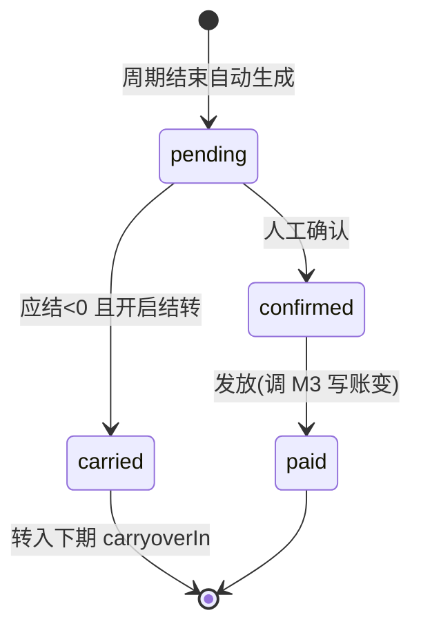

# 5.2 · 佣金结算

## 1. 用途
按周期计算并发放代理佣金。**本模块最大不确定性,口径未定前无法实现。**

## 2. 入口
菜单:代理渠道 → 代理 → 佣金结算 · 跳入:代理详情「结算记录」

## 3. 字段清单

**筛选**:结算周期 · 代理ID/账号 · 结算状态 · 币种 · 金额区间
**表格列**:`序号 | 代理 | 周期 | 充值返佣 | 下注返佣 | 输赢分成 | 一次性奖励 | 上期结转 | 应结金额 | 结转下期 | 状态 | 操作`

**四种佣金口径**( 用哪几种待定)
| 口径 | 计算基数 | 字段 |
|---|---|---|
| 充值返佣 | 下级充值额 × 比例 | `rechargeCommission` |
| 下注返佣 | 下级投注额 × 比例 | `betCommission` |
| 输赢分成 RevShare | 下级 GGR × 比例(**可能为负**) | `profitShare` |
| 一次性奖励 CPA | 达成条件的人头奖 | `bonusReward` |

## 4. 需求清单

| ID | 需求 | 验收标准 | 权限码 | 人日 |
|---|---|---|---|---|
| 5.2-R1 | 结算单列表 | 按周期倒序;显示各口径拆分与应结金额 | `agent:settlement:view` | 1 |
| 5.2-R2 | 周期自动生成 | 周期结束定时生成结算单,状态 `pending` | — | 1.5 |
| 5.2-R3 | 充值返佣计算 | 下级充值额 × 比例;金额与明细可核对 | — | 1.5 |
| 5.2-R4 | 下注/输赢分成计算 | 下级投注额或 GGR × 比例;**输赢分成可为负** | — | 2 |
| 5.2-R5 | 负余额结转 | `payable<0` 且开启结转时写 `carryoverOut` 并转入下期 `carryoverIn`;关闭时清零 | — | 1.5 |
| 5.2-R6 | 确认发放 | 二次确认显示总额;发放调 M3 写 `Transaction`;状态转 `paid` | `agent:settlement:confirm` | 1.5 |
| 5.2-R7 | 重算 | 二次确认;仅 `pending` 可重算;写 `OperationLog` | `agent:settlement:recalc` | 1 |

## 5. 状态清单
空 / 加载 / 错误 / 无权限 / 计算中 / 待确认 / 已发放(只读)/ 负数结转(黄标)

## 6. 交互流程

**负余额结转**:`payable < 0` 时,若开启结转则写 `carryoverOut` 转下期;否则清零。

## 7. 涉及表
`AgentSettlement`(owner,新增)· `AgentCommissionRecord` · 只读 `Transaction` `BetRecords` → `../表设计.prisma`

## 8. 关联页面
跳出:代理管理(5.1)· 钱包账变(M2.2)· 渠道报表(M1.4)
