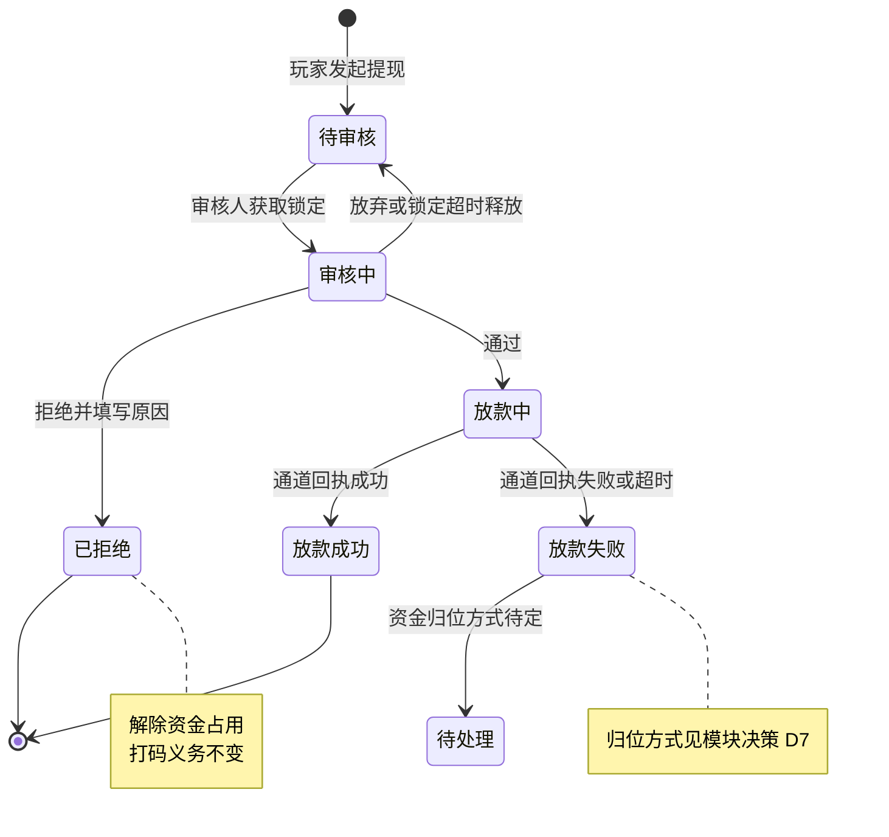
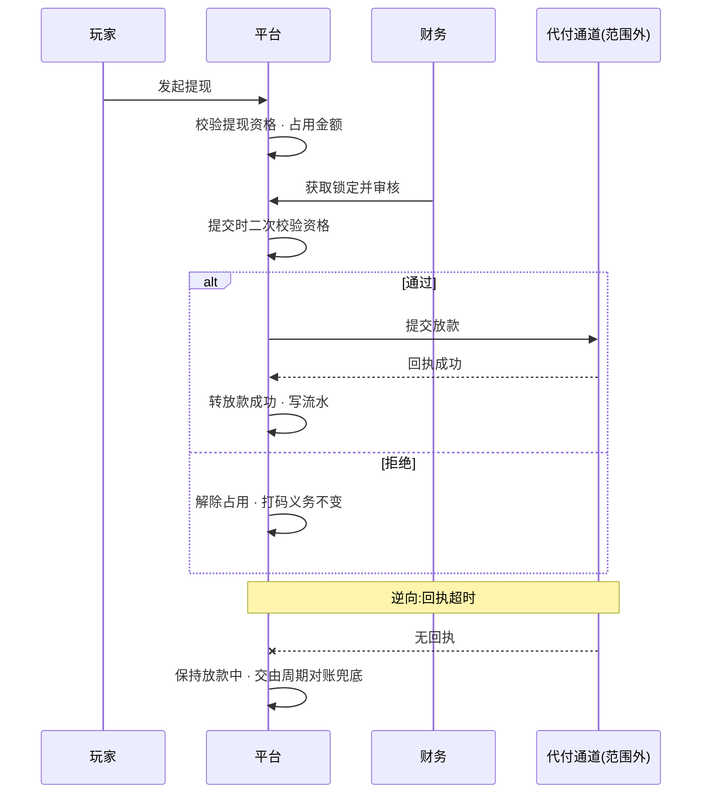

# 5.1 · 提现订单

## 1. 背景与目标

**目标**:让财务在一个页面里完成提现的审核与放款跟踪,并保证两个人不会同时审同一笔单。

**谁在用**

| 角色 | 用来做什么 | 没有会怎样 |
|---|---|---|
| 财务 | 审核待处理的提现,通过或拒绝 | 提现积压,玩家等钱等到投诉,口碑直接受损 |
| 风控 | 拦下异常提现,查玩家标签与首次提现 | 刷子把钱提走了才发现,追不回来 |
| 客服 | 回答「我的提现到哪一步了」 | 只能说「在处理中」,玩家不信,反复来问 |

**业务价值**:提现是玩家对平台信任度最敏感的环节,慢一小时的体感损失远大于快一小时的收益。
同时它也是资金流出的唯一闸口,审错一笔就是真金白银的损失。这一页要同时做到**快**和**不出错**。

**不做什么**
- 不做提现规则的配置(限额、手续费、审核阈值归提现配置与审核规则两页)
- 不做打码义务的判定逻辑本身(见第 3 段引用的资金模型,本页只消费判定结果)
- 不做放款通道的对接配置(那是通道管理的事)
- 不做玩家端的提现申请流程

**适用范围**

| 维度 | 取值 |
|---|---|
| 终端 | 桌面后台,最小宽度 1440 |
| 响应式 | 否 |
| 界面语言 | 简体中文 |
| 时区 | 运营时区,页面顶部标注 |
| 货币 | 多币种共存,金额必须带币种标识 |

## 2. 入口

- 菜单:财务管理 → 提现管理 → 提现订单
- 跳入:顶栏「待审核」角标 · 玩家详情弹窗的提款记录 · 风控告警下钻

## 3. 术语

> 资金类术语(余额、可用余额、真金、彩金、打码任务、提现拦截)统一定义在
> `../../M2-用户管理/2.1-用户列表/资金模型.md` 第 2 段;
> 锁定、首次提现的定义见 `../README.md` 第 2 段。此处不重复。

| 术语 | 定义 |
|---|---|
| 提现信息 | 玩家的收款账户信息,含 CPF 等敏感项 |
| 付款通道 | 实际执行放款的第三方通道 |
| 提现方式 | 玩家选择的收款形式,与付款通道不是一回事 |
| 操作人员 | 审核该单的后台账号 |

**「提现真金金额」与「彩金金额」是两轨的拆分,不是两个余额。**
它们由提现扣款顺序(真金优先、彩金兜底)拆分得出,是派生的展示形态。
口径与 M2 弹窗提款记录中的同名列保持一致,不得两处分叉。

## 4. 关键参数与假设

| 编号 | 参数 | 取值 | 依据 | 在哪配 |
|---|---|---|---|---|
| A1 | 每页条数 | 20 条/页 | **未验证假设** | 写死 |
| A2 | 默认筛选 | 订单状态为待审核 | 已验证(实采默认值) | 写死 |
| A3 | 自动刷新间隔 | 30 秒 | **未验证假设** | 配置项,可由运营开关 |
| A4 | 批量审核单次上限 | 50 笔 | **未验证假设** | 配置项 |
| A5 | 查询响应上限 | 5 秒 | **未验证假设** | 写死,超时中断并给可读提示 |
| A6 | 导出行数上限 | 5 万行 | **未验证假设** | 配置项 |
| A7 | 锁定的持有时长 | 5 分钟无操作自动释放 | **未验证假设** | 配置项 |

> A7 决定了「审核人打开单子后离开工位」这类情况多久解锁。太短会审到一半被别人抢走,
> 太长会让积压单卡死。需要按实际审核时长实测校准。

## 5. 字段清单

筛选面板与表格左半见 `截图/列表-筛选面板与表头-左半.png`,
右半列头见 `截图/列表-表头-右半.png`。表格共 21 列需横向滚动。

> **两张截图中表格无数据行**:采集时该运营商的待审核提现为 0 笔(顶栏待审核角标同为 0),
> 而本页默认筛选即为待审核(见 A2)。截图用于确认筛选项与列结构,不用于确认数据表现。

**筛选字段**

| 字段 | 类型 | 可输入数据与校验 |
|---|---|---|
| 渠道 | select | 只列启用中的渠道 |
| 付款通道 | select | 只列启用中的通道 |
| 用户ID | text | 数字,精确匹配 |
| 订单状态 | select | 默认待审核,见 A2。**枚举未取全**,见模块决策 D8 |
| 订单号 | text | 精确匹配 |
| 金额 | range | 两个输入框,下限不得大于上限 |
| 首次提现 | select | 全部 / 是 / 否 |
| 时间 | select | 时间类型切换,决定下方日期范围作用于哪个时间字段 |
| 申请时间 | daterange | 起止时间 |
| 完成时间 | daterange | 起止时间 |
| 备注 | text | 模糊或精确匹配,按实现约定 |
| CPF | text | 敏感字段,查询时精确匹配 |

**表格列**

| 列 | 说明 | 默认显示 |
|---|---|---|
| 序号 | 当前页行号 | 是 |
| ID | 记录标识 | 是 |
| 运营商 | 该单所属运营商 | 是 |
| 渠道 | 玩家注册渠道 | 是 |
| 锁定 | 当前是否被某审核人占用,显示占用人 | 是 |
| 用户ID | 可点击进入玩家详情 | 是 |
| 用户标签 | 来自玩家档案,风控参考 | 是 |
| 订单号 | 与通道对账的凭据 | 是 |
| 提现金额 | 玩家申请提取的总额,带币种标识 | 是 |
| 提现真金金额 | 两轨拆分中的真金部分,派生指标 | 是 |
| 彩金金额 | 两轨拆分中的彩金部分,派生指标 | 是 |
| 提现手续费 | 本单扣除的手续费 | 是 |
| 提现信息 | 收款账户,**须脱敏** | 是 |
| 首次提现 | 该玩家的第一笔提现,风控重点 | 是 |
| 付款通道 | 执行放款的通道 | 是 |
| 时间 | 按筛选的时间类型展示对应时间 | 是 |
| 提现方式 | 玩家选择的收款形式 | 是 |
| 订单状态 | 当前状态 | 是 |
| 操作人员 | 审核人 | 是 |
| 备注 | 审核或拒绝原因 | 是 |
| 操作 | 审核 · 查看详情 | 是 |

**汇总**:当前筛选结果的**提现总人数**与**提现总金额**,金额带币种标识。

## 6. 需求清单

> **权限**:本页权限码对应角色配置里的权限树节点(模块 → 分组 → 页面 → 操作),
> 完整映射与「已有 / 需新增」见 `../README.md` 第 6 段。
> 勾中任一操作节点必须同时持有其页面节点,判定一律在服务端做。

| ID | 需求 | 触发条件 | 验收标准 | 权限码 |
|---|---|---|---|---|
| 5.1-R1 | 订单列表与筛选 | 进入页面 · 点查询 · 翻页 | 12 项筛选可组合;默认筛选见 A2;敏感字段脱敏;汇总准确 | `finance:withdraw:order` |
| 5.1-R2 | 单笔审核 | 对某笔待审核订单点通过或拒绝 | 提交时二次校验提现资格;通过后进入放款;拒绝须填原因并解除资金占用 | `finance:withdraw:order:review` |
| 5.1-R3 | 批量审核 | 勾选多笔后点批量审核 | 逐笔独立判定,部分失败不影响其余;结果逐笔可见;单次上限见 A4 | `finance:withdraw:order:review` |
| 5.1-R4 | 锁定与并发控制 | 打开某笔订单的审核 | 同一笔单同时只能被一人占用;超时自动释放见 A7 | `finance:withdraw:order:review` |
| 5.1-R5 | 自动刷新 | 点开启自动刷新 | 按 A3 间隔刷新列表;刷新不打断正在进行的审核操作 | `finance:withdraw:order` |
| 5.1-R6 | 全量导出 | 点全量导出数据 | 不阻塞页面,完成后通知;内容与当前筛选一致;敏感字段按权限脱敏 | `finance:withdraw:order:export` |

## 7. 需求详述

### 5.1-R2

**触发条件**:对一笔待审核订单点击通过或拒绝,填写必要信息并确认。

**可输入数据**:审核结果(通过 / 拒绝)· 拒绝原因(拒绝时**必填**)· 备注。

**功能范围**

| 归属 | 做什么 |
|---|---|
| 界面 | 展示该玩家的余额构成、打码进度与风控标签;拒绝原因必填;防重复提交 |
| 服务端 | 权限判定、锁定校验、**提交时二次校验提现资格**、状态流转、写流水与审计 |

**处理逻辑**

1. 判权限;校验该单当前由本人锁定(见 R4),否则拒绝操作
2. **提交时二次校验提现资格**:该币种是否仍存在未完成的打码任务。
   打开页面时可提、提交时已不可提的,**按提交时为准拒绝**,不按打开时的状态放行
3. 通过:订单转入放款流程,资金保持占用状态直至放款结果返回
4. 拒绝:必须填写原因;**解除本单的资金占用**,金额回到玩家可用余额
5. 拒绝**不改变玩家的打码义务** —— 提现被拒不等于打码作废,也不等于额外惩罚
6. 写账变流水与审核审计,记录审核人、时间、结果与原因

**错误处理**

| 错误状况 | 提示 |
|---|---|
| 无审核权限 | 提示无权限,不展示审核入口 |
| 该单未被本人锁定 | 该订单正被他人处理,请刷新后重试 |
| 订单已非待审核态 | 该订单已被处理,请刷新查看最新状态 |
| 二次校验发现仍有未完成打码任务 | 该玩家该币种仍有未完成的流水要求,**告知还差多少**,不可通过 |
| 拒绝未填原因 | 请填写拒绝原因 |
| 重复提交 | 只生效一次,返回首次结果 |

**测试案例**

- 正向:一笔打码已达标的待审核订单点通过 → 状态转放款中,审核人与时间被记录
- 正向:点拒绝并填写原因 → 状态转已拒绝,占用金额回到可用余额,**打码任务剩余量不变**
- 逆向:打开页面时可提,提交前玩家新充值产生了打码任务 → 提交时被拦下,并**告知还差多少**
- 逆向:他人已锁定该单时点审核 → 拒绝并提示
- 逆向:拒绝未填原因 → 拒绝;同一单连点两次通过 → 只生效一次

### 5.1-R3

**触发条件**:勾选多笔待审核订单后点击批量审核,选择结果并确认。

**可输入数据**:勾选的订单集合(不超过 A4)· 批量结果(通过 / 拒绝)· 原因(拒绝时必填)。

**功能范围**

| 归属 | 做什么 |
|---|---|
| 界面 | 勾选与上限提示、二次确认展示笔数与总金额、逐笔结果回显 |
| 服务端 | 逐笔权限与资格判定、逐笔锁定、部分失败隔离、逐笔留痕 |

**处理逻辑**

1. 校验勾选数量不超过 A4;超过则拒绝并提示
2. **逐笔独立处理**,每一笔都走 R2 的完整判定,包括提交时二次校验提现资格
3. **部分失败不影响其余**:某笔因资格不足或已被他人锁定而失败时,其余照常处理
4. 返回**逐笔结果**,明确哪些成功、哪些失败以及失败原因,不只给一句「部分失败」
5. 每一笔各自写流水与审计,不合并成一条批量记录

**错误处理**

| 错误状况 | 提示 |
|---|---|
| 超过单次上限 | 单次最多处理 N 笔(见 A4),请减少勾选 |
| 部分订单被他人锁定 | 逐笔标出「正被他人处理」,其余照常 |
| 部分订单资格不足 | 逐笔标出仍差多少打码量,其余照常 |
| 全部失败 | 如实展示每笔原因,不静默 |

**测试案例**

- 正向:勾选 10 笔全部达标的订单批量通过 → 10 笔全部转放款中,产生 10 条独立审计
- 正向:其中 3 笔资格不足 → 7 笔成功、3 笔失败并各自说明原因,列表可见逐笔结果
- 逆向:勾选超过上限 → 拒绝并提示
- 逆向:批量过程中某笔被他人抢先审核 → 该笔失败并提示,其余不受影响

### 5.1-R4

**触发条件**:打开某笔订单的审核操作 · 离开审核 · 锁定超时。

**可输入数据**:无(由打开与关闭审核动作隐式触发)。

**功能范围**

| 归属 | 做什么 |
|---|---|
| 界面 | 列表中显示锁定状态与占用人;被他人锁定时禁用审核入口 |
| 服务端 | 锁定的获取、持有、释放与超时回收;并发下只有一人能拿到 |

**处理逻辑**

1. 打开审核时尝试获取该单的锁定;**并发下只有一人能获取成功**
2. 获取成功者可审核,其余人看到「正被某人处理」且审核入口不可点
3. 主动关闭审核或提交完成时**立即释放**锁定
4. 持有超过 A7 且无操作则**自动释放**,避免单子被永久卡住
5. 锁定仅约束审核动作,**不影响查看与查询**

**错误处理**

| 错误状况 | 提示 |
|---|---|
| 锁定已被他人持有 | 该订单正被 X 处理,请稍后重试 |
| 锁定已超时被回收后仍提交 | 提示锁定已失效,请重新打开该订单 |
| 锁定服务不可用 | 禁用审核入口并提示,**不允许无锁审核** |

**测试案例**

- 正向:A 打开订单 → 列表中该单显示被 A 锁定,B 的审核入口不可点
- 正向:A 提交完成 → 锁定立即释放,B 可以处理下一笔
- 逆向:A 与 B 同时打开同一单 → 只有一人拿到锁定
- 逆向:A 打开后离开超过 A7 → 锁定自动释放,B 可接手
- 逆向:锁定服务不可用时强行提交 → 被拒绝,不允许无锁审核

> 放款失败后的资金归位方式尚未拍板(自动退回可用余额,还是转入冻结待人工处理),
> 见模块决策 D7。图中以「待处理」表示这一未定态。

## 8. 数据流向与系统串接

**数据流向**:玩家在客户端发起提现 → 平台占用对应金额并生成待审核订单 →
财务在本页锁定并审核 → 通过则提交放款、拒绝则解除占用 →
通道执行放款并回执 → 平台按回执更新订单状态并写流水 → 结果呈现在本页与玩家详情的提款记录。

**系统串接**:**与代付通道第三方串接**。

- **正向**:审核通过 → 平台向通道提交放款 → 通道执行 → 回执成功 → 订单转放款成功
- **逆向**:回执失败 → 订单转放款失败,资金归位方式见模块决策 D7;
  回执超时或未返回 → **不猜测结果**,订单保持放款中并由对账兜底,不自行转成功也不自行退回;
  重复回执 → 按订单号幂等,只处理一次;
  通道侧成功但平台未收到回执 → 由周期对账捕获并告警
- **责任边界**:放款结果以**通道回执为准**,平台不自行判定成功;
  提现资格判定(打码是否达标)**完全由平台负责**,通道不参与也不知晓打码义务的存在

## 9. 异常与边界

| # | 场景 | 触发条件 | 预期处理 |
|---|---|---|---|
| E1 | 越权审核 | 无审核权限账号提交审核 | 拒绝并提示;界面不展示入口,服务端二次判定 |
| E2 | 两人同审一单 | 并发打开同一笔订单的审核 | 只有一人获得锁定,另一人被拒绝并提示占用人 |
| E3 | 审核期间资格变化 | 打开页面后玩家新充值产生打码任务 | **提交时二次校验**,按提交时状态拒绝,并告知还差多少 |
| E4 | 重复提交审核 | 网络抖动或连点导致同一单提交多次 | 只生效一次,返回首次结果 |
| E5 | 批量部分失败 | 批量中若干笔资格不足或被他人锁定 | 逐笔隔离,成功的照常完成,失败的逐笔说明原因 |
| E6 | 放款回执丢失 | 通道已放款但平台未收到回执 | 订单保持放款中,不自行判定;由周期对账捕获并告警 |
| E7 | 重复回执 | 同一放款结果被推送多次 | 按订单号幂等,只处理一次 |
| E8 | 锁定卡死 | 审核人打开后离开或断线 | 超过 A7 自动释放,单子不被永久占用 |
| E9 | 敏感信息泄露 | 无脱敏权限的账号查看提现信息与 CPF | 服务端按权限脱敏后再返回,不在界面侧遮挡了事 |
| E10 | 拒绝被当成惩罚 | 提现被拒后玩家的打码义务被清掉或增加 | 拒绝**不改变**打码义务,只解除本单的资金占用 |

## 10. 状态清单

| 状态 | 表现 |
|---|---|
| 错误 | 列表区域内提示并可重试,不整页跳转;筛选条件与勾选保留 |
| 被他人锁定 | 特有态:该行显示占用人,审核入口不可点,但详情可查看 |
| 放款中 | 特有态:审核入口不可点,状态明确显示为处理中,避免被再次审核 |
| 回执未达 | 特有态:超过预期时长仍无回执的订单需可被筛出,不与放款失败混为一谈 |
| 自动刷新中 | 刷新不打断正在进行的审核,不重置已勾选项与滚动位置 |

## 11. 涉及表与职责

**数据归属**

- 拥有(owner=M5):提现订单 · 账变流水 · 审核审计 · 锁定状态
- 只读:用户、用户标签(owner=M2)· 打码任务与提现资格判定结果
  (owner=M5,语义定义见资金模型)· 付款通道(owner=通道管理)

**前后端职责**

| 事项 | 归属 |
|---|---|
| 权限判定 | **服务端**,按角色的权限节点判定 |
| 可见范围过滤 | **服务端**,按账号绑定的推广商过滤,列表、汇总与导出一律先过滤再返回(见 `../README.md` 第 6 段) |
| 提交时的提现资格二次校验 | **服务端** |
| 锁定的获取、释放与超时回收 | **服务端** |
| 批量审核的逐笔隔离与幂等 | **服务端** |
| 提现信息与 CPF 的脱敏 | **服务端**(不得由界面遮挡代替) |
| 汇总金额与总人数的计算 | **服务端** |
| 筛选交互、勾选、自动刷新 | 界面 |
| 拒绝原因收集与二次确认 | 界面 + 服务端双重校验 |

## 12. 关联页面

- 跳出:玩家详情弹窗(点用户ID)· 5.3 人工充值(错账回收场景)
- 跳入:顶栏待审核角标 · 玩家详情弹窗的提款记录 · 风控告警下钻
