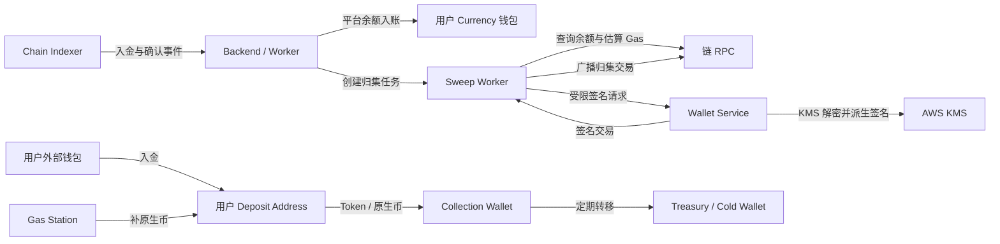
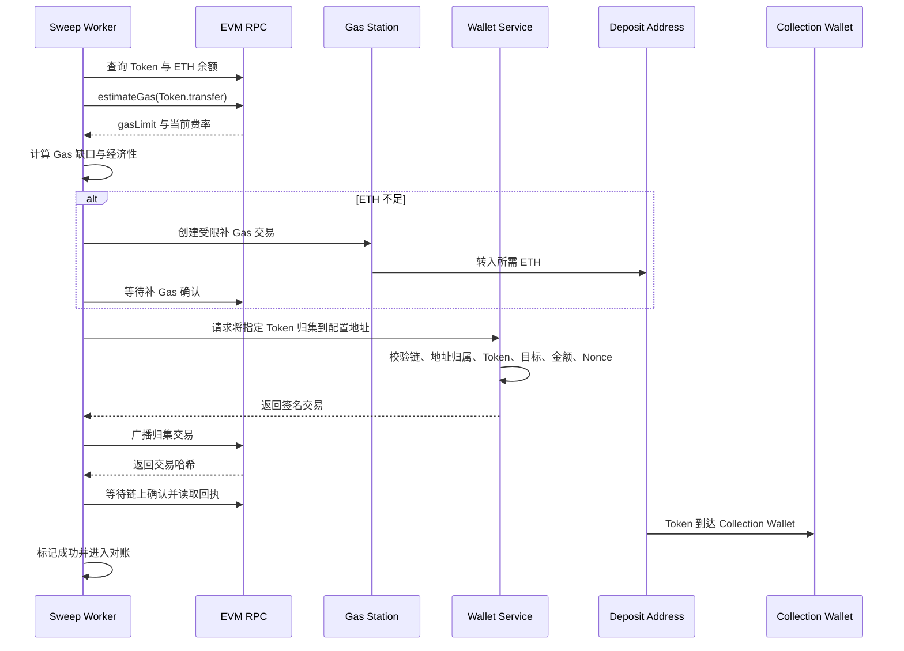
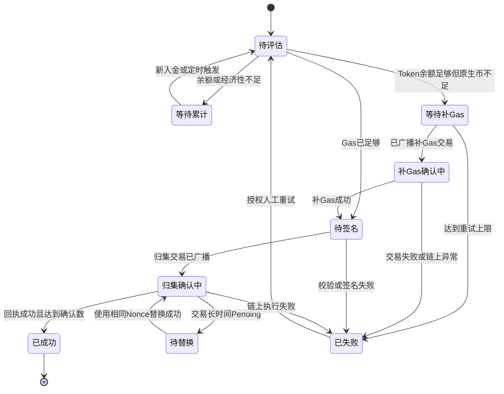

# Gas Station 与自动归集方案

## 1. 目标与结论

平台为每个用户分配独立链上入金地址。用户入金并完成平台余额记账后，链上资产仍停留在各用户地址，
需要由归集系统安全、可追踪地转入平台统一归集钱包。

MVP 采用 **Gas Station + 自动归集**：

- Gas Station 是平台控制的手续费热钱包，只保存受限数量的链原生币
- Collection Wallet 是平台在某条链上的统一归集钱包，用于接收用户地址中的资产
- Sweep Worker 负责判断是否值得归集、补充 Gas、发起归集并跟踪结果
- Wallet Service 负责受限签名；根密钥、助记词和派生私钥不离开托管边界
- 用户平台余额入账与链上归集解耦，归集失败不得导致重复入账

本方案当前为后续建设规格。现有系统已经具备用户 HD 入金地址、KMS 信封加密、链上监听和余额入账，
尚未具备 Gas Station、受限交易签名、Sweep Worker、归集记录和归集后台。

## 2. 范围

**在范围内**

- EVM 原生币和 ERC-20 资产自动归集
- Gas 估算、补充、使用和余额回收
- 归集策略、状态、幂等、重试、对账、告警和后台控制
- Wallet Service 的受限签名边界
- TRON、Solana 后续适配原则

**不在范围内**

- 用户提现执行、提现手续费和提现审核
- 链上换币、跨链桥和法币结算
- 平台主资金的长期冷存储流程
- 向运营提供任意地址、任意合约调用或任意交易签名能力
- 把高风险或风控未完成资产归入正常 Collection Wallet

## 3. 钱包角色

| 角色 | 用途 | 资金要求 | 安全要求 |
|---|---|---|---|
| Deposit Address | 用户在某条链上的专属入金地址 | 接收用户原生币或 Token；默认不预存 Gas | 由 HD Wallet Pool 派生，用户和网络维度唯一 |
| Gas Station | 给需要归集的地址补原生币手续费 | 只保留满足近期归集需求的少量原生币 | 独立密钥、限额、限目标、余额告警，不兼作归集钱包 |
| Collection Wallet | 汇集正常入金资产 | 接收多个 Deposit Address 的资产 | 每条链独立配置；不得从后台任意修改收款地址 |
| Quarantine Wallet | 隔离风控命中或来源不明的资产 | 只接收需隔离资产 | 与正常归集钱包分离，后续处置必须人工审批 |
| Treasury/Cold Wallet | 长期保管平台主要资产 | 定期接收 Collection Wallet 资金 | 不参与高频补 Gas 和逐用户归集，不暴露给业务服务 |

同一个 EVM 地址格式可跨多条 EVM 链使用，但余额、Nonce、Gas、归集记录和配置必须按
`chainNetworkId` 隔离。生产环境建议每条链使用独立 Collection Wallet 和 Gas Station。

## 4. 总体架构



职责边界：

| 组件 | 职责 | 禁止事项 |
|---|---|---|
| Chain Indexer | 提供区块、余额、交易确认和重组事实 | 不接触私钥，不修改平台余额 |
| Backend/Worker | 判断归集资格、创建任务、记状态和对账 | 不解密助记词，不自行拼装任意签名请求 |
| Wallet Service | 校验受限归集意图、派生对应密钥并签名 | 不提供任意 `to`、任意 calldata 的通用签名接口 |
| AWS KMS | 生成/解密数据密钥，保护 HD 根熵 | 不保存业务地址关系，不决定归集目标 |
| RPC | 估算 Gas、查询余额、广播和查询回执 | RPC 返回不能单独作为平台账务事实 |

## 5. 归集触发条件

只有同时满足以下条件才能创建归集任务：

1. 入金已达到链配置的确认要求
2. 地址、资产和用户归属已匹配
3. 风控状态为通过；待检测、人工审核或拒绝状态不得进入正常归集
4. 平台入金记录具有稳定业务唯一键，且不存在未结束的同资产归集任务
5. 链和资产的自动归集开关均已开启
6. 链上可归集余额达到策略阈值，或达到定时强制归集条件
7. Collection Wallet、Gas Station、RPC 和 Wallet Pool 均处于可用状态

平台余额入账和链上归集是两个独立幂等流程：

- 平台入账以链上入金事件为幂等来源，只能增加一次用户余额
- 链上归集以“链 + 用户地址 + 资产 + 余额批次”为幂等来源，只能执行一次有效转移
- 归集失败只影响平台链上资金分布，不得回滚或重复增加用户余额
- 风控策略要求“先归集后可用”时，应通过冻结余额实现，不得复用归集状态冒充入账状态

## 6. EVM ERC-20 归集流程

假设用户地址持有 USDC，但没有 ETH：



处理规则：

1. 使用链上实时余额决定本次金额，不直接使用平台入金金额拼交易
2. 使用 `eth_estimateGas` 估算具体 Token 合约的转账消耗，不把 Gas Limit 写死
3. 使用 EIP-1559 费率字段；保存估算值、上限、实际使用量和实际费用
4. Gas Station 只补“预计所需金额减当前原生币余额”的正差额
5. 补 Gas 交易确认后再次读取余额和 Nonce，再发起 Token 归集
6. 归集默认转出可归集的全部 Token 余额；存在冻结批次时仅转允许金额
7. 广播成功后以交易哈希跟踪，不因请求超时立即生成第二笔交易
8. 交易回执成功且 Collection Wallet 余额变化可核对后，任务才进入成功状态

## 7. 原生币归集流程

用户入金的是 ETH 等链原生币时，不需要 Gas Station 补充手续费，归集金额为：

```text
可归集金额 = 地址原生币余额 - 预计交易费用 - 保留缓冲
```

如果可归集金额小于策略阈值，则保持待归集；不得尝试转出全部余额导致交易无法支付 Gas。
原生币转账仍需估算费用、锁定 Nonce、受限签名和确认跟踪。

## 8. Gas 计算与成本策略

ERC-20 归集通常包含两笔交易：

```text
总平台成本
= Gas Station 补 Gas 交易实际费用
+ Deposit Address 的 Token 归集实际费用
+ 可选的剩余原生币回收费用
```

补充金额按以下语义计算，具体参数均配置化：

```text
目标 Gas 余额 = estimateGas × maxFeePerGas × gasBufferRatio
补充金额 = max(目标 Gas 余额 - 当前原生币余额, 0)
```

规则：

- `gasBufferRatio` 用于覆盖区块费率波动，不得无限放大
- Gas Limit 未消耗部分不是实际费用；报表同时保存上限和实际费用
- 补 Gas 金额、单笔 Gas 成本、每日 Gas 支出和单地址累计补充均必须设上限
- 剩余原生币只有达到回收阈值才回收，避免回收费用高于余额
- 平台按链和资产计算归集成本率；不经济时合并等待，不为极小余额频繁归集
- 归集成本是平台内部资金调度成本，不直接修改该笔用户已入账金额

## 9. 归集策略配置

**链级配置**

| 字段 | 含义 |
|---|---|
| 自动归集开关 | 紧急停止该链创建新归集任务 |
| Collection Wallet | 正常资产的唯一归集目标 |
| Quarantine Wallet | 风控隔离资产目标 |
| Gas Station | 该链补 Gas 钱包引用，不保存明文私钥 |
| Gas 安全系数 | 预计费用的缓冲比例 |
| 单笔补 Gas 上限 | 防止异常估算或恶意合约消耗资金 |
| 每日 Gas 预算 | 达到后暂停自动补充并告警 |
| 归集确认数 | 归集交易进入成功态所需确认数 |
| 原生币保留量 | 地址完成交易后允许保留的最小缓冲 |
| RPC 超时与重试策略 | 查询、广播和回执跟踪的容错规则 |

**资产级配置**

| 字段 | 含义 |
|---|---|
| 自动归集开关 | 控制该 Token 是否参与归集 |
| 最低归集金额 | 小于该值时等待累计 |
| 强制归集周期 | 达到周期后重新做经济性判断，不代表无条件归集 |
| 最大成本率 | 预计 Gas 折算价值占归集金额的最大比例 |
| Token 合约与精度 | 必须引用已审批的 Crypto 资产配置 |
| 特殊 Token 类型 | 标记转账税、暂停、黑名单等非标准行为；MVP 默认不支持 |

配置变更只影响尚未创建的任务。任务创建时保存策略快照，进行中的交易不得因运营修改配置而改变
目标地址、Token、金额或 Nonce。

## 10. 状态模型

**归集任务状态**



状态进入 `补Gas确认中` 或 `归集确认中` 后，必须优先查询已有交易，不得直接重新发送。链上交易不存在且
确认需要替换时，必须使用同一 Nonce 和明确的提价策略。

## 11. 建议数据对象

以下为职责与字段语义，不要求直接采用同名物理表。

**Collection Wallet 配置**

- 链网络、钱包角色、地址、托管引用、启用状态、配置版本、创建与修改审计
- 不保存助记词、明文私钥、派生私钥或可直接签名的通用凭据

**Sweep Policy**

- 链网络、资产网络、最低金额、最大成本率、Gas 安全系数、预算、确认数和状态

**Sweep Task**

- 业务唯一键、用户入金地址、钱包池、派生路径引用、链、资产、策略快照
- 计划金额、实际金额、目标地址、Nonce、状态、失败分类和重试次数
- 归集交易哈希、Gas 上限、实际 Gas、费率、实际费用、广播与确认时间

**Gas Top-up**

- 归集任务、Gas Station、目标入金地址、估算缺口、实际补充金额、Nonce
- 交易哈希、状态、实际费用、广播与确认时间、失败原因

每个外部动作都使用独立幂等键。数据库唯一约束至少覆盖：

- 同一地址、链和资产同时最多一个未结束归集任务
- 同一归集任务最多一个有效补 Gas Nonce
- 同一链和发送地址的 Nonce 不得被两个任务并发占用
- 同一链上交易哈希只能归属一个补 Gas 或归集记录

## 12. Wallet Service 安全边界

Wallet Service 不提供通用签名接口。归集请求至少包含业务任务 ID、链、用户入金地址、资产网络和
期望金额；目标地址由 Wallet Service 根据服务端配置读取，不接受调用方任意指定。

签名前必须验证：

1. 调用方通过内部服务认证，且网络层只允许授权服务访问
2. 入金地址确实属于指定 Wallet Pool，派生路径与地址重新计算一致
3. 链 ID、Token 合约和资产网络配置一致且在白名单内
4. 目标只能是当前生效的 Collection Wallet 或 Quarantine Wallet
5. 金额不超过链上余额和任务允许金额
6. calldata 只能由 Wallet Service 根据内置 ABI 构造
7. Nonce 与锁定记录一致，重复请求返回原签名或原交易结果
8. 单笔、单地址、单链和每日限额未超限

KMS 负责解密数据密钥；Wallet Service 在受控内存中恢复根熵、派生对应子密钥并签名，使用后立即清理
可清理的敏感缓冲。日志、异常、Tracing、审计、数据库和消息队列均不得记录根熵、助记词、私钥或签名
前的敏感材料。

## 13. 风控与黑名单资产

- 风控未完成时不得补 Gas 或正常归集，避免为攻击者承担链上成本
- 风控拒绝的资产不进入正常 Collection Wallet
- 需要链上移动以隔离风险时，只能转入 Quarantine Wallet，并执行独立权限和审批规则
- Gas Station 不接收用户 Token，不参与资金混合
- Collection Wallet 收到的链上金额必须能反查到用户地址、入金记录和归集任务
- 命中制裁、黑名单或污染资产处置规则时，优先遵循合规要求，不以自动归集成功为业务目标

## 14. 异常、重试与补偿

| 场景 | 处理方式 |
|---|---|
| RPC 查询失败 | 保持原状态并切换健康节点；不得假设交易失败 |
| Gas 估算异常升高 | 超过上限后暂停，记录估算输入并告警，不自动补充 |
| 补 Gas 已成功、签名失败 | 保留链上事实，禁止重复补 Gas，修复后从待签名继续 |
| 广播超时但结果未知 | 按发送地址 + Nonce 查询链上和节点交易池，不直接创建新 Nonce |
| 交易 Pending 过久 | 使用相同 Nonce 按配置提价替换，保留前后交易哈希关系 |
| 链上执行失败 | 保存回执和实际 Gas；重新估算并经策略判断后重试 |
| Token 余额在签名前变化 | 重新读取余额并按任务规则缩减或取消，不发送超额交易 |
| Collection Wallet 被停用 | 停止新任务；进行中任务继续使用创建时快照或进入人工处置 |
| Gas Station 余额不足 | 暂停补 Gas 并告警，不影响用户平台余额的幂等状态 |
| Worker 重启 | 从持久化状态恢复，先查询已存在的交易哈希和 Nonce |
| 链重组 | 重新核对补 Gas、归集和原入金交易，按链上最终事实修正状态并告警 |

人工重试不是“重新发一笔”。操作人只能触发状态机重新评估，系统仍需先查询原交易、原 Nonce 和余额；
操作人不能编辑目标地址、Token 合约、签名内容和链上成功结果。

## 15. 对账与资金一致性

至少执行以下三类对账：

1. **地址余额对账**：所有有效 Deposit Address 链上余额与未完成归集任务一致
2. **归集流水对账**：Deposit Address 减少量、Collection Wallet 增加量、Token 特殊扣减和链上费用一致
3. **平台负债对账**：用户平台 Currency 余额总额与平台可控制链上资产、在途资产及隔离资产可解释

必须区分：

- 用户已入账但尚未归集：平台负债已增加，资产仍在用户专属地址
- 归集进行中：资产可能在交易 Pending 状态，不能重复计入两个地址
- 归集成功：资产已进入 Collection Wallet，但不产生第二次用户余额变化
- 风控隔离：资产计入隔离项，不计入正常可用储备

## 16. 后台能力

MVP 在 Crypto 配置和 Crypto 入金下增加归集相关视图，不向普通运营开放签名细节。

**配置能力**

- 按链查看 Collection Wallet、Gas Station、余额、状态和最后检查时间
- 按资产配置自动归集、最低金额、最大成本率和确认数
- 修改归集目标、启停自动归集和提高限额必须二次确认并写操作日志
- 地址只允许从受控钱包记录中选择，不接受粘贴后直接生效

**运行能力**

- 按链、资产、用户地址、任务状态、交易哈希和时间查询
- 展示计划/实际金额、补 Gas 金额、实际 Gas、Nonce、目标钱包和处理轨迹
- 允许授权人员重新评估失败任务、暂停新任务和导出对账记录
- 不提供人工修改成功状态、删除记录或覆盖链上交易哈希的能力

## 17. 分链差异

| 链族 | 费用处理 | 归集要求 |
|---|---|---|
| EVM | ERC-20 发送地址需要原生币；MVP 使用 Gas Station 补充 | 每个地址单独 Nonce 和签名；可对支持授权的 Token 后续增加 Relayer 优化 |
| TRON | TRC-20 需要 Energy/Bandwidth；不足时燃烧 TRX | 优先评估平台质押并代理资源，补 TRX 作为降级方案 |
| Solana | 交易必须支付 SOL，但 Fee Payer 可以与 Token 所有者分离 | 平台 Sponsor 支付费用，Deposit Address 作为 Token authority 签名；处理 ATA 和租金回收 |

不同链族必须使用独立 Wallet Adapter，不得把 EVM 派生、地址校验、Nonce 和交易模型直接复用到
TRON 或 Solana。

## 18. 监控与告警

| 指标 | 告警条件语义 |
|---|---|
| 待归集资产价值 | 超过链或资产配置阈值、持续时间过长 |
| Gas Station 余额 | 低于预计安全水位或每日消耗异常 |
| 补 Gas 成功率 | 连续失败、Pending 超时或实际费用异常 |
| 归集成功率和耗时 | 达到资格后长时间未进入成功态 |
| RPC 健康度 | 无可用节点、估算结果偏离或链高度落后 |
| Nonce 队列 | 出现缺口、冲突、替换次数过多或长时间卡住 |
| 对账差异 | 地址余额、归集流水、Collection Wallet 和平台负债无法闭环 |
| KMS/Wallet Service | 解密、签名、权限或限额异常 |

告警内容允许包含任务 ID、链、资产、脱敏地址、交易哈希和错误分类，不包含任何密钥材料或内部认证
Token。

## 19. 实施阶段

**阶段一：EVM MVP**

- 配置 EVM Collection Wallet 与 Gas Station
- 增加归集策略、任务和补 Gas 记录
- 实现 Sweep Worker、RPC 估算、Nonce 锁、广播与回执跟踪
- Wallet Service 增加 ERC-20 和原生币的受限归集签名
- 增加后台配置、任务查询、人工重新评估、审计和告警

**阶段二：安全与成本优化**

- 动态成本率、批量调度、剩余原生币回收和资金对账
- Collection Wallet 到 Treasury/Cold Wallet 的独立调拨流程
- 对明确支持授权的 Token 增加 Relayer/Gas Sponsorship，减少逐地址补 Gas

**阶段三：多链**

- TRON 资源代理与 TRC-20 归集适配器
- Solana Sponsor Fee Payer、SPL Token 与 ATA 适配器

## 20. 验收标准

- ERC-20 地址没有原生币时，系统能够按策略补 Gas 并完成归集
- 地址已有足够 Gas 时不会重复补充
- 同一地址并发触发只产生一个有效归集 Nonce，不重复转账
- Worker 在补 Gas 或归集广播后重启，能够恢复原任务并继续跟踪
- RPC 超时不会直接产生第二笔交易
- Collection Wallet、Token 合约或目标地址被篡改时 Wallet Service 拒绝签名
- 风控未通过资产不会进入正常 Collection Wallet
- 归集成功不会再次增加用户平台余额
- 每笔 Gas 补充和资产归集均能通过任务、地址、交易哈希和账务来源完整追溯
- 后台、日志、消息、导出和异常中不出现助记词、根熵、私钥或明文数据密钥

## 21. 参考

- [Ethereum Gas 与费用](https://ethereum.org/developers/docs/gas/)
- [Ethereum 交易结构](https://ethereum.org/developers/docs/transactions/)
- [Solana Fee Sponsorship](https://solana.com/docs/payments/send-payments/payment-processing/fee-abstraction)
- [TRON Stake 2.0 资源代理](https://developers.tron.network/docs/staking-on-tron-network)
