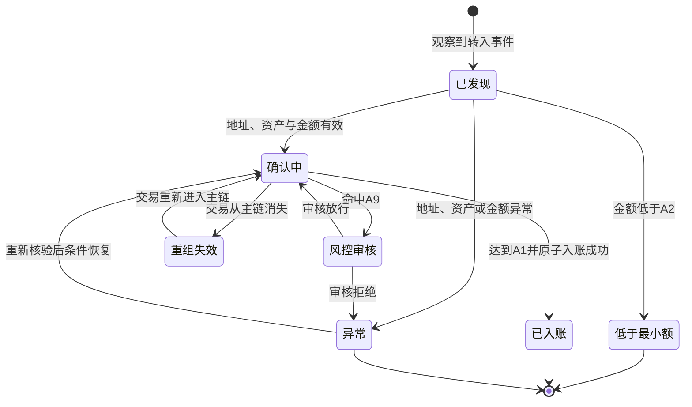
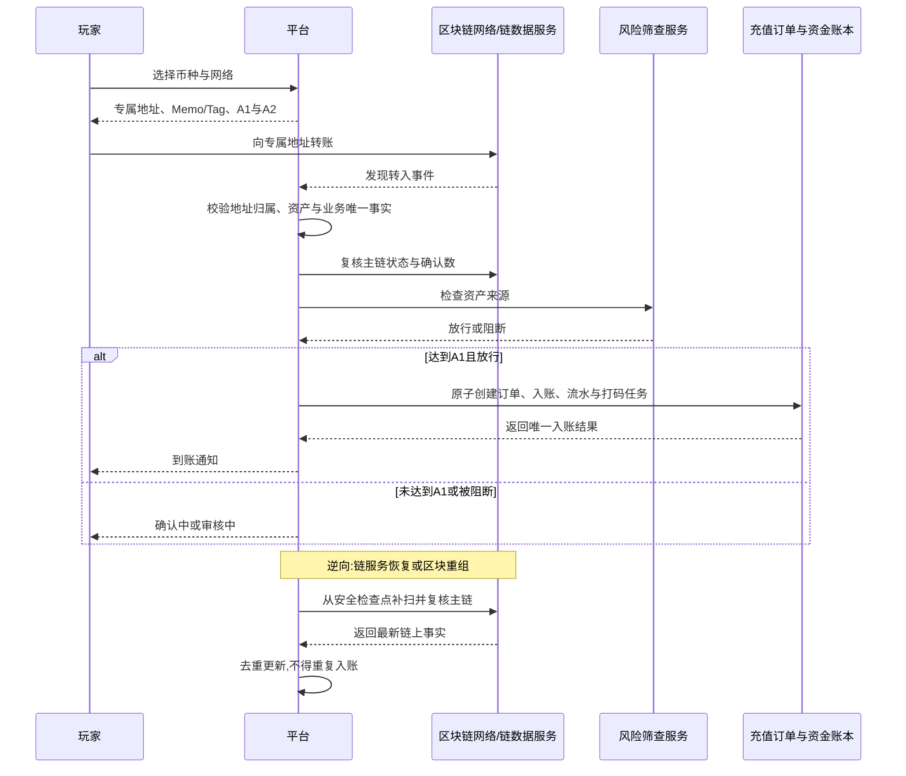

# 5.14 · Crypto入金

## 1. 背景与目标

**目标**:支持玩家通过多条区块链、多个币种向自己的专属地址入金,达到确认条件后自动到账,
同一笔链上资金只入账一次且全程可追溯。

**谁在用**

| 角色 | 用来做什么 | 没有会怎样 |
|---|---|---|
| 玩家 | 获取自己的充值地址并从外部钱包转入资产 | 只能使用法币通道,无法用链上资产充值 |
| 客服 | 按用户、地址或交易哈希确认充值进度 | 玩家说没到账时无法判断是待确认、充错链还是系统漏单 |
| 财务 | 核对链上实收、平台入账与异常记录 | 链上资产与玩家余额无法闭环对账 |
| 风控 | 识别异常来源、重复交易和高风险入金 | 可疑资产可能在发现前已被提现或消费 |

**业务价值**:扩大可接受的支付方式,减少共享地址和人工认领带来的错账,
并把链上事实、充值订单与玩家余额连成可核对的一条链。

**不做什么**

- 不向玩家或后台运营展示助记词、根密钥、私钥或派生密钥
- 不在本页提供链上提现、归集、换币或法币结算能力
- 不承诺找回充错链、充错币或转到历史上从未分配给该玩家的地址的资产
- 不把未达到确认条件的交易提前计入可用余额
- 不定义节点、密钥托管、签名设备和链监听组件的具体技术选型

**适用范围**

| 维度 | 取值 |
|---|---|
| 终端 | 玩家端收银台 + 桌面后台,后台最小宽度 1440 |
| 响应式 | 玩家端需要,后台不需要 |
| 界面语言 | 玩家端跟随站点语言,后台简体中文 |
| 时区 | 链上时间按 UTC 保存,后台按运营时区展示并标注 |
| 货币 | 已启用的链上币种,金额精度按币种配置且最多展示 8 位 |

## 2. 入口

- 菜单:财务管理 → 充值管理 → Crypto入金
- 跳入:充值订单查询中的 Crypto 订单 · 玩家详情的充值记录 · 风控或对账告警
- 玩家入口:收银台 → Crypto充值(**玩家端页面本仓库范围外**)

## 3. 术语

> 钱包、余额、真金、打码任务与账变流水的语义统一引用
> `../../M2-用户管理/2.1-用户列表/资金模型.md`;充值订单与补单引用 `../5.2-充值订单查询/README.md`。
> 链、币种、确认数、资产标识与 RPC 节点的配置入口统一见 `../5.15-Crypto配置/README.md`。

| 术语 | 定义 |
|---|---|
| 托管钱包 | 平台代玩家保管并控制链上密钥的钱包。玩家只有入金地址,不持有私钥 |
| HD钱包 | 可从同一受控根生成大量独立地址的钱包体系;根密钥及派生材料不是产品展示字段 |
| 用户专属地址 | 平台为某玩家在某条链分配的唯一入金地址;能从地址直接归属到玩家 |
| 网络 | 资产实际转移所在的区块链,如 Ethereum、Tron;币种相同但网络不同仍是不同入金路径 |
| 链上事件 | 链上某笔交易中实际转给用户地址的一次资产转移;一笔交易可有多个事件或输出 |
| 确认数 | 该交易所在区块之后已被链接受的区块数量,达到网络配置阈值后才可入账 |
| 重组 | 链上已观察区块被后续主链替换,使交易确认数下降或交易消失 |
| 入账 | 按链上资产配置关联的 `Currency` 找到玩家对应币种钱包,写入实收金额并同时生成充值订单、流水与打码任务 |

## 4. 关键参数与假设

| 编号 | 参数 | 取值 | 依据 | 在哪配 |
|---|---|---|---|---|
| A1 | 入账确认数 | 按网络配置,各网络独立 | 链最终性不同,不能全平台写死 | Crypto网络配置 |
| A2 | 最小入金金额 | 按网络 + 币种配置;低于阈值只记录不自动入账 | **未验证假设** | Crypto币种配置 |
| A3 | 入金手续费 | MVP 为 0,链上实收多少就入账多少 | **未验证假设** | Crypto币种配置 |
| A4 | 地址分配规则 | 每个玩家每条网络一个稳定专属地址;协议要求 Memo/Tag 时地址与 Memo/Tag 共同标识玩家 | 用户已明确要求专属钱包 | 地址规则配置 |
| A5 | 同链多币种地址 | 网络协议允许时共用该玩家在该网络的地址,币种仍按资产标识独立入账 | 避免为每个代币重复派生地址 | 写死 |
| A6 | 监听起点 | 网络启用时记录的起始区块,不得扫描起点之前的历史交易 | **未验证假设** | Crypto网络配置 |
| A7 | 到账时效目标 | 达到 A1 后 2 分钟内完成入账或进入明确异常态 | **未验证假设** | 监控告警配置 |
| A8 | 地址生成时机 | 玩家首次打开该网络充值页时按需分配,重复打开返回原地址 | **未验证假设** | 写死 |
| A9 | 风控处置 | 命中阻断规则时记录实收但不入可用余额,转人工审核 | **未验证假设** | 风控规则配置 |

> A4 的“每个玩家每条网络一个地址”是“每个用户一个 HD 钱包”的产品口径:
> 玩家拥有一个逻辑托管钱包,其中按网络持有地址。地址不是币种钱包余额,同链代币可按 A5 共用地址。

## 5. 字段清单

**筛选字段**

| 字段 | 类型 | 可输入数据与校验 |
|---|---|---|
| 用户ID | text | 数字,精确匹配 |
| 网络 | select | 全部 / 已配置网络,包含已停用网络以便查历史 |
| 币种 | select | 随网络联动,包含已停用币种以便查历史 |
| 充值地址 | text | 完整地址精确匹配,输入前后空格自动去除 |
| 交易哈希 | text | 精确匹配,按网络规则校验格式 |
| 入金状态 | select | 已发现 / 确认中 / 风控审核 / 已入账 / 低于最小额 / 异常 / 重组失效 |
| 异常类型 | select | 不支持币种 / 金额解析失败 / 地址归属冲突 / 入账失败 / 其他 |
| 发现时间 | daterange | 默认近 7 天,按运营时区展示 |
| 入账时间 | daterange | 起止时间,可空 |

**表格列**

| 列 | 说明 | 默认显示 |
|---|---|---|
| 用户ID | 地址所属玩家,可进入玩家详情 | 是 |
| 网络 | 实际发生转账的区块链 | 是 |
| 币种 | 根据链上资产唯一标识识别,不只按展示简称判断 | 是 |
| 平台Currency | 该链上资产关联的 Currency 名称与 currencyCode | 是 |
| 充值地址 | 用户专属地址;默认中间脱敏,可复制完整值 | 是 |
| Memo/Tag | 网络需要时显示;不需要时为空 | 否 |
| 交易哈希 | 可复制并跳转已配置的区块浏览器 | 是 |
| 事件/输出序号 | 区分同一交易中的多次资产转移 | 否 |
| 区块高度 | 首次观察到该事件的区块 | 否 |
| 实收金额 | 链上实际转入金额,带币种和完整有效精度 | 是 |
| 入账金额 | 扣除 A3 后写入玩家钱包的金额 | 是 |
| 当前确认数 | 最新确认进度;已终态记录最终值 | 是 |
| 要求确认数 | 处理当时采用的 A1 快照 | 是 |
| 状态 | 当前链上与入账状态 | 是 |
| 充值订单号 | 入账后生成,可跳到 5.2 | 是 |
| 发现时间 | 首次监听到的时间 | 是 |
| 入账时间 | 余额实际增加的时间 | 是 |
| 异常原因 | 异常态必须有机器可分类、人工可读的原因 | 是 |
| 操作 | 重新核验 · 查看处理轨迹 | 是 |

## 6. 需求清单

| ID | 需求 | 触发条件 | 验收标准 | 权限码 |
|---|---|---|---|---|
| 5.14-R1 | 分配用户专属地址 | 玩家首次打开某网络充值页 | 返回可归属该用户的稳定地址;并发请求不生成两个地址 | `finance:recharge:crypto` |
| 5.14-R2 | 多链多币种展示 | 玩家选择币种与网络 | 只展示已启用组合及对应地址、Memo/Tag、最小额和确认要求 | `finance:recharge:crypto` |
| 5.14-R3 | 发现并登记链上入金 | 监听到专属地址收到资产 | 每个链上事件只登记一次,金额、币种、用户和链上凭据可追溯 | `finance:recharge:crypto` |
| 5.14-R4 | 确认后自动入账 | 确认数达到 A1 且通过校验与风控 | 生成一笔充值订单并原子完成余额、流水和打码任务写入 | `finance:recharge:crypto` |
| 5.14-R5 | 查询入金与处理轨迹 | 进入页面 · 查询 · 翻页 | 可按用户、地址、哈希、网络、币种和状态查到完整处理链 | `finance:recharge:crypto` |
| 5.14-R6 | 重新核验异常记录 | 对未入账记录点击重新核验并填写原因 | 重新读取链上事实但不修改事实;满足条件时仍只入账一次 | `finance:recharge:crypto:recheck` |
| 5.14-R7 | 导出入金记录 | 点击导出 | 导出与当前筛选一致,敏感字段按权限脱敏且不含任何密钥材料 | `finance:recharge:crypto:export` |

## 7. 需求详述

### 5.14-R1

**触发条件**:已登录玩家首次打开某个已启用网络的 Crypto 充值页;或已有玩家再次取地址。

**可输入数据**:当前玩家身份 · 网络;玩家不得提交用户ID、派生序号或自定义地址。

**功能范围**

| 归属 | 做什么 |
|---|---|
| 界面 | 展示网络、地址、二维码、Memo/Tag、风险提示与复制操作 |
| 服务端 | 校验身份与网络状态,分配或返回专属地址,保证用户与网络维度唯一 |

**处理逻辑**

1. 校验玩家已登录、账号可用、网络与至少一个币种组合已启用
2. 已存在该玩家在该网络的地址时返回原记录,不重复生成
3. 不存在时分配新地址;同一玩家并发请求只能成功建立一条有效绑定
4. 地址必须能唯一反查玩家;需要 Memo/Tag 的网络以“地址 + Memo/Tag”共同保证唯一归属
5. 返回 A2、A1、支持币种与“仅使用所选网络”的明确警告
6. 任何响应、日志、导出和运营页面都不得包含根密钥、助记词或私钥

**错误处理**

| 错误状况 | 提示 |
|---|---|
| 网络已停用 | 当前网络暂不可充值,请选择其他网络 |
| 地址暂时无法分配 | 暂时无法生成充值地址,本次请勿转账,稍后重试 |
| 并发重复请求 | 返回首次成功分配的同一地址 |
| 玩家被禁止入金 | 当前账户暂不可充值,请联系客服 |

**测试案例**

- 正向:玩家首次进入 Tron 充值页 → 获得唯一地址;刷新和重新登录后仍返回同一地址
- 正向:同一玩家在 Ethereum 与 Tron 分别打开充值页 → 得到两个网络各自的地址
- 逆向:并发请求同一网络地址 → 只有一个有效绑定,两次响应地址相同
- 逆向:网络停用后新玩家请求地址 → 不分配地址并明确提示不可转账

### 5.14-R2

**触发条件**:玩家进入 Crypto 充值页或切换币种、网络。

**可输入数据**:币种 · 网络;只能选择后台已启用且绑定正确链上资产标识的组合。

**功能范围**

| 归属 | 做什么 |
|---|---|
| 界面 | 联动选项,显示地址、二维码、Memo/Tag、A1、A2 与风险提示 |
| 服务端 | 返回已启用组合及配置快照,拒绝伪造或已停用组合 |

**处理逻辑**

1. 币种与网络是两个独立选择,同名币种跨网络不得合并成一个选项
2. 币种必须绑定网络上的唯一资产标识;不得仅凭 USDT 等展示简称识别资产
3. 按 A5 返回该网络地址,并展示当前组合的 A1、A2
4. 玩家确认页明确提示:网络选错或发送未支持资产可能无法找回

**错误处理**

| 错误状况 | 提示 |
|---|---|
| 组合已停用 | 当前币种暂不支持该网络,请重新选择 |
| 资产标识缺失或冲突 | 当前充值方式配置异常,请勿转账 |
| Memo/Tag 必填但未分配 | 当前充值地址不可用,请勿转账并联系客服 |

**测试案例**

- 正向:USDT 同时启用 Tron 与 Ethereum → 玩家能看到两个网络及各自规则
- 正向:同一 EVM 网络启用原生币与两个代币 → 共用玩家该网络地址,入账币种各自独立
- 逆向:绕过界面请求已停用组合 → 服务端拒绝且不返回可充值信息

### 5.14-R3

**触发条件**:受支持网络观察到资产转入平台已分配的用户专属地址。

**可输入数据**:网络 · 区块高度与哈希 · 交易哈希 · 事件/输出序号 · 收款地址 ·
资产唯一标识 · 原始链上金额 · 发送地址 · 链上时间。

**功能范围**

| 归属 | 做什么 |
|---|---|
| 界面 | 将新记录显示为已发现或确认中,持续显示确认进度 |
| 服务端 | 校验地址归属和资产配置,精确解析金额,去重登记,保存链上原始凭据 |

**处理逻辑**

1. 只处理 A6 起点之后、收款地址属于平台有效地址池的转入事件
2. 通过网络 + 资产唯一标识识别币种,不得只看名称或符号
3. 以“网络 + 交易哈希 + 事件/输出序号 + 资产唯一标识”作为业务唯一事实;
   相同事件无论被轮询、推送或重扫多少次都只登记一次
4. 原始最小单位必须按币种精度准确转换,禁止浮点计算和提前舍入
5. 低于 A2 的记录转为“低于最小额”,保留链上事实但不自动入账
6. 未支持资产转入已知地址时记异常资产,不写入任何玩家币种余额
7. 命中 A9 时转风控审核,确认数可继续累计但不得提前入账

**错误处理**

| 错误状况 | 提示 |
|---|---|
| 地址无归属 | 记平台地址异常并告警,不得猜测用户 |
| 资产未配置 | 记不支持币种异常,不得按同名币种入账 |
| 重复事件 | 返回首次登记结果,不新增第二条记录 |
| 金额无法精确解析 | 进入异常态并告警,不得以近似值入账 |

**测试案例**

- 正向:同一交易向同一用户地址产生两条不同事件 → 按事件分别登记且金额各自准确
- 正向:轮询与推送同时发现同一事件 → 只产生一条入金记录
- 逆向:伪造同名但资产标识不同的代币转入 → 记不支持资产,不按正版代币入账
- 逆向:金额低于 A2 → 可查询但不生成充值订单、不增加余额

### 5.14-R4

**触发条件**:已登记事件达到 A1,且资产、地址、金额和风控状态全部允许入账。

**可输入数据**:入金记录 · 最新主链确认结果 · A1/A2/A3/A9 的处理快照。

**功能范围**

| 归属 | 做什么 |
|---|---|
| 界面 | 展示确认进度、入账结果、充值订单号和可读异常原因 |
| 服务端 | 二次核验链上事实,生成充值订单,原子写余额、流水、打码任务和入账状态 |

**处理逻辑**

1. 入账前重新确认交易仍在主链、确认数达到 A1、收款地址和资产与登记事实一致
2. 读取该链上资产处理时的配置快照,取得稳定的 Currency ID 与 currencyCode;
   不得根据 Symbol 或当前最新映射猜测入金币种
3. 校验 Currency 为 Crypto 类型、状态正常且允许充值;检查 A2、A9 与入金幂等状态;
   任何条件不满足都不得进入余额写入
4. 按链上实收减 A3 计算入账金额,费用为 0 时两者相等;不在此流程换汇
5. 生成来源为 Crypto 的充值订单,保存网络、链上资产标识、Currency ID、currencyCode、
   交易哈希、事件/输出序号、发送与收款地址、区块和确认阈值快照
6. 按用户ID + currencyCode 定位唯一平台钱包;不存在时在本次原子操作内创建,
   已存在时使用原钱包
7. 入该钱包的真金轨,按资金模型创建固定 1 倍打码任务并写账变流水
8. 充值订单、钱包、余额、来源账本、打码任务、流水、入金记录状态必须整笔原子成功
9. 重复执行返回首次结果;不得产生第二笔订单、第二个同币种钱包或第二次余额增加
10. 成功后在 A7 内向玩家发送到账通知;通知失败不回滚已完成入账

**错误处理**

| 错误状况 | 提示 |
|---|---|
| 确认数不足或下降 | 保持确认中,不入账 |
| 交易不在当前主链 | 转重组失效或回到确认中,不入账 |
| 入账环节任一步失败 | 全部回滚并进入可重试异常态,余额不发生半笔变化 |
| 同一事件再次处理 | 返回首次入账结果,余额不重复增加 |
| 风控阻断 | 显示风控审核中,不进入可用余额 |
| Currency缺失、停用或禁止充值 | 转配置异常,只保留链上实收记录,不得写入其他币种钱包 |

**测试案例**

- 正向:USDT-Tron 入金达到 A1 → 生成一笔 Crypto 充值订单,USDT 余额、流水和打码任务一致增加
- 正向:用户尚无 USDT 钱包 → 入账时只创建一个 USDT 钱包并增加余额
- 正向:同一用户从 Tron 和 Ethereum 分别充值映射到同一 Currency 的 USDT → 都进入同一个 USDT 钱包
- 正向:到账通知发送失败 → 入账保持成功,通知可独立重试
- 逆向:资产映射的 Currency 已关闭充值 → 只登记入金并转配置异常,不得转入默认币种
- 逆向:达到 A1 前重复处理多次 → 始终不入账;达到后并发处理 → 只入账一次
- 逆向:余额已写但打码任务写入失败 → 整笔回滚,余额与订单均不留半成品

### 5.14-R6

**触发条件**:持有重新核验权限的运营对未入账记录点击重新核验,填写原因并二次确认。

**可输入数据**:入金记录ID · 原因(必填);不得手工填写金额、币种、地址、哈希或确认数。

**功能范围**

| 归属 | 做什么 |
|---|---|
| 界面 | 展示当前链上事实与将执行的核验动作,收集原因并回显结果 |
| 服务端 | 判权限,重新读取链上事实,按 R3/R4 相同规则处理,记录审计 |

**处理逻辑**

1. 重新核验不是人工改状态,所有链上字段必须重新读取并验证
2. 满足 R4 时允许自动入账;不满足时保持对应状态并返回明确原因
3. 已入账记录只允许核对,不得再次入账
4. 操作人、原因、前后状态与核验结果必须留痕

**错误处理**

| 错误状况 | 提示 |
|---|---|
| 无权限 | 提示无重新核验权限 |
| 未填原因 | 请填写重新核验原因 |
| 链服务不可用 | 本次未改变记录状态,请稍后重试 |
| 已入账记录 | 该记录已入账,本次仅完成一致性核对 |

**测试案例**

- 正向:此前因链服务异常未入账,重新核验时条件完整 → 按 R4 入账且只发生一次
- 逆向:运营试图修改金额后提交 → 不提供字段且服务端拒绝非链上事实输入
- 逆向:两名运营同时重新核验 → 最多一人触发首次入账,另一人返回已有结果

## 8. 数据流向与系统串接

**数据流向**:玩家选择币种与网络 → 平台返回该玩家专属地址 → 玩家从外部钱包转账 →
平台观察并登记链上事件 → 按资产配置取得 Currency → 累计确认并执行风控 → 生成充值订单 →
按用户ID + currencyCode 写入对应币种钱包余额、来源账本、
打码任务与账变流水 → 玩家和后台看到到账结果。

**系统串接**:区块链网络/链数据服务、风险筛查服务、玩家通知能力、5.2 充值订单与资金模型。

- 链上事实以目标网络主链为准;任何第三方推送只作为发现方式,不能单独作为入账凭据
- 平台负责地址归属、资产识别、确认判断、幂等入账和对账;外部钱包只负责发起转账
- 风险服务超时按 A9 的阻断口径处理,不得静默放行
- 链服务中断时保留最后已确认进度,恢复后从安全检查点补扫,不得跳过区块

## 9. 异常与边界

| # | 场景 | 触发条件 | 预期处理 |
|---|---|---|---|
| E1 | 重复发现 | 推送、轮询、补扫同时发现同一事件 | 按 R3 业务唯一事实只登记一次 |
| E2 | 同交易多事件 | 一笔交易包含多个转入事件或输出 | 按事件/输出序号分别识别,不漏记也不把整笔交易重复算入 |
| E3 | 充错网络 | 玩家使用未选择或未支持的网络 | 支持网络且地址可归属时按实际网络识别;不支持时不承诺找回、不入账 |
| E4 | 充入假币或未支持资产 | 同名代币转入用户地址 | 按资产唯一标识判断,记异常资产且不入账 |
| E5 | 低于最小额 | 实收小于 A2 | 记录但不自动入账,页面明确显示原因 |
| E6 | 区块重组 | 入账前交易确认数下降或从主链消失 | 回到确认中或转重组失效,不入账 |
| E7 | 入账后极端重组 | 已入账交易随后从主链消失 | 不静默扣减已消费资金;冻结该币种提现并生成追偿/人工处置记录 |
| E8 | 链服务中断 | 一段时间无法取得新区块 | 告警并暂停该网络自动入账;恢复后从检查点补扫 |
| E9 | 地址归属冲突 | 同一网络地址或地址+Memo/Tag 被绑定给多个玩家 | 阻断相关入金并告警,不得任选一个玩家入账 |
| E10 | 配置中途变更 | 入金确认期间 A1/A2/A3 被修改 | 每次处理保存采用的配置快照;已入账结果不回溯修改 |
| E11 | 不支持精度 | 链上金额超出平台币种可保存精度 | 不舍入入账,进入金额解析异常等待配置修复 |
| E12 | 运营越权 | 无权限账号查询、导出或重新核验 | 服务端拒绝;导出和密钥材料不因界面隐藏而泄露 |
| E13 | Currency映射缺失 | 链上资产未关联 Currency 或历史映射无法读取 | 只登记链上事实并转配置异常,不得记入默认币种 |
| E14 | Currency被停用 | 确认期间平台 Currency 停用或关闭充值 | 暂停自动入账,保留处理快照并转人工复核 |
| E15 | 并发创建钱包 | 用户首次同币种两笔入金同时到账 | 用户 + currencyCode 只创建一个钱包,两笔分别且正确入账 |

## 10. 状态清单

| 状态 | 表现 |
|---|---|
| 确认中 | 显示当前确认数 / A1 与最近更新时间,不得显示“已到账” |
| 风控审核 | 显示“链上已收到,正在审核”,不暴露内部命中规则 |
| 已入账 | 显示入账金额、币种、时间和充值订单号 |
| 低于最小额 | 显示实收与 A2 快照,明确“不自动入账” |
| 网络异常 | 页面顶部标记受影响网络及最后同步时间,其他网络不受影响 |
| 重组失效 | 显示交易已不在当前主链,余额未增加;可重新核验 |
| 错误 | 列表区域内保留筛选条件并允许重试,不整页跳转 |

## 11. 涉及表与职责

**数据归属**

- 拥有(owner=M5):Crypto网络与币种配置 · 用户充值地址绑定 · 链上入金记录 ·
  充值订单 · 资金来源账本 · 账变流水 · 打码任务 · 重新核验审计
- 只读:玩家与账号状态(owner=M2)· 区块、交易、资产与确认事实(owner=区块链网络,
  **本仓库范围外**)· 风险筛查结果(owner=风控,**本仓库范围外**)

> 根密钥、助记词、私钥和派生密钥不是产品查询数据,不得进入业务列表、导出、日志或通用数据库备份。

**前后端职责**

| 事项 | 归属 |
|---|---|
| 玩家身份、地址唯一归属、网络与资产有效性校验 | **服务端** |
| 链上事实复核、确认判断、重组处理与安全补扫 | **服务端** |
| 幂等控制、入账原子性、金额精确计算 | **服务端** |
| 风控判定与提现冻结联动 | **服务端** |
| 权限判定、可见范围过滤与敏感数据脱敏 | **服务端** |
| 币种网络联动、地址与二维码展示、风险提示 | 玩家端界面 |
| 筛选、处理轨迹与重新核验二次确认 | 后台界面 |

## 12. 关联页面

- 跳出:5.2 充值订单查询(按充值订单号)· 5.15 Crypto配置 · 玩家详情弹窗 · 配置中的区块浏览器
- 跳入:5.2 的 Crypto 充值订单 · 玩家详情充值记录 · 风控与对账告警
