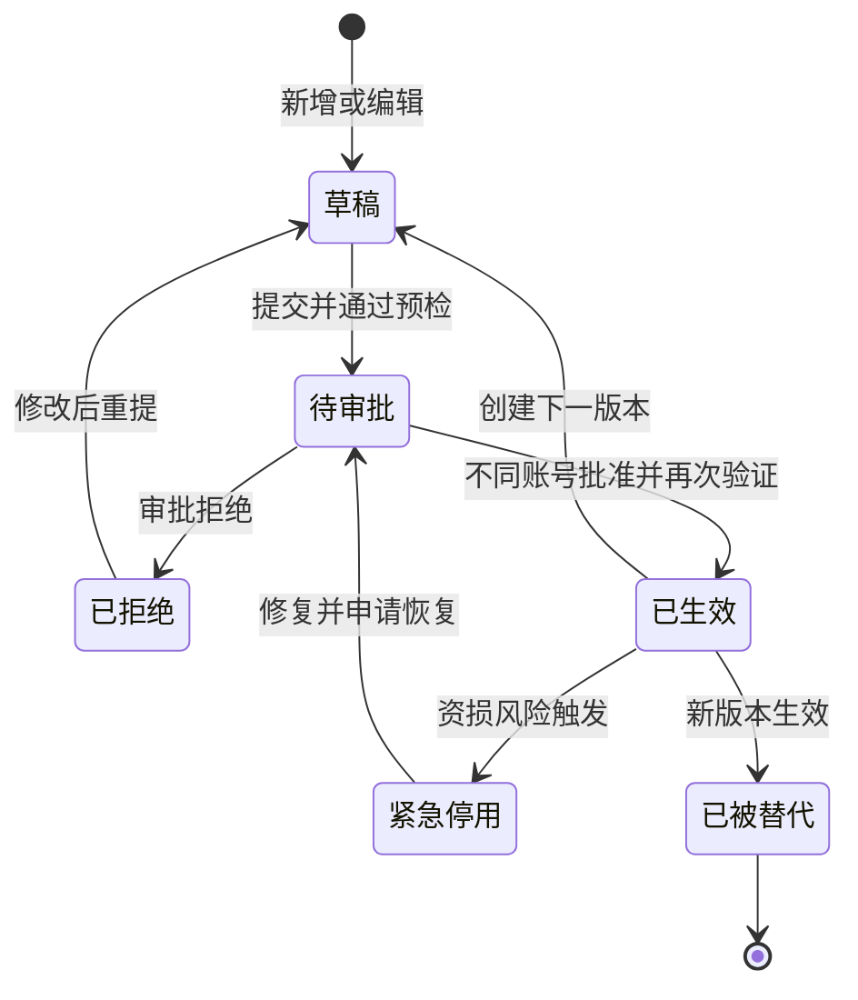
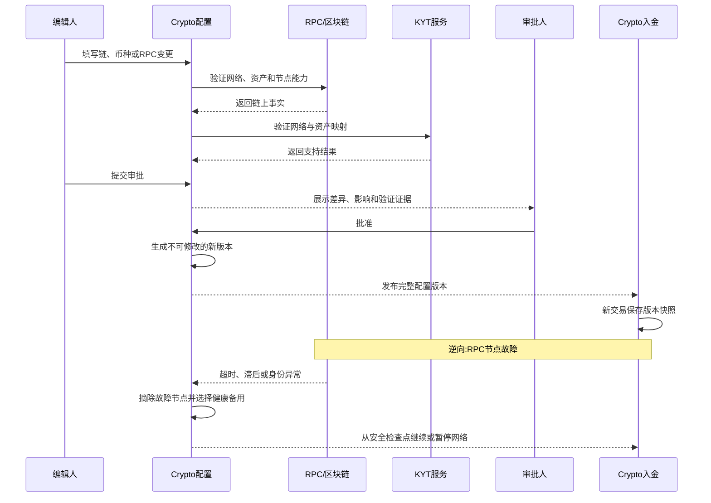

# 5.15 · Crypto配置

## 1. 背景与目标

**目标**:让授权人员在后台安全配置 Crypto 入金支持的链、币种和 RPC 节点,
配置错误在生效前被拦截,单个节点故障时入金监听能够继续运行。

**谁在用**

| 角色 | 用来做什么 | 没有会怎样 |
|---|---|---|
| 技术运营 | 上线新链、币种和节点,调整确认与最小入金规则 | 每次变更都要改代码发版,配置错误无法提前发现 |
| 财务 | 控制哪些币种允许入金及其到账规则 | 入金口径不透明,无法解释未到账或金额差异 |
| 风控/合规 | 绑定链上风控资产标识并控制高风险网络 | 交易可能绕过 KYT 或被识别成错误资产 |
| 审批人 | 复核合约、精度、确认数和 RPC 等高风险改动 | 单人误操作即可造成错币入账、漏扫或重复入账 |

**业务价值**:在不发版的情况下扩展多链多币种,同时通过验证、双人审批、版本快照和节点冗余
降低错账、漏账、资损与服务中断风险。

**不做什么**

- 不展示、导入或管理助记词、根密钥、私钥和派生私钥
- 不在本页执行链上归集、提现、Gas 补充或交易签名
- 不提供任意 RPC 调试控制台,运营不能在后台提交自定义节点请求
- 不自动决定某条链或某个币种是否合法合规,上线前仍需业务所属地区的合规审批
- 不允许通过改配置回溯重算已经登记或已经入账的历史交易

**适用范围**

| 维度 | 取值 |
|---|---|
| 终端 | 桌面后台,最小宽度 1440 |
| 响应式 | 否 |
| 界面语言 | 简体中文 |
| 时区 | UTC 保存,后台按运营时区展示并标注 |
| 货币 | 所有拟支持的链上币种,金额规则必须带网络与币种标识 |

## 2. 入口

- 菜单:财务管理 → 充值管理 → Crypto配置
- 跳入:5.14 Crypto入金的配置异常 · RPC健康告警 · Crypto入金页的网络或币种链接

## 3. 术语

> Crypto 入金、网络、确认数、链上事件和资产标识的业务语义引用
> `../5.14-Crypto入金/README.md`;资金语义引用
> `../../M2-用户管理/2.1-用户列表/资金模型.md`。

| 术语 | 定义 |
|---|---|
| 链配置 | 某个区块链网络的身份、确认、地址、监听和展示规则 |
| 币种配置 | 某个网络上的原生币或 Token 与平台 `Currency` 之间的唯一映射及入金规则 |
| Currency | 平台货币主数据,以稳定 ID 标识,以 `currencyCode` 定位玩家对应币种钱包;本页只引用不创建 |
| RPC节点 | 平台读取区块、交易、回执和事件所使用的链数据入口;不承担玩家余额记账 |
| 节点用途 | 节点允许承载的任务类型,如历史补扫、实时订阅、交易复核;未授权用途不得调用 |
| 节点优先级 | 多个健康节点同时可用时的选用顺序;不是区块链共识权重 |
| 区块落后量 | 该节点最新高度与同链健康基准高度的差,用于识别数据滞后 |
| 配置版本 | 一次获批并生效的完整配置快照;历史入金保留当时采用的版本 |
| 紧急停用 | 发现资损风险时立即停止新地址展示和新入金入账;已观察交易仍保留事实记录 |

## 4. 关键参数与假设

| 编号 | 参数 | 取值 | 依据 | 在哪配 |
|---|---|---|---|---|
| A1 | RPC健康检查周期 | 30 秒 | **未验证假设** | 系统级 Crypto 配置 |
| A2 | 单次 RPC 超时 | 10 秒 | **未验证假设** | 每个 RPC 节点,可继承系统默认 |
| A3 | 节点落后阈值 | 按链配置,默认 5 个区块 | **未验证假设**,不同链出块速度不同 | 链配置 |
| A4 | 自动摘除阈值 | 连续 3 次健康检查失败 | **未验证假设** | 系统级 Crypto 配置 |
| A5 | 启用网络的节点下限 | 至少 2 个来自独立供应源的健康节点 | 规避单节点故障 | 链配置 |
| A6 | 高风险配置审批 | 提交人与审批人必须是不同账号,一人不得自批 | 资金安全四眼原则 | 写死 |
| A7 | 配置生效方式 | 审批通过后生成新版本并立即生效;历史处理不回溯 | 保证规则可追溯 | 写死 |
| A8 | Token精度 | 首次配置时必须与链上元数据一致;产生入金后不可直接修改 | 防止数量级错账 | 币种配置 |
| A9 | RPC密钥展示 | 保存后永不回显明文,只展示脱敏结果 | 凭据安全要求 | 写死 |
| A10 | 紧急停用时效 | 授权操作确认后 1 分钟内阻止新入金自动入账 | **未验证假设** | 监控告警配置 |
| A11 | 测试网隔离 | 测试网与主网配置、地址和交易完全隔离;生产默认不展示测试网 | 防止测试资产混入生产 | 写死 |

> A1–A5 是初始运行参数,上线前必须按每条链的出块、限流和最终性实测校准。
> 降低确认数、修改资产标识/精度、启用网络或币种、编辑 RPC 凭据均按 A6 审批。

## 5. 字段清单

本页分三个 tab:**链配置 · 币种配置 · RPC节点**。三个 tab 共用配置版本和审批轨迹,
但权限分别判定。

**筛选字段**

| 字段 | 类型 | 可输入数据与校验 |
|---|---|---|
| 配置类型 | select | 链 / 币种 / RPC节点,随当前 tab 固定 |
| 网络 | select | 全部 / 所有已创建网络,包含停用项 |
| 币种 | select | 币种 tab 可用,按网络联动 |
| 平台Currency | select | 币种 tab 可用,按 Currency ID 或 currencyCode 筛选 |
| 状态 | select | 草稿 / 待审批 / 已启用 / 已停用 / 配置异常 |
| RPC健康状态 | select | RPC tab 可用:健康 / 降级 / 不健康 / 未检测 / 已摘除 |
| 关键词 | text | 匹配网络名称、币种、节点名称或供应商,去除首尾空格 |
| 更新时间 | daterange | 起止时间,按运营时区展示 |

**表格列**

| 列 | 说明 | 默认显示 |
|---|---|---|
| 配置对象 | 网络、币种或节点的业务名称 | 是 |
| 唯一标识 | 网络代码、链上资产标识或节点ID | 是 |
| 所属网络 | 币种和 RPC 节点所属的链 | 是 |
| 平台Currency | 关联的 Currency 名称与 currencyCode | 是 |
| 状态 | 当前业务状态或健康状态 | 是 |
| 生效版本 | 当前采用的配置版本 | 是 |
| 更新人 | 最近提交变更的账号 | 是 |
| 审批人 | 最近批准变更的账号;未审批为空 | 是 |
| 更新时间 | 最近变更时间 | 是 |
| 操作 | 查看 · 编辑 · 提交审批 · 审批 · 启停 · 测试连接 | 是 |

**链配置 · 表单字段**

| 字段 | 必填 | 规则 |
|---|---|---|
| 网络代码 | 是 | 平台内部稳定标识,创建后不可修改,主网与测试网不得复用 |
| 网络名称 | 是 | 玩家端展示名称,同环境不可重复 |
| 网络族 | 是 | EVM / Tron / Bitcoin / Solana / TON / 其他;决定可用地址与事件能力 |
| Chain ID / 网络标识 | 按网络族 | 必须能通过健康 RPC 验证;不得与已有网络冲突 |
| 环境 | 是 | 主网 / 测试网,按 A11 隔离 |
| 原生币 | 是 | 绑定本网络原生资产,需先保存链后再建币种配置 |
| 地址归属模式 | 是 | 独立地址 / 共享地址 + Memo/Tag;必须与 5.14 地址规则一致 |
| 默认确认数 | 是 | 正整数;降低时属于高风险变更 |
| 最终性模式 | 是 | 按确认数 / 链已确认标记 / 两者组合;取决于网络能力 |
| 区块落后阈值 | 是 | A3,正整数 |
| 监听起始高度 | 是 | 首次启用前填写;启用后只允许通过受控补扫流程调整 |
| 区块浏览器交易模板 | 否 | 必须包含交易哈希占位符,只允许 HTTPS |
| 区块浏览器地址模板 | 否 | 必须包含地址占位符,只允许 HTTPS |
| KYT网络映射 | 是 | 与风控供应商支持的网络唯一标识对应 |
| 入金状态 | 是 | 启用 / 停用;启用前必须满足 A5 |

**币种配置 · 表单字段**

| 字段 | 必填 | 规则 |
|---|---|---|
| 所属网络 | 是 | 已创建网络,产生入金后不可迁移到其他网络 |
| 关联平台Currency | 是 | 保存稳定的 Currency ID;只可选择 `type=crypto`、状态正常且允许充值的 Currency |
| Currency Code | 自动 | 由所选 Currency 带出,只读;用于定位玩家对应币种钱包,如 USDT |
| 展示名称 / Symbol | 是 | 用于玩家端展示;Symbol 不能作为链上唯一识别依据 |
| 资产类型 | 是 | 原生币 / Token |
| 链上资产标识 | Token必填 | 合约地址或该链等价唯一标识;同网络不得重复 |
| Decimals | 是 | A8;通过健康 RPC 与链上元数据验证 |
| 最小入金金额 | 是 | 大于等于 0,精度不得超过 Decimals |
| 入金手续费 | 是 | 大于等于 0;不得大于最小入金金额 |
| 确认数覆盖 | 否 | 留空继承链默认;填写后必须为正整数 |
| KYT资产映射 | 是 | 与风控供应商资产标识一致;缺失不得启用 |
| 玩家风险提示 | 是 | 明确网络、资产和充错不可找回风险 |
| 展示顺序 | 是 | 正整数,只影响玩家端排序 |
| 入金状态 | 是 | 启用 / 停用;所属网络停用时币种不得对玩家可用 |

**RPC节点 · 表单字段**

| 字段 | 必填 | 规则 |
|---|---|---|
| 所属网络 | 是 | 节点验证出的网络身份必须与所选网络一致 |
| 节点名称 | 是 | 同网络内唯一,用于告警和审计 |
| 供应商 | 是 | 自建或第三方供应商名称,用于 A5 独立性判断 |
| HTTP地址 | 按用途 | 只允许 HTTPS;保存后按 A9 脱敏,不可复制明文 |
| WSS地址 | 按用途 | 实时订阅需要;只允许 WSS,保存后按 A9 脱敏 |
| 鉴权凭据 | 按供应商 | 单独录入,保存后不回显;不得拼接显示在列表或日志中 |
| 节点用途 | 是 | 实时订阅 / 区块读取 / 交易复核 / 历史补扫,可多选 |
| 优先级 | 是 | 正整数,数值越小优先级越高 |
| 权重 | 是 | 同优先级节点的分配权重,大于 0 |
| 单次超时 | 是 | A2,在允许范围内配置 |
| 限流参数 | 是 | 每秒和每日允许量;超过后主动切换而非持续撞限流 |
| 启用状态 | 是 | 启用 / 停用;不得停用某网络最后一个健康读取节点 |

**RPC健康字段**

| 字段 | 说明 | 默认显示 |
|---|---|---|
| 健康状态 | 健康 / 降级 / 不健康 / 未检测 / 已摘除 | 是 |
| 响应延迟 | 最近健康检查耗时 | 是 |
| 节点最新高度 | 节点返回的最新区块高度 | 是 |
| 同链基准高度 | 多个健康来源形成的对照高度 | 是 |
| 区块落后量 | 节点高度与基准高度的差 | 是 |
| 连续失败次数 | 用于 A4 自动摘除 | 是 |
| 最近成功时间 | 最近一次通过完整校验的时间 | 是 |
| 最近错误 | 脱敏后的错误分类与摘要,不得包含凭据 | 是 |
| 当前承载用途 | 正在承担实时监听、复核或补扫中的哪些任务 | 否 |

## 6. 需求清单

| ID | 需求 | 触发条件 | 验收标准 | 权限码 |
|---|---|---|---|---|
| 5.15-R1 | 查看配置与版本 | 进入页面 · 切换 tab · 查询 | 链、币种、RPC、版本和健康状态可追溯,敏感字段脱敏 | `finance:recharge:crypto-config` |
| 5.15-R2 | 新增编辑链配置 | 点击新增/编辑并提交 | 网络身份、确认、地址和监听规则完整校验,不直接覆盖生效版本 | `finance:recharge:crypto-config:edit-chain` |
| 5.15-R3 | 新增编辑币种配置 | 点击新增/编辑并提交 | 链上资产唯一关联一个可充值 Currency;精度经链上验证,同名假币不能映射为正版币种 | `finance:recharge:crypto-config:edit-asset` |
| 5.15-R4 | 新增编辑RPC节点 | 点击新增/编辑并测试 | 网络身份、用途与连接通过验证,凭据保存后不回显 | `finance:recharge:crypto-config:edit-rpc` |
| 5.15-R5 | RPC健康检查与自动切换 | 定时检查 · 调用失败 · 节点恢复 | 异常节点按 A4 摘除,健康节点承接任务,恢复后经检查再加入 | `finance:recharge:crypto-config` |
| 5.15-R6 | 提交与审批配置 | 提交审批 · 审批通过/拒绝 | 按 A6 双人复核,通过后生成 A7 版本,拒绝不影响当前版本 | `finance:recharge:crypto-config:approve` |
| 5.15-R7 | 启用链或币种 | 对待启用配置提交并审批 | 节点、资产、风控和地址规则全部就绪后才对玩家开放 | `finance:recharge:crypto-config:enable` |
| 5.15-R8 | 紧急停用 | 点击紧急停用并二次确认 | A10 内阻止新入金自动入账,历史事实不删除,操作完整留痕 | `finance:recharge:crypto-config:disable` |
| 5.15-R9 | 手动测试RPC | 点击测试连接 | 返回网络身份、最新高度、延迟与能力结果,不泄露凭据 | `finance:recharge:crypto-config:test-rpc` |

## 7. 需求详述

### 5.15-R2

**触发条件**:持有链编辑权限的账号新增或编辑链配置并提交。

**可输入数据**:第 5 段链配置表单字段;网络代码、环境及已经产生入金的网络身份不可修改。

**功能范围**

| 归属 | 做什么 |
|---|---|
| 界面 | 字段联动、格式提示、展示改动前后差异和影响范围 |
| 服务端 | 唯一性、权限和状态校验,通过健康 RPC 验证网络身份,生成待审批变更 |

**处理逻辑**

1. 新增时校验网络代码、名称、网络身份与环境不冲突
2. 至少通过两个独立健康节点读取一致的网络身份后,才允许提交启用申请
3. 编辑时展示当前生效值、拟变更值及受影响的币种、地址和监听任务数量
4. 已产生地址或入金后,网络代码、环境、地址归属模式与网络身份不可原地修改;
   需要更换时创建新网络配置并迁移业务
5. 降低确认数、修改最终性和监听起点必须标为高风险变更并填写理由
6. 保存只形成草稿或待审批版本,不直接影响 5.14

**错误处理**

| 错误状况 | 提示 |
|---|---|
| Chain ID/网络身份与节点不一致 | 节点实际网络与所选网络不一致,不可保存 |
| 独立健康节点不足 A5 | 当前节点冗余不足,不可启用该网络 |
| 修改不可变身份字段 | 该网络已有地址或交易,请创建新网络配置 |
| 监听起点高于当前区块 | 监听起始高度不可超过当前链高度 |

**测试案例**

- 正向:创建新 EVM 主网,两个独立节点返回相同 Chain ID → 可提交审批但尚未对玩家开放
- 逆向:RPC 实际连接测试网而配置为主网 → 拒绝保存
- 逆向:已有入金后修改 Chain ID → 拒绝并提示创建新配置

### 5.15-R3

**触发条件**:持有币种编辑权限的账号新增或编辑币种配置并提交。

**可输入数据**:第 5 段币种配置字段;关联项保存 Currency ID,
链上资产标识与 Decimals 以目标网络事实为准。

**功能范围**

| 归属 | 做什么 |
|---|---|
| 界面 | 网络联动、金额精度校验、展示链上验证结果与变更差异 |
| 服务端 | 验证资产存在、唯一标识、Decimals、风控映射及 Currency 关系 |

**处理逻辑**

1. 原生币按网络身份识别;Token 必须以合约地址或该链等价唯一标识识别
2. 通过至少两个独立健康节点验证资产存在及 A8,两边结果不一致时不得提交
3. 每条链上资产配置必须关联一个 Currency ID;同一网络的资产唯一标识只能关联一个 Currency
4. 同一个 Currency 可以关联多条网络上的等价资产,如 Ethereum-USDT 与 Tron-USDT
   都关联平台 USDT Currency;这表示同一计价资产的跨链入口,不是换汇
5. 禁止把不同计价资产直接映射后按 1:1 入账,如 USDC 不得通过配置直接记入 USDT 或 BRL;
   需要兑换时必须走独立闪兑订单和汇率规则
6. 只有 `type=crypto`、状态正常且允许充值的 Currency 才能启用;
   Currency 被停用或关闭充值后,对应链上资产立即停止向玩家展示
7. KYT 网络与资产映射缺失时允许保存草稿,但不得启用
8. 已产生入金后不得修改所属网络、资产标识、Decimals 或 Currency 关联;通过新配置替代旧配置
9. 调整最小额、手续费或确认数只影响新观察到的入金,历史记录保留原配置快照

**错误处理**

| 错误状况 | 提示 |
|---|---|
| 合约不存在或无法读取 | 未在目标网络验证到该资产,不可提交 |
| Decimals 与链上不一致 | 币种精度与链上结果不一致,请更正 |
| 资产标识重复 | 该链上资产已绑定其他平台币种 |
| Currency不可充值 | 该平台货币已停用或不允许充值,不可启用此链上资产 |
| 非等价资产映射 | 链上资产与平台 Currency 不是同一计价资产,不可直接关联 |
| KYT映射缺失 | 可保存草稿,但不可启用入金 |

**测试案例**

- 正向:新增 USDT Token,合约和 Decimals 在两个节点验证一致 → 可提交审批
- 正向:Ethereum-USDT 与 Tron-USDT 分别关联同一个 USDT Currency → 两条链入金都进入用户 USDT 钱包
- 逆向:使用同 Symbol 的假 USDT 合约 → 只能作为新资产处理,不得覆盖正版 USDT
- 逆向:把 USDC 合约关联到 USDT Currency → 拒绝,不得按 1:1 当成 USDT 入账
- 逆向:已有入金后把 Decimals 从 6 改为 18 → 拒绝,避免数量级错账

### 5.15-R4

**触发条件**:持有 RPC 编辑权限的账号新增、编辑或更换节点地址及凭据。

**可输入数据**:第 5 段 RPC 表单字段;地址与凭据只允许写入,保存后不可读取明文。

**功能范围**

| 归属 | 做什么 |
|---|---|
| 界面 | 安全录入、脱敏展示、测试连接、展示能力与影响范围 |
| 服务端 | 校验协议和网络身份,保护凭据,验证用途能力,生成待审批变更 |

**处理逻辑**

1. 地址仅允许 HTTPS/WSS,禁止明文协议、本地地址和未批准的内网目标
2. 测试网络身份、最新高度、历史查询和订阅等已选择用途;部分能力失败则不得勾选该用途
3. 凭据与普通配置分离保护;列表、详情、导出、操作日志和错误日志均不得出现明文
4. 编辑凭据时只能整体替换,不能读取或复制旧值
5. 保存后先处于未启用/待审批,不得立即承载生产监听
6. 停用前校验 A5 及当前任务;会导致网络失去安全数据源时拒绝普通停用

**错误处理**

| 错误状况 | 提示 |
|---|---|
| 网络身份不匹配 | 节点连接的不是所选网络,不可保存 |
| 协议不安全 | 仅支持 HTTPS/WSS 安全连接 |
| 用途能力不足 | 节点不支持所选用途,请调整用途或更换节点 |
| 停用最后健康节点 | 当前网络没有足够备用节点,不可停用 |

**测试案例**

- 正向:新增备用节点,网络身份和用途测试通过 → 待审批,批准后加入健康检查
- 正向:保存后重新打开 → URL 和凭据均为脱敏值,无法从页面取回
- 逆向:节点 URL 指向错误网络 → 测试失败且不可启用

### 5.15-R5

**触发条件**:按 A1 定时检查、生产调用失败、节点限流、节点恢复或同链高度出现分歧。

**可输入数据**:节点响应、网络身份、最新高度、延迟、错误分类与同链其他节点的对照结果。

**功能范围**

| 归属 | 做什么 |
|---|---|
| 界面 | 实时展示健康、落后、摘除、恢复和当前承载用途,异常可跳到处理轨迹 |
| 服务端 | 持续健康检查,识别错误网络/滞后/超时/限流,按优先级切换并告警 |

**处理逻辑**

1. 健康不能只看“能连接”,必须同时校验网络身份、区块高度、延迟和所需能力
2. 达到 A3 标记降级;达到 A4 或身份错误立即停止分配新任务
3. 从剩余健康节点中按优先级和权重选择替代,同一入金事件仍按 5.14 幂等规则处理
4. 切换前后保存最后安全检查点,恢复监听后不得跳过区块
5. 节点恢复后先完成连续健康检查与高度追平,再重新承载生产任务
6. 全部节点不可用时暂停该网络自动入账并告警;已发现记录保留,不得猜测确认结果

**错误处理**

| 错误状况 | 提示 |
|---|---|
| 单节点超时或限流 | 自动切换健康节点,记录原因 |
| 多节点高度分歧 | 采用安全口径暂停确认推进并告警,不得选最高值直接入账 |
| 全部节点不可用 | 该网络监听异常,自动入账暂停 |
| 恢复后存在区块缺口 | 从安全检查点补扫完成前保持网络降级 |

**测试案例**

- 正向:主节点连续失败达到 A4 → 自动摘除并由备用节点继续监听,同一交易不重复入账
- 逆向:两个节点报告高度差超过 A3 → 暂停确认推进而不是采用更高结果
- 正向:节点恢复并追平 → 自动重新加入,完整记录摘除与恢复轨迹

### 5.15-R6

**触发条件**:编辑人提交配置;审批人查看差异并批准或拒绝。

**可输入数据**:变更对象 · 变更前后值 · 提交理由 · 审批意见;敏感值只显示“已新增/已替换”。

**功能范围**

| 归属 | 做什么 |
|---|---|
| 界面 | 展示字段级差异、影响范围、验证结果,收集审批意见和二次确认 |
| 服务端 | 按 A6 判定职责分离,审批时重新校验依赖,生成 A7 配置版本并留痕 |

**处理逻辑**

1. 提交前完成字段、链上事实、节点能力和依赖检查
2. 审批人不得是提交人;界面隐藏不替代服务端判定
3. 审批时重新验证依赖,防止等待期间节点、网络或上游配置已经变化
4. 通过后生成不可修改的配置版本,记录提交人、审批人、理由、差异和验证证据
5. 5.14 的每笔入金保存实际采用的配置版本,新版本不回溯修改历史
6. 拒绝时保留当前生效版本,草稿可修改后重新提交

**错误处理**

| 错误状况 | 提示 |
|---|---|
| 提交人审批自己 | 提交人与审批人必须为不同账号 |
| 审批时验证已失效 | 配置依赖已变化,请修正后重新提交 |
| 并发审批 | 只接受第一次有效决定,后续返回当前结果 |
| 生效通知失败 | 新版本不得呈现部分生效;保持旧版本并告警 |

**测试案例**

- 正向:账号 A 提交、账号 B 批准 → 生成新版本并完整留痕
- 逆向:账号 A 尝试审批自己的变更 → 服务端拒绝
- 逆向:审批期间资产合约验证不再一致 → 不生效,旧配置继续运行

### 5.15-R8

**触发条件**:持有紧急停用权限的账号对链或币种执行紧急停用并二次确认。

**可输入数据**:停用对象 · 原因(必填) · 事件/工单号(可选)。

**功能范围**

| 归属 | 做什么 |
|---|---|
| 界面 | 显示受影响币种、玩家地址和处理中入金数量,强警示并二次确认 |
| 服务端 | 判权限,按 A10 阻止新自动入账和玩家新转账引导,保留监听事实并告警 |

**处理逻辑**

1. 紧急停用可绕过普通发布等待,但必须有独立权限、二次确认、原因和完整审计
2. 玩家端立即隐藏或禁用对应充值入口,明确提示暂停充值
3. 新发现交易仍登记链上事实,但进入“网络/币种停用待处理”,不得自动入账
4. 停用前已入账订单不回滚;确认中和风控中的记录逐笔保留当前状态
5. 恢复必须走 R6 双人审批并完成节点、资产和积压区块复核

**错误处理**

| 错误状况 | 提示 |
|---|---|
| 无紧急权限 | 提示无紧急停用权限 |
| 未填原因 | 请填写停用原因 |
| 停用传播超过 A10 | 立即升级告警,默认暂停对应网络入账 |

**测试案例**

- 正向:发现节点返回错误网络后紧急停链 → A10 内停止玩家入口与自动入账,链上记录不丢失
- 逆向:普通编辑权限账号尝试紧急停用 → 服务端拒绝
- 正向:恢复时补扫停用期间区块 → 交易先登记、去重和风控,不会直接批量盲入账

## 8. 数据流向与系统串接

**数据流向**:编辑人填写链、币种或 RPC 配置 → 服务端验证格式、网络身份、资产与节点能力 →
提交审批 → 不同账号复核 → 生成生效版本 → 5.14 地址展示、监听、确认、风控和入账读取该版本 →
每笔入金保存配置版本快照 → RPC 健康状态和配置异常回流本页。

**系统串接**:区块链网络/RPC供应商、KYT 风控服务、系统币种配置、5.14 Crypto入金、
全站操作日志和告警能力。

- RPC 只提供链上读取事实,不能直接修改玩家余额
- KYT 映射必须同时匹配网络和资产,缺失或失效时不得启用币种
- `Currency` 决定玩家钱包使用的 `currencyCode`;本页保存链上资产到 Currency ID 的稳定关联
- 5.14 入账使用配置快照中的 Currency ID 和 currencyCode 定位玩家钱包,
  不根据 Symbol 猜币种,也不进行隐式换汇
- 配置发布失败必须保持旧版本整体有效,不能让不同监听任务读取一半新、一半旧配置
- 所有外部服务异常都要返回明确状态,不得把“查不到”当成“无风险”或“交易不存在”

## 9. 异常与边界

| # | 场景 | 触发条件 | 预期处理 |
|---|---|---|---|
| E1 | 错配主网测试网 | 节点网络身份与配置环境不一致 | 拒绝保存或启用,按 A11 隔离 |
| E2 | 假币同名 | Symbol 相同但资产唯一标识不同 | 不得覆盖现有币种或关联正版 Currency,作为独立未知资产处理 |
| E3 | Token精度错误 | 填写 Decimals 与链上不一致 | 按 A8 拒绝提交 |
| E4 | 单节点运行 | 启用网络时独立健康供应源少于 A5 | 拒绝启用 |
| E5 | RPC凭据泄露 | 页面、导出或错误日志尝试返回密钥 | 按 A9 脱敏或拒绝,记录安全告警 |
| E6 | 全节点不可用 | 所有节点被摘除或限流 | 暂停确认推进与自动入账,恢复后补扫 |
| E7 | 多节点分叉 | 健康节点报告不一致的链事实 | 采用安全口径暂停,不得以多数或最高高度盲目入账 |
| E8 | 并发编辑 | 两人基于同一旧版本提交不同修改 | 后提交者发现版本过期,重新加载差异后再提交 |
| E9 | 自审 | 提交人与审批人为同一账号 | 按 A6 服务端拒绝 |
| E10 | 历史配置被覆盖 | 新版本修改确认数、费用或资产规则 | 只作用于新交易,历史记录保留 A7 快照 |
| E11 | 最后节点被停用 | 普通停用会使网络低于 A5 | 拒绝;资损场景使用 R8 停整条链 |
| E12 | 降确认数后重组风险增大 | 提交降低默认确认数 | 标高风险并展示影响,需不同账号审批 |
| E13 | 恶意RPC返回伪造事实 | 单一节点与其他来源持续不一致 | 摘除节点、暂停受影响任务并生成安全告警 |
| E14 | 停用期间用户继续转账 | 玩家复用历史地址入金 | 继续登记事实但不自动入账,恢复后逐笔复核 |
| E15 | Currency状态变化 | 已映射 Currency 被停用或关闭充值 | 玩家端停止展示,新入金只登记不入账;恢复后逐笔复核 |
| E16 | 错误Currency关联 | 资产配置拟从一个 Currency 改绑另一个 | 已有入金时拒绝原地改绑,创建新版本并人工处置存量 |

## 10. 状态清单

| 状态 | 表现 |
|---|---|
| 草稿 | 仅编辑人和有查看权限者可见,不影响生产 |
| 待审批 | 只读展示字段差异、影响和验证证据,提交人不可审批 |
| 配置异常 | 标明网络、资产、KYT 或节点哪一项未通过,不可启用 |
| 节点降级 | 显示延迟、落后量和当前是否仍承载任务 |
| 节点已摘除 | 显示摘除原因、时间、替代节点和恢复检查进度 |
| 网络紧急停用 | 顶部持续强提示受影响币种、积压交易和停用原因 |
| 密钥字段 | 始终脱敏,编辑时只能替换;不存在查看明文状态 |
| 错误 | 当前 tab 保留筛选和草稿,外部验证失败可重试且不丢输入 |

## 11. 涉及表与职责

**数据归属**

- 拥有(owner=M5):Crypto链配置 · Crypto币种映射 · RPC节点元数据 · RPC健康记录 ·
  配置草稿/审批/版本 · 紧急停用记录
- 只读:平台 `Currency`、currencyCode、类型、状态与充值开关(owner=系统设置,
  **本仓库范围外**)· 网络、区块、资产元数据和节点能力
  (owner=区块链/RPC供应商,**本仓库范围外**)· KYT 网络与资产支持清单(owner=风控,
  **本仓库范围外**)

> RPC鉴权凭据是受保护的运行凭据,不属于可查询业务数据。业务数据只保存凭据引用和脱敏摘要,
> 不允许通过数据库查询、页面、导出或日志还原明文。

**前后端职责**

| 事项 | 归属 |
|---|---|
| 权限、职责分离、版本并发与状态校验 | **服务端** |
| 网络身份、资产、Decimals 和 RPC 能力验证 | **服务端** |
| RPC凭据保护、脱敏和安全目标限制 | **服务端** |
| 健康检查、故障摘除、切换和安全检查点 | **服务端** |
| 配置原子发布、版本快照与历史不回溯 | **服务端** |
| 字段联动、差异展示、影响提示和二次确认 | 界面 |
| 健康状态、审批轨迹和异常的可视化 | 界面 |

## 12. 关联页面

- 跳出:5.14 Crypto入金(查看配置影响与异常记录)· 5.2 充值订单查询 · 全站操作日志
- 跳入:5.14 配置异常 · RPC健康告警 · 网络或币种停用告警
