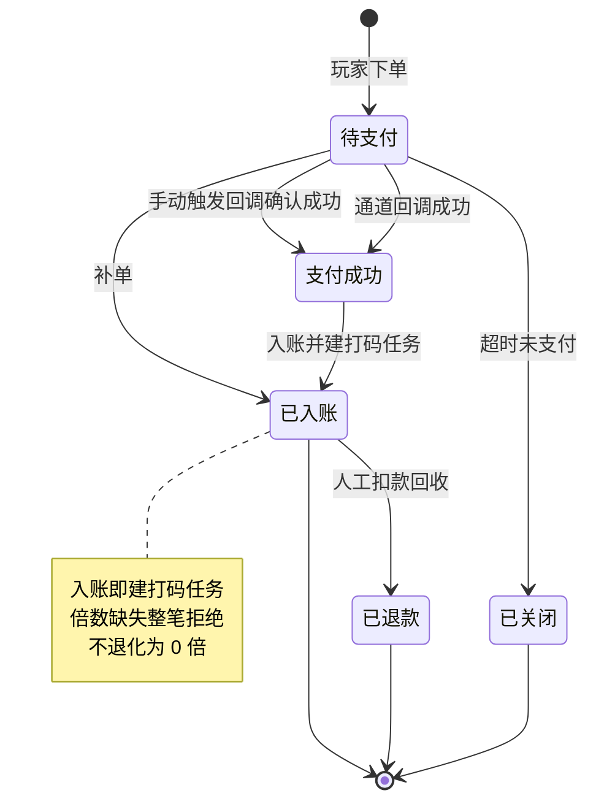
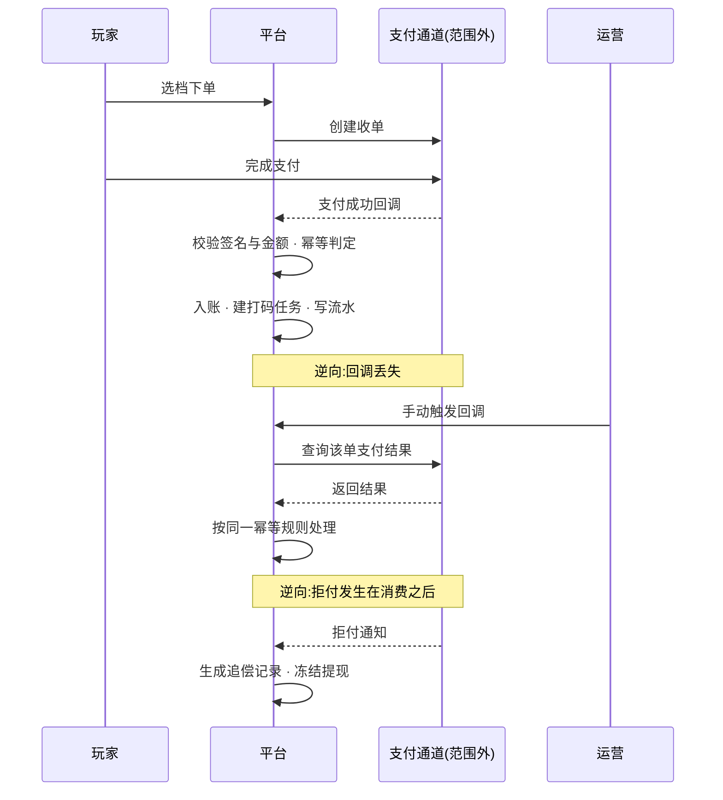

# 5.2 · 充值订单查询

## 1. 用途

查清每一笔充值的去向,并在支付成功而订单没成功时,把钱补给玩家。

### 使用者

| 角色 | 用来做什么 | 没有会怎样 |
|---|---|---|
| 客服 | 玩家说「钱扣了没到账」,当场查订单并补单 | 只能记录后转财务,玩家等一天,投诉与差评一起来 |
| 财务 | 日终核对成功率与总额,发现通道异常 | 通道掉单要到月底对账才发现,损失已经扩大 |
| 运营 | 看活动订单的转化与成功率 | 判断不了活动效果,也分不清是活动没吸引力还是支付挂了 |

充值是收入入口,掉单直接等于收入损失加投诉。
这一页把「查得到」和「补得回」放在一起,把掉单的处理时间从一天压到几分钟。

### 本次范围
- 不做退款(退款走人工扣款,见充值管理下的人工充值页)
- 不做支付通道本身的配置与切换(那是通道管理的事)
- 不做跨天的成功率趋势图(那是数据中心的事,本页只给当前筛选结果的汇总)
- 不定义入账后的资金与打码语义(见“相关资料”引用的资金模型)

### 适用范围

| 维度 | 取值 |
|---|---|
| 终端 | 桌面后台,最小宽度 1440 |
| 响应式 | 否 |
| 界面语言 | 简体中文 |
| 时区 | 运营时区,页面顶部标注 |
| 货币 | 多币种共存,金额必须带币种标识 |

## 2. 查询与处理信息

筛选面板见 `截图/列表-筛选面板-展开.png`;表格共 24 列需横向滚动,
分两屏:`截图/列表-表格-左半.png`(序号至订单号)与
`截图/列表-表格-右半.png`(支付金额至操作,含汇总行与分页)。

**筛选字段**

| 字段 | 类型 | 可输入数据与校验 |
|---|---|---|
| 渠道 | select | 只列启用中的渠道 |
| 支付通道 | select | 只列启用中的通道 |
| 用户ID | text | 数字,精确匹配 |
| 商品ID | text | 数字,精确匹配 |
| 订单号 | text | 精确匹配 |
| 订单状态 | select | 待支付 / 支付中 / 成功 / 失败 / 已取消 / 已关闭 |
| 金额 | range | 两个输入框,下限不得大于上限 |
| 是否首充 | select | 全部 / 是 / 否 |
| 是否游客 | select | 全部 / 是 / 否 |
| 时间 | select | 时间类型切换,决定下方日期范围作用于哪个时间字段 |
| 创建时间 | daterange | 起止时间。**必填不可清空**,默认近 7 天(A2) |
| 支付时间 | daterange | 起止时间 |

**表格列**

| 列 | 说明 | 默认显示 |
|---|---|---|
| 序号 | 当前页行号 | 是 |
| ID | 记录标识 | 是 |
| 用户ID | 可点击进入玩家详情 | 是 |
| 用户标签 | 来自玩家档案,只读 | 是 |
| VIP等级 | 来自 M4 等级序列,只读展示,不参与本页任何判定 | 是 |
| 渠道 | 玩家注册渠道 | 是 |
| 手机号 | 敏感字段,**须脱敏** | 是 |
| 商品ID | 可反查 5.5 的商品配置 | 是 |
| 订单号 | 与支付方对账的凭据 | 是 |
| 订单类型 | 普通 / 活动 / Crypto 等 | 是 |
| 支付金额 | 玩家实付,带币种标识 | 是 |
| 获得金额 | 账户实增总额,带币种标识 | 是 |
| 活动类型 | 该单挂的活动 | 是 |
| 订单状态 | 当前状态 | 是 |
| 支付通道 | 走的哪个通道 | 是 |
| USDT | 加密币种下的对应金额,精度 8 位 | 否 |
| 是否首充 | 该运营商内该玩家真实成功充值的首充事实;不是“第 1 次比例奖励”,每日奖励重置不改变首充事实 | 是 |
| 备注 | 人工干预时填写的原因 | 是 |
| 时间 | **分组表头**,下含注册时间 / 创建时间 / 支付时间三个子列 | 是 |
| ├ 注册时间 | 玩家注册时间,只读,来自玩家档案 | 是 |
| ├ 创建时间 | 下单时间 | 是 |
| └ 支付时间 | 支付成功时间 | 是 |
| 操作 | 补单 · 手动触发回调 | 是 |

**汇总行**(见 `截图/列表-表格-右半.png`):八个指标,分充值与活动两组 ——
充值订单人数 · 充值订单数 · 充值订单总金额 · 充值订单成功率 ·
活动订单人数 · 活动订单数 · 活动订单总金额 · 活动订单成功率。
金额带币种标识,成功率口径见 A5。两组的分母互不相干,不得相加。

**赠送金额列不实现。** 商品赠送和活动赠送在资金账变中按各自来源查询,本页不把赠送金额合并到支付金额或充值实收。

**订单处理轨迹补充只读依据**:可查该单锁定的充值打码倍数 X、商品与赠送方案版本、最终采用的“固定赠送 / 第 N 次比例赠送 / 无赠送”、奖励周期、充值实付与到账金额、彩金计算基数/比例/金额、彩金倍数 Y、关联账变及两类打码任务。次数是奖励成功次数,与“是否首充”分开显示;具体奖励查询入口复用 5.5 的赠送记录,不在本页再次维护配置。

**首充补助翻倍订单**另展示只读用途、关联宝箱、活动版本、已选领取模式、锁定翻倍条件、排除商品固定/比例彩金的原因、支付事实与通知结果。可按宝箱或专用用途定位订单,并在权限允许时关联 [4.15 活动记录](../../M4-活动管理/4.15-首充破产补助/README.md)；充值成功与补助已领取分别展示,不能把“充值成功”当成“补助已发放”。补助金额不重复计入该笔充值实收或充值获得金额。

### 配置限制与默认值

| 配置或参数 | 填写与执行规则 |
|---|---|
| 每页条数(A1) | 50 条/页；界面可切换 |
| 默认查询窗(A2) | **近 7 天**,按创建时间降序 |
| 查询响应上限(A3) | 5 秒；写死,超时中断并给可读提示 |
| 导出行数上限(A4) | 5 万行；配置项 |
| 成功率计算口径(A5) | 成功订单数 ÷ 当前筛选结果总订单数；分母为当前全部筛选条件下的订单总数,包含处理中与失败;总数为0时显示0% |
| 补单允许的时间窗(A6) | 不限；配置项 |
| 充值打码倍数(A7) | 只读消费 [5.5 充值商品与赠送](../5.5-充值商品配置/README.md)“充值通用配置”的运营商级 X;默认初始化为 1、必须为正数,本页不重复配置;以订单或入金记录锁定值执行 |

## 3. 处理规则

> A5 是派生指标,必须写明公式、时区与数据源:分母是**当前筛选结果**而非全量,
> 时区按运营时区,数据源为充值订单。口径不写清,财务与数据中心的数会对不上。

### 订单与奖励依据锁定

以下固定/比例赠送步骤适用于普通商品充值；建单时已锁定“首充补助翻倍”用途的订单执行下方专用规则，不进入 5.5 赠送阶段占用。

1. 商品订单生成时保存商品、赠送方案完整版本、充值到账金额及充值倍数 X;候选固定彩金/分次比例、各阶段门槛及对应彩金倍数 Y 一并形成不可变快照。配置修改或关闭不追改已生成订单。
2. 比例彩金按成功支付的充值金额计算并向下保留币种精度;充值来源需打码量按**实际到账充值金额 × X**计算,彩金需打码量按**实际发放彩金金额 × Y**另建任务。面值、售价、到账充值金额、彩金均分别保留,不得把彩金计入比例基数。
3. 当前奖励阶段以同运营商、账号、共享方案及奖励周期下的成功比例奖励次数确定;结算时串行确定并持久化本次阶段占用,成功入账时原子提交次数,固定与比例二选一,不叠加。未达当前阶段门槛不跳级、不消耗次数;采用常规固定赠送,无固定赠送则只入充值。
4. 最终奖励决定必须持久化并关联原订单;彩金入账、打码任务、发奖记录和次数更新保持一致。奖励执行失败按原决定重试,不得临时改发固定彩金;重复回调、补单或切换支付渠道均不得重复发奖、重复扣次。已选阶段在失败后保留待恢复占用,成功次数不递增;同账号、方案、周期的后续订单排队,不得重新分配该阶段。阶段与周期的并发、跨日口径以 5.5 为准。
5. 无商品订单的 Crypto 入金在首次持久化充值记录时锁定 X,生成充值订单时继承该快照;统一 X 不等于自动参加商品赠送方案。无有效商品/方案关联的入金不凭空发赠金。
6. “是否首充”按真实成功充值事实判断,不以首次获奖替代。每日重置只重置奖励机会;人工调整、人工生成记录不得伪装成真实支付事实取得首充或比例奖励资格。

### 首充补助翻倍专用订单

1. 仅接受 [4.15](../../M4-活动管理/4.15-首充破产补助/README.md)在受理充值前校验通过的活动依据，由玩家主动选择翻倍并创建同币种、单笔达标的商品订单。订单生成时绑定宝箱并锁定用途、模式、活动条件、商品金额及 X；本页不能事后将普通订单或人工生成订单绑定宝箱。
2. 建单即明确排除本单商品固定与限次比例彩金，不预占或消耗比例次数，不采用“先发商品彩金、再回收”的方式。充值来源仍按实际到账金额与快照 X 入账建码；此前首充奖励和已有任务保留。
3. 充值成功只形成翻倍充值条件达成事实；提供原订单、宝箱、金额、币种及可核验支付事实给活动业务，通知失败保留待恢复记录并幂等重试，不重复入账。补助仍由玩家在 4.15 手动领取，其彩金、倍数及独立打码任务按活动已锁定依据处理，不能由本页补单或回调直接代领。
4. 结果未知、通道超时或仅本地支付页面到期不等于确认未支付，不释放宝箱占用；确认通道未支付且订单已不可继续支付的终态，才通知活动按原规则释放。关联订单建单时锁定支付有效期，以真实业务支付时间判断，不以回调到达时的订单显示状态判断。领取期限内合法建单、在锁定支付有效期内付款的，回调迟到或活动关闭/截止仍按原快照履约；真实超期付款进入财务核查，不丢弃收款、不自动发奖，不得静默变成普通商品订单。
5. 真实成功支付证据缺失时，人工补记不构成翻倍条件；有可核验支付事实的补单、自然回调和手动重查共用原用途、快照及幂等结果。普通补单、人工生成订单仍沿用各自原规则。完整资格、时间与活动状态规则只维护于 4.15（M4-D90）。

### 补单(5.2-R2)

选中一笔非成功态的订单,点击补单并通过二次确认。

输入信息：订单号(自动带入)· 补单原因(**必填**)。

1. 判权限;校验该订单当前状态**允许补单**(已成功或已退款的订单拒绝)
2. **幂等**:同一订单号的补单只生效一次,重复请求返回首次结果
3. 使用订单快照与已持久化奖励决定,**不按当前商品、方案或倍数配置重算**;
   普通商品充值首次履约尚未确定奖励时按上节的共享次数规则原子确定,已确定后不得重选;首充补助专用订单沿用已锁定用途及排除结果,不得进入商品赠送分支
4. 入账:真金轨按获得的真金数量、普通商品充值的彩金轨按本单最终采用的固定或比例赠送彩金分别入账;奖励机会仅在比例奖励成功后消耗。首充补助专用订单只补充值入账及其任务,有可核验真实支付事实时恢复翻倍条件通知,不代领补助
5. **按入账规则建打码任务**:充值来源按实际到账充值金额 × 锁定 X,彩金按实际赠送彩金 × 锁定 Y 各建任务;
   **X 或实际采用的 Y 缺失则整笔拒绝**,不得退化成 0 或默认 1 倍放行,不得用当前配置修补历史快照
6. 写账变流水与操作审计,记录操作人与原因
7. 整笔原子:入账、建任务、流水、审计任一失败则全部回滚

### 人工生成订单(5.2-R3)

点击人工生成订单,填写表单并通过二次确认。

输入信息：用户ID(必填)· 商品(必填,只列已上架)· 支付通道(可选)· 生成原因(**必填**)。

1. 判权限;校验玩家存在且未注销、商品存在且已上架
2. 按所选商品的**当前配置**计算入账金额,建单时锁定商品、常规固定赠送及 X/Y 快照(与补单不同,这是新单)
3. 生成一笔订单,标记为人工生成,与自然订单同规格、可被同样查询与对账;人工生成不能替代真实支付事实,不消耗比例奖励次数、不改变真实首充标记
4. 入账并按锁定 X/Y 分别建打码任务,倍数缺失整笔拒绝;本动作不是 5.3 人工余额调整,不允许在此临时覆写倍数
5. 写流水与审计,记录操作人与原因;进入对账的重点关注项

### 手动触发回调(5.2-R4)

对某笔订单点击手动触发回调并确认。

输入信息：订单号(自动带入)· 操作原因(**必填**)。

1. 判权限
2. 以订单号向支付方重新确认支付结果
3. 按**与自然回调完全相同的幂等规则**处理:已入账的不再入账,未入账且确认成功的补入账
4. 入账时同样建打码任务,规则与自然回调一致
5. 如实记录本次触发的结果(成功 / 仍未支付 / 通道无此单 / 通道异常),**失败不静默**
6. 写操作审计,记录操作人与原因

### 业务流程

> 补单与手动触发回调是同一目的地的两条人工路径:前者跳过通道确认直接入账,
> 后者先向通道确认再入账。两者共用同一套幂等规则,不会叠加入账。
> 上述补单动作本身不构成首充补助的真实支付证明；专用订单的翻倍条件与宝箱释放须遵守本页专用规则。

## 4. 特殊情况

### 边界处理

| # | 场景 | 触发条件 | 预期处理 |
|---|---|---|---|
| E1 | 越权干预 | 无补单或生成权限的账号提交 | 拒绝并提示;界面不展示入口,服务端二次判定 |
| E2 | 重复回调 | 同一订单的回调被推送多次 | 按订单号幂等,只入账一次,重复请求返回首次结果 |
| E3 | 补单与自然回调撞车 | 运营补单的同时通道回调到达 | 只入账一次,余额不翻倍;后到者返回首次结果 |
| E4 | 倍数快照缺失被兜底 | 该单 X 或实际采用的固定/比例彩金倍数快照缺失 | **整笔拒绝入账**并保留异常依据，不按 0/1 或当前配置替代 |
| E5 | 金额被篡改 | 回调金额与下单金额不一致 | 拒绝入账并告警,以平台侧订单金额为准 |
| E6 | 拒付发生在消费之后 | 玩家已用这笔钱投注或提现后发生拒付 | 不回滚已消费资金,生成负债与追偿记录并冻结提现 |
| E7 | 人工生成订单被滥用 | 反复凭空造单给特定玩家 | 允许但受控:原因必填、留痕、进对账重点关注项,按操作人与频次汇总 |
| E8 | 商品或打码配置已变更 | 补单时商品、赠送方案、X 或 Y 已被改过 | 按订单**当时**的配置和已锁定奖励决定入账,不按当前配置重算 |
| E9 | 大跨度查询 | 把默认的近 7 天(A2)手动放宽到很长区间 | 按 A3 超时中断并提示缩小范围,不返回半截数据。时间范围**不允许清空**,避免无边界全表扫描 |
| E10 | 并发竞争同次奖励 | 同账号多商品订单同时支付成功 | 同方案周期共享次数,原子确定不同阶段或常规固定分支,不得重复占用同一次比例奖励 |
| E11 | 奖励执行异常 | 已确定比例奖励但入账或打码失败 | 沿用原决定重试,未成功发奖不增加成功次数,不改发固定金额、不重复入账 |
| E12 | 首充补助订单结果未知 | 通道超时、未收到终态或仅本地支付页面到期 | 保留原用途与宝箱占用，按原订单核验；不发商品彩金、不代领补助，不允许另单重复占用 |
| E13 | 首充补助订单确认未支付 | 通道确认未支付且订单已不可继续支付 | 幂等通知 4.15 释放占用，是否仍可重新选择由活动期限与原资格决定；不改写原单用途 |
| E14 | 关联订单迟到回调或真实超期付款 | 领取期限内合法建单，收到支付结果时须核对真实业务支付时间与锁定支付有效期 | 有效期内付款的迟到回调按原快照入账建码并恢复翻倍达成通知；真实超期付款进入财务核查，不丢弃收款、不自动发奖，不静默改发商品彩金 |
| E15 | 活动通知失败或重复 | 充值入账成功，通知 4.15 超时、失败或被重放 | 保留待恢复事实，按订单与宝箱幂等通知，不重复入账、不自动领取补助 |
| E16 | 人工记录冒充翻倍充值 | 人工生成订单或只有人工补记、无可核验真实支付事实 | 不作为翻倍条件，不允许事后绑定宝箱；保留普通人工处理的来源与审计 |

### 补单遇到异常时(5.2-R2)

| 错误状况 | 提示 |
|---|---|
| 无补单权限 | 提示无权限 |
| 订单已是成功态 | 该订单已成功,无需补单 |
| 订单已退款或已作废 | 该订单不可补单 |
| 重复补单 | 只生效一次,返回首次结果并提示已补过 |
| 充值或彩金倍数快照缺失 | **整笔拒绝**,提示该单奖励/打码依据不完整并转异常处理;不得读取最新配置兜底 |
| 未填原因 | 请填写补单原因 |
| 玩家已注销 | 该玩家已注销,不可入账 |

### 人工生成订单遇到异常时(5.2-R3)

| 错误状况 | 提示 |
|---|---|
| 无生成权限 | 提示无权限 |
| 玩家不存在或已注销 | 该玩家不可用 |
| 商品不存在或已下架 | 该商品不可用,请重新选择 |
| 充值或彩金倍数缺失 | 整笔拒绝,请在 5.5 补齐充值通用配置或本次固定赠送倍数后重新建单 |
| 未填原因 | 请填写生成原因 |
| 重复提交 | 只生效一次 |

### 手动触发回调遇到异常时(5.2-R4)

| 错误状况 | 提示 |
|---|---|
| 无触发权限 | 提示无权限 |
| 支付方查无此单 | 通道侧无此订单,请核对订单号 |
| 支付方返回未支付 | 该单在通道侧尚未支付,不做入账 |
| 通道超时或异常 | 如实提示通道异常,本次未改变订单状态,可重试 |
| 已入账订单重复触发 | 不重复入账,提示当前已是成功态 |

### 页面状态

| 状态 | 表现 |
|---|---|
| 错误 | 列表区域内提示并可重试,不整页跳转;筛选条件保留 |
| 干预进行中 | 补单或触发回调期间该行按钮不可点,防止重复提交 |
| 通道异常 | 特有态:触发回调返回通道异常时,如实展示「通道异常,订单状态未改变」,不显示为失败也不显示为成功 |
| 人工生成订单 | 特有态:列表中显式标注该单为人工生成,与自然订单可区分 |

## 5. 验收场景

| 需求编号 | 场景与操作 | 预期结果 |
|---|---|---|
| 5.2-R1 | 订单列表与筛选：进入页面 · 点查询 · 翻页 | 12 项筛选可组合;金额带币种;手机号脱敏;汇总与成功率按 A5 口径 |
| 5.2-R2 | 补单：对未成功订单点补单并确认 | 幂等,重复补单不产生二次入账;补单后按入账规则建打码任务 |
| 5.2-R3 | 人工生成订单：点人工生成订单并确认 | 生成的订单与自然订单同规格;必须建打码任务;原因必填留痕 |
| 5.2-R4 | 手动触发回调：对某订单点手动触发回调 | 重放不产生重复入账;结果如实反映,失败不静默 |
| 5.2-R5 | 导出数据：点导出数据 | 不阻塞页面,完成后通知;导出内容与当前筛选一致;敏感字段按权限脱敏 |
| 5.2-R6 | 首充补助专用订单的查询、支付与补单 | 可查宝箱、用途、模式及商品奖排除原因；充值按 X 建码且不占比例次数；回调/补单不代领补助；可核验支付事实仅幂等推进翻倍达成 |
| 5.2-R7 | 专用订单未知、失败与迟到结果 | 未知不释放，确认未支付且不可继续支付的终态按活动规则释放；真实业务支付时间在锁定有效期内的迟到回调按快照履约，真实超期付款转财务核查；不因回调时已到期或活动关闭丢弃有效收款权益 |

### 补单(5.2-R2)

- 正向:一笔支付成功但状态未变的订单 → 补单后状态转成功,余额增加,
  真金与彩金各自建打码任务,操作记录可查到操作人与原因
- 正向:补单后再看该单 → 补单按钮不可用,不能再补第二次
- 正向:旧单锁定充值到账 100、X=2、比例彩金 30、Y=5,随后把 X 改为 3、Y 改为 6 → 补单仍建立 200 与 150 两条任务,新单使用新配置
- 正向:第 1 次比例奖励已成功,下笔低于第 2 次门槛 → 不消耗第 2 次机会,仅按该单快照发常规固定彩金;真实首充标记不重置
- 逆向:对已成功订单点补单 → 拒绝
- 逆向:同一订单并发点两次补单 → 只入账一次,余额不翻倍
- 逆向:充值 X 或实际采用的彩金 Y 快照缺失 → **整笔拒绝**,不得当成 0 或 1 倍入账
- 逆向:最后一次比例奖励遇到并发支付、重复回调与补单 → 只有一笔占用该阶段并发奖,次数与账变/任务一致

### 人工生成订单(5.2-R3)

- 正向:为玩家生成一笔 30 元档订单 → 订单可查、余额增加、打码任务已建、标记为人工生成
- 正向:该订单在对账中被列为重点关注项
- 正向:人工生成商品订单 → 沿用新单锁定的充值 X 与固定彩金 Y,不取得真实首充或比例奖励资格
- 逆向:选择已下架商品 → 拒绝
- 逆向:未填原因 → 拒绝;连点两次 → 只生成一笔
- 逆向:充值通用 X 或常规固定赠送 Y 缺失 → 整笔拒绝

### 手动触发回调(5.2-R4)

- 正向:一笔通道已成功但平台未收到回调的订单 → 触发后入账并转成功态,打码任务已建
- 正向:对已成功订单触发 → 不重复入账,余额不变
- 逆向:通道返回未支付 → 订单状态不变,如实提示
- 逆向:通道超时 → 提示异常且订单状态不变,可重试;不出现「显示成功但没入账」

### 首充补助翻倍专用订单(5.2-R6/R7)

- 专用商品订单实际到账 50、锁定 X=2 → 充值成功仅新增充值打码 100，不发本商品固定/比例彩金，不占其次数；随后玩家在 4.15 手动领取补助，独立新增彩金任务。
- 普通充值、既有首充奖励和 VIP/签到按各自规则保留；普通订单不能事后改绑宝箱，专用订单不能静默转普通用途。
- 专用订单真实支付成功但回调丢失 → 有可核验支付事实的补单或手动重查按原快照入账并恢复活动通知；重复操作不重复达成或发奖。
- 未知结果或仅本地过期 → 宝箱仍占用；通道确认未支付且订单已不可支付 → 幂等释放，重新选择仍须符合活动期限。
- 领取期限内合法建单，真实业务支付时间处于订单锁定支付有效期内 → 即使回调在有效期结束或活动关闭后到达，仍按锁定依据履约；活动通知失败能够恢复，不丢收款、不自动改发商品奖。
- 真实业务支付时间超过订单锁定支付有效期 → 进入财务核查，不自动确认翻倍达成、不丢弃收款，也不静默转普通用途。
- 人工生成商品订单或仅人工补记 → 不凭人工动作取得补助翻倍资格；本页补单不会把未领取宝箱变成已领取。

## 6. 相关资料

### 入口与关联页面

- 菜单:财务管理 → 充值管理 → 充值订单查询
- 跳入:5.5 充值商品配置(按商品ID 看成交)· 各类报表下钻

- 跳出:玩家详情弹窗(点用户ID)· 5.5 充值商品配置(按商品ID)· 5.3 人工充值(补偿场景)· 5.14 Crypto入金(按交易哈希)
- 首充补助专用订单可与 [4.15 活动记录](../../M4-活动管理/4.15-首充破产补助/README.md)按宝箱/订单相互查询，分别执行目标页面权限。
- 用户详情的充值记录只查询当前用户的充值到账账变,不提供跳往本页的按钮。

### 权限

| 操作 | 权限或执行方 |
|---|---|
| 订单列表与筛选(5.2-R1) | `finance:recharge:order` |
| 补单(5.2-R2) | `finance:recharge:order:repair` |
| 人工生成订单(5.2-R3) | `finance:recharge:order:create` |
| 手动触发回调(5.2-R4) | `finance:recharge:order:callback` |
| 导出数据(5.2-R5) | `finance:recharge:order:export` |

> **权限**:本页权限码对应角色配置里的权限树节点(模块 → 分组 → 页面 → 操作),
> 完整映射与「已有 / 需新增」见 `../README.md` 第 6 段。
> 勾中任一操作节点必须同时持有其页面节点,判定一律在服务端做。

### 术语与共用口径

> 资金类术语(真金、彩金、打码任务、账变流水)统一定义在
> `../../M2-用户管理/2.1-用户列表/资金模型.md` 第 2 段;
> 补单、人工生成订单、轨的定义见 `../README.md` 第 2 段。此处不重复。

| 术语 | 定义 |
|---|---|
| 支付金额 | 玩家实际支付的钱 |
| 获得金额 | 本单为玩家账户增加的总金额 |
| 赠送金额 | 本页不展示该列;商品赠送和活动赠送分别在资金账变中按来源查询 |
| 订单类型 | 普通充值 / 活动充值 / Crypto入金 |
| Crypto充值 | 由已确认的链上入金生成的充值订单;链上事实与确认轨迹见 5.14 |
| 手动触发回调 | 用支付方重新推送或人工重放的方式,让平台重新处理一次该单的支付结果 |

### 依赖与数据流

**数据流向**:法币路径为玩家在收银台选档下单 → 平台生成订单 → 玩家在通道侧完成支付 →
通道回调平台 → 平台入账并按规则建打码任务 → 写账变流水 → 结果呈现在本页与玩家详情。
人工路径:运营在本页补单或触发回调 → 走与自然回调相同的入账与建任务逻辑 → 额外写操作审计。
Crypto 路径:5.14 监听到用户专属地址入金并达到确认条件 → 生成来源为 Crypto 的充值订单 →
走同一套幂等入账、打码任务与流水规则;链上确认和重组状态由 5.14 承载。

**系统串接**:**与支付通道第三方串接**。

- **正向**:平台下单 → 通道收单 → 玩家支付 → 通道回调 → 平台校验签名与金额 → 入账
- **逆向**:回调丢失 → 运营手动触发回调向通道确认,或直接补单;
  重复回调 → 按订单号幂等,只入账一次;
  通道异常或超时 → 订单保持原状态,如实提示,不猜测结果;
  **充值拒付发生在玩家已消费之后** → 不试图回滚已花掉的钱,
  生成负债与追偿记录并冻结提现(见资金模型的拒付处理)
- **责任边界**:支付结果以**通道侧为准**,平台不自行判定成功;
  但入账、建打码任务、写流水**完全由平台负责**,通道不参与也不知晓打码义务的存在

### 数据归属与职责

**数据归属**

- 拥有(owner=M5):充值订单 · 账变流水 · 打码任务 · 干预操作审计
- 只读:用户、用户标签(owner=M2)· VIP等级(owner=M4,仅展示)· 充值通用与赠送方案快照(owner=M5/5.5)· 其他活动奖励依据(owner=对应玩法)· 支付通道(owner=通道管理)

充值通用 X、商品固定彩金与分次比例赠送方案及其 Y 由 M5/5.5 维护,本页只读快照与执行结果;不得继续从旧“账号首充”入口和商品旧赠送逻辑分别发放同一笔充值奖励。其他活动仍由各玩法决定固定奖励依据,财务不在账务重试时重新调用活动配置计算金额。

4.15 拥有补助资格、宝箱、领取模式、翻倍条件及手动领奖依据；在专用充值受理前提供校验结果与不可变依据。M5 拥有充值用途/关联快照、实际支付与入账事实，并提供可恢复的结果通知。钱包、账变和打码服务只执行已确定的资金依据，不反查活动配置；参数与活动决策唯一出处为 4.15 / M4-D90。

**前后端职责**

| 事项 | 归属 |
|---|---|
| 权限判定 | **服务端**,按角色的权限节点判定 |
| 可见范围过滤 | **服务端**,按账号绑定的推广商过滤,列表、汇总与导出一律先过滤再返回(见 `../README.md` 第 6 段) |
| 回调校验、幂等控制、入账原子性 | **服务端** |
| 打码任务的创建与倍数校验 | **服务端** |
| 手机号等敏感字段脱敏 | **服务端** |
| 成功率等派生指标的计算 | **服务端**(口径见 A5) |
| 筛选交互、分页、金额呈现 | 界面 |
| 二次确认与原因收集 | 界面 + 服务端双重校验 |

### 补单的职责(5.2-R2)

| 归属 | 做什么 |
|---|---|
| 界面 | 二次确认弹窗,展示该单的支付金额与将入账金额;原因必填 |
| 服务端 | 权限判定、状态校验、幂等控制、入账、建打码任务、写流水与审计 |

### 人工生成订单的职责(5.2-R3)

| 归属 | 做什么 |
|---|---|
| 界面 | 表单校验、二次确认、展示将产生的入账金额 |
| 服务端 | 权限判定、玩家与商品有效性校验、建单、入账、建打码任务、留痕 |

### 手动触发回调的职责(5.2-R4)

| 归属 | 做什么 |
|---|---|
| 界面 | 二次确认,展示当前订单状态;结果如实回显 |
| 服务端 | 权限判定、向支付方查询或重放结果、按幂等规则处理入账、留痕 |
