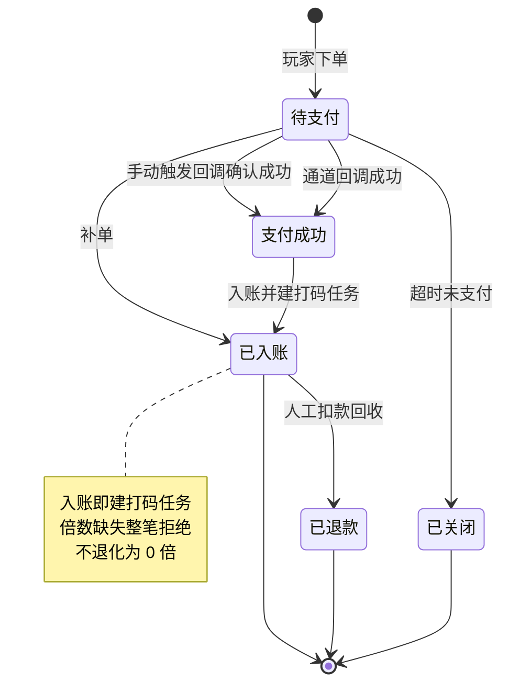
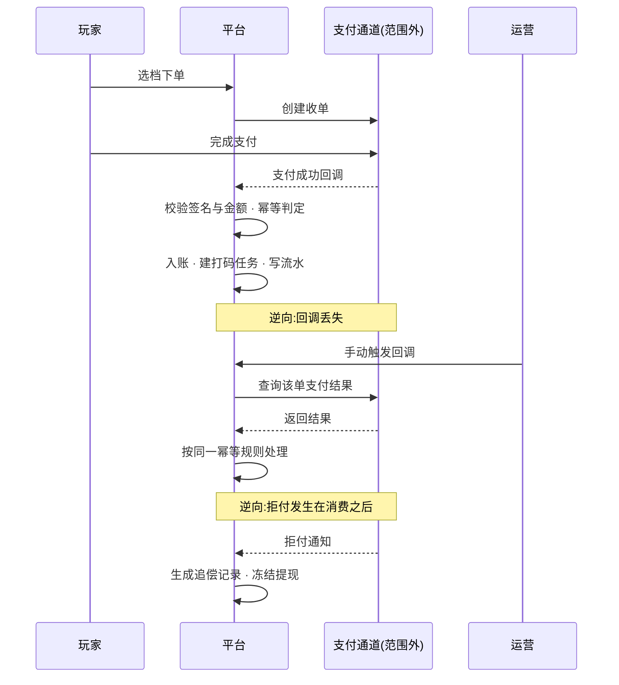

# 5.2 · 充值订单查询

## 1. 背景与目标

**目标**:查清每一笔充值的去向,并在支付成功而订单没成功时,把钱补给玩家。

**谁在用**

| 角色 | 用来做什么 | 没有会怎样 |
|---|---|---|
| 客服 | 玩家说「钱扣了没到账」,当场查订单并补单 | 只能记录后转财务,玩家等一天,投诉与差评一起来 |
| 财务 | 日终核对成功率与总额,发现通道异常 | 通道掉单要到月底对账才发现,损失已经扩大 |
| 运营 | 看活动订单的转化与成功率 | 判断不了活动效果,也分不清是活动没吸引力还是支付挂了 |

**业务价值**:充值是收入入口,掉单直接等于收入损失加投诉。
这一页把「查得到」和「补得回」放在一起,把掉单的处理时间从一天压到几分钟。

**不做什么**
- 不做退款(退款走人工扣款,见充值管理下的人工充值页)
- 不做支付通道本身的配置与切换(那是通道管理的事)
- 不做跨天的成功率趋势图(那是数据中心的事,本页只给当前筛选结果的汇总)
- 不定义入账后的资金与打码语义(见第 3 段引用的资金模型)

**适用范围**

| 维度 | 取值 |
|---|---|
| 终端 | 桌面后台,最小宽度 1440 |
| 响应式 | 否 |
| 界面语言 | 简体中文 |
| 时区 | 运营时区,页面顶部标注 |
| 货币 | 多币种共存,金额必须带币种标识 |

## 2. 入口

- 菜单:财务管理 → 充值管理 → 充值订单查询
- 跳入:玩家详情弹窗的充值记录 · 5.5 充值商品配置(按商品ID 看成交)· 各类报表下钻

## 3. 术语

> 资金类术语(真金、彩金、打码任务、账变流水)统一定义在
> `../../M2-用户管理/2.1-用户列表/资金模型.md` 第 2 段;
> 补单、人工生成订单、轨的定义见 `../README.md` 第 2 段。此处不重复。

| 术语 | 定义 |
|---|---|
| 支付金额 | 玩家实际支付的钱 |
| 获得金额 | 本单为玩家账户增加的总金额 |
| 赠送金额 | 本单随单赠送的金额。**当前口径恒为 0**,见第 5 段说明 |
| 订单类型 | 普通充值 / 活动充值等分类。**枚举未取全**,见模块决策 D8 |
| Crypto充值 | 由已确认的链上入金生成的充值订单;链上事实与确认轨迹见 5.14 |
| 手动触发回调 | 用支付方重新推送或人工重放的方式,让平台重新处理一次该单的支付结果 |

## 4. 关键参数与假设

| 编号 | 参数 | 取值 | 依据 | 在哪配 |
|---|---|---|---|---|
| A1 | 每页条数 | 50 条/页 | 已验证(`截图/列表-表格-右半.png` 分页区) | 界面可切换 |
| A2 | 默认查询窗 | **近 7 天**,按创建时间降序 | 已验证(`截图/列表-筛选面板-展开.png` 创建时间默认值) | 写死 |
| A3 | 查询响应上限 | 5 秒 | **未验证假设** | 写死,超时中断并给可读提示 |
| A4 | 导出行数上限 | 5 万行 | **未验证假设** | 配置项 |
| A5 | 成功率计算口径 | 成功订单数 ÷ 当前筛选结果总订单数 | **未验证假设**(实采充值订单成功率 86.17%,分母口径待确认) | 写死 |
| A6 | 补单允许的时间窗 | 不限 | **未验证假设** | 配置项 |

> A5 是派生指标,必须写明公式、时区与数据源:分母是**当前筛选结果**而非全量,
> 时区按运营时区,数据源为充值订单。口径不写清,财务与数据中心的数会对不上。

## 5. 字段清单

筛选面板见 `截图/列表-筛选面板-展开.png`;表格共 24 列需横向滚动,
分两屏:`截图/列表-表格-左半.png`(序号至订单号)与
`截图/列表-表格-右半.png`(支付金额至操作,含汇总行与分页)。

**筛选字段**

| 字段 | 类型 | 可输入数据与校验 |
|---|---|---|
| 渠道 | select | 只列启用中的渠道 |
| 支付通道 | select | 只列启用中的通道 |
| 用户ID | text | 数字,精确匹配 |
| 商品ID | text | 数字,精确匹配 |
| 订单号 | text | 精确匹配 |
| 订单状态 | select | 枚举未取全,见模块决策 D8 |
| 金额 | range | 两个输入框,下限不得大于上限 |
| 是否首充 | select | 全部 / 是 / 否 |
| 是否游客 | select | 全部 / 是 / 否 |
| 时间 | select | 时间类型切换,决定下方日期范围作用于哪个时间字段 |
| 创建时间 | daterange | 起止时间。**必填不可清空**,默认近 7 天(A2) |
| 支付时间 | daterange | 起止时间 |

**表格列**

| 列 | 说明 | 默认显示 |
|---|---|---|
| 序号 | 当前页行号 | 是 |
| ID | 记录标识 | 是 |
| 用户ID | 可点击进入玩家详情 | 是 |
| 用户标签 | 来自玩家档案,只读 | 是 |
| VIP等级 | 来自玩家档案,只读 | 是 |
| 渠道 | 玩家注册渠道 | 是 |
| 手机号 | 敏感字段,**须脱敏** | 是 |
| 商品ID | 可反查 5.5 的商品配置 | 是 |
| 订单号 | 与支付方对账的凭据 | 是 |
| 订单类型 | 普通 / 活动 / Crypto 等 | 是 |
| 支付金额 | 玩家实付,带币种标识 | 是 |
| 获得金额 | 账户实增总额,带币种标识 | 是 |
| 赠送金额 | 见下方说明 | 是 |
| 活动类型 | 该单挂的活动 | 是 |
| 订单状态 | 当前状态 | 是 |
| 支付通道 | 走的哪个通道 | 是 |
| USDT | 加密币种下的对应金额,精度 8 位 | 否 |
| 是否首充 | 该玩家的第一笔充值 | 是 |
| 备注 | 人工干预时填写的原因 | 是 |
| 时间 | **分组表头**,下含注册时间 / 创建时间 / 支付时间三个子列 | 是 |
| ├ 注册时间 | 玩家注册时间,只读,来自玩家档案 | 是 |
| ├ 创建时间 | 下单时间 | 是 |
| └ 支付时间 | 支付成功时间 | 是 |
| 操作 | 补单 · 手动触发回调 | 是 |

**汇总行**(见 `截图/列表-表格-右半.png`):八个指标,分充值与活动两组 ——
充值订单人数 · 充值订单数 · 充值订单总金额 · 充值订单成功率 ·
活动订单人数 · 活动订单数 · 活动订单总金额 · 活动订单成功率。
金额带币种标识,成功率口径见 A5。两组的分母互不相干,不得相加。

**关于「赠送金额」列(当前按明确假设处理)**

实采抽样 26 行该列**全为 0**,且每一行**支付金额恒等于获得金额**,没有任何赠送发生
(可在 `截图/列表-表格-右半.png` 中直接看到:支付金额 R$20 · 获得金额 R$20 · 赠送金额 0)。
特征与 M2 弹窗内已确认不做的同名列一致。**当前假设:该列恒为 0,暂不做。**
全表 104 条未全覆盖,结论待后端全表聚合确认,见模块决策 D5。
若确认恒为 0,按「有意不做的字段必须显式写出来」的规矩在此明确:
**这一列不实现,不要在下次比对截图时补上。**

## 6. 需求清单

> **权限**:本页权限码对应角色配置里的权限树节点(模块 → 分组 → 页面 → 操作),
> 完整映射与「已有 / 需新增」见 `../README.md` 第 6 段。
> 勾中任一操作节点必须同时持有其页面节点,判定一律在服务端做。

| ID | 需求 | 触发条件 | 验收标准 | 权限码 |
|---|---|---|---|---|
| 5.2-R1 | 订单列表与筛选 | 进入页面 · 点查询 · 翻页 | 12 项筛选可组合;金额带币种;手机号脱敏;汇总与成功率按 A5 口径 | `finance:recharge:order` |
| 5.2-R2 | 补单 | 对未成功订单点补单并确认 | 幂等,重复补单不产生二次入账;补单后按入账规则建打码任务 | `finance:recharge:order:repair` |
| 5.2-R3 | 人工生成订单 | 点人工生成订单并确认 | 生成的订单与自然订单同规格;必须建打码任务;原因必填留痕 | `finance:recharge:order:create` |
| 5.2-R4 | 手动触发回调 | 对某订单点手动触发回调 | 重放不产生重复入账;结果如实反映,失败不静默 | `finance:recharge:order:callback` |
| 5.2-R5 | 导出数据 | 点导出数据 | 不阻塞页面,完成后通知;导出内容与当前筛选一致;敏感字段按权限脱敏 | `finance:recharge:order:export` |

## 7. 需求详述

### 5.2-R2

**触发条件**:选中一笔非成功态的订单,点击补单并通过二次确认。

**可输入数据**:订单号(自动带入)· 补单原因(**必填**)。

**功能范围**

| 归属 | 做什么 |
|---|---|
| 界面 | 二次确认弹窗,展示该单的支付金额与将入账金额;原因必填 |
| 服务端 | 权限判定、状态校验、幂等控制、入账、建打码任务、写流水与审计 |

**处理逻辑**

1. 判权限;校验该订单当前状态**允许补单**(已成功或已退款的订单拒绝)
2. **幂等**:同一订单号的补单只生效一次,重复请求返回首次结果
3. 按订单当时绑定的商品配置计算入账金额,**不按当前配置重算** ——
   商品配置改过也不影响历史订单
4. 入账:真金轨按获得的真金数量、彩金轨按赠送彩金,分别入账
5. **按入账规则建打码任务**:充值来源固定 1 倍,彩金按该单绑定活动的倍数;
   **倍数缺失则整笔拒绝**,不得退化成 0 倍放行
6. 写账变流水与操作审计,记录操作人与原因
7. 整笔原子:入账、建任务、流水、审计任一失败则全部回滚

**错误处理**

| 错误状况 | 提示 |
|---|---|
| 无补单权限 | 提示无权限 |
| 订单已是成功态 | 该订单已成功,无需补单 |
| 订单已退款或已作废 | 该订单不可补单 |
| 重复补单 | 只生效一次,返回首次结果并提示已补过 |
| 彩金倍数缺失 | 该单绑定的活动未配置打码倍数,**整笔拒绝**,请先补配置 |
| 未填原因 | 请填写补单原因 |
| 玩家已注销 | 该玩家已注销,不可入账 |

**测试案例**

- 正向:一笔支付成功但状态未变的订单 → 补单后状态转成功,余额增加,
  真金与彩金各自建打码任务,操作记录可查到操作人与原因
- 正向:补单后再看该单 → 补单按钮不可用,不能再补第二次
- 逆向:对已成功订单点补单 → 拒绝
- 逆向:同一订单并发点两次补单 → 只入账一次,余额不翻倍
- 逆向:该单绑定的活动没配倍数 → **整笔拒绝**,不得当成 0 倍入账

### 5.2-R3

**触发条件**:点击人工生成订单,填写表单并通过二次确认。

**可输入数据**:用户ID(必填)· 商品(必填,只列已上架)· 支付通道(可选)· 生成原因(**必填**)。

**功能范围**

| 归属 | 做什么 |
|---|---|
| 界面 | 表单校验、二次确认、展示将产生的入账金额 |
| 服务端 | 权限判定、玩家与商品有效性校验、建单、入账、建打码任务、留痕 |

**处理逻辑**

1. 判权限;校验玩家存在且未注销、商品存在且已上架
2. 按所选商品的**当前配置**计算入账金额(与补单不同 —— 这是新单,没有历史配置可依)
3. 生成一笔订单,标记为人工生成,与自然订单同规格、可被同样查询与对账
4. 入账并按入账规则建打码任务,倍数缺失整笔拒绝
5. 写流水与审计,记录操作人与原因;进入对账的重点关注项

**错误处理**

| 错误状况 | 提示 |
|---|---|
| 无生成权限 | 提示无权限 |
| 玩家不存在或已注销 | 该玩家不可用 |
| 商品不存在或已下架 | 该商品不可用,请重新选择 |
| 彩金倍数缺失 | 整笔拒绝,请先补活动倍数配置 |
| 未填原因 | 请填写生成原因 |
| 重复提交 | 只生效一次 |

**测试案例**

- 正向:为玩家生成一笔 30 元档订单 → 订单可查、余额增加、打码任务已建、标记为人工生成
- 正向:该订单在对账中被列为重点关注项
- 逆向:选择已下架商品 → 拒绝
- 逆向:未填原因 → 拒绝;连点两次 → 只生成一笔
- 逆向:绑定活动无倍数 → 整笔拒绝

### 5.2-R4

**触发条件**:对某笔订单点击手动触发回调并确认。

**可输入数据**:订单号(自动带入)· 操作原因(**必填**)。

**功能范围**

| 归属 | 做什么 |
|---|---|
| 界面 | 二次确认,展示当前订单状态;结果如实回显 |
| 服务端 | 权限判定、向支付方查询或重放结果、按幂等规则处理入账、留痕 |

**处理逻辑**

1. 判权限
2. 以订单号向支付方重新确认支付结果
3. 按**与自然回调完全相同的幂等规则**处理:已入账的不再入账,未入账且确认成功的补入账
4. 入账时同样建打码任务,规则与自然回调一致
5. 如实记录本次触发的结果(成功 / 仍未支付 / 通道无此单 / 通道异常),**失败不静默**
6. 写操作审计,记录操作人与原因

**错误处理**

| 错误状况 | 提示 |
|---|---|
| 无触发权限 | 提示无权限 |
| 支付方查无此单 | 通道侧无此订单,请核对订单号 |
| 支付方返回未支付 | 该单在通道侧尚未支付,不做入账 |
| 通道超时或异常 | 如实提示通道异常,本次未改变订单状态,可重试 |
| 已入账订单重复触发 | 不重复入账,提示当前已是成功态 |

**测试案例**

- 正向:一笔通道已成功但平台未收到回调的订单 → 触发后入账并转成功态,打码任务已建
- 正向:对已成功订单触发 → 不重复入账,余额不变
- 逆向:通道返回未支付 → 订单状态不变,如实提示
- 逆向:通道超时 → 提示异常且订单状态不变,可重试;不出现「显示成功但没入账」

> 补单与手动触发回调是同一目的地的两条人工路径:前者跳过通道确认直接入账,
> 后者先向通道确认再入账。两者共用同一套幂等规则,不会叠加入账。

## 8. 数据流向与系统串接

**数据流向**:法币路径为玩家在收银台选档下单 → 平台生成订单 → 玩家在通道侧完成支付 →
通道回调平台 → 平台入账并按规则建打码任务 → 写账变流水 → 结果呈现在本页与玩家详情。
人工路径:运营在本页补单或触发回调 → 走与自然回调相同的入账与建任务逻辑 → 额外写操作审计。
Crypto 路径:5.14 监听到用户专属地址入金并达到确认条件 → 生成来源为 Crypto 的充值订单 →
走同一套幂等入账、打码任务与流水规则;链上确认和重组状态由 5.14 承载。

**系统串接**:**与支付通道第三方串接**。

- **正向**:平台下单 → 通道收单 → 玩家支付 → 通道回调 → 平台校验签名与金额 → 入账
- **逆向**:回调丢失 → 运营手动触发回调向通道确认,或直接补单;
  重复回调 → 按订单号幂等,只入账一次;
  通道异常或超时 → 订单保持原状态,如实提示,不猜测结果;
  **充值拒付发生在玩家已消费之后** → 不试图回滚已花掉的钱,
  生成负债与追偿记录并冻结提现(见资金模型的拒付处理)
- **责任边界**:支付结果以**通道侧为准**,平台不自行判定成功;
  但入账、建打码任务、写流水**完全由平台负责**,通道不参与也不知晓打码义务的存在

## 9. 异常与边界

| # | 场景 | 触发条件 | 预期处理 |
|---|---|---|---|
| E1 | 越权干预 | 无补单或生成权限的账号提交 | 拒绝并提示;界面不展示入口,服务端二次判定 |
| E2 | 重复回调 | 同一订单的回调被推送多次 | 按订单号幂等,只入账一次,重复请求返回首次结果 |
| E3 | 补单与自然回调撞车 | 运营补单的同时通道回调到达 | 只入账一次,余额不翻倍;后到者返回首次结果 |
| E4 | 倍数缺失被当成 0 | 该单绑定的活动未配置彩金倍数 | **整笔拒绝入账**,不得退化成 0 倍放行 |
| E5 | 金额被篡改 | 回调金额与下单金额不一致 | 拒绝入账并告警,以平台侧订单金额为准 |
| E6 | 拒付发生在消费之后 | 玩家已用这笔钱投注或提现后发生拒付 | 不回滚已消费资金,生成负债与追偿记录并冻结提现 |
| E7 | 人工生成订单被滥用 | 反复凭空造单给特定玩家 | 允许但受控:原因必填、留痕、进对账重点关注项,按操作人与频次汇总 |
| E8 | 商品配置已变更 | 补单时该商品的配置已被改过 | 按订单**当时**的配置入账,不按当前配置重算 |
| E9 | 大跨度查询 | 把默认的近 7 天(A2)手动放宽到很长区间 | 按 A3 超时中断并提示缩小范围,不返回半截数据。时间范围**不允许清空**,避免无边界全表扫描 |

## 10. 状态清单

| 状态 | 表现 |
|---|---|
| 错误 | 列表区域内提示并可重试,不整页跳转;筛选条件保留 |
| 干预进行中 | 补单或触发回调期间该行按钮不可点,防止重复提交 |
| 通道异常 | 特有态:触发回调返回通道异常时,如实展示「通道异常,订单状态未改变」,不显示为失败也不显示为成功 |
| 人工生成订单 | 特有态:列表中显式标注该单为人工生成,与自然订单可区分 |

## 11. 涉及表与职责

**数据归属**

- 拥有(owner=M5):充值订单 · 账变流水 · 打码任务 · 干预操作审计
- 只读:用户、用户标签、VIP等级(owner=M2)· 活动类型与彩金倍数(owner=玩法,
  **本仓库范围外**)· 支付通道(owner=通道管理)

**前后端职责**

| 事项 | 归属 |
|---|---|
| 权限判定 | **服务端**,按角色的权限节点判定 |
| 可见范围过滤 | **服务端**,按账号绑定的推广商过滤,列表、汇总与导出一律先过滤再返回(见 `../README.md` 第 6 段) |
| 回调校验、幂等控制、入账原子性 | **服务端** |
| 打码任务的创建与倍数校验 | **服务端** |
| 手机号等敏感字段脱敏 | **服务端** |
| 成功率等派生指标的计算 | **服务端**(口径见 A5) |
| 筛选交互、分页、金额呈现 | 界面 |
| 二次确认与原因收集 | 界面 + 服务端双重校验 |

## 12. 关联页面

- 跳出:玩家详情弹窗(点用户ID)· 5.5 充值商品配置(按商品ID)· 5.3 人工充值(补偿场景)· 5.14 Crypto入金(按交易哈希)
- 跳入:玩家详情弹窗的充值记录 · 5.5 商品配置查看成交 · 各类报表下钻
