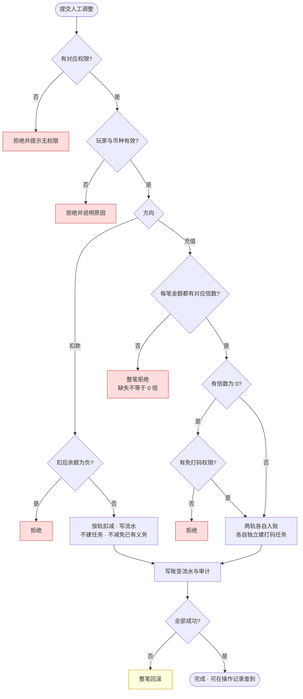

# 5.3 · 人工充值

## 1. 背景与目标

**目标**:让运营在不经支付通道的情况下,安全地给玩家加钱或扣钱,且每一笔都能被追溯与复核。

**谁在用**

| 角色 | 用来做什么 | 没有会怎样 |
|---|---|---|
| 客服 | 玩家充值掉单、活动奖励漏发时,直接补给玩家 | 只能让玩家干等第二天财务批量处理,投诉升级 |
| 财务 | 补偿、退款、错账回收 | 错账只能靠改数据库,没有留痕,事后查不清是谁改的 |
| 风控 | 收回异常获利 | 发现刷子也拿不回钱,只能封号了事 |

**业务价值**:把「改数据库」这种没有痕迹的操作,变成有权限、有原因、有流水、可复核的正规动作。
这是资金安全的底线,也是出事后唯一能自证清白的东西。

**不做什么**
- 不做打码义务的直接干预(加打码量、清除打码任务归玩家详情页,本模块不重复提供入口)
- 不做审批流 —— 本轮是即时生效 + 事后复核,审批流待定
- 单笔操作只作用于一个玩家的一个币种;批量上传可跨玩家跨币种,但仍是逐行独立处理
- 不定义资金语义本身(余额、真金彩金、打码任务的含义见第 3 段引用的资金模型)

**适用范围**

| 维度 | 取值 |
|---|---|
| 终端 | 桌面后台,最小宽度 1440 |
| 响应式 | 否 |
| 界面语言 | 简体中文 |
| 时区 | 运营时区,页面顶部标注 |
| 货币 | 多币种共存,金额必须带币种标识 |

## 2. 入口

- 菜单:财务管理 → 充值管理 → 人工充值
- 跳入:玩家详情弹窗的资金操作入口(带用户ID 进入)· 充值订单查询页对掉单玩家的补偿跳转

## 3. 术语

> 资金类术语(钱包、余额、真金、彩金、打码任务、有效投注)统一定义在
> `../../M2-用户管理/2.1-用户列表/资金模型.md` 第 2 段;
> 轨、Cash、JCoin 的对照见 `../README.md` 第 2 段。此处不重复。

| 术语 | 定义 |
|---|---|
| 方向 | 本次操作是给玩家加钱(充值)还是从玩家账上扣钱(扣款) |
| 操作流水号 | 批量上传时每行的唯一标识,用于判定重复上传,见 5.3-R5 |

**同一样东西的三种叫法**(全仓库最容易混的一处,在此对齐一次)

| 线上界面写 | 业务口语叫 | 本仓库文档称 |
|---|---|---|
| 充值Cash | 真金 | 真金轨 |
| 充值JCoin | 彩金 | 彩金轨 |

本文一律用「真金轨 / 彩金轨」,与资金模型 R16 的「两轨」措辞一致。
界面标签按上方第 5 段的硬要求改为「真金金额 / 彩金金额」,
届时三种叫法收敛为两种,`JCoin` 与 `Cash` 只出现在历史数据与旧模板里。

**两个金额框不是两个余额。** 单钱包单余额不变,两条轨是同一个余额之下的资金来源分线,
一次提交产生**两笔来源不同的入账**,各自独立建打码任务。

## 4. 关键参数与假设

| 编号 | 参数 | 取值 | 依据 | 在哪配 |
|---|---|---|---|---|
| A1 | 单笔金额上限 | 10000 | 已验证(界面提示原文「最高10000」) | 配置项,**界面须显式展示当前上限** |
| A2 | 打码倍数上限 | 10000 | 已验证(界面提示原文「最高10000」) | 配置项 |
| A3 | 扣款是否受 A1 约束 | 受同一上限 | **未验证假设** | 同 A1 |
| A4 | 备注长度上限 | 200 字符 | **未验证假设** | 写死 |
| A5 | 超过 A1 时的处理 | **拒绝并提示**,不静默截断 | **待定,见模块决策 D6** | 写死 |
| A6 | 批量充值单次行数上限 | 500 行 | **未验证假设** | 配置项 |
| A7 | 批量文件格式 | `.xlsx` `.xls` `.csv` | 已验证(界面提示) | 写死 |
| A8 | 操作流水号格式 | 32 位以内,字母数字与短横,全表唯一 | **未验证假设** | 写死 |

> A5 是本页最需要挑战的一条。现状是超限自动改成上限值且照常成功 ——
> 运营想充 50000、系统悄悄充了 10000,双方都不知道。

## 5. 字段清单

本页分两个 tab:**单个充值**(逐个玩家操作)与**批量充值**(上传表格批量操作)。
两个 tab 的界面见 `截图/表单-人工充值.png` 与 `截图/表单-批量充值.png`。

**单个充值 · 表单字段**

| 字段 | 类型 | 可输入数据与校验 |
|---|---|---|
| 用户ID | text | 必填,数字,须为存在且未注销的玩家 |
| 方向 | select | 必填,充值 / 扣款。切换时联动倍数框可填性与金额框标签 |
| 币种 | select | 必填,只列启用中的币种 |
| 真金金额 | number | 真金轨金额,即线上的「充值Cash」。上限见 A1,精度按币种(法币 2 位、加密 8 位) |
| 真金流水倍数 | number | 真金轨这一笔的打码倍数。上限见 A2。**方向为扣款时不可填** |
| 彩金金额 | number | 彩金轨金额,即线上的「充值JCoin」。上限见 A1,精度同上 |
| 彩金流水倍数 | number | 彩金轨这一笔的打码倍数。上限见 A2。**方向为扣款时不可填** |
| 备注 | text | **必填**,长度见 A4。作为操作原因留痕 |

**字段命名的两条硬要求**(都是为了防误填,不是措辞偏好)

1. **两个倍数框的标签必须能区分**。线上两个框都叫「流水倍数」
   (见 `截图/表单-人工充值.png`),运营只能靠位置猜哪个管哪个,填反了就是
   真金按彩金倍数打码。必须写成「真金流水倍数」「彩金流水倍数」。
2. **金额框标签不得带「充值」二字**。方向选扣款时,界面还写着「充值Cash」
   却要在里面填扣款额,语义正好相反。改用中性的「真金金额」「彩金金额」,
   由方向下拉表达加减,标签不再承担方向含义。

**批量充值 · 界面字段**

| 字段 | 类型 | 可输入数据与校验 |
|---|---|---|
| Excel 模板 | 下载 | 提供模板下载,运营按模板格式填写 |
| 数据文件 | upload | 支持 `.xlsx` `.xls` `.csv`;单次行数上限见 A6 |

**批量充值 · 模板列**(每行等同一次单笔操作)

| 列 | 必填 | 说明 |
|---|---|---|
| 操作流水号 | 是 | **幂等键**,运营自填且全表唯一,格式见 A8。重复上传时靠它判定是否已入账 |
| 用户ID | 是 | 同单笔 |
| 方向 | 是 | 充值 / 扣款。**服务端按此列逐行校验权限**,见 R5 |
| 币种 | 是 | 同单笔;不同行可以是不同币种 |
| 真金金额 | 否 | 同单笔的「真金金额」 |
| 真金流水倍数 | 充值时必填 | 扣款行留空;充值行留空即视为缺失,该行拒绝 |
| 彩金金额 | 否 | 同单笔的「彩金金额」 |
| 彩金流水倍数 | 充值时必填 | 同上 |
| 备注 | 是 | 操作原因 |

**与实采的差异**(见 `截图/表单-人工充值.png`)

线上现有单个充值表单为 6 项:用户ID、充值JCoin、流水倍数、充值Cash、流水倍数、备注 ——
**两条轨已各自带一个倍数框**,与本文口径一致,无需改造。本文相对线上的改动有五处:

1. **新增方向下拉**。线上靠「金额填负数」表示扣款(界面说明原文:
   「扣除金额,填写"-"和对应的金额即可」),本文改为用方向下拉显式区分,
   避免正负号被误填、也让扣款方向能独立授权与置灰倍数框
2. **新增币种选择**。线上未见币种字段,多币种下必须显式指定
3. **备注由选填改为必填**,与人工干预必须留原因的铁律对齐
4. **两个倍数框改用可区分的标签**,理由见上方「字段命名的两条硬要求」
5. **金额框去掉「充值」前缀**,同上

批量充值 tab 的模板**新增一列操作流水号**作为幂等键,理由见 5.3-R5。

**有意不做的字段**:不提供跨币种一次调整多个钱包的入口,理由见第 1 段。**不要补上。**

## 6. 需求清单

> **权限**:本页权限码对应角色配置里的权限树节点(模块 → 分组 → 页面 → 操作),
> 完整映射与「已有 / 需新增」见 `../README.md` 第 6 段。
> 勾中任一操作节点必须同时持有其页面节点,判定一律在服务端做。

| ID | 需求 | 触发条件 | 验收标准 | 权限码 |
|---|---|---|---|---|
| 5.3-R1 | 人工充值(加钱) | 方向选「充值」并提交 | 两轨金额各自独立入账并各自建打码任务;倍数缺失整笔拒绝;余额与流水同增 | `finance:recharge:manual` |
| 5.3-R2 | 人工扣款 | 方向选「扣款」并提交 | 不建打码任务;不减免已有打码义务;扣至负数直接拒绝 | `finance:recharge:manual:deduct` |
| 5.3-R3 | 免打码入账 | 充值方向且任一倍数填 0 | 需同时持有充值与免打码两个节点;照常建需打码量为 0 的任务并留痕 | `finance:recharge:manual` + `finance:recharge:manual:waive` |
| 5.3-R4 | 表单联动与上限提示 | 打开页面 · 切换方向 · 输入超限 | 界面显式展示当前上限;扣款方向下倍数框不可填;两个倍数框标签可区分 | `finance:recharge:manual` |
| 5.3-R5 | 批量充值 | 下载模板 · 上传文件 · 确定上传 | **逐行按方向校验对应权限**;逐行独立入账,部分失败不影响其余;需幂等键 | `finance:recharge:manual:batch` |

## 7. 需求详述

### 5.3-R1

**触发条件**:方向选「充值」,填写用户ID、币种、至少一个金额与其对应倍数,点击确定并通过二次确认。

**可输入数据**:用户ID(数字)· 币种(启用中)· 真金金额与真金流水倍数 · 彩金金额与彩金流水倍数 ·
备注(必填)。金额上限见 A1,倍数上限见 A2,精度按币种。

**功能范围**

| 归属 | 做什么 |
|---|---|
| 界面 | 表单校验、上限展示、二次确认弹窗、提交中防重复点击 |
| 服务端 | 权限判定、玩家与币种有效性校验、两笔入账的原子写入、建打码任务、写账变流水与审计 |

**处理逻辑**

1. 校验权限、玩家存在且币种启用;任一不通过直接拒绝
2. 对填了金额的每一条轨,各自生成**一笔独立入账**:真金金额记真金来源、彩金金额记彩金来源
3. 每笔入账按**各自的倍数**独立创建一条打码任务,需打码量 = 该笔金额 × 该笔倍数,**两笔不合并**
4. 写账变流水:变动前金额、变动金额、变动后金额、资金来源、变动原因、关联单号、操作人
5. 整笔操作**要么全成功要么全不发生**:两笔入账、两条任务、流水与审计任一失败则全部回滚
6. 只填一条轨时只产生一笔入账与一条任务,另一条轨不受影响

**错误处理**

| 错误状况 | 提示 |
|---|---|
| 无操作权限 | 提示无权限,不展示表单提交入口 |
| 用户ID 不存在或已注销 | 该玩家不存在,请确认用户ID |
| 币种未启用或已停用 | 该币种当前不可入账 |
| 填了金额但对应倍数为空 | **整笔拒绝**:请填写该笔入账的打码倍数,不填不予入账 |
| 倍数为负 | 打码倍数不能为负 |
| 倍数为 0 但无豁免权限 | 0 倍入账需要免打码权限,请联系管理员 |
| 金额或倍数超上限 | 超过上限(见 A1 / A2),请修改后重试 |
| 未填备注 | 请填写操作原因 |
| 两条轨都没填金额 | 请至少填写一笔金额 |

**测试案例**

- 正向:真金 100(倍数 1)+ 彩金 50(倍数 5)→ 余额增加 150,生成**两条**打码任务
  (需打码量 100 与 250),两条流水,均可在操作记录中查到
- 正向:只填真金 100(倍数 1)→ 一笔入账、一条任务,彩金轨不产生任何记录
- 逆向:填了彩金 50 但彩金流水倍数留空 → **整笔拒绝**,真金那笔也不入账,余额不变
- 逆向:倍数填 −1 → 拒绝;无豁免权限填 0 倍 → 拒绝;未填备注 → 拒绝
- 逆向:建任务环节失败 → 余额与流水一并回滚,不出现「钱到了但没有打码义务」

### 5.3-R2

**触发条件**:方向选「扣款」,填写用户ID、币种与金额,点击确定并通过二次确认。

**可输入数据**:用户ID · 币种 · 真金金额 · 彩金金额 · 备注(必填)。**倍数框不可填**。

**功能范围**

| 归属 | 做什么 |
|---|---|
| 界面 | 方向切换后置灰倍数框、二次确认、提交中防重复 |
| 服务端 | 权限判定、余额充足性校验、扣款原子写入、写账变流水与审计 |

**处理逻辑**

1. 校验权限与玩家、币种有效性
2. 校验扣款后余额**不会为负**;会为负则直接拒绝,不做部分扣款
3. 按轨扣减并写账变流水,资金来源标记为人工扣款
4. **不创建打码任务**(无本金),也**不减少任何已存在的打码任务剩余量**
5. 整笔原子:流水或审计写入失败则全部回滚

**错误处理**

| 错误状况 | 提示 |
|---|---|
| 无扣款权限 | 提示无权限 |
| 扣款金额大于可用余额 | 余额不足,当前可用余额为 X,扣款将使余额为负 |
| 在倍数框内填值 | 扣款不涉及打码倍数(界面应已置灰,服务端二次拒绝) |
| 未填备注 | 请填写操作原因 |

**测试案例**

- 正向:玩家真金 100,扣真金 30 → 余额变 70,一条负向流水,**打码任务剩余量不变**
- 正向:扣款后余额恰好为 0 → 允许
- 逆向:玩家余额 50,扣 80 → 拒绝,余额不变
- 逆向:构造并发两笔扣款使余额为负 → 至少一笔被拒绝,余额不为负
- 逆向:扣款后试图让提现解禁(期望打码义务随之减少)→ 义务不减,该币种仍禁提

### 5.3-R3

**触发条件**:充值方向下,真金流水倍数或彩金流水倍数任一填 0 并提交。

**可输入数据**:同 R1,其中至少一个倍数为 0;备注必填。

**功能范围**

| 归属 | 做什么 |
|---|---|
| 界面 | 0 倍时给出显著提示,说明该笔入账不带打码义务 |
| 服务端 | 校验豁免权限、照常建任务、纳入重点关注项汇总 |

**处理逻辑**

1. 校验操作人**同时具备**充值节点与免打码节点;缺任一则拒绝 ——
   免打码是充值的一个分支,不是独立入口,单独持有免打码节点不构成入账资格
2. 该笔入账**照常创建打码任务**,需打码量为 0,创建即完成
3. 之所以不省掉这条任务:对账要能区分「当时就填了 0」和「漏建任务」——
   前者是运营的决定,后者是缺陷
4. 该笔操作进入对账的重点关注项,按操作人与频次汇总

**错误处理**

| 错误状况 | 提示 |
|---|---|
| 无免打码权限 | 0 倍入账需要免打码权限 |
| 只有免打码权限、没有充值权限 | 提示无充值权限,不得凭免打码节点单独入账 |
| 未填原因 | 请填写操作原因 |
| 倍数为空而非 0 | 按缺失处理,整笔拒绝(缺失不等于 0) |

**测试案例**

- 正向:有豁免权限,彩金 30 填 0 倍 → 建一条需打码量为 0 且创建即完成的任务;
  若该币种无其他进行中任务,玩家可提现
- 逆向:无豁免权限填 0 倍 → 拒绝;倍数留空 → 按缺失拒绝,**不得当成 0 倍放行**

### 5.3-R4

**触发条件**:打开页面 · 切换方向下拉 · 金额或倍数输入超过上限。

**可输入数据**:无(纯界面行为)。

**功能范围**

| 归属 | 做什么 |
|---|---|
| 界面 | 展示当前上限、按方向联动倍数框可填性、超限即时提示 |
| 服务端 | 提供当前上限配置值;**不依赖界面校验**,提交时二次校验 |

**处理逻辑**

1. 进入页面时读取并**显式展示**当前单笔上限与倍数上限
2. 方向选「扣款」时,两个倍数框置灰且清空
3. 输入超过上限时即时提示,**不自动改写用户输入的数值**
4. 提交时服务端按 A5 处理超限:拒绝并提示
5. 两个倍数框的标签必须**分别标明所属轨**(真金流水倍数 / 彩金流水倍数),
   不得两个都叫「流水倍数」;金额框标签不得带方向含义。理由见第 5 段

**错误处理**

| 错误状况 | 提示 |
|---|---|
| 上限配置读取失败 | 提示配置不可用并禁用提交,不套用默认值放行 |
| 界面已提示超限仍强行提交 | 服务端拒绝 |

**测试案例**

- 正向:进入页面即可看到当前上限;方向切到扣款 → 倍数框立即置灰
- 正向:两个倍数框标签分别为「真金流水倍数」「彩金流水倍数」,可直接区分而无需靠位置推断
- 逆向:输入 50000 → 提示超限且**输入框仍显示 50000**,不被悄悄改成 10000;
  强行提交 → 被服务端拒绝
- 逆向:方向切到扣款后,金额框标签**不出现「充值」字样**,避免语义与实际操作相反

### 5.3-R5

**触发条件**:切到批量充值 tab,下载模板,填好后上传文件并点击确定上传。

**可输入数据**:数据文件(格式见 A7,行数上限见 A6)。每行的字段与单个充值一致,
外加一列**操作流水号**:操作流水号 · 用户ID · 方向 · 币种 · 真金金额与真金流水倍数 ·
彩金金额与彩金流水倍数 · 备注。

**操作流水号是幂等键**,由运营在模板中自行填写且全表唯一(格式见 A8)。
没有它,「重复上传不重复入账」就无从判定 —— 靠「用户+金额+备注」去重会把
同一天给同一玩家的两笔合法补偿误判成重复而吞掉第二笔。

**功能范围**

| 归属 | 做什么 |
|---|---|
| 界面 | 模板下载、文件选择与拖拽、上传前的格式与行数预校验、**二次确认**、结果逐行回显 |
| 服务端 | 解析文件、**逐行按方向校验权限**、逐行独立校验与入账、部分失败隔离、逐行留痕、生成结果文件 |

**处理逻辑**

1. 判批量节点权限;无 `finance:recharge:manual:batch` 直接拒绝
2. 解析文件;格式不符、缺少操作流水号列、流水号重复或行数超过 A6 则**整份拒绝**,不做部分导入
3. **二次确认**:上传后先展示汇总(总行数、充值行数与总额、扣款行数与总额、涉及币种),
   运营确认后才执行。批量一次可达 A6 行,金额量级远高于单笔,不允许一键直接入账
4. **逐行按方向校验权限** —— 这是关键一步:
   - 方向为充值的行,要求 `finance:recharge:manual`
   - 方向为扣款的行,要求 `finance:recharge:manual:deduct`
   - **缺哪个方向的权限,就只失败那些行**,其余照常
   - 不允许只持有充值权限的人靠上传文件执行扣款
5. **逐行独立处理**,每一行走与 5.3-R1 / R2 完全相同的校验与入账逻辑,
   包括倍数缺失整行拒绝、扣款不建任务、余额不得为负
6. **部分失败不影响其余**:某行失败时其余行照常入账
7. 返回**逐行结果**,明确哪些成功、哪些失败及失败原因,并可下载结果文件
8. 每一行各自写账变流水与审计,**不合并成一条批量记录** —— 对账要能追到每一笔

**错误处理**

| 错误状况 | 提示 |
|---|---|
| 无批量上传权限 | 提示无权限 |
| 文件格式不支持 | 仅支持 xlsx、xls、csv |
| 文件列与模板不符 | 指出缺失或多余的列,整份拒绝 |
| 缺少操作流水号列 | 模板已更新,请重新下载模板后填写 |
| 文件内操作流水号重复 | 指出重复的行号,整份拒绝 |
| 行数超过上限 | 单次最多 N 行(见 A6),请拆分后重试 |
| 某行为扣款但无扣款权限 | 该行失败并提示无扣款权限,**其余行照常** |
| 某行用户ID 不存在 | 该行失败并说明,其余行照常 |
| 某行倍数缺失 | 该行**整行拒绝**,不得退化成 0 倍,其余行照常 |
| 某行金额为负 | 该行失败并提示改用方向列,不按负数当扣款处理 |
| 某行扣款导致余额为负 | 该行失败并说明,其余行照常 |
| 重复上传同一文件 | 按操作流水号幂等,已成功的流水号不重复入账 |

**测试案例**

- 正向:上传 10 行全部合法的数据 → 二次确认展示汇总后执行,10 行全部入账,
  产生 10 条独立流水与审计,可在 5.4 操作记录中逐条查到
- 正向:其中 3 行用户ID 不存在 → 7 行成功、3 行失败并各自说明原因,可下载结果文件
- 正向:文件含 6 行充值 + 4 行扣款,操作人两个方向的权限都有 → 10 行全部执行
- 逆向:**只有充值权限的人上传含 4 行扣款的文件 → 那 4 行全部失败并提示无扣款权限,
  6 行充值照常成功**,不得让扣款借批量入口通过
- 逆向:文件列与模板不符、或操作流水号重复 → 整份拒绝,不做部分导入
- 逆向:某行倍数留空 → 该行整行拒绝,**不得当成 0 倍**,其余行不受影响
- 逆向:同一文件重复上传 → 按操作流水号判定,已成功的行不重复入账,余额不翻倍
- 逆向:两份文件里出现相同的操作流水号 → 后一份中的重复行被拒绝

> 红色为拒绝分支,黄色为回滚分支。所有拒绝均不改变余额。

## 8. 数据流向与系统串接

**数据流向**:运营填写表单 → 服务端校验权限与玩家币种 → 按轨生成入账或扣减 →
创建打码任务(仅充值方向)→ 写账变流水与操作审计 → 界面返回结果并给出可追溯单号 →
数据呈现在 5.4 操作记录与玩家详情的资产变动中。

**系统串接**:**无外部系统**。本页不经支付通道、不调用第三方,资金变动完全在平台内部完成 ——
这正是它风险高的原因:没有外部对账方可以佐证,唯一的约束是权限、原因与留痕。
对账侧由周期对账统一覆盖(见资金模型 R15),本页只负责把痕迹留全。

## 9. 异常与边界

| # | 场景 | 触发条件 | 预期处理 |
|---|---|---|---|
| E1 | 越权操作 | 无充值或扣款权限的账号直接提交 | 拒绝并提示无权限;界面不展示提交入口,服务端二次判定 |
| E2 | 重复提交 | 网络抖动或连点导致同一笔提交多次 | 只生效一次,重复请求返回首次结果,不产生第二笔入账 |
| E3 | 余额被扣成负数 | 并发扣款、扣款与玩家下注同时发生 | 任何路径都不得使余额为负,会导致负数的操作直接拒绝 |
| E4 | 倍数缺失被当成 0 | 填了金额但倍数留空 | 按缺失**整笔拒绝**,绝不退化成 0 倍放行 —— 这是资金入账而义务丢失的主要路径 |
| E5 | 超限被静默截断 | 输入超过单笔上限 | 拒绝并提示,**不自动改写数值**(见 A5) |
| E6 | 扣款用于绕过打码 | 先加钱建任务、再扣款,期望义务随之减少 | 义务不随扣款减少,该币种仍按未完成任务禁提 |
| E7 | 部分成功 | 两笔入账中的第二笔写入失败 | 整笔回滚,不出现只入一条轨的半截状态 |
| E8 | 玩家状态变化 | 提交瞬间玩家被封禁或币种被停用 | 提交时二次校验,不按打开页面时的状态放行 |
| E9 | 批量部分失败 | 上传文件中若干行不合法 | 逐行隔离,合法行照常入账,失败行逐行说明原因并可下载结果 |
| E10 | 批量文件重复上传 | 同一份文件被上传两次 | 按**操作流水号**幂等,已成功的流水号不重复入账 |
| E11 | 负号被误填 | 沿用旧习惯在金额里填负数表示扣款 | 方向由下拉决定,金额框拒绝负数输入并提示改用方向下拉 |
| E12 | **批量绕过扣款授权** | 只持有充值节点的人上传含扣款行的文件 | **逐行按方向校验权限**,扣款行全部失败并提示无扣款权限,充值行照常。不得让批量入口成为扣款的越权通道 |
| E13 | 幂等键缺失或重复 | 模板未填操作流水号,或文件内流水号重复 | 整份拒绝并指出行号,不做部分导入 —— 没有幂等键就无法判定重复上传 |
| E14 | 两个倍数被填反 | 界面两个倍数框同名,运营按位置猜错 | 标签须分别标明所属轨(R4),从源头消除歧义;已发生的填反由对账关注项发现 |

## 10. 状态清单

| 状态 | 表现 |
|---|---|
| 错误 | 表单级提示,定位到具体字段;整页不跳转,已填内容保留 |
| 提交中 | 按钮进入不可点状态,防止重复提交;完成前不清空表单 |
| 方向切换 | 倍数框即时置灰并清空;已填金额保留 |
| 上限不可用 | 上限配置读取失败时禁用提交并说明原因,不套用默认值 |
| 成功 | 清空表单并展示可追溯单号,提供跳转到操作记录的入口 |
| 批量上传中 | 展示进度,完成前不可重复提交;完成后展示逐行结果并提供结果文件下载 |
| 批量未选文件 | 确定上传按钮不可点(见 `截图/表单-批量充值.png` 的默认态) |
| 批量待确认 | 解析成功后先展示汇总(行数、两个方向各自的笔数与金额、涉及币种),确认后才执行 |
| 无扣款权限 | 方向下拉中的「扣款」选项置灰并说明原因,不是隐藏 —— 隐藏会让人以为功能不存在 |

## 11. 涉及表与职责

**数据归属**

- 拥有(owner=M5):钱包余额的本次变动 · 账变流水 · 打码任务 · 人工调整记录
- 只读:用户(owner=M2)· 币种与精度配置(owner=系统设置,**本仓库范围外**)

**前后端职责**

| 事项 | 归属 |
|---|---|
| 权限判定 | **服务端**,按角色的权限节点判定 |
| 可见范围过滤 | **服务端**,按账号绑定的推广商过滤,列表、汇总与导出一律先过滤再返回(见 `../README.md` 第 6 段) |
| 玩家与币种有效性、余额充足性校验 | **服务端** |
| 两笔入账与两条任务的原子性、幂等 | **服务端** |
| 打码任务的创建与倍数校验 | **服务端** |
| 超限判定的最终裁决 | **服务端**(界面提示不作数) |
| 表单交互、即时格式提示、方向联动 | 界面 |
| 二次确认与原因收集 | 界面 + 服务端双重校验 |

## 12. 关联页面

- 跳出:5.4 人工充值操作记录(按本次用户ID 过滤)· 玩家详情弹窗的资产变动
- 跳入:玩家详情弹窗的资金操作入口 · 5.2 充值订单查询(掉单补偿场景)
