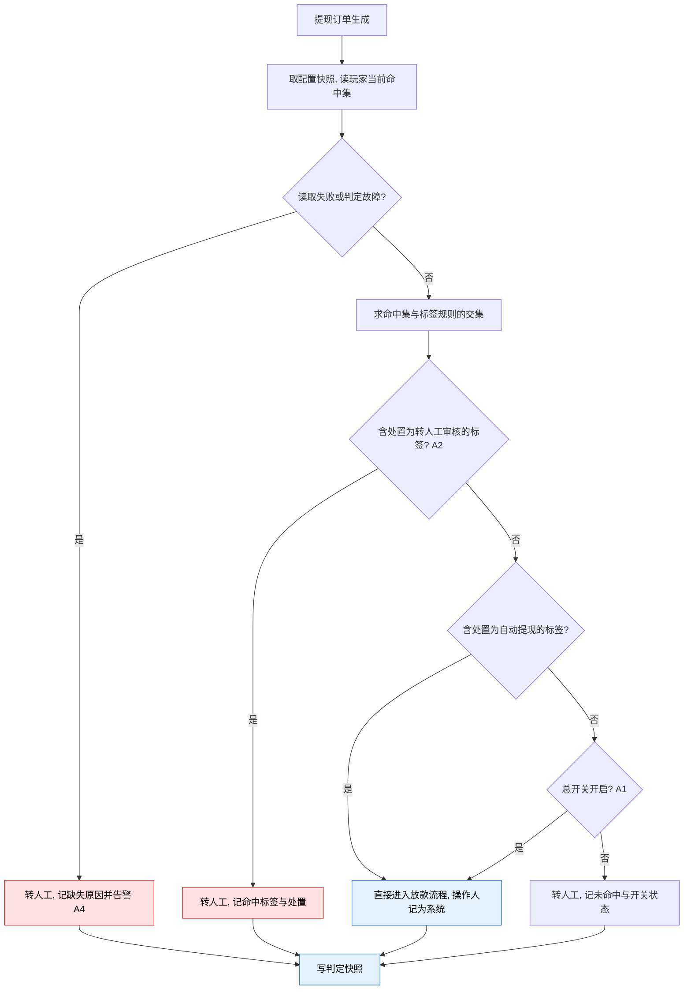

# 5.8 · 审核规则

## 1. 背景与目标

**目标**:用标签圈出的人群决定提现走人工还是自动放款,人工只看被拦下的单,每笔单的去向有据可查。

**谁在用**

| 角色 | 用来做什么 | 没有会怎样 |
|---|---|---|
| 财务 | 只审被拦下的单 | 提现全量人工,量一大就积压,玩家等钱投诉 |
| 风控 | 把风险人群固化成标签送进人工队列 | 审核标准因人而异,漏放与误拦说不清 |
| 运营 | 给可信人群开自动提现,自助调整不等发版 | 提现速度只能靠加减审核人手 |

**业务价值**:低风险人群的提现从「等人上班」变成分钟级到账;人工火力集中在可疑单;
人群口径复用标签,风控、客服、审核说同一套词汇。

**不做什么**

- **不做自动拒绝** —— 只分流「直接放款 / 转人工」,拒绝永远由人做出(A3)
- **不做内置条件与金额阈值** —— 风险与白名单人群一律用标签表达;订单级即时量(单笔金额、
  请求 IP 归属地)与竞品的双档阈值**有意不做**,需要时另立决策(模块决策 D32)
- 不做提现资格(打码)判定、人工审核流程(归 5.1)、标签本身的规则配置(归 2.5)

**适用范围**

| 维度 | 取值 |
|---|---|
| 终端 | Web 后台,桌面优先(设计基准 1440px) |
| 响应式 | 最小支持 1280px;不做移动端适配 |
| 界面语言 | 后台界面简体中文 |
| 时区 | 时间展示按运营时区并标注 |
| 货币 | 本页不涉及金额判定;金额的展示与口径归提现订单页 |

## 2. 入口

- 菜单:财务管理 → 提现管理 → 审核规则
- 跳入:首版仅从菜单进入

## 3. 术语

> 标签、命中集见 `../../M2-用户管理/2.5-用户标签/README.md`;锁定见 `../README.md` 第 2 段。不重复。

| 术语 | 定义 |
|---|---|
| 标签规则 | 一条「标签 → 处置」的绑定;标签来自 2.5,由运营在本页添加与删除 |
| 处置 | 命中标签后订单的去向:**转人工审核** 或 **自动提现** |
| 命中 | 玩家当前命中集与已配置标签的交集非空 |
| 判定快照 | 一次自动审核的留痕:走到的分支、命中的标签与处置 |

## 4. 关键参数与假设

| 编号 | 参数 | 取值 | 依据 | 在哪配 |
|---|---|---|---|---|
| A1 | 总开关 | 只决定**未命中任何标签**的订单去向:开=自动放款,关=转人工。**默认关**;切换均须二次确认(开:展示当前规则清单;关:提示自动提现标签仍生效) | 已定 | 本页配置 |
| A2 | 判定语义 | 命中集与标签规则求交集:含「转人工审核」即转人工(冲突时**人工优先**);全为「自动提现」则直接放款,**不受总开关影响**;交集为空按 A1 | 已定(D32) | 写死 |
| A3 | 永不拒绝 | 自动审核不拒绝订单,拒绝只能由人工在 5.1 做出 | 已定(D32) | 写死 |
| A4 | 数据缺失 | 命中集或配置读取失败、判定故障,一律**转人工**并留痕告警 —— 缺数放行等于错付钱 | 已定(D32) | 写死 |
| A5 | 生效时点 | 修改只对之后生成的订单生效,不追溯、不重判 | 已定 | 写死 |
| A6 | 标签读取口径 | 读判定时刻的**当前命中集**;重算延迟窗口内的漏判是已知代价,不做提现时同步重算 | 已定,时效见 2.5 第 4 段 A4 | 写死 |
| A7 | 规则行唯一 | 同一标签最多配置一行 | 已定 | 写死 |

**判定去向(A1/A2 的展开)**

| 情况 | 去向 | 受总开关影响 |
|---|---|---|
| 命中任一「转人工审核」标签 | 转人工队列 | 否 |
| 命中的全是「自动提现」标签 | 直接放款 | 否(白名单独立生效) |
| 未命中任何标签 | 开=直接放款;关=转人工 | **是**(总开关只管这一类) |

> 与 A1/A2 同义,口径以 A1/A2 为准;数据缺失与故障不走此表,一律按 A4 转人工。

## 5. 字段清单

纯配置页,无筛选与分页。页面两个区块:**总开关区**(当前状态与说明文案)与**标签规则表**。

**标签规则 · 表格列**

| 列 | 内容与展示形态 | 默认显示 |
|---|---|---|
| 序号 | 行号 | 是 |
| 标签 | 名称,点击跳转 2.5 定位;被停用时整行标异常(E5) | 是 |
| 组成 | 只读引用 2.5 的组成摘要,超长折叠 | 是 |
| 命中人数 | 只读引用 2.5,从未重算显示「未成熟」,**不显示 0**;供评估影响面 | 是 |
| 处置 | 文字徽记;「自动提现」是放钱方向,视觉权重须重于「转人工审核」 | 是 |
| 最后操作人 / 最后操作时间 | 按运营时区 | 是 |
| 操作 | 修改处置 · 删除(二次确认) | 是 |

> 首版不做列设置、排序与筛选,行按添加时间倒序;样式细节归 Figma,本表只约束列构成与展示形态。

**新增与编辑 · 表单字段**

| 字段 | 必填 | 规则 |
|---|---|---|
| 标签 | 是 | 下拉,仅列 2.5 启用中且未被本页配置的标签(A7) |
| 处置 | 是 | 单选:转人工审核 / 自动提现 |

## 6. 需求清单

> **权限**:权限码与树节点的映射见 `../README.md` 第 6 段。

| ID | 需求 | 触发条件 | 验收标准 | 权限码 |
|---|---|---|---|---|
| 5.8-R1 | 查看审核规则 | 进入页面 | 展示总开关与全部标签规则,列构成见第 5 段 | `finance:withdraw:rules` |
| 5.8-R2 | 维护标签规则 | 新增、修改处置或删除 | 新增按 A7 校验;删除二次确认;按 A5 生效;留痕前后对照;版本冲突提示重载,不静默覆盖 | `finance:withdraw:rules:edit` |
| 5.8-R3 | 切换总开关 | 切换并二次确认 | 按 A1 生效并留痕;重复提交只生效一次 | `finance:withdraw:rules:toggle` |
| 5.8-R4 | 自动审核判定 | 提现订单生成(执行在提现下单流程,口径以本页为准) | 按 A2~A4 判定;每单写判定快照;转人工的单带命中原因进 5.1 | 系统触发,无界面权限 |
| 5.8-R5 | 判定快照查询 | 在 5.1 打开订单详情或审核弹窗 | 展示该单快照:走到的分支、命中标签与处置 | `finance:withdraw:order` |

## 7. 需求详述

> R1~R3、R5 为简单查询与维护操作,第 6 段一行即为完整规格,不展开。

### 5.8-R4 自动审核判定

**触发条件**:提现订单生成,即提现资格校验与金额占用完成之后。执行在提现下单流程,口径以本段为准。

**可输入数据**:玩家当前标签命中集(owner=M2)· 标签规则与总开关的配置快照。

**功能范围**

| 归属 | 做什么 |
|---|---|
| 界面 | 无(系统需求);结果呈现在 5.1 的队列、「转人工原因」列与快照区 |
| 服务端 | 判定、快照留痕、幂等;判定不得明显放大提现时延 |

**处理逻辑**

1. 取配置快照,读玩家当前命中集(A6);读取失败或故障按 A4 转人工并告警
2. 求命中集与标签规则的交集,按第 4 段「判定去向」表分流(A1/A2)
3. 直接放款的单操作人员记为系统;每单写判定快照
4. 同一订单只判定一次,幂等;下单不因判定故障阻塞,也绝不因故障放行(A4)

> 配色:红色为给人看的拦截分支,蓝色为自动放款与快照写入 ——
> 自动放款是本页唯一的放钱动作,快照缺失即无法追责。

**错误处理**

| 错误状况 | 处理 |
|---|---|
| 命中集或配置读取失败、判定超时 | 按 A4 转人工并告警;下单主流程不阻塞 |
| 同一订单重复触发判定 | 幂等,只判定一次,以首次快照为准 |

**测试案例**

- 正向:命中「净取款玩家」(转人工)→ 转人工,5.1 可见命中标签与处置
- 正向:同时命中转人工与自动提现的标签 → **人工优先**,转人工
- 正向:未命中任何标签,总开关开 → 直接放款,快照记「未命中」
- 逆向:命中集读取失败 → 转人工,快照记原因为数据缺失

## 8. 数据流向与系统串接

**数据流向**:运营在本页配置标签规则与总开关 → 提现订单生成后按 R4 判定 →
转人工的单进 5.1 队列并带判定快照,直接放款的单进入放款流程 → 快照与配置变更留痕可查。

**系统串接**:无外部第三方。仓库内:用户标签(owner=M2,只读命中集与组成,
本页是 2.5 删除预检的登记引用方)· 提现订单(owner=M5,判定结果的消费方,见 5.1)·
全站操作日志(owner=M6)。人群怎么算归 2.5(含右值条件,M2-D31),本页只消费命中集。

## 9. 异常与边界

| # | 场景 | 触发条件 | 预期处理 |
|---|---|---|---|
| E1 | 越权 | 无权限账号提交操作 | 服务端拒绝;隐藏按钮不作为唯一防线 |
| E2 | 并发编辑 | 两人基于同一版本保存 | 后提交者版本过期,重载后再提交,不静默覆盖 |
| E3 | 判定与修改竞态 | 判定进行中规则被修改 | 单次判定取开始时快照;修改只对之后的订单生效(A5) |
| E4 | 数据缺失或判定故障 | 命中集、配置读取失败或超时 | 按 A4 全部转人工并告警,绝不缺数放行 |
| E5 | 引用的标签停用 | 已配置的标签在 2.5 被停用 | 该行永不命中 —— 整行标异常并告警,不得静默失效;删除已被 2.5 的引用预检阻断(2.5 第 4 段 A6) |
| E6 | 规则覆盖不足 | 总开关开,标签没圈住某类风险人群 | 开启总开关的二次确认展示规则清单(A1);误伤与漏放靠判定快照定位后调标签 |
| E7 | 标签重算延迟 | 风险行为刚发生,标签未及打上即提现 | 漏判按未命中处理,已知代价(A6);窗口随 2.5 重算时效 |

## 10. 状态清单

四态按全局默认。本页特有态:

| 状态 | 表现 |
|---|---|
| 总开关关闭 | 页面标注「未命中标签的提现当前全部走人工审核」 |
| 规则行异常 | 引用标签被停用的行整行标红并说明原因(E5) |
| 无规则警示 | 总开关开且无任何有效规则时,警示「当前所有提现将不经人工直接放款」 |

## 11. 涉及表与职责

**数据归属**

- **拥有**(owner=M5):标签规则、总开关及修改历史 · 判定快照(随提现订单存储与展示)
- **只读**:标签命中集、组成摘要与命中人数(owner=M2,口径与 2.5 一致)

**前后端职责**

| 事项 | 归属 |
|---|---|
| 权限判定 · 标签有效性与唯一性校验 · 版本冲突检测 | **服务端** |
| 判定、快照留痕与幂等 | **服务端** |
| 标签下拉过滤、二次确认、异常行标红 | 界面 |

## 12. 关联页面

- 跳出:2.5 用户标签(配置人群规则)· 5.1 提现订单(查看转人工的单与判定快照)· 6.3 操作日志
- 跳入:首版仅菜单
