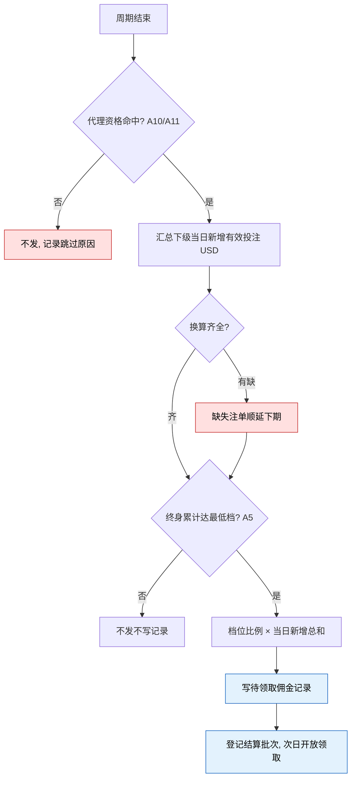
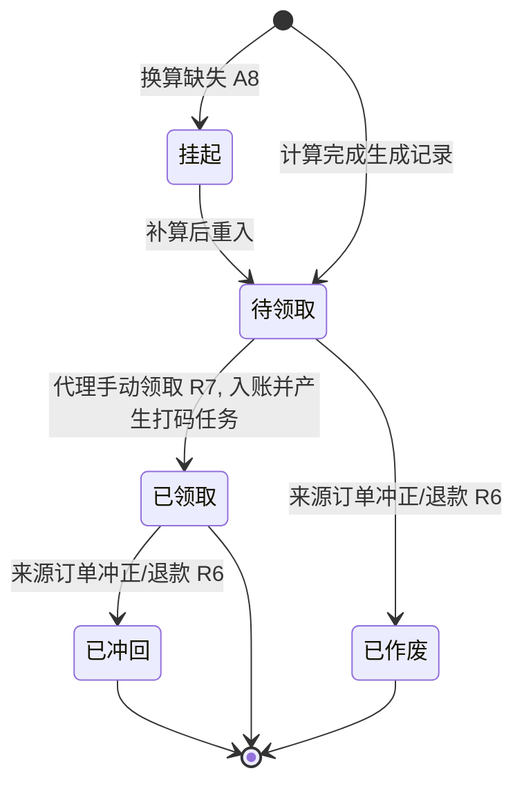

# 7.1 · 代理返佣

## 1. 背景与目标

**目标**:玩家邀请直属下级获得充值与投注返佣,平台以可控成本换取自增长拉新;
运营按人群与渠道定向开启,调比例当天生效,不用等发版。

**谁在用**

| 角色 | 用来做什么 | 没有会怎样 |
|---|---|---|
| 运营 | 配置比例、档位与目标人群 | 规则写死,调比例要发版 |
| 代理(玩家) | 邀请好友赚佣金 | 无裂变激励,拉新全靠买量 |
| 财务 / 风控 | 逐笔核对佣金来源与计算依据 | 佣金算错或被刷,查不出依据 |

**业务价值**:拉新成本与下级真实充值投注挂钩;每笔佣金带完整计算依据,可追溯。

**不做什么**

- **不做二级返佣、团队模式、三级分销** —— 枚举预留,首版只开放「仅直属」(A1)
- **不做代理关系绑定本身** —— 前置能力,归 7.3 代理列表(见模块决策 D28),本页只读引用
- **不做高RTP折算比例的配置** —— 归游戏管理,本页只读引用(A12)
- **不做佣金提现流程** —— 入账后走钱包统一提现,打码与提现语义归资金模型
- 不做玩家端页面 —— 本仓库只写运营后台

**适用范围**

| 维度 | 取值 |
|---|---|
| 终端 | Web 后台,桌面优先(设计基准 1440px) |
| 响应式 | 最小支持 1280px;不做移动端适配 |
| 界面语言 | 后台界面简体中文 |
| 时区 | 结算与时间展示按运营时区并标注 |
| 货币 | 判档与佣金计算按标准计价币种,见 A8 |

## 2. 入口

- 菜单:挂在**现有后台的代理管理菜单**下,新增独立入口,**不与现有界面重合**;
  该菜单下各 tab 的整理另开需求,本页不定义(2026-08-13 已定)
- 跳入:首版仅从菜单进入

## 3. 术语

> 通用词(代理关系、直属下级、一级代理)见 `../README.md` 第 2 段;
> 打码任务、有效投注的资金语义见 `../../M2-用户管理/2.1-用户列表/资金模型.md`,不重复定义。

| 术语 | 定义 |
|---|---|
| 充值返佣 | 直属下级每笔成功到账充值,按比例逐笔给上级的佣金 |
| 投注返佣 | 按周期内全部直属下级有效投注总和判档给上级的佣金 |
| 有效投注 | 实际投注 × 游戏折算比例(A12);与提现流水、打码、VIP 成长(`../../M4-活动管理/README.md`)同口径 |
| 佣金打码 | 佣金入账产生的打码任务倍数,完成前不可提现 |
| 配置快照 | 每次计算取用的当时配置副本,事后改配置不影响已算佣金 |
| 领取 | 代理在玩家端把待领取佣金转入钱包的动作;入账并按快照倍数产生打码任务 |

## 4. 关键参数与假设

**投注返佣档位默认表**(阈值为标准计价币种,按**终身累计**判定见 A5,可按 A3 修改)

| 打码要求(有效投注 ≥) | 100 | 500 | 1000 | 5000 | 10000 |
|---|---|---|---|---|---|
| 返还比例 | 1% | 1.5% | 2% | 2.5% | 3% |

| 编号 | 参数 | 取值 | 依据 | 在哪配 |
|---|---|---|---|---|
| A1 | 活动模式 | 枚举:仅直属 / 直属+二级 / 直属+团队 / 三级分销;**首版只开放仅直属**,其余置灰,数据结构预留 | 已定(2026-08-13) | 活动配置 |
| A2 | 充值返佣比例 | 1% ~ 10%,精度 0.1%;范围写死,值由运营配 | 已定(范围来自需求原稿;精度 2026-08-13 业务确认) | 活动配置 |
| A3 | 投注返佣档位 | 1 ~ 10 档;阈值严格递增、比例非递减;默认见上表 | 已定(2026-08-13 业务确认档数上限) | 活动配置 |
| A4 | 结算周期与领取开放 | 两类佣金均按**自然日**(运营时区)汇总生成待领取记录,次日到达「领取开放时点」后可领取;开放时点后台可配,默认 00:00 | 已定(2026-08-13 业务确认,含默认时点) | 活动配置 |
| A5 | 判档口径 | 判档按全部直属下级的**终身累计**有效投注,取最高满足档;发放基数为**当日新增**有效投注,按结算时点档位全量单一比例,**非分段累进** | 终身判档已定(2026-08-13 业务确认);增量发放为唯一不重复返佣的读法,随 D25 一并视为已定 | 写死 |
| A6 | 充值返佣发放时机 | 充值到账时逐笔计算生成待领取记录,**不实时入账**,次日按 A4 开放领取 | 已定(2026-08-13 业务确认) | 写死 |
| A7 | 佣金打码倍数 | 0 ~ 10 倍,0 = 无要求,默认 3 倍;**领取入账时**按记录快照的倍数产生打码任务,语义见 `资金模型.md` | 已定(2026-08-13 业务确认,含 0~10 倍范围);默认值来自现行后台截图 | 活动配置 |
| A8 | 金额口径 | 判档与计算一律按标准计价币种 USD;换算记录尚未补算的充值/注单**不计入当期**,补算后计入下期,对齐 `标准计价.md` | 已定 | 写死 |
| A9 | 佣金入账币种 | 以标准计价币种 USD 入账至代理钱包 | 已定(2026-08-13 业务确认,D26);前提是钱包开设 USD,实现时不支持须回 D26 重议 | 写死 |
| A10 | 人群限定口径 | 用户标签多选取**并集**,开放渠道多选取**并集**,两维度之间取**交集**;「全部」= 不限(含无标签玩家);**限定对象是代理本人**,不限定其下级 | 已定(2026-08-13) | 活动配置 |
| A11 | 资格判定时点 | 每次计算按**当时**标签命中与渠道归属判定;不符合即不发,恢复后**不补发** | 已定(2026-08-13 业务确认) | 写死 |
| A12 | 有效投注折算 | 有效投注 = 实际投注 × 游戏折算比例;按游戏逐个配置,owner=游戏管理,**本仓库范围外,只读引用**,未配置按 100% 处理;比例修改只对新注单生效,不追溯 | 已定(2026-08-13) | 游戏管理 |
| A13 | 排除项 | 测试账号、自我邀请、风控标记账号的充值与投注不计入;刷佣判定规则归风控(**范围外**) | 已定(2026-08-13 业务确认) | 写死 |
| A14 | 领取机制 | 佣金一律由代理**手动领取**(R7),领取时入账并按 A7 产生打码任务;待领取佣金**不过期** | 已定(2026-08-13 业务确认:手动领取、不过期) | 写死 |

> A1 的模式枚举含「三级分销」、A7 默认 3 倍,依据是需求原稿所附的现行后台截图:
> `截图/弹窗-活动模式-下拉展开.png`(修改活动模式弹窗,模式下拉展开态)。

## 5. 字段清单

**活动配置字段**

| 字段 | 类型 | 必填 | 规则 |
|---|---|---|---|
| 活动开关 | switch | 是 | 关闭立即停止产生新佣金,已入账不回收 |
| 活动名称 | text | 是 | 最长 30 字符,去首尾空格 |
| 用户标签 | multiselect | 是 | 「全部」或多选,只列启用中标签(2.5);口径 A10 |
| 开放渠道 | multiselect | 是 | 「全部」或多选,只列启用中渠道;口径 A10 |
| 活动模式 | select | 是 | A1,首版固定仅直属 |
| 充值返佣比例 | number | 是 | A2 |
| 佣金打码倍数 | number | 是 | A7 |
| 领取开放时点 | time | 是 | 次日该时刻起可领取前一日产生的佣金(A4),默认 00:00 |
| 档位行 · 打码要求 | number | 是 | 标准计价币种,严格递增(A3) |
| 档位行 · 返还比例 | number | 是 | 精度 0.1%,非递减(A3) |

> 配置页展示只读说明「有效投注按游戏折算比例计算,配置见游戏管理」并给跳转入口(A12)。

## 6. 需求清单

| ID | 需求 | 触发条件 | 验收标准 | 权限码 |
|---|---|---|---|---|
| 7.1-R1 | 查看活动配置 | 进入页面 | 展示全部配置、启停状态与最近修改人 | `agent:commission:view` |
| 7.1-R2 | 编辑活动配置 | 修改并保存 | 按 A1~A3、A7、A10 校验;只对之后的计算生效,**不追溯**;留痕 | `agent:commission:edit` |
| 7.1-R3 | 启停活动 | 切换并二次确认 | 关闭即停止新佣金;历史记录保留可查 | `agent:commission:toggle` |
| 7.1-R4 | 充值返佣计算 | 直属下级充值到账 | 按 A6 逐笔计算生成**待领取**记录;同一订单幂等只生成一次 | 系统触发,无界面权限 |
| 7.1-R5 | 投注返佣日结 | 结算周期结束 | 按 A5 终身累计判档、当日增量计算,生成**待领取**记录;批次可中断续跑,重复调度幂等 | 系统触发,无界面权限 |
| 7.1-R6 | 佣金冲回 | 来源充值冲正/退款 | 未领取的记录直接**作废**;已领取的自动冲回**以钱包余额为上限**(不产生负余额),未耗打码任务核销;差额只在冲回留痕中记录并告警,**首版不做挂账台账与系统内追偿**,线下人工处理(D27 已定,有意省略勿补)。投注返佣结算后的注单回滚**不追溯**,超阈值告警 | 系统触发,无界面权限 |
| 7.1-R7 | 佣金领取入账 | 代理在玩家端发起领取 | 校验状态与开放时点(A4/A14);入账带来源标识 + 按 A7 产生打码任务;重复领取幂等 | 系统触发,无界面权限 |

## 7. 需求详述

### 7.1-R4 充值返佣计算

**触发条件**:充值订单成功到账(owner=财务,只读)。

**可输入数据**:订单金额与换算结果 · 该玩家的上级(代理关系,只读)· 活动配置快照 ·
上级的标签命中与渠道归属。

**功能范围**

| 归属 | 做什么 |
|---|---|
| 界面 | 无(系统需求);结果呈现在佣金记录 |
| 服务端 | 资格判定、计算、入账、写记录,保证幂等不丢单 |

**处理逻辑**

1. 无上级则结束;判活动开启且模式含直属
2. 按 A10/A11 判上级资格,不符合则不发并**记录跳过原因**;按 A13 排除
3. 取标准计价换算结果(A8);未补算则**挂起**,补算后重入
4. 佣金 = 换算金额 × 充值返佣比例(计算时刻配置快照,打码倍数一并快照)
5. 写**待领取**佣金记录:来源订单、比例与倍数快照、换算依据;次日按 A4 开放领取
6. 同一订单**只生成一次**;入账发生在领取时(R7),本步不动钱包

**错误处理**

| 错误状况 | 处理 |
|---|---|
| 资格不符 | 不发,跳过原因可查 |
| 换算缺失 | 挂起重入,不按原币硬算 |
| 重复触发 | 幂等,只生成一次 |

**测试案例**

- 正向:下级充值换算 100 USD,比例 5% → 生成 5 USD 待领取记录,次日按 A4 可领取
- 逆向:上级不属所选渠道 → 不发,跳过原因可查

### 7.1-R5 投注返佣日结

**触发条件**:结算周期(A4)结束,系统调度,无手工触发界面。

**可输入数据**:有直属下级的玩家 · 下级当日已结算注单的有效投注(A12/A8)·
周期结束时点的配置快照。

**功能范围**

| 归属 | 做什么 |
|---|---|
| 界面 | 无(系统需求);当期未出结果标注「结算中」 |
| 服务端 | 汇总、判档、入账、写记录与批次,可中断续跑 |

**处理逻辑**

1. 候选按 A10/A11 过滤、A13 排除
2. 逐代理汇总下级**当日新增**有效投注(USD);换算未补算的注单**顺延下期**(A8)
3. 按全部直属下级**终身累计**有效投注判档(A5),未达最低档不发不写记录
4. 佣金 = 当日新增总和 × 档位比例(配置与倍数快照);写**待领取**记录,次日按 A4 开放领取
5. 批次可中断续跑,不得半发后当完成;单代理失败跳过记录,不中断整批
6. 活动中途关闭:关闭前投注**照常结算当期**,关闭后不计入;已生成的待领取佣金不受关闭影响

> 配色:红色为不发与顺延分支(必须留痕,否则无法解释「为什么没到账」),
> 蓝色为产生留痕的写入步骤;本流程不动钱包,入账发生在领取(R7)。

**错误处理**

| 错误状况 | 处理 |
|---|---|
| 批次中断 | 断点续跑,已发不重复 |
| 结算期间改配置 | 本批按快照跑完,修改下期生效 |

**测试案例**

- 正向:下级终身累计 6000 USD、当日新增 800 USD → 命中 ≥5000 档,佣金 20 USD(2.5%),次日可领取
- 逆向:高RTP折算 1%,实投 10000 → 按有效投注 100 计入,不按实投

### 7.1-R7 佣金领取入账

**触发条件**:代理在玩家端对待领取佣金发起领取(单条或一键全部);玩家端属本仓库范围外,规则以本段为准。

**可输入数据**:待领取佣金记录(含比例与打码倍数快照)· 领取开放时点(A4)。

**功能范围**

| 归属 | 做什么 |
|---|---|
| 界面 | 无(玩家端行为);后台在佣金记录中呈现领取状态与时间 |
| 服务端 | 状态与时点校验、入账、打码任务、状态流转,保证幂等 |

**处理逻辑**

1. 校验记录状态为**待领取**且已到 A4 开放时点;已作废、已领取的拒绝
2. 入账:账变带**来源标识**(资金域不与活动建立关联,00-公共约定铁律)
3. 按记录快照的打码倍数产生打码任务(A7);倍数以**生成时快照**为准,领取时改配置不影响
4. 状态流转待领取 → 已领取,写流水
5. 重复领取幂等,只入账一次

**错误处理**

| 错误状况 | 处理 |
|---|---|
| 未到开放时点 | 拒绝并提示可领取时间 |
| 记录已作废 | 拒绝并提示来源已撤销 |
| 重复领取 | 幂等,只入账一次 |
| 入账失败 | 重试不丢单,持续失败告警,状态不得停在中间态 |

**测试案例**

- 正向:次日开放后领取 5 USD(倍数快照 3)→ 入账 5 USD + 打码任务 15 USD,状态已领取
- 逆向:当日就发起领取 → 拒绝,提示次日开放时点

> 待领取暂不过期(A14)。佣金记录不含「打码中 / 可提现」状态 —— 打码进度归打码任务(`资金模型.md`),不重复承载。

## 8. 数据流向与系统串接

**数据流向**:运营保存配置 → 之后的计算取快照 → 充值到账触发 R4 / 周期结束触发 R5 →
读代理关系、标签命中、渠道、换算记录、折算比例 → 计算并生成**待领取**佣金记录 →
代理次日在玩家端领取(R7)→ 钱包入账(带来源标识)+ 打码任务 →
佣金记录页(7.2)与玩家端读取状态。

**系统串接**:代理关系(owner=M7,规则待 7.3)· 充值订单、钱包、打码任务、换算记录(owner=财务)·
注单与有效投注(owner=玩法,**范围外**)· 折算比例(owner=游戏管理,**范围外**)·
标签命中集(owner=M2)· 渠道(owner=代理渠道,**范围外**)· 操作日志(owner=M6)。

- 对钱包**只发起入账与冲回请求**,不直接改余额;资金域不反向依赖活动域
- 领取由玩家端(**范围外**)发起,但校验、入账与状态流转全部在服务端;玩家端不判定资格
- 标签只读当前命中集,不反向写入;标签删除预检须能查到本活动引用
- 折算比例与换算记录只读;其口径变化直接改变佣金结果,改动须与本页同步评审

## 9. 异常与边界

| # | 场景 | 触发条件 | 预期处理 |
|---|---|---|---|
| E1 | 越权 | 无权限账号提交操作 | 服务端拒绝;隐藏按钮不作为唯一防线 |
| E2 | 并发编辑 | 两人基于同一版本改配置 | 后提交者版本过期,重载后再提交,不静默覆盖 |
| E3 | 冲正与回滚 | 充值冲正 / 结算后注单回滚 | 未领取作废、已领取按 R6 冲回;注单回滚不追溯,超阈值告警人工核查 |
| E4 | 关系变更请求 | 玩家要求更换上级 / 后台人工解除关系 | 代理关系以邀请码绑定且**不可换绑**(D28),换绑请求一律拒绝;如后台人工解除,此后不再计入原上级,已发与待领取佣金不回收不作废 |
| E5 | 代理被封禁 | 上级处于封禁状态 | 封禁期间不参与计算,解封不补发(同 A11) |
| E6 | 中途关闭 | 活动在周期中关闭 | 关闭前投注照常结算当期;关闭后不再产生新佣金 |
| E7 | 换算缺失 | 标准计价未补算 | 充值挂起、投注顺延下期(A8),不按原币硬算 |
| E8 | 折算修改 | 高RTP折算比例调整 | 只对新注单生效,不追溯(A12) |
| E9 | 领取竞态 | 领取与来源冲正同时发生 | 以先完成的状态流转为准:已作废不可再领取,已领取则转入冲回;不得出现双重状态 |
| E10 | 关闭后遗留 | 活动关闭时仍有待领取佣金 | 仍可领取,已产生权益不没收(A14);后台记录可查 |

## 10. 状态清单

四态按全局默认。本页特有态:

| 状态 | 表现 |
|---|---|
| 结算中 | 当期数字标注「结算中」,不展示半截结果 |
| 活动已关闭 | 配置只读弱化,历史记录可查 |
| 佣金挂起 | 标注挂起原因与预计重入时机 |

## 11. 涉及表与职责

**数据归属**

- **拥有**(owner=M7):活动配置及修改历史 · 档位表 · 佣金记录 · 结算批次
- **只读**:代理关系(owner=M7,规则待 7.3)· 充值订单、钱包、打码任务、换算记录(owner=财务)·
  注单与有效投注(owner=玩法,**范围外**)· 折算比例(owner=游戏管理,**范围外**)·
  标签命中集(owner=M2)· 渠道(owner=代理渠道,**范围外**)

> **佣金记录是审计数据**:计算依据(比例快照、换算依据、档位、来源单据)入账后不可改;
> 状态流转每次写流水;配置每次保存留前后对照。

**前后端职责**

| 事项 | 归属 |
|---|---|
| 权限判定 · 配置校验 · 资格判定与计算 · 入账冲回与幂等续跑 | **服务端** |
| 档位行增删、递增即时校验、离开前未保存提示 | 界面 |

## 12. 关联页面

- 跳出:7.2 佣金记录(未开工)· 2.5 用户标签 · 2.2 钱包流水 · 6.3 操作日志
- 跳入:7.3 代理列表(未开工)
