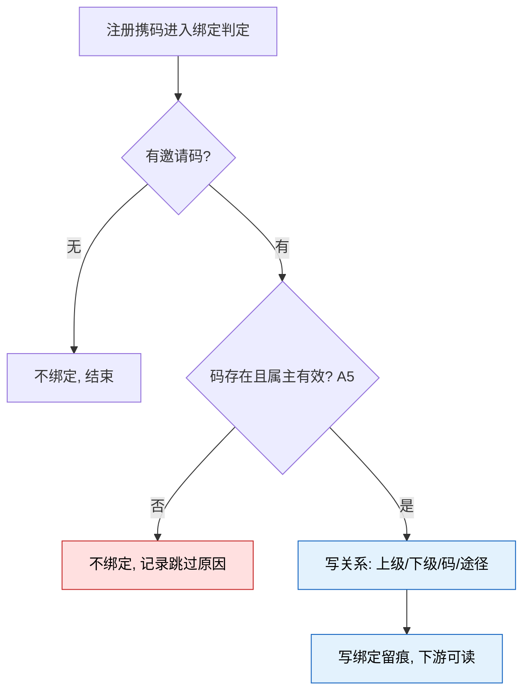

# 7.3 · 代理列表

## 1. 用途

定清玩家之间的邀请绑定规则,并让运营与客服查得到「谁邀请了谁、下级贡献了多少」——
它是代理返佣的计算地基,关系不清,佣金争议就无法查证。

### 使用者

| 角色 | 用来做什么 | 没有会怎样 |
|---|---|---|
| 运营 | 看代理结构与产出,评估返佣活动效果 | 只看得到佣金总数,不知道钱发给了什么样的代理 |
| 客服 | 处理「我下级充值了为什么没佣金」 | 查不到绑定关系与贡献明细,只能升级工单 |
| 风控 | 识别自邀、互刷的账号结构 | 刷佣结构靠人工猜 |

绑定规则一次定清,返佣、玩家端邀请页、风控共用同一事实;
客服凭下级清单自助答复佣金争议,不再升级。

### 本次范围

- **首版不做管理界面**(2026-08-13 已定)—— 列表与下级清单延后,随后续界面需求启动;
  首版只实现绑定与邀请码的后台逻辑(R3、R5)
- **不做换绑** —— 绑定终身有效(D28 已定);后台人工解除是唯一例外(A4)
- **不做补填** —— 仅注册时绑定,注册后不能再认上级(A3)
- 不做多码与活动码 —— 每人一个固定邀请码(A1)
- 不做玩家端邀请页本身 —— 规则以本页为准,玩家端照此实现
- 不做佣金计算与发放 —— 归 7.1,本页只读聚合展示

### 适用范围

| 维度 | 取值 |
|---|---|
| 终端 | Web 后台,桌面优先(设计基准 1440px) |
| 响应式 | 最小支持 1280px;不做移动端适配 |
| 界面语言 | 后台界面简体中文 |
| 时区 | 时间按运营时区展示并标注 |
| 货币 | 金额列按标准计价币种展示,见 A8 |

## 2. 查询与处理信息

> 管理界面首版延后(见“用途”),以下为界面启用时的**预留规格**,先行定义避免届时口径漂移。

**筛选字段**

| 字段 | 类型 | 可输入数据与校验 |
|---|---|---|
| 玩家 | text | 玩家编号或昵称,模糊匹配,去首尾空格 |
| 上级 | text | 上级玩家编号,精确匹配 |
| 渠道来源 | select | 只列启用中的渠道 |
| 绑定时间 | daterange | 起止时间;绑定与注册同时(A3) |
| 有无下级 | select | 全部 / 有下级 / 无下级 |

**表格列**

| 列 | 说明 | 默认显示 |
|---|---|---|
| 玩家 | 编号与昵称 | 是 |
| 邀请码 | | 是 |
| 上级 | 无上级显式展示「无」,不留白 | 是 |
| 直属下级数 | 点击进下级清单 | 是 |
| 下级终身累计有效投注 | 7.1-A5 的判档基数,口径同源不重复定义 | 是 |
| 当前档位 | 按 7.1 档位表命中的返还比例 | 是 |
| 累计充值返佣 / 累计投注返佣 | 已领取口径,USD(A8) | 是 |
| 待领取余额 | USD(A8) | 是 |
| 绑定时间 | 与注册同时(A3) | 是 |
| 操作 | 查看下级 · 查看佣金记录 · 解除关系 | 是 |

**下级清单**(点击直属下级数进入)

| 列 | 说明 |
|---|---|
| 下级玩家 | 编号与昵称 |
| 绑定时间 | |
| 渠道来源 | |
| 累计充值 | 成功到账充值之和,USD(A8) |
| 终身累计有效投注 | 与 7.1 判档同源,USD(A8) |
| 关系状态 | 有效 / 已解除(含解除时间与原因) |

### 配置限制与默认值

| 配置或参数 | 填写与执行规则 |
|---|---|
| 每页条数(A7) | 50 条/页,与 2.1 一致 |
| 金额列口径(A8) | 一律按标准计价币种 USD 展示,口径同 7.1-A8,见 `标准计价.md` |

## 3. 处理规则

### 邀请码形态(A1)

每玩家一个**固定个人码**,注册时自动生成、全局唯一、终身不变;不可自定义、不可多码。

配置或来源：(最简方案,D28)。

### 绑定途径(A2)

邀请链接自动带码,或注册表单手输;两者同一机制,链接带入的码可改。

配置或来源：(最简方案,D28)。

### 绑定时点(A3)

**仅注册时**绑定,注册后不可补填;上级必然先于下级注册,循环绑定天然不可能;存量玩家不追溯补绑。

配置或来源：(最简方案,D28)。

### 换绑与解除(A4)

不可换绑(D28 已定);后台可**人工解除**,解除后该下级不再计入原上级且**不可重绑**任何上级。

配置或来源：不可换绑;人工解除为。

### 注册绑定关系(7.3-R3)

新玩家注册,注册来源携带邀请码(链接带入或表单手输,同一机制,A2);无码则不进入绑定。

输入信息：邀请码(格式与长度按 A1 生成规则校验)· 新玩家注册信息(owner=M2,只读)。

1. 注册流程携码进入绑定判定;无码直接结束,玩家无上级
2. 校验码存在且属主有效(A5);属主已注销则不绑定,**记录跳过原因**
3. 校验非自我绑定 —— A3 下天然不可能(属主必已存在、新玩家尚无码),服务端仍兜底校验
4. 写关系:上级、下级、邀请码、绑定时间、来源途径(链接 / 手输),终身有效
5. 同一玩家注册重复提交,幂等只产生一条关系
6. 绑定成败均不影响注册结果(A5)

> 配色:红色为不绑定分支(必须留痕,否则客服无法解释「为什么没绑上」),
> 蓝色为写入与留痕步骤。所有分支都不阻断注册(A5)。

### 人工解除关系(7.3-R4)

持有解除权限的账号在下级清单对某条有效关系点击解除,填写原因并二次确认。

输入信息：目标关系 · 解除原因(必填,最长 200 字符)。

1. 判权限;校验关系当前为有效
2. 置为已解除,记录操作人、时间、原因;**关系记录不删除**
3. 解除即时生效:此后该下级的充值与投注不再计入原上级(7.1-E4);
   已进入当日计佣的数据按事件发生时点归属
4. 已发与待领取佣金一律不动;该下级此后**不可再绑定任何上级**(A4)

## 4. 特殊情况

### 无效码处理(A5)

码不存在或属主已注销时,**注册照常完成、仅不绑定**,不阻断注册。

### 封禁与注销影响(A6)

关系保留;封禁只影响计佣(7.1-A11/E5);注销玩家的码失效,已有下级关系保留供查证。

### 边界处理

| # | 场景 | 触发条件 | 预期处理 |
|---|---|---|---|
| E1 | 越权 | 无权限账号提交解除 | 服务端拒绝;隐藏按钮不作为唯一防线 |
| E2 | 无效码注册 | 码不存在或属主注销 | 注册照常、不绑定、记录原因(A5),不得报错打断注册 |
| E3 | 自我与循环绑定 | 构造请求试图绑自己或成环 | A3 下天然不可能,服务端仍兜底拒绝并告警 |
| E4 | 重复绑定 | 同一玩家注册重复提交 / 二次尝试换上级 | 幂等只留一条关系;指定不同上级一律拒绝 |
| E5 | 解除遗留 | 解除时仍有待领取佣金 | 佣金不动(7.1-E4);解除只影响之后的计佣 |
| E6 | 存量玩家 | 功能上线前注册的玩家 | 无上级,不追溯补绑(A3);列表显式展示「无」 |

### 注册绑定关系遇到异常时(7.3-R3)

| 错误状况 | 处理 |
|---|---|
| 码不存在 | 不绑定,注册照常,记录原因 |
| 属主已注销 | 不绑定,注册照常,记录原因 |
| 重复提交 | 幂等,只绑一次 |
| 关系写入失败 | 重试;持续失败告警,注册不回滚 |

### 人工解除关系遇到异常时(7.3-R4)

| 错误状况 | 处理 |
|---|---|
| 无权限 | 拒绝;界面隐藏按钮不作为唯一防线 |
| 关系已解除 | 拒绝并提示当前状态 |
| 并发解除 | 幂等,只留一次解除留痕 |

### 页面状态

四态按全局默认。本页特有态:

| 状态 | 表现 |
|---|---|
| 已解除关系 | 下级清单整行弱化,标注解除时间与原因,可查不可恢复 |
| 无上级 | 上级列显式展示「无」,与取数失败区分,不留白 |

## 5. 验收场景

| 需求编号 | 场景与操作 | 预期结果 |
|---|---|---|
| 7.3-R1 | 查看代理列表：进入页面 · 点击查询 | 能按玩家、上级、渠道、绑定时间筛出代理;佣金与判档列与 7.1 口径同源 |
| 7.3-R2 | 查看下级清单：点击直属下级数 | 展示该代理全部直属下级及贡献明细;已解除的保留展示并标注 |
| 7.3-R3 | 注册绑定关系：新玩家经邀请链接或手输码注册 | 按 A1~A3、A5 判定;绑定即终身有效,全程留痕;**注册不因绑定失败而失败** |
| 7.3-R4 | 人工解除关系：点击解除并二次确认 | 按 A4 置为已解除并留痕;此后不再计佣,已发与待领取佣金不动(7.1-E4) |
| 7.3-R5 | 邀请码生成：玩家注册完成 | 自动生成全局唯一固定码(A1),终身不变;生成失败可重试,不阻断注册 |

### 注册绑定关系(7.3-R3)

- 正向:经 A 的邀请链接注册 → 新玩家成为 A 的直属下级,来源记「链接」
- 正向:无码注册 → 无上级,列表上级列显式展示「无」
- 逆向:填一个不存在的码 → 注册成功、不绑定,后台可查跳过原因

### 人工解除关系(7.3-R4)

- 正向:解除后下级次日充值 → 原上级不再产生佣金,历史佣金记录与待领取余额不变
- 逆向:无权限账号提交解除 → 服务端拒绝

## 6. 相关资料

### 入口与关联页面

- 首版**无界面入口**:本页只以后台逻辑存在(R3、R5),管理界面延后随后续界面需求启动
- 路由与菜单位置为界面启用时的预留,届时随现有后台代理管理菜单的 tab 整理一并定

- 跳出:7.2 佣金记录(带代理筛选,未开工)· 2.1 用户列表(查玩家详情)· 6.3 操作日志(查解除留痕)
- 跳入:首版仅菜单

### 权限

| 操作 | 权限或执行方 |
|---|---|
| 查看代理列表(7.3-R1) | `agent:list:view` |
| 查看下级清单(7.3-R2) | `agent:list:view` |
| 注册绑定关系(7.3-R3) | 系统触发,无界面权限 |
| 人工解除关系(7.3-R4) | `agent:relation:remove` |
| 邀请码生成(7.3-R5) | 系统触发,无界面权限 |

> **首版范围:仅 R3、R5(后台逻辑)。** R1、R2、R4 依赖管理界面,延后至界面需求启动;
> 编号保留不重排。

### 术语与共用口径

> 通用词(代理关系、直属下级、一级代理)见 `../README.md` 第 2 段。

| 术语 | 定义 |
|---|---|
| 邀请码 | 玩家名下唯一且终身不变的绑定凭证,注册时自动生成(A1) |
| 邀请链接 | 携带邀请码的注册入口,经它注册自动填码(A2) |
| 绑定 | 新玩家注册时与邀请码属主建立上下级关系,终身有效 |
| 解除 | 后台人工把某条关系置为失效的例外操作;解除后不可重绑 |

### 依赖与数据流

**数据流向**:玩家注册(携码)→ 服务端绑定判定,写关系与留痕 → 7.1 结算读关系判归属 →
本页聚合展示关系、判档基数与佣金汇总 → 客服与运营查证,必要时人工解除(R4)。

**系统串接**:注册流程与玩家档案(owner=M2;绑定判定嵌在注册流程内,**不得使注册失败**)·
代理返佣(7.1,读关系与终身累计判档)· 佣金记录(7.2,本页跳转)·
玩家端邀请页(**范围外**,展示邀请码与下级,规则以本页为准)·
渠道(owner=代理渠道,**范围外**)· 操作日志(owner=M6)。

- 关系是 7.1 计佣的唯一归属依据;**只有 R3 与 R4 能写关系**,其余环节一律只读
- 佣金与判档数字是 7.1 数据的只读聚合,本页不重复定义口径

### 数据归属与职责

**数据归属**

- **拥有**(owner=M7):代理关系(上级、下级、邀请码、绑定时间、来源途径、状态)·
  邀请码 · 绑定与解除留痕
- **只读**:玩家档案与注册事件(owner=M2)· 渠道(owner=代理渠道,**范围外**)·
  佣金记录与判档汇总(owner=M7,定义在 7.1,本页只读聚合)

> **关系记录只增不删**:解除是状态流转加留痕。历史佣金的归属解释依赖它,删了链路就断了。

**前后端职责**

| 事项 | 归属 |
|---|---|
| 权限判定 · 码校验与绑定判定 · 幂等与留痕 · 聚合口径正确性 | **服务端** |
| 筛选交互、二次确认弹窗、解除原因必填提示 | 界面 |

### 注册绑定关系的职责(7.3-R3)

| 归属 | 做什么 |
|---|---|
| 界面 | 无(注册流程属玩家端,**范围外**);后台在本页与下级清单呈现绑定结果 |
| 服务端 | 码校验、属主判定、写关系与留痕;任何失败不阻断注册 |

### 人工解除关系的职责(7.3-R4)

| 归属 | 做什么 |
|---|---|
| 界面 | 二次确认弹窗,展示该下级的贡献数据与影响说明 |
| 服务端 | 判权限、置状态、留痕、通知计佣停止 |
