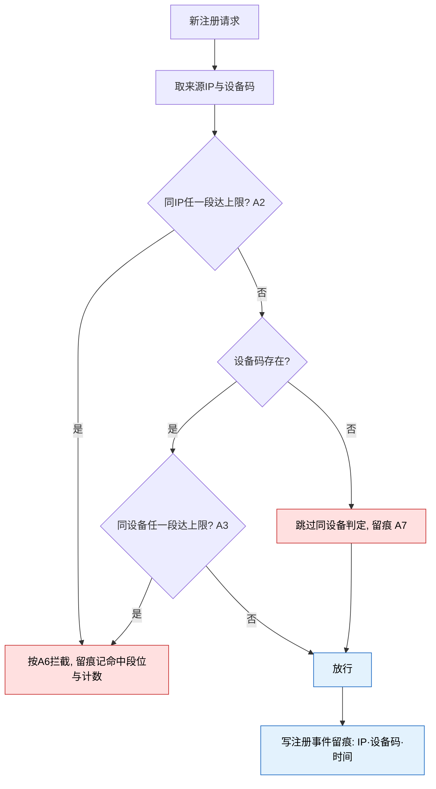

# 8.1 · 风控参数

## 1. 用途

注册环节的多号限制(同IP、同设备、同CPF)与风控统计窗口集中一页配置,
调参数即时生效不用发版;每一次拦截都能查到命中原因。

### 使用者

| 角色 | 用来做什么 | 没有会怎样 |
|---|---|---|
| 风控 / 运营 | 按刷号态势调注册限制与统计窗口 | 限制写死,黑产换打法只能等发版 |
| 客服 | 依据用户详情里的同IP/同设备计数快速判断代理是否养小号 | 逐个肉眼比对,查一个团伙要翻几十个账号 |
| 代理业务 | 依赖注册限制挡住自邀刷佣这条成本最低的打法 | 一人批量注册小号互刷返佣,拉新预算变成套利提款机 |

把多号注册的成本从「免费」抬到「要换IP换设备换证件」,直接压低刷佣与刷活动的收益;
统计窗口给客服与风控一个可解释、可调节的关联计数口径。

### 本次范围

- 不做注册流程本身 —— 拦截的执行在平台注册环节(**本仓库范围外**),本页只定义参数与判定口径
- 不做 RTP 取值范围 —— 现有后台与本区块同屏,归玩法/游戏域(**范围外**),不收入
- 不做设备码的采集与生成 —— 归客户端(**范围外**),本页只读引用(A7,模块决策 D30)
- 不做风控命中后的人工审核流程 —— 超限按D29拒绝注册,本版不提供注册人工审核队列
- 不做登录环节的限制 —— 首版只管注册与CPF绑定;登录事件只用于统计展示

### 适用范围

| 维度 | 取值 |
|---|---|
| 终端 | Web 后台,桌面优先(设计基准 1440px) |
| 响应式 | 最小支持 1280px;不做移动端适配 |
| 界面语言 | 后台界面简体中文 |
| 时区 | 时间窗按事件发生时刻连续回溯,不切自然日,与时区无关;时间展示按运营时区 |
| 货币 | 不涉及金额 |

## 2. 配置项

本页为纯配置页,无筛选字段与列表。

**配置字段**

| 字段 | 类型 | 必填 | 规则 |
|---|---|---|---|
| 同IP注册限制 · 段位行 | 时间窗(小时)+ 人数上限 | 是 | 均为正整数;最多 3 行,可增删;窗口严格递增、人数非递减(A2) |
| 同设备注册限制 · 段位行 | 同上 | 是 | 规则同 A2,按设备码判定(A3) |
| 搜索相同IP时间秒数 | number | 是 | 正整数秒,默认 86400;上限 30 天,防误配(A4) |
| 搜索相同设备时间秒数 | number | 是 | 正整数秒,默认 3600;上限 30 天(A4) |
| 相同CPF绑定账号上限 | number | 是 | 正整数,默认 1(A5) |

### 配置限制与默认值

| 配置或参数 | 填写与执行规则 |
|---|---|
| 生效范围(A1) | 全站一套参数,不分渠道、标签、注册来源；(现行后台亦为单套) |
| 同IP注册分段(A2) | 每段 = 时间窗(小时)+ 注册人数上限,最多 **3 段**;窗口严格递增、人数非递减;**任一段达到上限即超限**;默认单段 2 小时 / 5 人；段数上限与默认值来自现行后台;递增规则与「任一段命中即超限」为 |
| 同设备注册分段(A3) | 结构同 A2,按设备码判定;默认单段 2 小时 / 5 人；同 A2 |
| 统计窗口(A4) | 「搜索相同IP时间秒数」默认 86400,「搜索相同设备时间秒数」默认 3600;只决定用户详情「风控数据」计数的检索范围 —— 以被查事件时间为中心**前后各取该时长**(沿用 2.1 弹窗原口径),**不参与拦截**;上限 30 天；默认值与用途文案来自现行后台;窗口用法、不参与拦截、30 天上限为 |
| CPF绑定上限(A5) | 同一 CPF 最多绑定的账号数,默认 1;解绑或注销后名额释放；默认值来自现行后台;名额释放为 |

## 3. 操作规则

### 超限动作(A6)

注册超限**拒绝注册**;提示文案不暴露风控规则与阈值。

配置或来源：模块决策D29。

### 计数口径(A8)

「注册人数」按注册**成功**事件计,被拦截的注册不占名额;判定与统计都依赖注册/登录事件留痕(IP、设备码、时间)。

配置或来源：M2必须提供注册和登录成功事件,含唯一事件号、玩家、IP、设备码及业务时间。

> 「最多 3 段」、各默认值与两条窗口的用途文案,依据是现行后台截图:
> `截图/系统设置-其他设置-审核相关.jpg`(系统设置-其他设置页「审核相关」区块)。
> A4 是 2.1 用户详情弹窗 A-1「风控关联账户判定时间窗」的唯一配置出处,两处口径以本行为准。

### 编辑风控参数(8.1-R2)

修改任一参数并保存。

1. 校验各字段范围(A2~A5):段位窗口严格递增、人数非递减,段数不超过 3
2. 保存生成新版本并留痕:修改人、时间、修改前后值
3. 新参数只对**之后**的判定与统计查询生效,已完成的判定不追溯、不重算

### 注册超限判定(8.1-R3)

新玩家提交注册。执行在平台注册流程(**本仓库范围外**),判定口径以本段为准。

输入信息：注册请求的来源IP与设备码 · 当前生效的分段配置(A2/A3)· 注册事件留痕(A8)。

1. 取注册请求的来源IP与设备码
2. 同IP判定:对 A2 的每一段,统计该IP在时间窗内的注册成功数,任一段达到上限即超限
3. 同设备判定:同法按 A3;设备码缺失则**跳过本维度**并留痕(A7)
4. 超限按 A6 处理(首版规则:拒绝注册),留痕记命中段位与当时计数
5. 放行的注册写入事件留痕(IP、设备码、时间),供后续判定与统计使用

> 配色:红色为拦截与降级分支(必须留痕,否则误伤无法申诉、缺码放行无法复盘),
> 蓝色为放行与写留痕。本流程不涉及资金。

### CPF绑定上限判定(8.1-R4)

玩家提交CPF绑定。执行在绑定流程(**范围外**),口径以本段为准。

输入信息：CPF号码 · 该CPF当前有效绑定的账号数(owner=M2 玩家档案)· 上限(A5)。

1. 统计该CPF当前**有效绑定**的账号数;已解绑、已注销的不计入,名额释放(A5)
2. 达到上限拒绝绑定并留痕;未达上限放行
3. 并发绑定同一CPF时名额判定须原子,不得超发

## 4. 特殊情况

### 设备码口径(A7)

设备码由客户端采集上报,客户端按安装实例持久生成标识,Web按浏览器配置文件持久保存(**范围外**);服务端验证格式并记录来源,不将其当作不可伪造身份;采不到设备码的注册**跳过同设备判定**并留痕。

配置或来源：—— 模块决策 D30。

### 边界处理

| # | 场景 | 触发条件 | 预期处理 |
|---|---|---|---|
| E1 | 越权 | 无编辑权限的账号提交保存 | 服务端拒绝;隐藏按钮不作为唯一防线 |
| E2 | 并发编辑 | 两人基于同一版本保存 | 后提交者版本过期,重载后再提交,不静默覆盖 |
| E3 | 判定与修改竞态 | 判定进行中参数被修改 | 单次判定内参数取判定开始时的快照;修改只对之后的判定生效 |
| E4 | 设备码缺失或伪造 | 客户端未上报,或指纹被伪造 | 缺失按 A7 跳过并留痕;指纹可伪造,同设备限制的定位是抬高成本,不是绝对防线 |
| E5 | 共享出口IP误伤 | 校园网、公司网、运营商共享出口下大量正常用户同IP | 超限即拦,首版不做IP白名单;提示不暴露风控原因;误伤靠拦截留痕定位,运营可临时调大段位 |
| E6 | 历史事件缺口 | 留痕上线前的注册无IP/设备记录 | 计数只覆盖有留痕的时段,历史缺口不补;偏低的计数不得当作「无风险」结论 |
| E7 | 极端窗口配置 | 统计窗口配得过大 | 超 30 天上限拒绝保存(A4);上限内的大窗口查询按服务端超时保护处理 |
| E8 | CPF名额释放竞态 | 解绑与新绑并发 | 名额原子判定不超发;解绑成功后名额即时释放(A5) |

### 编辑风控参数遇到异常时(8.1-R2)

| 错误状况 | 提示 |
|---|---|
| 段位不递增 / 段数超 3 | 指出具体行,拒绝保存 |
| 统计窗口超 30 天上限 | 拒绝保存并提示上限(A4) |
| 版本冲突 | 提示重载后再提交,不静默覆盖 |

### 注册超限判定遇到异常时(8.1-R3)

| 错误状况 | 处理 |
|---|---|
| 设备码缺失 | 跳过同设备判定并留痕(A7),仅按同IP判定 |
| 留痕写入失败 | 注册主流程不因留痕故障阻断;故障期间计数偏低,须告警 |
| 配置读取失败 | 按最近一次成功读取的参数判定,并告警 |

### CPF绑定上限判定遇到异常时(8.1-R4)

| 错误状况 | 处理 |
|---|---|
| 已达上限 | 拒绝并提示该证件已绑定其他账号;**不展示**对方账号信息 |
| 并发绑定 | 名额原子判定,不超发 |

### 页面状态

四态按全局默认。本页特有态:

| 状态 | 表现 |
|---|---|
| 同设备限制未生效 | 设备码采集未接入(D30 未落地)时,同设备区块标注「未生效」及原因;参数可配置但不判定 |

## 5. 验收场景

| 需求编号 | 场景与操作 | 预期结果 |
|---|---|---|
| 8.1-R1 | 查看风控参数：进入页面 | 展示全部参数与最近修改人、修改时间 |
| 8.1-R2 | 编辑风控参数：修改并保存 | 按 A2~A5 校验;只对之后的判定生效,**不追溯**;留痕含前后对照 |
| 8.1-R3 | 注册超限判定：新玩家提交注册(执行在注册流程,**范围外**,口径以本页为准) | 同IP、同设备按分段判定,超限按 A6 处理;每次拦截留痕记命中段位 |
| 8.1-R4 | CPF绑定上限判定：玩家提交CPF绑定(执行在绑定流程,**范围外**,口径以本页为准) | 同一CPF有效绑定数达 A5 上限即拒绝;拦截留痕 |
| 8.1-R5 | 统计窗口供数：后台查询用户详情「风控数据」 | 同IP/同设备计数按 A4 窗口检索,窗口修改后的查询即用新值 |

### 编辑风控参数(8.1-R2)

- 正向:同IP段位配 2 小时 / 5 人、24 小时 / 10 人 → 保存成功,留痕含前后对照
- 逆向:第二段窗口 1 小时(小于第一段的 2 小时)→ 拒绝,指出第 2 行窗口须大于第 1 行

### 注册超限判定(8.1-R3)

- 正向:同IP 2 小时内已有 5 个注册成功(上限 5)→ 第 6 个注册被拦截,留痕记命中段位与计数
- 逆向:设备码缺失的注册请求 → 同设备维度跳过,仅按同IP判定,跳过原因留痕可查

### CPF绑定上限判定(8.1-R4)

- 正向:上限 1,该CPF从未绑定 → 绑定成功
- 逆向:上限 1,该CPF已绑定另一账号 → 拒绝,提示不含对方账号信息

## 6. 相关资料

### 入口与关联页面

- 菜单:系统设置 → 风控参数
- 跳入:首版仅从菜单进入

- 跳出:2.1 用户详情弹窗「风控数据」(A4 窗口的计数在此呈现)· 6.3 操作日志
- 跳入:首版仅菜单

### 权限

| 操作 | 权限或执行方 |
|---|---|
| 查看风控参数(8.1-R1) | `system:risk:view` |
| 编辑风控参数(8.1-R2) | `system:risk:edit` |
| 注册超限判定(8.1-R3) | 系统触发,无界面权限 |
| CPF绑定上限判定(8.1-R4) | 系统触发,无界面权限 |
| 统计窗口供数(8.1-R5) | 系统触发,无界面权限 |

### 术语与共用口径

> 通用词(设备码、注册事件、分段限制、统计窗口)见 `../README.md` 第 2 段,不重复定义。

| 术语 | 定义 |
|---|---|
| 命中段位 | 一次超限判定中,注册数达到上限的那一段(时间窗 + 人数);拦截留痕必须记录 |
| 名额 | 某维度(IP / 设备 / CPF)在规则内还能注册或绑定的剩余数量 |

### 依赖与数据流

**数据流向**:风控/运营保存参数 → 之后的注册与CPF绑定判定读取当前参数(R3/R4)→
拦截与放行写入事件留痕 → 用户详情「风控数据」按 A4 窗口统计计数(R5)→ 客服/风控查看。

**系统串接**:注册与CPF绑定流程(owner=平台玩家端,**范围外**)·
设备码采集(owner=客户端,**范围外**,D30)·
注册/登录事件留痕(owner=平台注册流程,**范围外**,本页只读)·
玩家档案与CPF绑定(owner=M2)· 用户详情「风控数据」展示(owner=M2)· 操作日志(owner=M6)。

- 本页对注册流程**只供参数与口径**,不参与执行;拦截提示文案归玩家端,但不得暴露风控规则(A6)
- 统计窗口只影响展示计数,不参与拦截(A4);拦截段位与统计窗口是两套独立时间参数
- 判定与统计都建立在事件留痕之上(A8):留痕缺失即计数偏低,上线验收必须验证成功事件完整记录且重复消息不重复计数

### 数据归属与职责

**数据归属**

- **拥有**(owner=M8):风控参数配置及修改历史
- **只读**:注册/登录事件留痕(owner=平台注册流程,**范围外**)· 玩家档案与CPF绑定(owner=M2)·
  设备码(owner=客户端,**范围外**)

**前后端职责**

| 事项 | 归属 |
|---|---|
| 权限判定 · 参数校验 · 判定口径与拦截留痕 · 统计供数 | **服务端** |
| 段位行增删、递增即时校验、离开前未保存提示 | 界面 |

### 编辑风控参数的职责(8.1-R2)

| 归属 | 做什么 |
|---|---|
| 界面 | 段位行增删、递增即时校验、离开前未保存提示 |
| 服务端 | 权限判定、规则校验、保存留痕(前后对照) |

### 注册超限判定的职责(8.1-R3)

| 归属 | 做什么 |
|---|---|
| 界面 | 无(系统需求);拦截结果呈现在事件留痕,计数呈现在用户详情「风控数据」 |
| 服务端 | 判定、拦截、留痕;判定不得明显放大注册时延 |

### CPF绑定上限判定的职责(8.1-R4)

| 归属 | 做什么 |
|---|---|
| 界面 | 无(系统需求) |
| 服务端 | 计数、判定、拦截留痕 |
