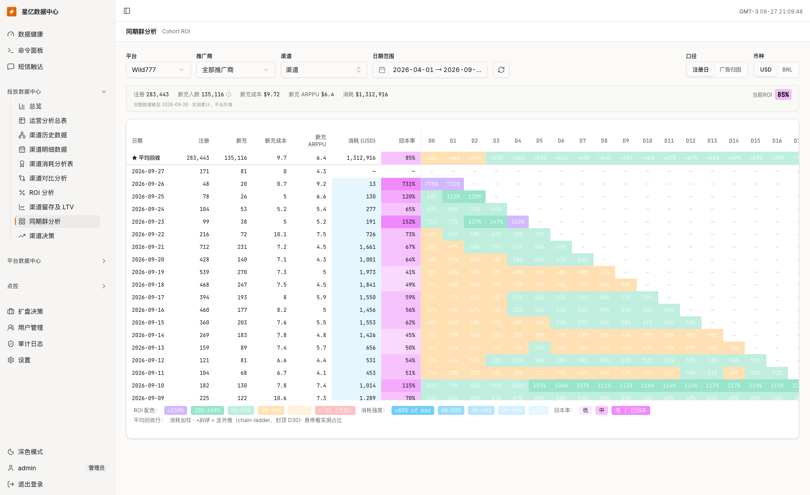

# 9.1 · 同期群分析

## 1. 用途

投放运营通过本页回答三个问题：某天带来的用户花了多少广告费；这批用户在当天、第 7 天、第 30 天累计回收了多少；同一天哪些渠道的回收更好。

同期群就是“同一批用户持续追踪”。例如只选择 9 月 1 日，D7 仍然要查看这批用户从 9 月 1 日到 9 月 8 日的累计充提，不能只统计 9 月 1 日的交易。日期筛选决定看哪几批用户，D 列决定观察每批用户多长时间。

本页位于现有数据中台，面向桌面端运营人员，使用简体中文。金额和统计自然日按所选平台的统一分析口径解释，不随查看者电脑的时区改变；当前中台平台使用 `America/Sao_Paulo`。Bingo 接入采用同一分析时区，原始事件仍保留其真实时间。

本文覆盖筛选、顶部汇总、同期群矩阵、平均回收、日期渠道明细及异常状态。页面只查询；不提供成本编辑、导出、同步任务、投放开关、钱包操作或预测参数编辑。视觉布局与样式由 Figma 表达。

参考网站为[星亿数据中心](https://dash.chartxcloud.com/operations)，登录后进入[投放数据中心 → 同期群分析](https://dash.chartxcloud.com/marketing/cohort)。设计与实现的 UI 应尽可能与该网站的同期群页面相似，对齐整体布局、筛选区、顶部汇总、矩阵及明细的阅读层次，尤其是色块、图例和交互；字段及计算规则按本文执行，UI 参考要求和截图见 3.5。

## 2. 查询条件

首次进入自动查询，修改平台、推广商、渠道、日期或口径后自动重新查询；日期范围选完整后才生效。币种切换只改变金额展示。多个数据筛选条件按 AND 组合，分子和广告费分母必须使用同一范围。

| 条件 | 含义和填写规则 |
|---|---|
| 平台 | 单选一个已授权、启用且支持同期群分析的平台，不提供跨平台合并。带平台入口优先，其次沿用记住的可用平台，再其次选择第一个可用平台。记住的值失效时提示并回退，不向无权限平台发请求 |
| 推广商 | 单选；无带入值、无可用记忆时为“全部推广商”。按当前平台及查询日期内有可查询数据的推广商提供选项，历史停投推广商仍可查。选择后同时约束用户归组和广告成本 |
| 渠道 | 单选，可清除回到全部；在当前平台、推广商和日期范围内选择。支持按渠道名、ID、推广商搜索，名称不区分大小写、ID 按输入内容匹配；渠道 ID 必须与平台组合识别 |
| 日期范围 | 起止日期均必填，包含两端自然日；默认平台开盘日至今天。结束日不得晚于平台分析时区的今天，开始不得晚于结束；两日期之差最多 365 天，即最多包含 366 个日期 |
| 日期快捷项 | 开盘至今、开盘 7/14/30/60 天；“开盘 7 天”是开盘日到第 6 天，不是 D7。截止不超过今天；超过最大查询跨度时提示缩短，不静默截断。平台未配置开盘日时隐藏快捷项，默认最近 60 个自然日 |
| 口径 | 注册日 / 广告归因，定义见下表。已有完整根关系能力的平台默认广告归因；仅支持注册日的平台固定注册日。Bingo 首次接入固定注册日，不以不完整关系伪造广告归因 |
| 币种 | 现有 BRL 平台支持 USD / BRL，首次默认 USD，后续沿用有效的金额展示选择。Bingo 首次接入只展示 USD；切换币种不改变人数、ROI、分组、预测状态或数据范围 |
| 刷新 | 用当前条件重新获取分析结果；不执行采集、回填或强制清理服务缓存。显示的完整数据截止日决定数据新鲜度 |

切换平台时清空推广商和渠道；未手选的日期重新按新平台开盘日生成，已手选的日期保留并重新校验。切换推广商时清空渠道。日期变化导致渠道确实不在可选范围时，清空实际查询条件并提示“原渠道不在当前范围，已显示全部渠道”；不能只清空按钮文案却继续按旧渠道请求。选项尚在加载或加载失败时不据此清空有效选择。

渠道选项显示名称、ID、推广商。名称缺失用“#渠道ID”，不把同名渠道合并。现有选择器右侧的辅助数字是所选期间渠道日报的首充人数合计；它属于日报口径，显示时必须标注“期间首充”，不能称为本页的 D0 新充人数。辅助数字缺失显示“—”，不影响选中渠道。

### 两种归组口径

| 内容 | 注册日 | 广告归因 |
|---|---|---|
| 批次日期 | 用户自己的注册日期 | 沿原始邀请链找到的根用户注册日期 |
| 渠道与推广商 | 用户注册时的获客渠道及其推广商 | 根用户注册时的获客渠道及其推广商 |
| 注册人数的含义 | 该日实际注册的去重用户数 | 归到该根注册日的去重用户数，包含根用户和后续裂变用户；随后续裂变增长 |
| 新充人数的含义 | 注册当天成功充值的去重用户数 | 根注册日当天成功充值的去重用户数；以后才注册或才充值的后代不进入 D0 新充 |
| Dn 的时间起点 | 用户自己的注册日 | 根用户的注册日 |
| 主要用途 | 与注册及 D0 充值事实对账 | 观察某批获客带来的直接与裂变回收 |

无上级的用户以自身为根，不代表已由外部广告平台证明是付费获客。这里的广告归因是站内邀请链归集，不等于 Meta、TikTok 或 AppsFlyer 的点击归因。

每名用户在一次查询中只能归到一个批次。断链、成环、注册先后不合法的关系不猜测为自然量，标注相关归因数据不完整；没有上级的有效根关系与关系缺失分别处理。邀请关系解除不把既有获客贡献转移到别的根，统计使用原始注册绑定事实；不修改 M7 的绑定、解除和佣金规则。

## 3. 结果字段

### 3.1 计算基准

下面的金额在同一分析币种下相加。设某批次日期为 C，完整数据截至日为 F，当前条件下该批用户为 U：

| 符号 | 含义 |
|---|---|
| S | C 当天、当前渠道范围的广告消耗；是固定的批次成本，不累加 C 之后的广告费 |
| N | U 中去重用户数；广告归因模式只计入截至 F 已注册的后代 |
| P0 | U 中在 C 当天有至少一笔成功充值的去重用户数；同一天多笔充值只计一个人 |
| Rn | U 从 C 至 C+n 当天结束的累计成功充值金额，包含首笔及复充 |
| Wn | 同一 U、同一期间的累计成功提现金额 |
| Mn | 累计净回收金额，Mn = Rn − Wn |

**Dn 回收率 = Mn ÷ S × 100%。** D0 是当天，D1 是当天加次日，D7 包含 C 到 C+7 共 8 个自然日。这不是第 n 天单日收入，不是留存率，也不是“净利润减广告费再除以广告费”。

只有 C+n 不晚于 F 且 S 为已完整采集的正金额时，才给出实测 Dn。S 为零或缺失不能除；未到观察日、未同步完整和计算失败分别显示原因。零充值、零提现且数据完整时净回收为零，ROI 应为 0%。

退款、冲正和提现资金退回使用来源方确认的关联更正事实去重重算，不能把失败提现的占用当成功提现，或把退回款再当一笔新充值。新充人数依据修正后仍有效的成功充值事实重算。

本页回收不扣广告费以外的工资、服务器、游戏服务费等经营成本，不把赠金、返佣、派彩当充值。因此超过 100% 只表示按本页资金回收口径覆盖广告费；余额负债等也未在本指标中扣除，不能称净利润。后续提现可能让回收率下降，不能强制曲线只增不减。

### 3.2 每日矩阵字段

| 界面字段（现有名称） | 含义、单位与计算规则 | 空值与提示 |
|---|---|---|
| 日期 | 批次日期 C，格式 YYYY-MM-DD，随归组口径解释 | 可点击查看该平台该日投流渠道 |
| 注册 | 去重用户数 N，单位人；广告归因时说明为“归因注册，含裂变” | 已知无人为 0，来源不完整则标注状态 |
| 新充 | D0 成功充值去重人数 P0，单位人；建议完整名称“D0 新充人数” | 0 是没有 D0 付费人，不代表后面没有充值 |
| 新充成本 | S ÷ P0，金额/人；建议完整名称“D0 新充成本” | P0=0 或消耗缺失为“—”；已确认 S=0 且 P0>0 时为 0 |
| 新充 ARPPU | R0 ÷ P0，金额/人；完整说明“D0 付费人均充值” | 包含 D0 当天复充，不是每人的第一笔充值均额；P0=0 时“—” |
| 消耗（USD/BRL） | 批次当天广告消耗 S，带币种，不是玩家充值额或整个观察期广告费 | 确认零消耗显示 0；成本未同步显示“— / 消耗未齐” |
| 回本率 | U 从 C 到 F 的累计净回收 ÷ S；建议完整名称“截至数据日回收率” | 不限 D60，老批次可继续累计；不可计算为“—” |
| D0…D60 | 分别为 Dn 累计回收率，共 61 列 | 只放该行实测结果，不给每日行填预测；晚于 F 的格子为“—” |

人数以整数和千分位展示。金额显示币种、千分位及两位小数；平均每人成本和金额也保留两位小数。百分比显示一位小数，悬停可查看两位小数及实际/预测说明；计算和比较都使用未展示舍入的值。分档和达到 100% 的判断不能用四舍五入后的文本。

矩阵日期倒序；有用户或有已确认广告消耗的日期均保留，包含“花了钱但无人注册”的日期。两者都没有的日期不强行补一行。全部渠道下可以包含自然量及零消耗渠道的用户和回收，分母仍是实际广告费；这类全平台汇总不能冒充纯付费渠道效果，比较投流渠道时应选择对应渠道。

### 3.3 顶部汇总与平均回收行

顶部汇总与平均回收行的基础字段使用同一组批次：当前筛选范围内、C 不晚于 F、D0 数据完整且 S>0 的批次。今天、成本缺失、零消耗及尚无完整 D0 的批次不进入这组汇总；矩阵仍可展示它们及状态。因此不能要求顶部人数等于所有可见行人数直接相加。

| 字段 | 含义与公式 |
|---|---|
| 注册 | 纳入汇总批次的 N 合计，不是平台全部历史注册数 |
| 新充人数 | 纳入汇总批次的 P0 合计，不是这些用户最终付费人数 |
| 新充成本 | 纳入批次的 S 合计 ÷ P0 合计，不平均每日新充成本 |
| 新充 ARPPU | 纳入批次的 R0 合计 ÷ P0 合计，不平均每日 ARPPU |
| 消耗 | 纳入批次的 S 合计；未纳入最新批次的已知消耗另作提示 |
| 当前 ROI | 纳入批次从各自 C 到同一 F 的实测净回收合计 ÷ 纳入批次 S 合计；不含预测 |
| 平均回收行 | 同一批次集合的消耗加权回收曲线；不是各日期百分比的算术平均 |
| 平均回收 Dn | 该批次集合在各自 Dn 的实测净回收与必要预测金额合计 ÷ S 合计；只计算 D0–D30 |
| 平均行 D31–D60 | 显示“—”，说明“平均回收仅汇总至 D30”；不表示每日矩阵没有 D31 之后的实测值 |
| 有效批次范围 | 实际纳入汇总的最早与最晚批次日期，可能小于筛选日期范围 |
| 完整数据截至 | F，按 4.3 的完整性规则确定；不是用户选择的结束日期，也不是页面打开时间 |
| 未纳入消耗 | 尚无完整 D0 的最新批次已知广告消耗；成本本身缺失不能折成 0 混入此金额 |
| 未纳入原因 | 按零消耗、消耗未齐、批次未成熟、来源数据未齐说明；汇总没有可纳入批次时说明原因，不显示一组伪造的 0 |
| ≈ / 含预测 | 平均 Dn 中存在任意未完整观察到 Dn 的批次时展示；每日行和当前 ROI 不使用此标识 |
| 实测金额占比 | 在该 Dn 已完整观察批次的净回收合计 ÷ 该格实测加预测净回收合计；不是用户覆盖率、模型准确率或置信度 |

实测金额占比仅在该格合计净回收大于零时展示，并限制到 0%–100%；合计小于等于零时显示“净回收非正，实测占比不适用”。若某批次只有 D28 实测但要估 D30，该批次对 D30 整格都算预测部分，不把其已观察的 D28 金额再次算成该格实测。即使占比舍入到 100%，只要有预测仍保留“≈”。

### 3.4 预测与图例

平均回收使用平台级、同一归组口径、截止 F 向前 90 个自然日的完整批次估算逐日发展系数。渠道或推广商筛选不改变训练样本为小渠道自身样本；提示“预测参考本平台历史，非本渠道独立模型”。未来单日增长系数由足够成熟批次的该日累计净回收合计除以前一日合计，限制在 0.5–2.0；无可用样本或分母非正时系数为 1，并说明按持平估算。

对较新批次，从最近完整观察日向目标 Dn 逐日估算，最多 D30。最近实测净回收大于零才乘发展系数；小于等于零时按原金额持平，仍标记含预测，不自动推算成回本。预测因子取数失败时，只有全部纳入批次均已完整观察的 Dn 可以汇总，其他格显示“— / 预测不可用”，不得缩小分母偷偷只汇总老批次。

回收热力图参照网站的六档色块，按原始数值分档；主矩阵、平均回收行与渠道展开曲线使用同一套映射。负数表示该批次累计提现超过累计充值，不命名为经营净亏损。

| 回收率区间 | 色块参考 | 图例含义 |
|---|---|---|
| 小于 0% | 浅红色 | 净回收为负 |
| 0% 至小于 20% | 很浅的黄色 / 琥珀色 | 回收不足 20% |
| 20% 至小于 50% | 较明显的黄色 / 琥珀色 | 回收 20%–不足 50% |
| 50% 至小于 100% | 浅绿色 | 回收过半，尚未覆盖广告费 |
| 100% 至小于 150% | 较明显的绿色 | 已覆盖广告费 |
| 150% 及以上 | 紫色 | 回收达到广告费的 1.5 倍及以上 |

消耗强度使用独立的蓝色色阶，表示该日期消耗相对当前可见日期最大消耗的比例，分为小于 20%、20%–小于 40%、40%–小于 60%、60%–小于 80%、80% 及以上，数值越高色块越深。它不是回收好坏或预算使用率；无正消耗时不着色，不与回收热力图共用绿、黄、红分档。

“回本率”列和顶部“当前 ROI”使用独立的紫红色色阶，按 0%、20%、50%、100%、150% 的边界逐档加深，与 D 列的多色色块区分。负回收不使用正向强度高亮，保留明确的负数。三类图例分别标注“回收率”“消耗强度”“截至数据日回收率”，色块旁始终有数值和含义。

### 3.5 UI 参考要求

设计参考：[同期群分析网站](https://dash.chartxcloud.com/marketing/cohort)。下图为注册日口径的页面截图，可直接用于比较色块和阅读层次。

UI 相似度是设计与实现的验收要求。在本文功能范围内，尽可能贴近参考网站的区域顺序、控件位置、矩阵密度、列宽与行高、字体层级、间距、色块和操作方式。设计稿与实现页面均需在相同桌面视口下对照参考网站检查筛选区、顶部汇总、平均回收行、每日矩阵、图例和日期渠道明细；因本文业务规则、可读性或设计系统适配而产生的必要差异，在设计交付中说明原因。

| 参考项 | UI 要求 |
|---|---|
| 整体布局与交互 | 尽可能与参考网站相似，保留筛选、汇总、矩阵、图例的区域顺序和阅读层次；控件位置、日期点击、渠道展开、悬停提示及横向滚动方式按网站对照，具体业务行为仍按本文执行 |
| 连续色块矩阵 | 参照网站以紧邻的单元格色块呈现 D0–D60，便于横向跟踪一批用户、纵向比较同一观察天数；每格同时显示百分比 |
| 三种色块含义 | D 列使用六档回收配色，消耗列使用蓝色强度，回本率列使用紫红色强度；具体分档统一使用 3.4，不因切换平台、口径或明细而改变 |
| 汇总的辨识 | 顶部汇总清楚标出当前 ROI 和完整数据截止日；平均回收行与每日行有明确区别，滚动时仍能辨认汇总和表头 |
| 固定信息与滚动 | 横向查看较远 D 列时仍能识别对应日期和基础指标；日期列的可点击状态明确，打开渠道明细后延续相同数字格式与颜色语义 |
| 预测状态 | “≈ / 含预测”始终与数值一起可见；可以辅以斜体，但不能只靠字体或颜色区分。悬停显示实测金额占比及预测说明 |
| 空值与零值 | 未到观察日、数据未齐、不可计算的格子使用中性背景和“—”，悬停说明原因；真实 0% 使用最低非负回收档，不能与空格混淆 |
| 图例与可读性 | 三类图例在矩阵附近可查，文字对色块背景保持清晰；深浅主题沿用相同语义，不能机械复刻截图中不易辨认的文字对比度 |
| 设计系统适配 | 以尽可能贴近参考网站为目标，具体色值、透明度、字体、间距、圆角和组件样式映射到 Bingo Figma 设计系统，保留参考页面的色相、强弱关系和布局层次；必要调整说明原因，截图中的业务数值不作为固定展示内容 |

### 3.6 日期渠道明细字段

点击某日期后，明细展示**当前平台该日期全部广告消耗大于零的渠道**，保留主表口径和币种，明确提示“不沿用主表的推广商及渠道筛选”。本页仅供有平台整体数据权限的运营账号使用。

| 字段或控件 | 含义与规则 |
|---|---|
| 日期 / 平台 / 口径 / 币种 | 明细的上下文；必须与打开时选中的日期、平台、口径和币种一致 |
| 回本天数 | 选择要比较的累计观察天数，不是自动计算“几天回本”；完整名称使用“观察天数”。默认 D0，可选已完整观察的 D3、D7、D14、D30、D60，并补入最新可观察天数 |
| 渠道 | 渠道名称与平台内渠道 ID；名称缺失用“#ID”，无渠道分组显示“自然量 / 无渠道”；推广商空值显示“无推广商” |
| 推广商 | 渠道所属推广商；作为渠道辅助信息展示，不是额外过滤条件 |
| 消耗 | 所选批次日该渠道广告费，带当前币种；有花费但没有用户的渠道仍显示 |
| 注册 | 归到该日期、该渠道的去重人数，随归组口径改变 |
| 新充 | 归到该日期、该渠道且 D0 成功充值的去重人数 |
| Dn 回本率 | 所选观察天数 n 的累计充提差 ÷ 该渠道当日消耗 |
| 展开曲线 | 点击渠道行展开该渠道 D0–D60 实测回收序列，可独立收起；未完整观察到的格子为空 |
| 在矩阵中查看该渠道 | 仅有有效渠道 ID 的行提供。关闭明细，将主表推广商和渠道设为该行；保留平台、日期区间、口径和币种，重新查询；无渠道分组不提供此操作 |
| 排序 | 默认消耗降序，可切换为所选 Dn 回收率降序；空回收率排最后，同值按消耗降序、再按渠道 ID 升序 |
| 渠道数量 | 本次明细实际展示的正消耗渠道数，不是平台渠道总数 |
| 最新可观察天数 | min(60，F−C)；C>F 时显示“尚无完整 D0”，观察天数选择禁用，不把 D0 宣称为可信值 |

明细最多展示 D60。老批次主表“截至数据日回收率”可以累计到 D60 之后，不能要求它等于明细 D60。正消耗渠道的消耗合计只与**同日期、同平台、全部渠道**主表分母对账；主表已筛选推广商或渠道时不直接比较。明细排除了零消耗及自然量渠道，所以人数、净回收和加权 ROI 也不保证等于全平台主表。

## 4. 操作规则

### 4.1 查看、切换与返回

主表按日期倒序展示，不分页；D0–D60 支持连续查看，查看较远 D 列时仍可识别日期和基础指标，滚动时可识别表头及平均回收。页面不提供用户级钻取或编辑指标。

从渠道决策带入时，先使用入口提供的有效平台、推广商、渠道，再使用记忆条件。展示来源上下文和“返回渠道决策”；返回恢复来源页面的原渠道定位及其带入的日期/筛选上下文，不用同期群默认日期覆盖它。

关闭日期明细后保留主表条件。明细与主表必须使用相同的数据版本和 F；刷新生成新结果时一并更新上下文，不能把旧币种或旧口径结果挂在新筛选下面。

### 4.2 金额、成功状态与 Bingo 接入

现有 BRL 平台的广告费原始金额为 USD，按该平台分析汇率换成 BRL 后与 BRL 充提比较；切换 USD 时将所有金额一致换成 USD，百分比保持不变。不从旧字段名推导固定 1 USD=6 BRL，换算依据须可追溯。

Bingo 直接提供其已有 USD 标准金额，引用 M5 保存的标准计价依据，不套用 Wild777/Aigobet 的巴币汇率重算历史。Bingo 首版不增加 BRL 展示或新钱包。其必须提供的业务事实如下，具体 API 和存储结构由技术设计维护：

| 来源 | 必需事实与使用规则 |
|---|---|
| 用户与渠道 | 平台、稳定用户 ID、注册时间、注册渠道、推广商、测试标记；渠道名称变更不拆分历史渠道，统计不因用户后续编辑渠道而静默改归属 |
| 成功充值 | 唯一成功业务标识、用户、实际成功入账时间、真实到账本金、原币及 USD 标准金额；包括真实 Crypto 入金，不含赠金、返佣、派彩、无真实支付的人工上分或人工生成订单；有真实支付依据的补单按原业务时点计入 |
| 成功提现 | 唯一业务标识、用户、确认成功时间、确认实际付给玩家的金额及对应标准金额；审核中、占用、失败、取消不算成功提现，服务费不得重复计作给玩家的款项 |
| 更正事实 | 原业务关联、修正金额或状态、业务时点和版本；重复同步不重复累计，迟到数据修正原批次及受影响 D 列，不记到同步执行日 |
| 广告消耗 | 平台、渠道、业务日期、实际成本及币种依据，区分已确认零消耗和未采集；更正一日成本时重算该批次成本及全部回收比例 |
| 邀请关系 | 开放广告归因时提供原始注册绑定、根用户、注册先后及完整性；首次仅注册日接入不以关系缺失阻塞注册日分析 |
| 完整性 | 注册、充提、关系及成本各自的数据完整性和更新批次；缺字段或汇率不足不得伪造 0 |

测试账号及其测试订单从 Bingo 投放分析中排除；封禁不抹掉此前真实业务。Bingo 同期群的真实成功充提口径与 2.7 玩家排行榜的账变扣款统计不同，不要求两页不加调整直接相等。接入数据不足时阻断受影响指标发布，不能阻塞玩家注册或原币入账。

### 4.3 数据截止、空白与异常

F 取平台昨天与注册、成功充值、成功提现均已同步完整日期中的最早值；广告归因还要求关系数据完整。成本按各批次日期单独校验，不用最近成本录入日截断老用户后续回收。数据源必须提供完成依据，不能仅凭“最近一笔订单日期”或订单量猜测完整性。

每日矩阵、截至数据日回收率、顶部当前 ROI 和平均行实测部分均使用同一 F。今天的数据可以显示已有注册和成本并标注“当日未完整”，不进入实测 ROI 或汇总；完整性无法确认时保留可识别的基础事实，受影响回收显示“数据未齐”。界面应说明零消耗、数据缺失和未到观察日的区别。

| 情况 | 页面处理 |
|---|---|
| 无可用平台 | 显示“没有可用的平台”，不发起无平台查询 |
| 未支持该平台 | 显示“该平台暂不支持同期群分析”，不画空矩阵冒充零业务 |
| 无注册且无广告消耗 | 显示“当前范围暂无同期群数据”；有广告费但无注册时保留零用户批次 |
| 尚无可汇总批次 | 保留每日可见事实，顶部和平均行显示“暂无完整且有消耗的批次”，解释排除原因 |
| 单个数据源、成本或换算缺失 | 标记受影响范围及原因，相关金额/比率用“—”，不能输出免费获客或亏损结论 |
| 预测不可用 | 已能完全实测的格子继续显示；需要预测的格子留空，当前 ROI 仍按完整实测计算 |
| 汇总计算失败 | 主表可继续查看，明确“汇总暂不可用”；不能把缺少顶部汇总理解为总额零 |
| 日期明细无正消耗渠道 | 显示“该日无投流消耗渠道”；不等于当天无人注册或无人充值 |
| 非法日期或口径 | 拒绝查询，指出错误；不静默改成另一段日期或另一种口径 |
| 取数失败或刷新失败 | 显示失败说明及重试；保留旧结果时标注“上次成功结果”及其条件、数据截止日，不能伪装为新条件结果 |
| 返回缓存结果 | 显示实际结果的范围和数据截止日；请求范围与结果范围不一致时显式提示并允许重试 |
| 无权限 | 服务端拒绝主表、明细及选项查询；不回传受限指标，页面提供无权限状态 |

## 5. 验收场景

| 需求编号 | 场景与操作 | 预期结果 |
|---|---|---|
| 9.1-R1 | 普通进入已有平台或 Bingo 平台 | 自动查询；已有平台按支持能力默认广告归因，Bingo 首次接入固定注册日和 USD；日期为有效默认范围 |
| 9.1-R2 | 切换平台、推广商、日期导致原渠道失效 | 按第 2 部分清空实际条件并提示；界面与请求一致，加载选项期间不误清空 |
| 9.1-R3 | 选择开盘 7 天，同日区间，反向、未来或超长区间 | 开盘 7 天为 7 个自然日；同日可查；非法范围拒绝且不替换成另一查询 |
| 9.1-R4 | 仅查 9 月 1 日批次，该用户 9 月 8 日又充值 | 该充值计入这行 D7，不因筛选结束日为 9 月 1 日而遗漏 |
| 9.1-R5 | 根用户 9 月 1 日注册，后代 9 月 3 日注册并充值 | 注册日口径后代进入 9 月 3 日 D0；广告归因进入根的 9 月 1 日 D2，不增加根日 P0 |
| 9.1-R6 | 用户在 D0 充 10 与 20，次日再充 30 | D0 新充人数为 1，D0 ARPPU 为 30；D1 累计充值为 60；新充人数不因次日充值增加 |
| 9.1-R7 | 消耗 100，D0 充值 50/提现 10，D1 再充 30/提 5 | D0 为 40%，D1 为 65%；不把 D1 显示成单日 25%或净利润比例 |
| 9.1-R8 | 两批成本 100/900，对应回收率 100%/50% | 同观察日汇总为 55%，不是 75%；新充成本和 ARPPU 同样按总分子/总分母计算 |
| 9.1-R9 | 有广告消耗 100 但无人注册 | 保留该日期，N/P0 为 0，成本/人和 ARPPU 为“—”，完整观察日 ROI 为 0%；广告费不从汇总消失 |
| 9.1-R10 | 分别查看确认零消耗和消耗未同步的批次 | 前者显示 0，后者显示“— / 消耗未齐”；两者 ROI 均不可除，不把缺失当零成本 |
| 9.1-R11 | 零消耗渠道有用户，与正消耗渠道同日查询 | 全平台主表解释自然量可能计入人数与分子；日期投流明细只列正消耗渠道，不强求人数合计相同 |
| 9.1-R12 | 今天或 C+n 晚于 F，或者充值/提现同步进度不同 | 统一按最早完整日 F 截止；不完整格不显示 0%或伪负值，今天不进入实测汇总 |
| 9.1-R13 | 查看超过 60 天的老批次 | 每日 D60 固定该观察窗，当前回收率继续到 F；平均 D31–D60 明确不汇总 |
| 9.1-R14 | 平均 D7 含未满 7 天批次，或占比舍入成 100% | 使用统一分母，含外推即显示“≈”；悬停解释实测金额占比，不宣称全部实测 |
| 9.1-R15 | 年轻批次净回收为零或负数，或增长因子样本不足 | 非正基数持平并标预测；样本不足按系数 1 并说明，不凭空推算回本 |
| 9.1-R16 | 预测因子请求失败 | 完全实测列保留，需要预测列留空；不改分母制造“平均回收” |
| 9.1-R17 | 筛选推广商 A 后点击一个日期 | 明细明确是该平台当日全部正消耗渠道，可含其他推广商；不承诺合计等于已筛选主表 |
| 9.1-R18 | 明细切 D7、回收率排序、展开渠道后再跳主表 | D 选项不超过完整观察天数；排序和空值规则正确；跳主表设置该渠道并保留日期、口径、币种 |
| 9.1-R19 | C 晚于完整截止日，或无正消耗渠道 | 分别显示“尚无完整 D0”并禁用天数选择，或“该日无投流消耗渠道” |
| 9.1-R20 | 切 USD/BRL 或查看 Bingo USD | 所有金额一致换算，人数和 ROI 不变；Bingo 不被套上 BRL 汇率 |
| 9.1-R21 | 成功、失败、占用提现与真实补单、人工上分混合 | 只纳入真实成功事实；按原业务时点和第 4.2 部分金额定义计算，不借用排行榜扣款额 |
| 9.1-R22 | 重复同步、迟到订单、退款冲正或更正广告费 | 同一事实只计一次，修正对应原批次及受影响列；不把同步日当业务日 |
| 9.1-R23 | 改渠道名称、用户当前渠道、解除邀请，或遇到关系成环 | 名称可更新但统计身份稳定；不静默挪历史批次；异常关系标记不完整，注册日能力独立可用 |
| 9.1-R24 | 账号未获平台授权或仅有单推广商授权 | 主表、明细与筛选选项均不泄露平台数据；只有平台整体范围账号可使用本页 |
| 9.1-R25 | 汇总失败、主请求失败、返回缓存或旧条件结果 | 各自显示明确状态、实际范围与截止日；不能把旧结果当新查询成功 |
| 9.1-R26 | 从渠道决策进入，再返回；或关闭日期明细 | 恢复对应上下文，关闭明细不丢主表筛选；返回决策不被同期群日期覆盖 |
| 9.1-R27 | 原始回收率 99.96%，后续提现导致回收下降 | 显示舍入不改变其低于 100% 的分档和判断；后续允许真实下降 |
| 9.1-R28 | 历史停投推广商不在最近 30 天活动名单内 | 按所查历史日期仍能选择并查询，不因最近停投漏掉历史渠道 |
| 9.1-R29 | 顶部人数、成本、ARPPU、ROI 与平均行对照 | 两处使用同一组有效批次；各比率以总金额/总人数或总消耗计算，未纳入原因可见 |
| 9.1-R30 | 查看负数、0%、20%、50%、100%、150%及其边界附近的回收值 | 按 3.4 的原始数值分档着色，主表、平均行和渠道曲线映射一致；消耗蓝色与回本率紫红色单独表达 |
| 9.1-R31 | 对照实测、预测、真实 0%和空值，并横向滚动矩阵 | 预测保留“≈”，真实 0%与中性空格可区分，提示原因完整；日期、汇总、表头及三类图例可辨认，数字在色块上清晰可读 |
| 9.1-R32 | 在相同桌面视口下对照参考网站、设计稿和实现页面，并操作筛选、滚动及日期渠道明细 | 整体布局、控件位置、矩阵密度、字体层级、间距、色块、图例与交互尽可能相似；按 3.5 逐项检查，必要差异有说明，字段及计算仍符合本文 |

## 6. 相关资料

- 入口：[现有同期群分析](https://dash.chartxcloud.com/marketing/cohort)，投放数据中心 → 同期群分析；也可由渠道决策带入。
- 模块、权限与职责：[M9 数据分析](../README.md)。权限标识 `analytics:cohort:view`，服务同时核对平台范围。
- 便于运营理解的[计算示例](计算示例.md)；设计参考本文 [UI 要求](#35-ui-参考要求)、[页面截图](截图/同期群-注册日.png)及[参考网站](https://dash.chartxcloud.com/marketing/cohort)。
- 用户来源：[M2 用户管理](../../M2-用户管理/README.md)；邀请绑定：[M7 代理关系](../../M7-代理管理/7.3-代理列表/README.md)。
- 财务来源：[充值订单](../../M5-财务管理/5.2-充值订单查询/README.md)、[提现订单](../../M5-财务管理/5.1-提现订单/README.md)、[标准计价](../../M2-用户管理/2.1-用户列表/标准计价.md)。
- 视觉设计消费本文字段、提示、操作、状态和色块要求；正式接口契约由技术实现维护。
