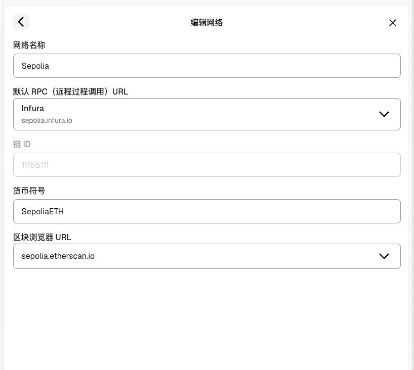

# 项目指南：Sepolia 测试网络与入金

供项目成员配置测试钱包、领取测试 ETH 和进行 Crypto 入金联调使用。本文以 MetaMask 为例，网络参数与测试 USDC 合约按团队提供的信息记录。

操作顺序：切换 Sepolia 网络 → 领取测试 ETH → 添加测试 USDC → 使用测试 USDC 入金。

## 1. 配置 Sepolia 测试网络

在钱包的网络列表中开启“显示测试网络”，选择内置的 **Sepolia**。入口名称可能随钱包版本变化，可参考 [MetaMask 测试网络说明](https://support.metamask.io/id/configure/networks/how-to-view-testnets-in-metamask/)。

按下面的参数核对网络：

| 配置项 | 值 | 说明 |
|---|---|---|
| 网络名称 | `Sepolia` | Ethereum Sepolia 测试网络 |
| 默认 RPC | `Infura` | 使用钱包内置 Sepolia 的默认 RPC；截图显示域名为 `sepolia.infura.io` |
| 链 ID | `11155111` | 用于确认连接的是正确网络 |
| 钱包货币符号 | `SepoliaETH` | 按团队截图中的钱包显示填写；用于支付测试链上的 Gas 手续费 |
| 区块浏览器 URL | [Sepolia Etherscan](https://sepolia.etherscan.io) | 地址为 `https://sepolia.etherscan.io` |

截图中的 `sepolia.infura.io` 仅是显示域名，不是可直接照填的完整 RPC URL。需要手动添加网络时，向团队获取可用的完整 Sepolia RPC URL，再填写链 ID、货币符号和区块浏览器地址。

`SepoliaETH` 是钱包中的原生币显示符号；业务币种代码仍使用 `ETH`，测试入金币种代码使用 `USDC`。

团队提供的网络配置截图：



## 2. 领取测试 ETH

领取入口：[Google Cloud Sepolia 测试 ETH 水龙头](https://cloud.google.com/application/web3/faucet/ethereum/sepolia)。

1. 在钱包中切换至 Sepolia，复制用于发起测试转账的钱包账户地址。
2. 打开领取入口，按页面提示登录 Google 账号并完成领取操作；接收地址填写上一步的钱包地址。
3. 等待链上交易确认，在钱包中查看 `SepoliaETH` 余额，或在 [Sepolia Etherscan](https://sepolia.etherscan.io) 搜索钱包地址核对到账情况。

领取额度、频率及资格限制以水龙头页面当时的提示为准。测试 ETH 用于后续 USDC 转账的 Gas 手续费，领取测试 ETH 不会同时获得团队测试 USDC。

## 3. 添加团队测试 USDC

本项目测试入金使用下面这个 Sepolia 合约的 **USDC**，按合约地址识别代币：

```text
0xeb92F9F595095bF4cCBeEC93BC5FB214feF03639
```

| 配置项 | 值 |
|---|---|
| 所属网络 | `Sepolia`，链 ID `11155111` |
| 代币合约地址 | `0xeb92F9F595095bF4cCBeEC93BC5FB214feF03639` |
| 代币符号 | `USDC` |
| 代币精度（Decimals） | 以钱包读取该合约的结果为准；无法读取时，向团队核实该合约精度后再填写 |
| 合约查看入口 | [在 Sepolia Etherscan 查看测试 USDC](https://sepolia.etherscan.io/address/0xeb92F9F595095bF4cCBeEC93BC5FB214feF03639) |

添加步骤：

1. 确认钱包当前网络为 Sepolia。
2. 在代币列表打开“导入代币”或“添加自定义代币”，选择自定义代币方式。
3. 粘贴上面的完整合约地址；如果界面要求选择网络，选择 Sepolia。
4. 核对自动读取的代币信息，完成导入。可参考 [MetaMask 自定义代币说明](https://support.metamask.io/managing-my-tokens/custom-tokens/how-to-display-tokens-in-metamask/)。

添加自定义代币只让钱包显示该资产，不会增加余额。余额为 0 时，向团队申请这个合约的测试 USDC，并提供自己的 Sepolia 钱包地址。不要用其他同名 USDC 合约替代，也不要依据主网 USDC 的精度猜填本合约精度。

## 4. 使用测试 USDC 入金

1. 打开已开通 Crypto 的测试环境充值入口，选择 Sepolia 网络和 USDC，复制当前测试用户的充值地址。如果没有对应入口，先向团队核实测试环境的网络与币种是否已启用。
2. 在外部测试钱包中确认持有上述合约的 USDC，以及足够支付手续费的 SepoliaETH。
3. 选择 USDC 发起转账，接收地址填写产品充值页面提供的地址，金额按测试场景填写。验证正常入账时，金额需满足测试环境配置的最小入金额。
4. 确认转账后保存交易哈希，在 Sepolia Etherscan 查看交易状态，并在测试环境核对入金记录、确认进度与最终入账结果。

**上面的 USDC 合约地址用于导入代币，不是用户充值地址。** 接收地址必须从当前测试用户的充值页面获取。

链上交易成功后，平台仍需达到配置的确认数等入账条件。入账规则见 [Crypto 入金](../M5-财务管理/5.14-Crypto入金/README.md)，网络、代币合约及最小入金额等配置见 [Crypto 配置](../M5-财务管理/5.15-Crypto配置/README.md)。

## 5. 常见问题

| 现象 | 处理方式 |
|---|---|
| 钱包找不到 Sepolia | 在网络列表开启“显示测试网络”，再选择 Sepolia |
| 有 USDC，但转账提示手续费不足 | 给发起转账的钱包领取测试 ETH；USDC 余额不能代替 SepoliaETH 支付 Gas |
| 导入 USDC 后余额为 0 | 核对钱包账户、网络和合约地址；仅导入代币不会获得余额，需接收团队提供的该合约测试 USDC |
| 水龙头无法领取 | 按页面提示检查登录状态和领取限制，或向团队申请测试 ETH |
| 链上成功，平台还未入账 | 核对网络、代币合约、充值地址、最小入金额及确认进度，并将交易哈希与测试用户信息提供给开发排查 |

返回[仓库首页](../README.md)。
